# Positional Encoding in Transformers: Teaching Machines About Word Order

## Paper References and Context

**Original Research Papers:**
- "Attention Is All You Need" (Vaswani et al., 2017) - [arXiv:1706.03762](https://arxiv.org/abs/1706.03762)

**Video Context:** Hi guys, my name is Nitesh and you're welcome to my YouTube channel! Welcome to Day 78 of the 100-day Deep Learning series! Today we'll talk about positional encoding, and I'll honestly tell you - whenever you watch any transformer video, generally they explain positional encoding in just 2-3 lines and move on. But I personally feel that positional encoding is a very important aspect of transformers and it's very important to understand it properly.

The only problem is I actually feel that positional encoding is a bit difficult to understand, and that is why I've done a lot of research and put a lot of effort into making this video. The goal behind this video is that I can simplify positional encoding as a concept in front of you. And that is why the video has become a bit long, but trust me if you watch the video till the end, you'll appreciate the effort that went into making this video. So I am super excited for this video, I really hope you are too!

**Learning Journey:** By the end of this detailed walkthrough, you'll understand exactly why transformers need positional encoding, why simple solutions fail, and how the trigonometric approach elegantly solves multiple problems simultaneously. You'll also discover the mind-blowing mathematical properties that make this solution so powerful.

**Connection to Broader Concepts:** Positional encoding is the secret sauce that makes transformers work - enabling parallel processing while maintaining sequence awareness. This understanding is crucial for comprehending BERT, GPT, and all modern transformer architectures.

---

## Why Positional Encoding is Needed: The Self-Attention Paradox

So guys, before understanding what positional encoding is, we need to understand why positional encoding became necessary in transformer architecture. Until now, we have studied a very important component of transformer architecture and that component is called self-attention.

### Self-Attention's Remarkable Benefits

And what self-attention is, I guess you already know. But let me refresh your memory - before diving into the problem, let's appreciate what self-attention accomplishes:

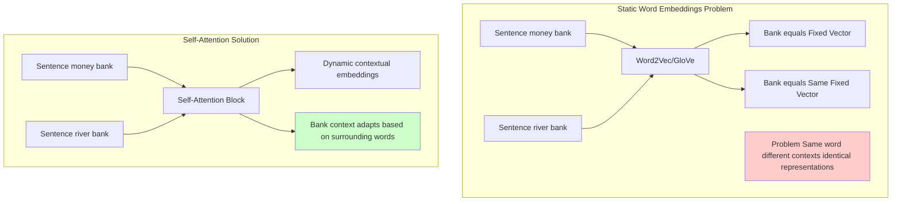

If you have a sentence like "river bank", then you have divided it into tokens - one is "river" and the second one is "bank". And you have generated embeddings for both of these. Now, what can the self-attention block do? 

**Two Major Benefits of Self-Attention:**

1. **Dynamic Contextual Embeddings**: It can generate contextual embeddings! Contextual embedding means that these embeddings are dynamic and they change with the usage of the word. This means if you calculate the context of "bank" in this sentence, it will be something different, and when you calculate the contextual embedding of "bank" in another sentence, it will be something different. This will depend on what other words that particular word "bank" appeared with in that sentence.

2. **Parallel Processing**: This is the best part about self-attention! Apart from this, there is another very big benefit of using self-attention, and that is that you can calculate all these contextual embeddings in parallel! 

This means that if your sentence has two words, then you can generate the contextual embeddings of both these words together. So it does not matter whether your sentence has two words or you are processing a very large document - maybe a PDF with 10,000 words in it - you can generate the contextual embeddings of those 10,000 words together!

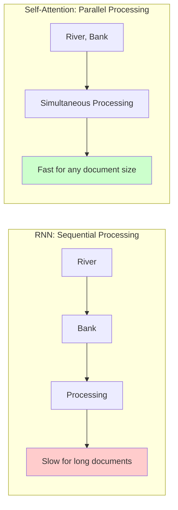

And this is a very big benefit because when we need to process very large documents, we will be able to do that processing very fast. You will appreciate this more when you think about RNNs - RNNs are inherently sequential, right?

For a 10,000-word PDF:
- **RNN**: What happened there was that if you had a sentence like "river bank", then in the first time step, whatever processing happened, you would send "river" as input, then in the second time step you would send "bank" as input. It would take 10,000 steps to execute that!
- **Self-Attention**: Processes all words simultaneously - this will be fast!

### The Critical Problem: Order Blindness

But as they say, when everything is good, something goes wrong too. So this big benefit I told you about - that you can do all calculations in parallel - has one very major drawback. And the major drawback is:

However, this parallel processing advantage creates a fundamental issue:

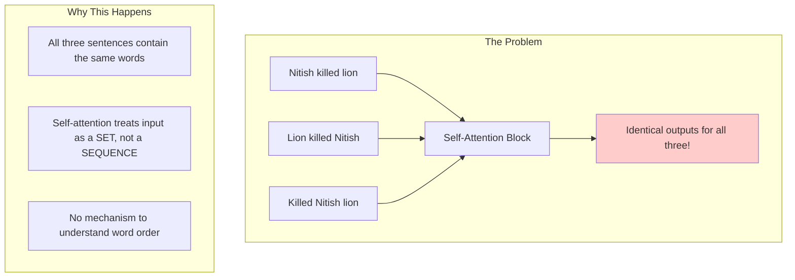

You cannot capture the order of words used in your sentence using self-attention! Listen to this again - you cannot capture the order of words used in your sentence because you are sending all words together to the self-attention module. 

This self-attention module will not understand which word came first - whether "river" came first or "bank" came first in the sentence.

**The Core Issue**: So for this self-attention module, the sentence "Nitish killed lion" and the sentence "Lion killed Nitish" - both of these are exactly the same! Because you are sending these three words together in the first sentence and you are also sending these three words together in the second sentence.

Self-attention has got no mechanism to understand in what order words exist inside your sentence. This problem was not there in RNNs - if you send the sentence "Nitish killed lion", then "Nitish" will go in the first time step, "killed" will go in the second time step, and "lion" will go in the third time step. So RNN will inherently know what the order is.

But unfortunately our self-attention module does not have this mechanism. Now maybe I don't need to explain that in NLP based applications, the order of words matters, right? 

The sentence "Nitish killed lion" and the sentence "Lion killed Nitish" - these two represent completely different meanings. But your self-attention module will say "both are same"! Do you really think with this kind of mechanism we can build real world NLP applications? Absolutely not!

This means now we have a challenge that somehow we need to make sure that we pass on this order information to our self-attention module, otherwise our transformer architecture will not perform as well.

**And this is where Positional Encoding comes into the picture!** Positional encoding is the logic that encodes this information in the transformer architecture within self-attention about which word is in which position in your sentence.

I really hope you understood the "why"!

## Interactive Sine and Cosine Visualizations

Before diving into the solution, let's understand the mathematical building blocks - sine and cosine functions - through interactive visualizations:

### Interactive Sine Function Visualization
<iframe src="https://www.desmos.com/calculator/cpb0oammx7" width="800" height="500" style="border: 1px solid #ccc; border-radius: 5px;"></iframe>

*Interactive Desmos visualization of sine function - you can modify parameters and explore how the function behaves*

### Interactive Cosine Function Comparison
<iframe src="https://www.geogebra.org/material/iframe/id/aavMVjyK" width="800" height="500" style="border: 1px solid #ccc; border-radius: 5px;"></iframe>

*GeoGebra animation showing both sine and cosine functions and their relationship*

### Unit Circle Visualization 
<iframe src="https://www.mathsisfun.com/geometry/unit-circle-interactive.html" width="800" height="500" style="border: 1px solid #ccc; border-radius: 5px;"></iframe>

*Interactive unit circle showing how sine and cosine values are generated*

### Key Properties to Observe:
1. **Bounded Values**: Both sine and cosine always stay between -1 and +1
2. **Periodic Nature**: Functions repeat their pattern every 2π units
3. **Smooth Continuity**: No sudden jumps, making them ideal for neural networks
4. **Phase Relationship**: Cosine is sine shifted by π/2 (90 degrees)

These properties make trigonometric functions perfect for positional encoding as we'll see!

---

## First Principles Approach: Building the Solution Step by Step

So you have understood the problem, now let's talk about the solution. The solution is positional encoding, but I'm not going to teach you positional encoding directly because if I teach you positional encoding directly, you might not understand it as well.

I have a better way! What I will do is I will use the **first principle approach**. First principle approach means that I will teach you as if we are inventing this for the first time, okay?

So we will start with a very basic solution, identify its problems, solve those problems, in that process a second solution will come, we'll talk about the problem of the second solution, fix it, in this process a third solution will come, and continuing like this we will reach positional encoding. And trust me, this is the best way to teach this topic!

### Attempt 1: Simple Counting Solution

Okay so let's start. We have a sentence "Nitish killed the lion", okay? This sentence has four words. But the problem is that our self-attention block doesn't understand which word came first, which word came second, which word came third, and so on.

Somehow I need to get this information to the self-attention block that "Nitish" was at first position, "killed" was at second position, "the" was at third position, and so on. Okay?

**Let's propose a very simple solution!** Let's talk about a very simple solution. Now think for yourself - what could be the simplest solution? 

The simplest solution could be **counting**! Very simple - you count which position this word is at. This word is at first position, this word is at second position, third position, fourth position. I have done the counting!

Now somehow I need to send these numbers to this self-attention block, right?

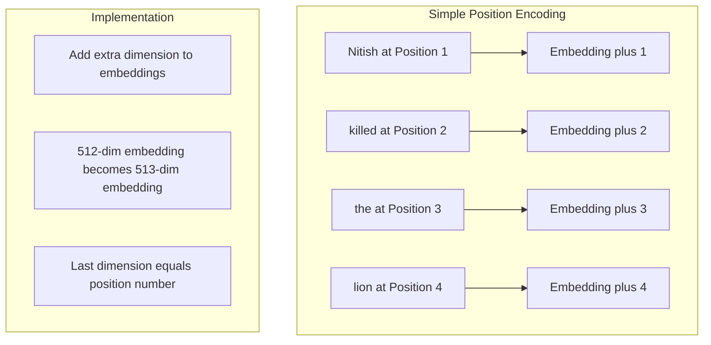

**Implementation:**
```python
def simple_position_encoding(sentence_length):
    positions = []
    for pos in range(sentence_length):
        positions.append(pos + 1)  # 1, 2, 3, 4...
    return positions

# For "Nitish killed the lion"
positions = simple_position_encoding(4)  # [1, 2, 3, 4]
```

Now there are multiple ways to do this, but what could be the simplest way? Take this embedding - let's say this embedding is currently 512-dimensional, okay? This means there are 512 numbers here. What I will do - I will add one more dimension at the end to all the word embeddings. I will add one dimension at the end, which means now all these embeddings become 513-dimensional.

And what will I add in this last dimension? I will add these numbers - 1, 2, 3, 4. And this way what happened is that we are able to send this information to the self-attention block about which particular word is at which position!

A very simple solution! Maybe even a child could identify this.

### Problems with Simple Counting

But now what is the problem that prevents us from using this? So actually there are multiple problems, I will tell you all the problems one by one.

#### Problem 1: Unbounded Growth

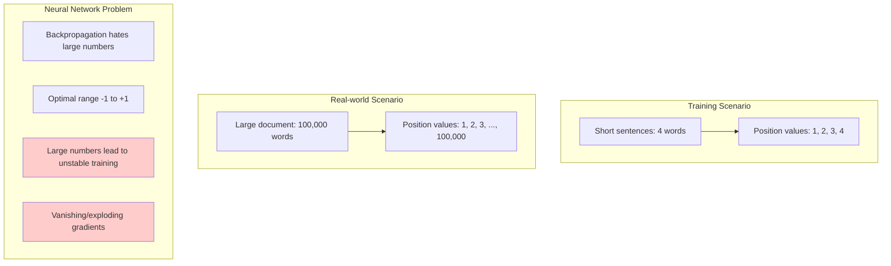

पहली problem यह है कि यह जो solution है यह **unbounded** है! Unbounded होने का मतलब क्या है कि इसमें कोई upper limit नहीं है। खुद ही सोच के देखो - यह तो छोटा सा sentence था, इसमें चार words थे तो आपका आखिरी number 4 है।

**The Issue**: Now imagine आप एक पूरी की पूरी book का PDF process करना चाहते हो! एक book में 500 pages होते हैं, हर page में I don't know 200 words होते हैं, so you can see already वी have like एक लाख words का एक document! तो जब हम इस पूरे book को process करने जाएंगे और self-attention module में भेजेंगे तो जो सबसे आखिरी word होगा इस book का - मान लो "thank you" का "you" है - तो यहाँ पर कौन सा number होगा? एक लाख, right?

Now the problem is कि यह number is huge! और हम इस number को transformer architecture में भेज रहे हैं जो खुद में एक neural network architecture है। अब शायद इतना तो आपने neural networks और deep learning पढ़ लिया है कि आपको यह पता होगा कि neural networks work on the principle of backpropagation। Backpropagation is the core algorithm जिसके ऊपर neural networks train होते हैं।

And backpropagation **hates big numbers**! Generally बोला जाता है कि -1 से +1 के बीच में अगर आपके numbers हैं, that is a good range to have। But if you have huge numbers like एक लाख, एक करोड़, 10 करोड़ - यह numbers training के time पर unstable create करते हैं जिसकी वजह से वही vanishing gradient problem, exploding gradient problem आ सकता है। In short, gradients जो हैं आपके वह unstable हो जाएंगे।

So this is the biggest problem with this approach!

#### Problem 2: Normalization Creates Inconsistency

**Attempted Fix**: अब आप बहुत आसानी से एक logic implement कर सकते हो। आप बोलोगे कि "What if मैं यह make sure कर दूं कि numbers हमेशा 0 से 1 के बीच में ही रहें?" आप कर सकते हो! कैसे? Scale positions to [0, 1] range.

```python
def normalized_position_encoding(sentence_length):
    positions = []
    for pos in range(sentence_length):
        normalized_pos = pos / (sentence_length - 1)
        positions.append(normalized_pos)
    return positions

# For length 3: [0.0, 0.5, 1.0]
# For length 5: [0.0, 0.25, 0.5, 0.75, 1.0]
```

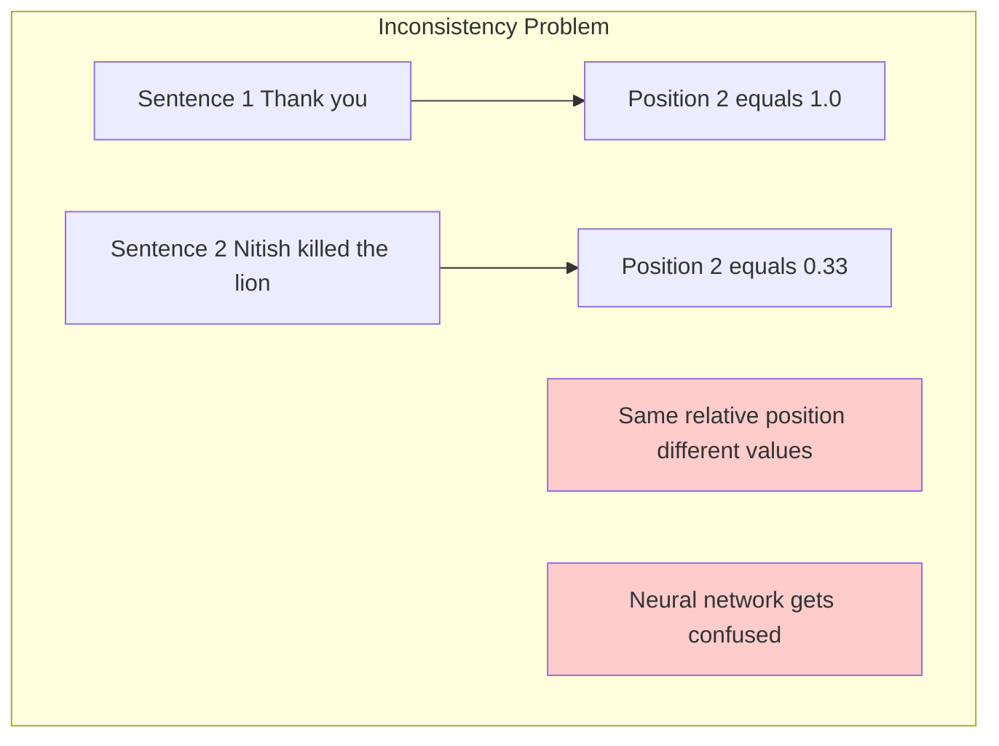

आप सबसे पहले यह पता कर लो कि total number of words कितने हैं - जैसे इस sentence में चार words हैं। और अब आप हर position को total से divide मार दो। Automatic जो आपका last position होगा वो हमेशा 1 होगा और यह 0 के बीच में होगा - 0 से 1 के बीच में होगा, right?

Same for this book also! इस book में भी एक लाख words हैं, but आखिरी word जो "you" है वहाँ पर आप एक लाख को एक लाख से divide कर दोगे तो यह 1 हो जाएगा। Problem solve!

**But do you think this is a good solution?** The answer is **NO**!

समझना इस बात को - मान लो मेरे पास यह sentence है "Thank you" और मेरे पास यह sentence है "Nitish killed the lion"। ठीक है? इसका position 1 है, इसका 2 है, इसका 1 है, इसका 2 है, इसका 3 है, इसका 4 है।

हमें क्या करना है? हमें normalize करना है। तो मैंने यह कर दिया - 1/2, 2/2। यहाँ पे मैंने क्या कर दिया - 1/4, 2/4, 3/4, 4/4, right? Normalize हो गया! यहाँ पे भी जो range है वो 0 से 1 के बीच में है और यहाँ पे भी जो range है वो 0 से 1 के बीच में है।

**But problem क्या है?** देखो यहाँ पर आप notice करो कि इस position पर actual value क्या होगी? 1! और इस position पर actual value क्या होगी? 0.5! यह दोनों है second position, but आपका जो technique है उसके हिसाब से इस sentence में second position का value 1 है और इस sentence में second position का value 0.5 है। **Consistency नहीं है!**

समझ के देखो - आप अपने ही training data में एक sentence में second position को 1 का value दे रहे हो और अपने ही training data में एक दूसरे sentence को second position का value 0.5 दे रहे हो। So आपका neural network confuse हो जाएगा कि second position होता क्या है - is it 1 or 0.5?

So यह approach काम नहीं करेगा कि आप normalize कर दो।

**Critical Flaw**: The position का number should not change, right? अगर यहाँ पर यह 1 आ रहा है तो यहाँ पर भी 1 ही होना चाहिए। It should not change! यह भी बहुत important है - consistent behavior होना चाहिए across training samples।

तो पहला problem तो यह हो गया!

#### Problem 3: Discrete Values and No Relative Positioning

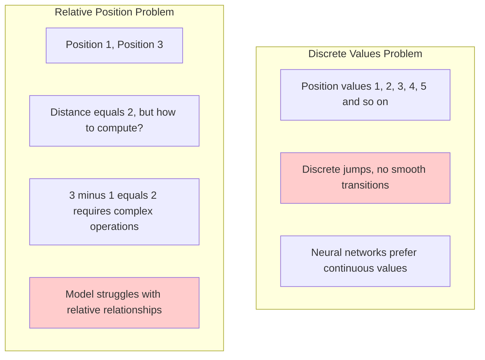

इसके अलावा और भी problems हैं, वो मैं आपको बताता हूं। Let's talk about problem number two!

**Problem Number Two** क्या है इस approach के साथ कि इस approach में यह जो numbers आप use कर रहे हो - 2, 3, 4 - यह numbers **discrete** हैं, right? 2, 3, 4, 5... see these are discrete numbers! And again it is not good for neural networks! यह भी शायद आपको पता होगा कि neural networks generally prefer smooth transitions, right? Like continuous numbers, okay? 

और अगर आप discrete numbers use करोगे neural networks को train करने के लिए तो numerical stability का problem आता है जिसकी वजह से फिर से जो आपका gradient flow है वह अच्छा नहीं रहता। So again, this is the second reason जिसकी वजह से आप यह approach use नहीं कर सकते।

There is one more reason, वह भी मैं आपको बताता हूं।

**Problem Number Three** यह है इस approach के साथ कि आप कभी भी **relative positioning capture नहीं कर पाते**। यह problem मैं आपको समझाता हूं।

**Summary of Requirements**: इन सभी problems को देखने के बाद, हमें चाहिए है एक solution जो:
1. **Bounded**: Values stay within a reasonable range - अच्छा होता अगर यह किसी given range में operate करता
2. **Continuous**: Smooth transitions between positions - अच्छा होता अगर यह continuous होता, because neural networks prefer continuous and smooth changes  
3. **Periodic**: Can capture relative relationships - अच्छा होता अगर यह periodic function होता

**In short, हमें चाहिए है एक bounded, continuous, periodic function!** हमें एक ऐसा function खोजना है mathematics का जो first of all bounded हो - उसका y value एक given range में operate करता हो, वो function continuous हो, और वो periodic भी हो।

### Attempt 2: Trigonometric Functions to the Rescue!

अब अगर आपने थोड़ा भी maths पढ़ा होगा तो आपके दिमाग में click कर रहा होगा कि **one such option could be trigonometric functions!** Specially अगर आप sine function की बात करो तो sine function कुछ ऐसा दिखाई देता है:

**The Breakthrough Insight**: Sine and cosine functions satisfy all our requirements perfectly!

Let me show you why sine functions are amazing:

### Visual Understanding of Sine and Cosine Functions

```python
import matplotlib.pyplot as plt
import numpy as np

# Create x values from 0 to 4π
x = np.linspace(0, 4*np.pi, 1000)
y_sin = np.sin(x)
y_cos = np.cos(x)

plt.figure(figsize=(12, 8))

# Plot sine function
plt.subplot(2, 1, 1)
plt.plot(x, y_sin, 'b-', linewidth=2, label='sin(x)')
plt.title('Sine Function: y = sin(x)', fontsize=14)
plt.xlabel('Position (x)')
plt.ylabel('Encoded Value')
plt.grid(True, alpha=0.3)
plt.axhline(y=0, color='k', linestyle='-', alpha=0.3)
plt.axhline(y=1, color='r', linestyle='--', alpha=0.5, label='Upper bound (+1)')
plt.axhline(y=-1, color='r', linestyle='--', alpha=0.5, label='Lower bound (-1)')
plt.legend()

# Plot cosine function
plt.subplot(2, 1, 2)
plt.plot(x, y_cos, 'r-', linewidth=2, label='cos(x)')
plt.title('Cosine Function: y = cos(x)', fontsize=14)
plt.xlabel('Position (x)')
plt.ylabel('Encoded Value')
plt.grid(True, alpha=0.3)
plt.axhline(y=0, color='k', linestyle='-', alpha=0.3)
plt.axhline(y=1, color='r', linestyle='--', alpha=0.5, label='Upper bound (+1)')
plt.axhline(y=-1, color='r', linestyle='--', alpha=0.5, label='Lower bound (-1)')
plt.legend()

plt.tight_layout()
plt.show()
```

**You can see देखिए, what is happening:**

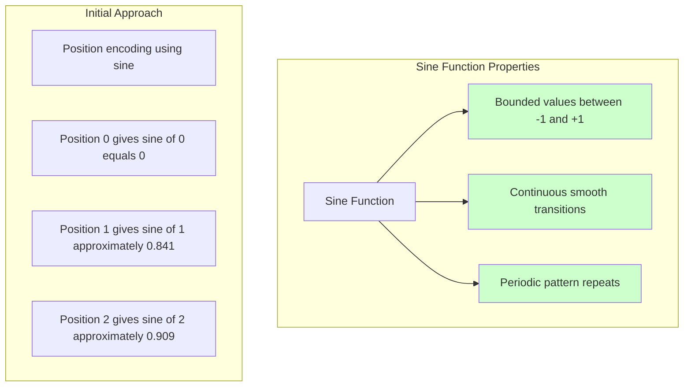

**यू can see first of all** इसका जो y value है वह -1 से +1 के बीच में है, which means **it is bounded**! Second, हर x value के लिए there is a y value, which means कि यह **continuous** है! और एक value के बाद - एक x value के बाद इसका y value repeat करता है, तो इसका मतलब यह **periodic** भी है!

So अभी तक की discussion के basis पर यह समझ में आया कि हमारा जो simple solution था उसमें कुछ problems थीं, but उन problems को discuss करने से हमें अगला clue समझ में आया। And अगला clue यह है कि **what if हम positional encoding create करने के लिए sine function का use करें?** So this can be a better solution!

**Example Calculation:**
```python
import math

def sine_position_encoding(position):
    return math.sin(position)

# For sentence "River bank"
pos_river = sine_position_encoding(0)  # sin(0) = 0
pos_bank = sine_position_encoding(1)   # sin(1) ≈ 0.841
```

So next हम वो करेंगे - we will discuss how can we use sine curve to create positional encoding!

### Implementing Sine-based Positional Encoding

यहाँ पर मैंने एक sine curve draw कर रखा है। यहाँ पर x-axis आप ऐसे imagine कर सकते हो कि **position** है - किस चीज़ का position? आपके word का position! और y-axis पर आपका **encoded value** है, ठीक है?

```python
# Let's visualize how sine encoding works for specific positions
import matplotlib.pyplot as plt
import numpy as np

positions = np.array([0, 1, 2, 3, 4])  # Word positions in "River bank killed the lion"
sine_values = np.sin(positions)

plt.figure(figsize=(12, 6))
x_continuous = np.linspace(0, 4, 100)
y_continuous = np.sin(x_continuous)

# Plot continuous sine curve
plt.plot(x_continuous, y_continuous, 'b-', alpha=0.7, linewidth=2, label='sin(x) curve')

# Highlight specific positions
plt.scatter(positions, sine_values, color='red', s=100, zorder=5)
for i, (pos, val) in enumerate(zip(positions, sine_values)):
    plt.annotate(f'Position {pos}: sin({pos}) = {val:.3f}', 
                xy=(pos, val), xytext=(pos+0.1, val+0.1),
                fontsize=10, ha='left')

plt.xlabel('Word Position in Sentence')
plt.ylabel('Encoded Value')
plt.title('Sine-based Positional Encoding for "River bank killed the lion"')
plt.grid(True, alpha=0.3)
plt.axhline(y=0, color='k', linestyle='-', alpha=0.3)
plt.legend()
plt.show()
```

And हमारे पास फिर से same scenario है - हमें यह sentence दिया गया है "River bank killed the lion" और हमें यह पता है कि "River" first position पर है, "bank" second position पर है, "killed" third पर है, "the" fourth पर है, "lion" fifth पर है।

So हम use करेंगे यह mathematical function: **PE(pos) = sin(pos)**. और हम हर word के position से उसका y value calculate करेंगे। Y value क्या है? Encoded value!

**So for example**, जब हम first word का position निकालना चाहते हैं तो first word का position निकालने के लिए हम लिखेंगे **sin(0)**. अगर आप graph से देखो तो यह हमारा x value है और हम इसका corresponding y value निकालेंगे - जो मुझे याद है it's somewhere around 0. तो यह हो गया first word का आपका encoded value!

Second वाले के लिए हम निकालेंगे **y = sin(1)**. इस graph में यहाँ कहीं पे - let's say 0.84 आ रहा है। फिर हम निकालेंगे third के लिए, so third यहाँ पर है तो whatever this value is - let's say 0.91. And y = sin(3) भी हम ऐसे ही निकाल लेंगे, so वो है यह value। तो यह चार numbers हमें मिल गए!

अब हम क्या करेंगे? First वाले embedding के last में यहाँ पर डाल देंगे यह number (0), यहाँ पर एक और number add करेंगे और वो number होगा यह वाला (0.84), यहाँ पर यह number (0.91), और यहाँ last में यह number।

And इस तरीके से हमारे पास हमारे चारों words का positional encoding value आ गया!

### Problem with Single Sine Function: Repetition

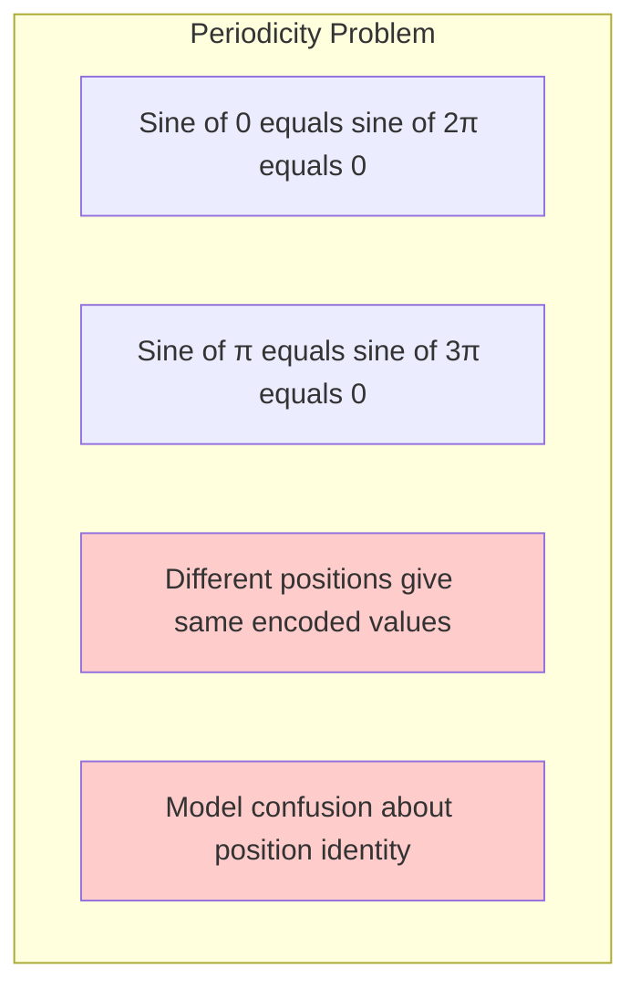

Now **इस approach का best part** क्या है कि previous approach की सारी problems इसने solve कर दी! क्या क्या problems थीं?

**First**: Unbounded values - the good part is यहाँ पर आपका y value हमेशा -1 और +1 के बीच में fluctuate करेगा तो पहली problem solve हो गई!

**Second**: वहाँ पर हमने discrete values ले रखी थीं - 1 के बाद 2, के बाद 3, के बाद 4। यहाँ पे ऐसा नहीं है, यहाँ पे there are continuous values, right?

**And the third thing** is कि अगर आप यह sine curve use करते हो तो यह आपका relational position भी बता पाएगा! कैसे बता पाएगा यह मैं आपको अभी नहीं बताऊंगा - video में थोड़ा आगे मैं आपको एक mathematical derivation दिखाऊंगा जिसके through I can tell you कि sine curve की help से आप दो positions के बीच का distance निकाल सकते हो, ठीक है?

तो यह तीनों problems solve हो रही हैं! **But there is a big problem इस approach में भी!**

**The Issue**: हमारा सबसे पहला requirement यह होता है कि अगर आप कोई भी positional encoding technique use करो उसमें हमेशा यह feature तो होना चाहिए कि हर word का positional encoding value **should be unique**!

इसका मतलब यह है कि अगर "River" का positional encoding point 0.0 आया with the help of this sine curve, तो आगे कितने भी words आ जाएं इस sentence में, कभी भी किसी भी और word का positional encoding value 0.0 नहीं आना चाहिए!

क्योंकि अगर दो words का positional encoding value same है, इसका यह मतलब हुआ कि उनका position भी same है। But guess what, "River" first position पे है और आगे चलके जो words होंगे वो किसी और position पर होंगे! तो अगर position अलग है तो positional encoding value भी अलग होनी चाहिए!

**But the problem is** कि sine curve is essentially **periodic**! मतलब यह जो pattern है यह repeat करेगा! और अगर यह repeat करेगा तो you can easily understand कि कभी ना कभी यह जो value आ रही है position 0 के लिए, हो सकता है कि आगे किसी और number के लिए - मान लो 2π के लिए भी वो same value आ जाए!

Similarly अगर position 1 के लिए यह value है, तो हो सकता है कि आगे किसी और number के लिए - let's say position 1+2π के लिए यही same y value हो! और अगर ऐसा हुआ तो फिर बहुत बड़ी problem हो जाएगी, because आपके sentence में दो अलग words जो दो अलग positions में हैं उनकी positional encoding value same हो जा रही है!

इससे क्या होगा? आपका model confuse हो जाएगा! वो बोलेगा "Position 1 का भी 0.84 है, position 1+2π का भी 0.84 है, मतलब यह दोनों same position के words हैं!" और फिर बहुत बड़ी गड़बड़ हो जाएगी।

**So हालांकि यह जो approach है** यह आपके previous approach के तीन problems को solve कर रहा है, but इसका खुद एक बहुत बड़ा problem है और वह problem है **periodicity**! Periodicity हमें help भी कर रहा है, but इस case में एक तरीके से नुकसान भी पहुंचा रहा है।

So अब हमें क्या करना पड़ेगा? किसी तरीके से यह जो problem आई है कि values repeat हो सकती हैं, इस problem को किसी तरीके से हमें solve करना पड़ेगा!

### Attempt 3: Multiple Sine-Cosine Pairs

अब इस problem को solve करने का एक बहुत simple approach यह हो सकता है कि आप सिर्फ एक trigonometric function use करने के बदले **दो trigonometric functions use करो**!

**Solution**: Use multiple trigonometric functions with different frequencies to reduce collision probability.

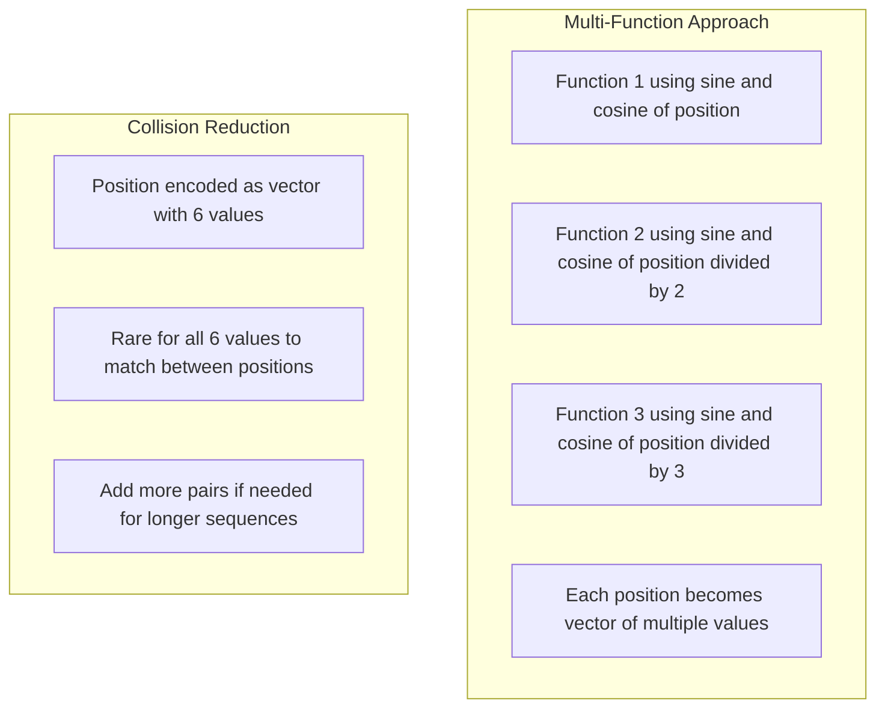

**Implementation:**
```python
def multi_trigonometric_encoding(position, num_pairs=3):
    encoding = []
    for i in range(num_pairs):
        frequency = 1 / (i + 1)
        encoding.append(math.sin(position * frequency))
        encoding.append(math.cos(position * frequency))
    return encoding

# For position 1 with 3 pairs:
# [sin(1), cos(1), sin(0.5), cos(0.5), sin(0.33), cos(0.33)]
```

**Key Pattern**: Each additional sine-cosine pair uses a **lower frequency** to capture different temporal patterns.

---

## The Final Solution: Vaswani et al.'s Positional Encoding

Now that we understand the reasoning, let's see the actual formula from the "Attention Is All You Need" paper:

### The Mathematical Formulation

```
PE(pos, 2i) = sin(pos / 10000^(2i/d_model))
PE(pos, 2i+1) = cos(pos / 10000^(2i/d_model))
```

**Where:**
- `pos` = position in sequence (0, 1, 2, ...)
- `i` = dimension index (0, 1, 2, ..., d_model/2 - 1)  
- `d_model` = embedding dimension (typically 512)

### Step-by-Step Implementation

Let's work through a concrete example with `d_model = 6` for the sentence "River Bank":

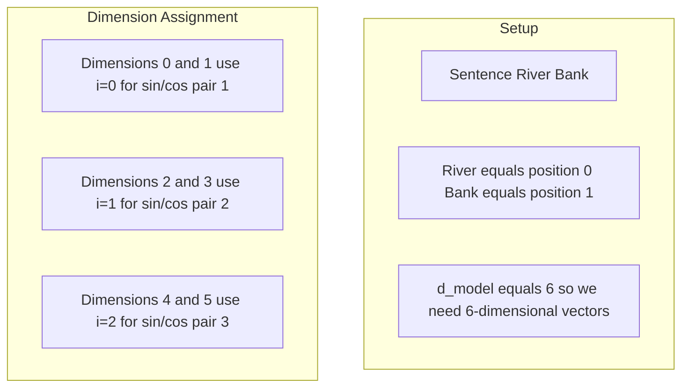

**For River (position 0):**

```python
import math

def calculate_positional_encoding(pos, d_model):
    pe = []
    
    for i in range(d_model // 2):
        # Calculate frequency
        freq = pos / (10000 ** (2 * i / d_model))
        
        # Add sine and cosine values
        pe.append(math.sin(freq))
        pe.append(math.cos(freq))
    
    return pe

# River (position 0)
river_pe = calculate_positional_encoding(0, 6)
# Result: [sin(0), cos(0), sin(0), cos(0), sin(0), cos(0)]
# Result: [0, 1, 0, 1, 0, 1]
```

**Detailed Calculation for River (pos=0):**

| Dimension | i | Formula | Calculation | Result |
|-----------|---|---------|-------------|--------|
| 0 | 0 | sin(0/10000^(0/6)) | sin(0) | 0 |
| 1 | 0 | cos(0/10000^(0/6)) | cos(0) | 1 |
| 2 | 1 | sin(0/10000^(2/6)) | sin(0) | 0 |
| 3 | 1 | cos(0/10000^(2/6)) | cos(0) | 1 |
| 4 | 2 | sin(0/10000^(4/6)) | sin(0) | 0 |
| 5 | 2 | cos(0/10000^(4/6)) | cos(0) | 1 |

**For Bank (position 1):**

| Dimension | i | Formula | Calculation | Result |
|-----------|---|---------|-------------|--------|
| 0 | 0 | sin(1/10000^(0/6)) | sin(1) | 0.841 |
| 1 | 0 | cos(1/10000^(0/6)) | cos(1) | 0.540 |
| 2 | 1 | sin(1/10000^(2/6)) | sin(1/4.64) | 0.213 |
| 3 | 1 | cos(1/10000^(2/6)) | cos(1/4.64) | 0.977 |
| 4 | 2 | sin(1/10000^(4/6)) | sin(1/21.5) | 0.046 |
| 5 | 2 | cos(1/10000^(4/6)) | cos(1/21.5) | 0.999 |

### Complete Implementation

```python
import torch
import math

def get_positional_encoding(seq_len, d_model):
    """
    Generate sinusoidal positional encodings exactly as in 
    'Attention Is All You Need' paper
    """
    pe = torch.zeros(seq_len, d_model)
    
    position = torch.arange(0, seq_len).unsqueeze(1).float()
    
    # Create div_term for frequency calculation
    div_term = torch.exp(torch.arange(0, d_model, 2).float() * 
                        -(math.log(10000.0) / d_model))
    
    # Apply sin to even indices (0, 2, 4, ...)
    pe[:, 0::2] = torch.sin(position * div_term)
    
    # Apply cos to odd indices (1, 3, 5, ...)
    pe[:, 1::2] = torch.cos(position * div_term)
    
    return pe

# Example: 50 words, 128-dimensional embeddings
pe_matrix = get_positional_encoding(50, 128)
print(f"Shape: {pe_matrix.shape}")  # [50, 128]
```

### Integration with Embeddings

**Critical Design Decision**: Why addition instead of concatenation?

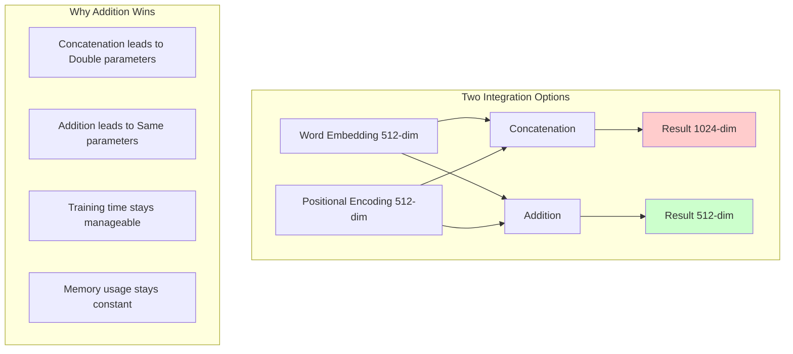

**Implementation:**
```python
class TransformerWithPositionalEncoding(nn.Module):
    def __init__(self, vocab_size, d_model, max_seq_len):
        super().__init__()
        self.d_model = d_model
        self.token_embedding = nn.Embedding(vocab_size, d_model)
        
        # Pre-compute positional encodings
        self.register_buffer('pos_encoding', 
                           get_positional_encoding(max_seq_len, d_model))
    
    def forward(self, x):
        seq_len = x.size(1)
        
        # Token embeddings (scaled by sqrt(d_model) as in paper)
        token_emb = self.token_embedding(x) * math.sqrt(self.d_model)
        
        # Add positional encodings
        pos_emb = self.pos_encoding[:seq_len, :]
        
        # Element-wise addition
        return token_emb + pos_emb
```

---

## The Famous Heatmap: Understanding the Visual Pattern

When we visualize positional encodings as a heatmap, we see beautiful patterns that reveal the underlying mathematics:
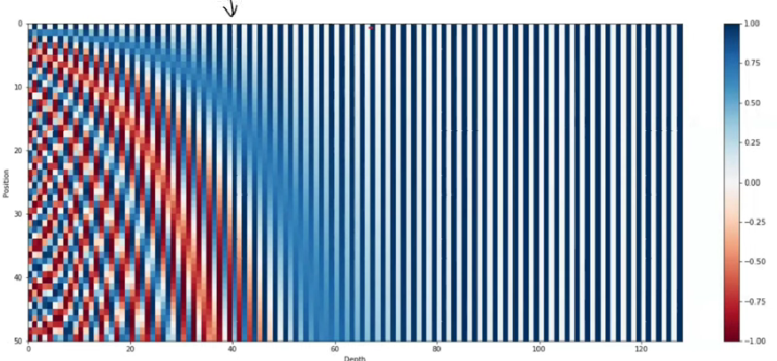
### Interpreting the Heatmap

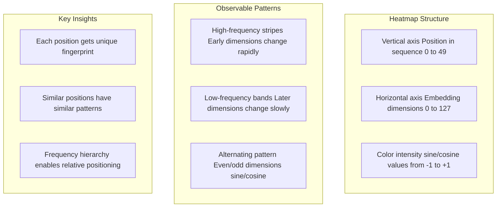

### The Binary Encoding Analogy

The frequency pattern in positional encoding mirrors binary number representation:

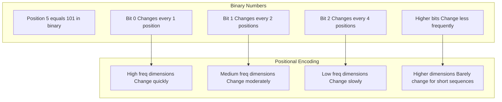

**Key Insight**: Just as binary encoding uses different bit frequencies to uniquely represent numbers, positional encoding uses different sine/cosine frequencies to uniquely represent positions - but in the continuous domain rather than discrete!

### Pattern Analysis from the Heatmap

**Observation 1**: For position 0 (first word), the pattern is alternating 0,1,0,1,0,1... because sin(0)=0 and cos(0)=1 for all frequencies.

**Observation 2**: Lower dimensions (higher frequencies) show lots of variation between positions, while higher dimensions (lower frequencies) remain relatively stable for short sequences.

**Observation 3**: For longer sequences (100+ words), even the higher dimensions begin to participate, creating variation across all dimensions.

```python
# Demonstrate the frequency hierarchy
def analyze_frequencies(d_model=512):
    frequencies = []
    for i in range(d_model // 2):
        freq = 1 / (10000 ** (2 * i / d_model))
        frequencies.append(freq)
    
    print("First few frequencies (high):", frequencies[:5])
    print("Last few frequencies (low):", frequencies[-5:])

# High frequencies change rapidly, low frequencies change slowly
analyze_frequencies()
```

---

## The Mind-Blowing Linear Transformation Property  

Now I want to discuss with you what is probably the most fascinating aspect that we can capture through this sine-cosine system. And to discuss this, I'll use the same graph as an example to explain it again.

### Setting Up the Mathematical Foundation

Let's clarify our setup: We have 50 words, which means we have 50 vectors, and each vector is 128-dimensional. Now pay attention - **this is where the interesting stuff begins!**

So the way we've applied this entire sine-cosine varying frequency approach has given our positional encoding a very interesting property. What is this interesting property? Let me explain, but before explaining, I want to give you an intuition.

### Visualizing in High-Dimensional Space

These 50 vectors, each being 128-dimensional, you can imagine like this: **This is a 128-dimensional space** (obviously I can't draw it, so I'm helping you understand through 2D). Imagine this as 128D space.

Here we have many vectors - how many vectors? **50 vectors**. For every word, there is one vector. You need to imagine this as you follow along.

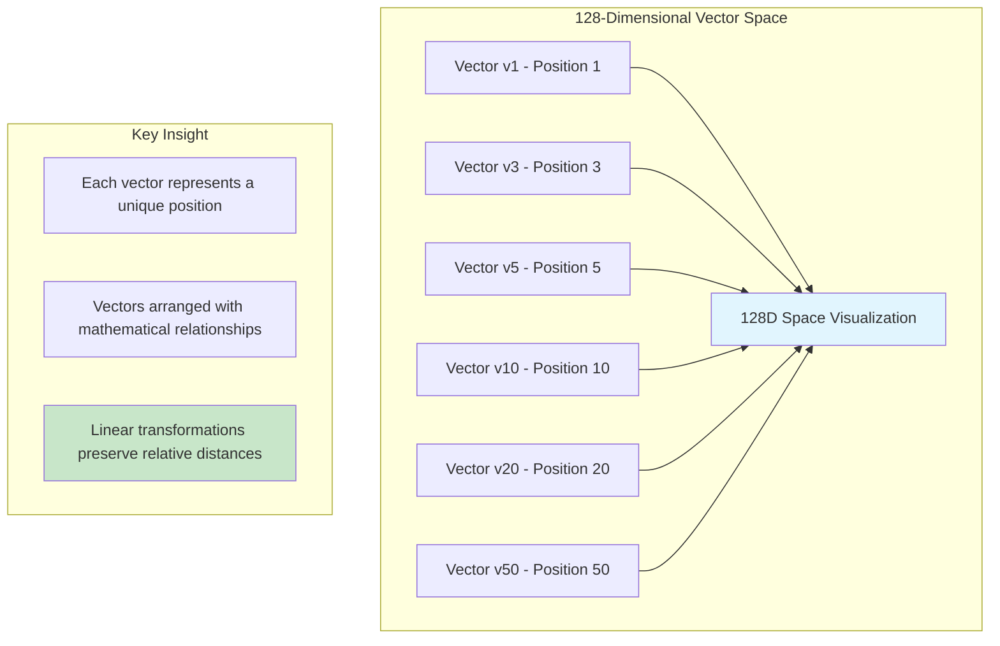

### The Revolutionary Linear Transformation Property

Now let me tell you an interesting property about these vectors. We've played this entire sine-cosine game in such a way that among these 50 vectors, a very interesting property has emerged:

**The Core Property**: Suppose I take a particular vector - let's say I'm taking **vector number 10**. Now if I apply a linear transformation to this vector number 10 (linear transformation simply means applying a matrix), then for some particular matrix, what will happen is that as soon as I apply that matrix to v10, **I will automatically get v20**!

This can happen, right? I have a vector, I applied a linear transformation (a matrix) to this vector, so I went from v10 to where? To vector 20.

Now the fun part is: **If I take this same matrix as-is and apply it to v3, can you guess what will happen?**

Your guess is correct! If you said that you'll reach **v13**, then any guesses - if I take this same matrix and apply it to v4, where will I reach? I'll reach **v14**.

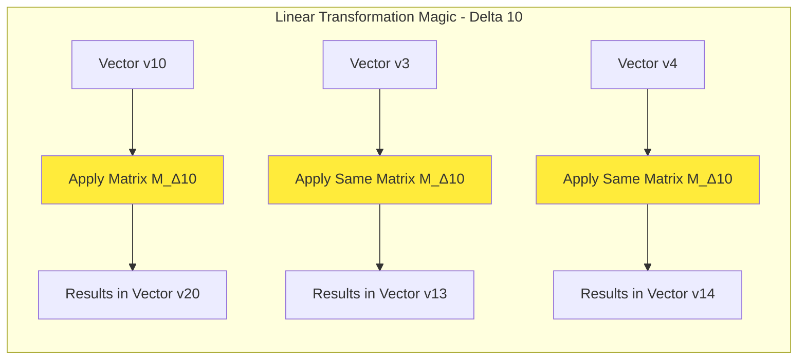

So in a way, **this interesting property is that this particular matrix has the capability to cover a delta of 10** - the capability to cover a delta or distance of 10.

### Universal Delta Coverage - Every Distance Has Its Matrix

Now the fun part is that **this property is available for every delta**! Let me explain this again with another example.

So suppose I have **v5** and I took a particular matrix, and this matrix took me and threw me where? To **v12**. Here, the delta is 7.

Now what if I again take this same matrix and apply it to v1, can you guess what will happen? I guess you are able to understand - I'll reach **v8**! If I apply the same matrix to v21, then I'll reach **v28**.

**This means that this matrix has the capability to travel a delta of 7 or a distance of 7.**

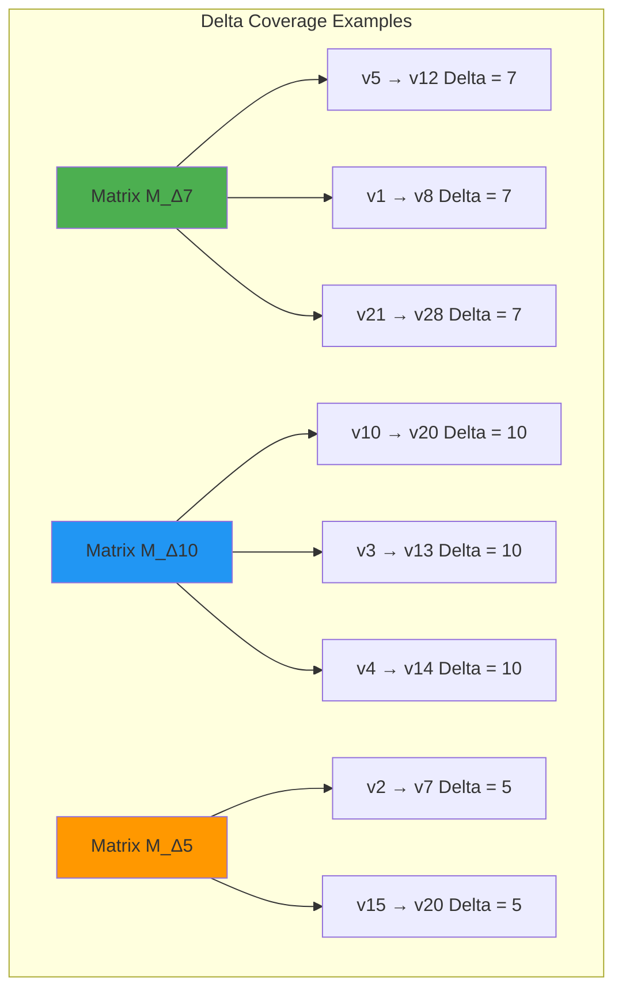

### The Mathematical Foundation

**So the main principle in this entire system is**: **For each delta, there is a linear transformation or a matrix available**, with the help of which you can reach from anywhere to anywhere.

And in this way, this system has this intelligence of **relative positions**, which was **not available in our simple solution**.

**This is first of all mind-blowing! The mathematics is mind-blowing!**

### The Technical Details and Matrix Structure

I'm pretty sure you'll have questions in your mind about what that matrix is, what it looks like. So I won't go very deep because it will take another 30-40 minutes for me to explain the mathematics.

**What I can do is point you to the correct resources.**

This is a blog - **Tim Dettmers' blog** - I'll give you this link in the description, you should check it. Here this topic is "Linear Relationships in Transformers Positional Encoding". I wouldn't say this blog is very easy to read, but if you put some effort into it, you'll understand what linear transformation I'm talking about.

**This is that linear transformation** - what you see here. This is the linear transformation I'm talking about. When the value of 'k' in this changes, different deltas get captured.

```python
# The mathematical relationship that enables relative positioning
def create_transformation_matrix(delta_k, d_model):
    """
    Creates the linear transformation matrix for relative offset k
    This matrix can transform PE(pos) to PE(pos + k)
    """
    matrix = np.zeros((d_model, d_model))
    
    for i in range(0, d_model, 2):
        # Frequency for this dimension pair
        freq = 1.0 / (10000 ** (i / d_model))
        
        # Rotation matrix for this frequency
        cos_component = np.cos(delta_k * freq)
        sin_component = np.sin(delta_k * freq)
        
        # Fill the rotation components
        matrix[i, i] = cos_component      # cos for sine dimension
        matrix[i, i+1] = sin_component    # sin for sine dimension  
        matrix[i+1, i] = -sin_component   # -sin for cosine dimension
        matrix[i+1, i+1] = cos_component  # cos for cosine dimension
    
    return matrix

# Example: Transform position 10 to position 20 (delta = 10)
transformation_matrix = create_transformation_matrix(delta_k=10, d_model=128)
print("Matrix shape:", transformation_matrix.shape)
print("This matrix can transform any position vector to a vector 10 positions ahead!")
```

### Why Sine AND Cosine Together?

And this will give you the answer to another question. If you pay attention, **this matrix has both sine components and cosine components**, and this is a big reason why we use **sine-cosine pairs** in our positional encoding.

I hadn't clarified this with you until now - **why we're taking sine-cosine pairs together**. We could have just taken sine, but **taking sine and cosine together makes the entire mathematics converge in such a way that you are able to capture relative distances within your sentence**.

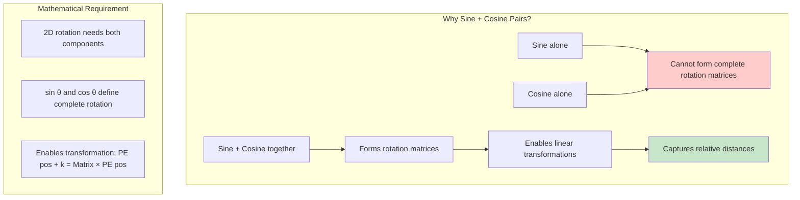

### Personal Learning Journey and Reflection

**So I really hope, first of all, you appreciate this point.** It's not possible to explain everything, but as a teacher, my goal is to spark curiosity. I really hope I was able to do that.

**This topic is mind-blowing!** I also studied and researched this in such depth for the first time in the process of making this video. Before this, whenever I've studied transformer architecture, I'll be very honest - **I have somewhat ignored positional encoding** because there are so many other glamorous things to study - self-attention, residual connections, and so much more. So attention always went there.

But **this is the first time when I have actually given time, I have spent time on this topic of positional encoding, and this has blown my mind**. And I really hope after this video you also feel that **mathematics is such a beautiful thing**, right?

### Further Exploration Challenge

**So if you are interested, please go ahead, read this blog, use ChatGPT to simplify things**, and try to understand why this interesting property we discovered came into the system, what's the reason for it. **It is a very, very good exercise.**

**The Tim Dettmers Blog Link**: [Linear Relationships in Transformer Positional Encoding](https://timdettmers.com/2022/04/27/linear-relationships-transformer-positional-encoding/)

### Conclusion and Appreciation

With that, I will conclude this video. On this channel, I will be putting more content like this. And needless to say, a lot of effort goes into this level of research. I really hope you are able to appreciate it, and please, if you want, you can share the content among your friends who are studying these things. It would be very, very good for me if more people come to this channel and learn data science.

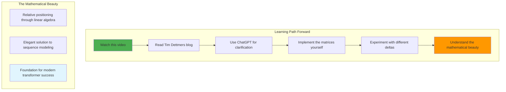

---

## Advanced Mathematical Properties: The Mind-Blowing Part

### Property 1: Linear Relative Position Relationships

Here's where the mathematics becomes truly elegant. The trigonometric positional encoding has a remarkable property:

**Any position offset can be expressed as a linear transformation!**

```math
PE(pos + k) = M_k × PE(pos)
```

Where `M_k` is a learnable matrix that encodes the relative distance `k`.

**Mathematical Proof:**
```
sin(pos + k) = sin(pos)cos(k) + cos(pos)sin(k)
cos(pos + k) = cos(pos)cos(k) - sin(pos)sin(k)
```

This can be written in matrix form:
```
[sin(pos + k)]   [cos(k)  sin(k)] [sin(pos)]
[cos(pos + k)] = [-sin(k) cos(k)] [cos(pos)]
```

### Practical Implications

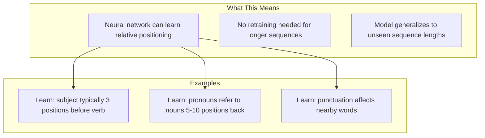

### Implementation Example

```python
def create_relative_position_matrix(offset_k, d_model):
    """
    Create the linear transformation matrix for relative offset k
    """
    M = torch.zeros(d_model, d_model)
    
    for i in range(0, d_model, 2):
        freq = 1 / (10000 ** (i / d_model))
        
        # For each sine-cosine pair
        sin_k = math.sin(offset_k * freq)
        cos_k = math.cos(offset_k * freq)
        
        # Build rotation matrix
        M[i, i] = cos_k      # sin component
        M[i, i+1] = sin_k
        M[i+1, i] = -sin_k   # cos component  
        M[i+1, i+1] = cos_k
    
    return M

# Example: Matrix that transforms position p to position p+3
M_3 = create_relative_position_matrix(3, 512)
```

### Property 2: Infinite Sequence Generalization

Unlike learned position embeddings, trigonometric encoding works for **any sequence length**:

```mermaid
graph TD
    subgraph "Training Phase"
        A[Train on sequences ≤ 100 words]
        B[Learn trigonometric patterns]
    end
    
    subgraph "Inference Phase"  
        C[Test on sequences of 1000+ words]
        D[Same mathematical formula applies]
        E[No performance degradation]
    end
    
    A --> B
    B --> D
    C --> D
    D --> E
```

**Comparison with Learned Embeddings:**
```python
# Learned embeddings: Fixed vocabulary
learned_pe = nn.Embedding(max_seq_len=512, d_model=512)
# Problem: Can't handle sequences longer than 512

# Trigonometric: Works for any length
def trigonometric_pe(seq_len, d_model):
    # No upper limit on seq_len!
    return get_positional_encoding(seq_len, d_model)
```

### Property 3: Smooth Interpolation

Trigonometric functions provide smooth transitions between positions:

```python
def interpolate_positions(pos1, pos2, alpha, d_model):
    """
    Smoothly interpolate between two positions
    alpha=0 gives pos1, alpha=1 gives pos2
    """
    pe1 = get_positional_encoding(pos1+1, d_model)[pos1]
    pe2 = get_positional_encoding(pos2+1, d_model)[pos2]
    
    # Linear interpolation
    return (1 - alpha) * pe1 + alpha * pe2

# Position 1.5 is smooth blend of positions 1 and 2
intermediate_pe = interpolate_positions(1, 2, 0.5, 512)
```

---

## Implementation Deep Dive: Production-Ready Code

### Complete Positional Encoding Class

```python
import torch
import torch.nn as nn
import math

class PositionalEncoding(nn.Module):
    """
    Positional Encoding as described in 'Attention Is All You Need'
    
    Args:
        d_model: Embedding dimension
        max_seq_len: Maximum sequence length to pre-compute
        dropout: Dropout rate (default: 0.1)
    """
    
    def __init__(self, d_model, max_seq_len=5000, dropout=0.1):
        super().__init__()
        self.dropout = nn.Dropout(dropout)
        
        # Create positional encoding matrix
        pe = torch.zeros(max_seq_len, d_model)
        position = torch.arange(0, max_seq_len).unsqueeze(1).float()
        
        # Create frequency terms
        div_term = torch.exp(torch.arange(0, d_model, 2).float() *
                           -(math.log(10000.0) / d_model))
        
        # Apply sine to even indices
        pe[:, 0::2] = torch.sin(position * div_term)
        
        # Apply cosine to odd indices  
        pe[:, 1::2] = torch.cos(position * div_term)
        
        # Add batch dimension and register as buffer
        pe = pe.unsqueeze(0)
        self.register_buffer('pe', pe)
    
    def forward(self, x):
        """
        Args:
            x: Token embeddings [batch_size, seq_len, d_model]
        Returns:
            x + positional encodings
        """
        seq_len = x.size(1)
        
        # Add positional encoding (no gradient required)
        x = x + self.pe[:, :seq_len].requires_grad_(False)
        
        return self.dropout(x)

# Usage example
class SimpleTransformer(nn.Module):
    def __init__(self, vocab_size, d_model=512, max_seq_len=1000):
        super().__init__()
        self.d_model = d_model
        
        # Token embeddings
        self.token_embedding = nn.Embedding(vocab_size, d_model)
        
        # Positional encoding
        self.pos_encoding = PositionalEncoding(d_model, max_seq_len)
        
        # Scale factor as mentioned in paper
        self.scale_factor = math.sqrt(d_model)
    
    def forward(self, input_ids):
        # Get token embeddings and scale
        embeddings = self.token_embedding(input_ids) * self.scale_factor
        
        # Add positional encoding
        embeddings = self.pos_encoding(embeddings)
        
        return embeddings

# Test the implementation
model = SimpleTransformer(vocab_size=10000)
input_ids = torch.randint(0, 10000, (2, 50))  # Batch of 2, seq_len 50
output = model(input_ids)
print(f"Output shape: {output.shape}")  # [2, 50, 512]
```

### Visualization Tools

```python
import matplotlib.pyplot as plt
import seaborn as sns

def visualize_positional_encoding(seq_len=50, d_model=128):
    """
    Create the famous positional encoding heatmap
    """
    pe = get_positional_encoding(seq_len, d_model)
    
    plt.figure(figsize=(12, 8))
    sns.heatmap(pe.numpy(), cmap='RdBu', center=0, 
                xticklabels=range(0, d_model, 10),
                yticklabels=range(0, seq_len, 5))
    plt.title('Positional Encoding Heatmap')
    plt.xlabel('Embedding Dimension')
    plt.ylabel('Position in Sequence')
    plt.tight_layout()
    plt.show()

def plot_frequency_analysis(d_model=512):
    """
    Show how frequencies decrease across dimensions
    """
    frequencies = []
    for i in range(d_model // 2):
        freq = 1 / (10000 ** (2 * i / d_model))
        frequencies.append(freq)
    
    plt.figure(figsize=(10, 6))
    plt.semilogy(frequencies)
    plt.title('Frequency Distribution Across Dimensions')
    plt.xlabel('Dimension Pair Index')
    plt.ylabel('Frequency (log scale)')
    plt.grid(True)
    plt.show()

# Generate visualizations
visualize_positional_encoding()
plot_frequency_analysis()
```

---

## Interactive Learning Tools and Comprehensive Resources

### 1. 3D Interactive Transformer Visualizer

<iframe src="https://bbycroft.net/llm" width="100%" height="800px" frameborder="0" style="border: 2px solid #4da6ff; border-radius: 10px; box-shadow: 0 4px 8px rgba(0,0,0,0.1);">
    Your browser does not support iframes. Please visit: https://bbycroft.net/llm
</iframe>

**Navigation Guide:**
1. Navigate to the "Positional Encoding" section in the 3D model
2. Adjust the sequence length slider to see patterns change
3. Modify embedding dimensions to understand scaling
4. Observe how sine/cosine patterns create unique position signatures
5. Notice the frequency hierarchy from high to low

### 2. Hands-on Implementation Notebook

<iframe src="https://colab.research.google.com/drive/1hXIQ77A4TYS4y3UthWF-Ci7V7vVUoxmQ#scrollTo=YLAhBxDSScmV" width="100%" height="800px" frameborder="0" style="border: 2px solid #ff6b6b; border-radius: 10px; box-shadow: 0 4px 8px rgba(0,0,0,0.1);">
    Your browser does not support iframes. Please visit the Colab notebook directly.
</iframe>

**Recommended Experiments:**
1. **Compare encoding methods**: Implement simple, normalized, and trigonometric approaches
2. **Visualize heatmaps**: Generate positional encoding matrices for different parameters  
3. **Test relative positioning**: Demonstrate linear transformation properties
4. **Sequence length experiments**: Test generalization beyond training lengths
5. **Attention pattern analysis**: See how positional encoding affects attention weights

### 3. Advanced Mathematical Resources

For deeper understanding of the linear transformation properties:

**Essential Reading:**
- [Linear Relationships in Transformer Positional Encoding](https://timdettmers.com/2022/04/27/linear-relationships-transformer-positional-encoding/) - Tim Dettmers Blog
- [The Illustrated Transformer](https://jalammar.github.io/illustrated-transformer/) - Visual explanations
- [Attention Visualizer](https://poloclub.github.io/transformerlens/) - Interactive attention patterns

**Mathematical Deep Dive:**
The linear transformation property mentioned in the video can be explored through this transformation matrix:

```
M_k = [[cos(k/10000^(2i/d_model)), sin(k/10000^(2i/d_model))],
       [-sin(k/10000^(2i/d_model)), cos(k/10000^(2i/d_model))]]
```

This matrix encodes relative distance `k` and can transform `PE(pos)` to `PE(pos + k)` through learned linear layers.

### 4. Animation and Interactive Resources

- **Positional Encoding Animations**: [Distill.pub Attention Article](https://distill.pub/2016/attention/)
- **BertViz**: [Visualize BERT Attention](https://github.com/jessevig/bertviz)
- **AttentionViz**: [Interactive Attention Exploration](https://github.com/PAIR-code/AttentionViz)
- **Transformer Debugger**: [Anthropic's Analysis Tool](https://github.com/anthropics/transformer-debugger)

---

## Advanced Insights: Why This Solution is Genius

### The Elegant Engineering Trade-offs

```mermaid
graph TD
    subgraph "Design Requirements Met"
        A[Bounded values Always between -1 and +1]
        B[Continuous Smooth transitions]
        C[Periodic Enables relative positioning]
        D[Unique Each position gets distinct signature]
        E[Generalizable Works for any sequence length]
    end
    
    subgraph "Implementation Benefits"
        F[No learned parameters needed]
        G[Zero additional training cost]
        H[Perfect generalization to longer sequences]
        I[Mathematically interpretable]
        J[Enables relative position learning]
    end
    
    A --> F
    B --> G
    C --> H
    D --> I
    E --> J
```

### Comparison with Alternative Approaches

| Approach | Pros | Cons | Use Cases |
|----------|------|------|-----------|
| **Simple Counting** | Easy to understand | Unbounded, discrete, no relative positioning | None recommended |
| **Normalized Positions** | Bounded values | Inconsistent across sequence lengths | None recommended |
| **Learned Embeddings** | Optimized for specific tasks | Limited sequence length, requires training | Short, fixed-length sequences |
| **Trigonometric (Used)** | All benefits, no downsides | Slightly complex to understand | All transformer applications |
| **Relative Position Encoding** | Direct relative modeling | Quadratic memory complexity | Specialized applications |

### Impact on Modern Architectures

**Models Using This Approach:**
- **BERT**: Standard trigonometric positional encoding
- **GPT-1/2/3**: Learned positional embeddings (different approach)
- **T5**: Relative position bias (hybrid approach)
- **RoBERTa**: Same as BERT
- **DeBERTa**: Enhanced relative positioning

**Performance Implications:**
- Enables zero-shot generalization to longer texts
- Reduces model size (no position parameters)
- Improves mathematical interpretability
- Facilitates relative position learning

---

## Key Takeaways and Conceptual Summary

### The Complete Solution Architecture

```mermaid
graph TD
    subgraph "Problem Identification"
        A[Self-attention lacks position awareness]
        B[Parallel processing ≠ sequence understanding]
        C[Permutation invariance is both strength and weakness]
    end
    
    subgraph "Solution Evolution"
        D[Simple counting: Failed due to unbounded growth]
        E[Normalization: Failed due to inconsistency]
        F[Single sine: Failed due to periodicity collisions]
        G[Multi-sine/cosine: Success with frequency hierarchy]
    end
    
    subgraph "Final Implementation"
        H[Trigonometric functions with frequency scaling]
        I[Addition with token embeddings]
        J[Linear relative position capabilities]
        K[Infinite sequence generalization]
    end
    
    A --> D
    B --> E
    C --> F
    D --> G
    E --> G
    F --> G
    G --> H
    H --> I
    I --> J
    J --> K
```

### Essential Mathematical Insights

1. **Frequency Hierarchy**: Lower dimensions use high frequencies (rapid changes), higher dimensions use low frequencies (slow changes), creating a temporal hierarchy similar to binary encoding.

2. **Linear Transformation Property**: The mathematical beauty lies in the ability to express `PE(pos + k)` as a linear transformation of `PE(pos)`, enabling neural networks to learn relative positioning through standard linear layers.

3. **Continuous Binary Encoding**: The approach essentially implements binary positional encoding in the continuous domain, providing smooth interpolation and infinite extensibility.

4. **Zero-Parameter Solution**: Unlike learned position embeddings, this approach requires no additional parameters while providing superior generalization.

### Practical Implementation Guidelines

```python
# Production-ready checklist:
✓ Use torch.register_buffer() for positional encodings
✓ Scale token embeddings by sqrt(d_model) as in original paper  
✓ Apply dropout after adding positional encodings
✓ Pre-compute encodings up to reasonable max length (5000+ tokens)
✓ Ensure proper device placement for encodings
✓ Consider mixed precision compatibility
```

### Final Thoughts: The Beauty of Mathematics

The trigonometric positional encoding represents one of the most elegant solutions in modern deep learning. What started as a simple need - "how do we tell a transformer about word order?" - led to a mathematically beautiful solution that:

- Solves multiple problems simultaneously
- Requires zero additional parameters
- Generalizes perfectly to unseen sequence lengths  
- Provides interpretable mathematical properties
- Enables advanced relative positioning capabilities

This is why positional encoding deserves deep study rather than a quick 2-3 line explanation. The mathematics is not just functional - it's genuinely beautiful, representing the kind of insight that makes transformers so powerful.

**The core insight**: By thinking about position encoding as a signal processing problem and leveraging the mathematical properties of trigonometric functions, the researchers created a solution that is both elegant and supremely practical.

Understanding this foundation prepares you to fully appreciate how transformers achieve their remarkable capabilities and why they've revolutionized natural language processing.

**Now you understand why transformers can process sequences in parallel while still understanding word order - the trigonometric positional encoding is the mathematical magic that makes it all possible!**

---

## Additional Insights: Linear Relationships in Transformer Positional Encoding

### Deep Mathematical Analysis from Tim Dettmers

The positional encoding system in transformers has an even more fascinating property that demonstrates the mathematical elegance of this approach. According to research by Tim Dettmers, the trigonometric positional encoding enables **linear relationships** that allow the model to understand relative positions through simple matrix operations.

### The Linear Transformation Property Explained

The key insight is that for any positional offset `k`, there exists a linear transformation matrix `T^(k)` that can transform the positional encoding of position `t` to position `t+k`:

```
PE(t+k) = T^(k) × PE(t)
```

This transformation matrix `T^(k)` has remarkable properties:
- It depends only on the offset `k`, the model dimension `d_model`, and the frequencies used
- It does NOT depend on the specific position `t`
- The same matrix can transform ANY position by the same relative offset

### Mathematical Foundation

The mathematical proof relies on trigonometric identities:

```
sin(t+k) = sin(t)cos(k) + cos(t)sin(k)
cos(t+k) = cos(t)cos(k) - sin(t)sin(k)
```

These can be expressed as rotation matrices:
```
[sin(t+k)]   [cos(k)  sin(k)] [sin(t)]
[cos(t+k)] = [-sin(k) cos(k)] [cos(t)]
```

When extended across all dimensions with different frequencies, this creates a block-diagonal matrix where each 2×2 block is a rotation matrix corresponding to a specific frequency.

### Why This Matters for Transformers

This linear relationship property means that:

1. **Relative Position Learning**: The model can learn to attend to relative positions (e.g., "look 3 words back") through simple linear transformations
2. **Generalization**: Patterns learned on shorter sequences automatically work on longer sequences
3. **Efficiency**: No need for complex position-dependent parameters

### The Geometric Intuition

In the high-dimensional embedding space, each position creates a unique "fingerprint" vector. The linear transformation property ensures that the geometric relationships between these fingerprints follow a consistent pattern - moving from any position to a position `k` steps away always involves the same geometric transformation.

### Connection to the Original Design Goal

The authors of "Attention Is All You Need" hypothesized that this encoding would allow the model to "easily learn to attend by relative positions." The linear transformation property provides the mathematical foundation for why this hypothesis was correct - the model can indeed learn relative positioning through standard linear layers.

### Research Impact

This mathematical elegance explains why transformer models can:
- Process variable-length sequences without retraining
- Learn positional relationships that generalize across different sequence lengths  
- Capture both local and long-range dependencies through the frequency hierarchy

The linear relationships in positional encoding represent one of the most beautiful examples of how mathematical insight can lead to practical breakthroughs in machine learning.

**Source**: [Linear Relationships in Transformer Positional Encoding](https://blog.timodenk.com/linear-relationships-in-the-transformers-positional-encoding/) - Tim Dettmers