# Layer Normalization in Transformers: Why Not Batch Normalization?

## Paper References and Context

**Original Research Papers:**
- "Layer Normalization" (Ba et al., 2016) - [arXiv:1607.06450](https://arxiv.org/abs/1607.06450)
- "Attention Is All You Need" (Vaswani et al., 2017) - [arXiv:1706.03762](https://arxiv.org/abs/1706.03762)

**Video Context:** Welcome to Day 79 of the 100-day Deep Learning series! This video explores Layer Normalization - the final key component before diving into the complete transformer architecture. While most transformer videos briefly mention layer normalization in 2-3 lines, this comprehensive tutorial explains why transformers specifically use layer normalization instead of batch normalization.

**Learning Journey:** By the end of this walkthrough, you'll understand normalization in deep learning, see a detailed demonstration of why batch normalization fails for sequential data, learn how layer normalization solves these problems, and understand its specific application in transformers.

**Connection to Broader Concepts:** Layer normalization is the crucial technique that enables stable training in transformers by handling variable-length sequences and padding effectively, making it fundamental to all modern transformer architectures like BERT and GPT.

---

## The Journey to Understanding Normalization

We've already covered three essential transformer components in previous videos: embeddings, attention mechanisms (self-attention and multi-head attention), and positional encoding. Now let's explore the final piece before diving into the complete architecture - normalization.

```mermaid
graph TD
    subgraph "Transformer Components Journey"
        A[Embeddings ✓]
        B[Self-Attention ✓]
        C[Multi-Head Attention ✓]
        D[Positional Encoding ✓]
        E[Layer Normalization 📍]
        F[Complete Architecture Next!]
    end
    
    subgraph "Today's Video Plan"
        G[What is Normalization?]
        H[Batch Norm Quick Review]
        I[Why Batch Norm Fails on Sequential Data]
        J[Layer Normalization Solution]
        K[Application in Transformers]
    end
    
    A --> B --> C --> D --> E --> F
    E --> G --> H --> I --> J --> K
    
    style E fill:#ffeb3b
    style F fill:#4caf50
```

In the transformer architecture diagram, you'll notice normalization steps appear after attention layers. Today we'll understand why specifically Layer Normalization is used here instead of Batch Normalization.

## What is Normalization in Deep Learning?

Normalization in deep learning refers to the process of transforming data to have specific statistics. Let's quickly review the fundamentals.

### Forms of Normalization

```mermaid
graph TD
    subgraph "Common Normalization Types"
        A["Standardization
        x' = x - μ / σ
        Mean = 0, Std = 1"]
        B["Min-Max Scaling
        x' = x - min / max - min
        Range = 0,1"]
        C["Layer Norm
        Normalize across features"]
        D["Batch Norm
        Normalize across batch"]
    end
    
    style A fill:#e3f2fd
    style B fill:#e3f2fd
    style C fill:#c8e6c9
    style D fill:#ffccbc
```

### Where to Apply Normalization in Neural Networks


**Two places for normalization:**
1. **Input Features**: Normalize f1, f2, f3 before feeding to network
2. **Hidden Layer Activations**: Normalize outputs from hidden layers

### Benefits of Normalization


### Understanding Internal Covariate Shift

Let me explain this important concept briefly (detailed explanation in the Batch Normalization video):


**Internal Covariate Shift**: During training, as weights in earlier layers change due to backpropagation, the distribution of inputs to later layers keeps changing. This makes training unstable. Normalization helps stabilize these distributions.

## Batch Normalization: A Quick Review

Let's quickly review how Batch Normalization works before understanding why it fails for transformers.

### Batch Normalization Setup


Let me show you the calculation process with actual numbers:

| Sample | f1 | f2 | z1 | z2 | z3 |
|--------|----|----|----|----|-----|
| 1      | 2  | 3  | 7  | 5  | 4   |
| 2      | 1  | 1  | 2  | 3  | 4   |
| 3      | 4  | 2  | 1  | 2  | 3   |
| 4      | 3  | 1  | 7  | 5  | 6   |
| 5      | 2  | 5  | 3  | 3  | 4   |

### Batch Normalization Process - Step by Step

Let me walk through each calculation step exactly as shown in the video:

```mermaid
graph TD
    subgraph "Step 1: Feed Data Through Network"
        A["Sample 1: f1=2, f2=3
        → z1=7, z2=5, z3=4"]
        B["Sample 2: f1=1, f2=1
        → z1=2, z2=3, z3=4"]
        C["Sample 3: f1=4, f2=2
        → z1=1, z2=2, z3=3"]
        D["Sample 4: f1=3, f2=1
        → z1=7, z2=5, z3=6"]
        E["Sample 5: f1=2, f2=5
        → z1=3, z2=3, z3=4"]
    end
    
    subgraph "Step 2: Calculate Column Statistics"
        F["z1 column: 7,2,1,7,3
        μ1 = (7+2+1+7+3)/5 = 4.0
        σ1 = std values = 2.65"]
        G["z2 column: 5,3,2,5,3
        μ2 = (5+3+2+5+3)/5 = 3.6
        σ2 = std values = 1.36"]
        H["z3 column: 4,4,3,6,4
        μ3 = (4+4+3+6+4)/5 = 4.2
        σ3 = std values = 1.09"]
    end
    
    A --> F
    B --> F
    C --> F
    D --> F
    E --> F
    
    style F fill:#ffeb3b
    style G fill:#ffeb3b
    style H fill:#ffeb3b
```

**Detailed Normalization for First Sample:**
```python
# Sample 1: z1=7, z2=5, z3=4
# Step 1: Normalize using column statistics
z1_norm = (7 - 4.0) / 2.65 = 3.0 / 2.65 = 1.13
z2_norm = (5 - 3.6) / 1.36 = 1.4 / 1.36 = 1.03  
z3_norm = (4 - 4.2) / 1.09 = -0.2 / 1.09 = -0.18

# Step 2: Scale and shift with learnable parameters
z1_final = γ₁ × 1.13 + β₁  # γ₁, β₁ are learnable for node 1
z2_final = γ₂ × 1.03 + β₂  # γ₂, β₂ are learnable for node 2  
z3_final = γ₃ × (-0.18) + β₃  # γ₃, β₃ are learnable for node 3
```

```mermaid
graph LR
    subgraph "Key Insight: Batch Norm Direction"
        A["All 5 samples
        used together"] --> B["Column-wise
        normalization ↓"]
        B --> C["Each feature normalized
        across all samples"]
    end
    
    style B fill:#ff9800
```

**Key Point**: Batch Normalization normalizes **across the batch dimension** - using all samples to compute statistics for each feature.

```python
# Batch Normalization for node 1
z1_values = [7, 2, 1, 7, 3]  # From all 5 samples
μ₁ = mean(z1_values) = 4.0
σ₁ = std(z1_values) = 2.65

# Normalize first sample's z1
z1_norm = (7 - 4.0) / 2.65 = 1.13
z1_final = γ₁ * 1.13 + β₁
```

## The Problem: Batch Normalization with Sequential Data

Now let's see why Batch Normalization fails catastrophically with transformers and self-attention.

### Setting Up the Demonstration
 


**Key Setup Details from Video:**
- **Training Data**: 4 sentences for sentiment analysis
- **Batch Processing**: Instead of sending one sentence at a time, we send 2 sentences together
- **Embedding Consistency**: Every word gets exactly 3-dimensional embedding vectors
- **Processing Order**: First batch = "Hi Nitish" + "How are you today", Second batch = "I am good" + "You?"

### Step-by-Step Tokenization and Embedding Process

  Let's break down exactly how the tokenization and embedding works:


### Batch Processing with Multiple Sentences
  Now comes the complexity - processing multiple sentences together in batches.

**Step 1: Generate Word Embeddings**

The instructor calculates embedding vectors for all words in our first two sentences:


**Video Quote:** "No logic here, all random numbers I've written just like that - don't focus on the specific values, focus on the concept."

**Remember:** Every word must have the same embedding dimension. If Hi has 3 dimensions, then Nitish, How, are, you, today - all must have exactly 3 dimensions.

### The Padding Problem - Why We Need It

**Video Context:** The instructor explains the critical padding problem when processing multiple sentences together.

Here's the exact problem we face when processing multiple sentences together:

```mermaid
graph TD
    subgraph "Original Sentences"
        A["Sentence 1: Hi Nitish
        2 words only"]
        B["Sentence 2: How are you today
        4 words"]
    end
    
    subgraph "Problem: Can't Process Together"
        C["❌ Different lengths
        Matrix operations fail
        Self-attention needs equal sizes"]
    end
    
    subgraph "Solution: Padding"
        D["Sentence 1: Hi Nitish PAD PAD
        Now 4 words"]
        E["Sentence 2: How are you today
        Still 4 words"]
        F["✅ All PAD tokens = 0,0,0
        Technical requirement only!"]
    end
    
    A --> C
    B --> C
    C --> D
    C --> E
    
    style C fill:#ffccbc
    style F fill:#fff3e0
```

**Critical Understanding:** PAD tokens are NOT real data! They're just a technical necessity to make matrix dimensions match. This is where the problem begins...

Now our input matrices look like:
```python
# Sentence 1 (after padding)
[
    [5, 1, 8],    # Hi
    [3, 7, 2],    # Nitish
    [0, 0, 0],    # PAD
    [0, 0, 0]     # PAD
]

# Sentence 2
[
    [4, 2, 6],    # How
    [1, 8, 3],    # are
    [7, 5, 9],    # you
    [2, 4, 1]     # today
]
```

### Self-Attention Processing - The Matrix View

Let me show you exactly how the matrices flow through self-attention, following the video explanation:


**Key Point from Video:** We can process multiple sentences in batches. The video shows batch size = 2, meaning 2 sentences processed together. In production, you might have batch size = 32 with 32 sentences!

### Matrix Processing Explanation

**Video Context:** The instructor explains how we can simplify this by representing everything in matrix form and shows the tensor operations.

```mermaid
graph TD
    subgraph "Matrix Representation (Video Explanation)"
        A["Instead of showing separate vectors,
        represent as matrices for clarity"]
        B["Sentence 1 Matrix (4×3):
        [5,1,8] Hi
        [3,7,2] Nitish  
        [0,0,0] PAD
        [0,0,0] PAD"]
        C["Sentence 2 Matrix (4×3):
        [4,2,6] How
        [1,8,3] are
        [7,5,9] you
        [2,4,1] today"]
    end
    
    subgraph "Tensor Processing"
        D["Combined Tensor Shape: (2,4,3)
        - 2 sentences
        - 4 words each  
        - 3 dimensions per word"]
        E["Self-attention processes this
        as a single tensor operation"]
        F["Output Tensor: Also (2,4,3)
        Same shape as input"]
    end
    
    A --> B
    A --> C
    B --> D
    C --> D
    D --> E --> F
    
    style D fill:#4caf50
```

**Video Quote:** "Actually we are sending a single tensor here and that tensor's shape is 2×4×3."

### The Normalization Problem Begins

**Video Context:** The instructor explains how the contextual embeddings vary widely and need normalization, but this is where the catastrophic problem begins.

After self-attention, we get contextual embeddings with varying ranges:

```python
# Contextual embeddings (example values from video)
output = [
    # Sentence 1
    [6.5, 2.1, 8.3],    # Hi (contextual)
    [4.2, 7.8, 3.1],    # Nitish (contextual)
    [0.0, 0.0, 0.0],    # PAD remains zero
    [0.0, 0.0, 0.0],    # PAD remains zero
    # Sentence 2
    [5.7, 9.2, 1.8],    # How (contextual)
    [3.4, 6.1, 7.5],    # are (contextual)
    [8.9, 4.3, 2.6],    # you (contextual)
    [1.2, 5.8, 9.4]     # today (contextual)
]
```

**Video Observation:** "These contextual embeddings are not in any range, they're varying a lot. You can see 6.5 is there, 9.2 is also there."

**The Decision to Normalize:** The instructor decides it's a good idea to normalize these numbers using Batch Normalization, but this is where the catastrophic problem begins.

### The Fatal Flaw: Applying Batch Normalization

**Video Context:** The instructor shows exactly how batch normalization is applied and why it fails catastrophically.

```mermaid
graph TD
    subgraph "Batch Normalization Application"
        A["Stack both sentence matrices
        vertically: Create 8×3 matrix"]
        B["Apply column-wise normalization
        (Standard Batch Norm)"]
        C["Calculate μ and σ for each
        dimension across ALL 8 rows"]
    end
    
    subgraph "The Hidden Catastrophe"
        D["Dimension 1:
        [6.5, 4.2, 0, 0, 5.7, 3.4, 8.9, 1.2]
        Mean includes unnecessary zeros!"]
        E["Dimension 2:
        [2.1, 7.8, 0, 0, 9.2, 6.1, 4.3, 5.8]
        Statistics corrupted by padding!"]
        F["Dimension 3:
        [8.3, 3.1, 0, 0, 1.8, 7.5, 2.6, 9.4]
        25% of data is meaningless zeros!"]
    end
    
    A --> B --> C
    C --> D
    C --> E  
    C --> F
    
    style D fill:#ff5252
    style E fill:#ff5252
    style F fill:#ff5252
```

**Video Explanation:** "Here each column represents one dimension of the contextual embedding."

### The Critical Problem with Batch Normalization

Now let's apply Batch Normalization and see exactly why it fails catastrophically:

```mermaid
graph TD
    subgraph "What Batch Norm Sees"
        A["8 rows × 3 columns stacked
        Row 1: 6.5, 2.1, 8.3 Hi
        Row 2: 4.2, 7.8, 3.1 Nitish
        Row 3: 0.0, 0.0, 0.0 PAD ❌
        Row 4: 0.0, 0.0, 0.0 PAD ❌
        Row 5: 5.7, 9.2, 1.8 How
        Row 6: 3.4, 6.1, 7.5 are
        Row 7: 8.9, 4.3, 2.6 you
        Row 8: 1.2, 5.8, 9.4 today"]
    end
    
    subgraph "Batch Norm Calculations"
        B["Column 1 (Dim 1):
        6.5, 4.2, 0, 0, 5.7, 3.4, 8.9, 1.2
        Mean = 3.74 (pulled down by zeros!)
        Includes unnecessary zeros!"]
        C["Column 2 (Dim 2):
        2.1, 7.8, 0, 0, 9.2, 6.1, 4.3, 5.8
        Mean = 4.41 (corrupted by padding)
        Not true representation!"]
        D["Column 3 (Dim 3):
        8.3, 3.1, 0, 0, 1.8, 7.5, 2.6, 9.4
        Mean = 4.09 (biased toward zero)
        Statistics are meaningless!"]
    end
    
    A --> B
    A --> C
    A --> D
    
    style B fill:#ff5252
    style C fill:#ff5252
    style D fill:#ff5252
```

**The Exact Problem Explained:** When we compute mean and standard deviation across the batch (column-wise), we're including padding zeros that are NOT part of our actual data. As the video emphasizes - these zeros corrupt our statistics completely!

### Real-World Scenario: Complete Breakdown

**Video Context:** The instructor asks viewers to pause and think about the problem, then explains the catastrophic real-world scenario.

**Video Quote:** "Now here I would like you to pause the video once and think - what problem is there if I'm doing batch normalization here?"

The video explains exactly what happens in production:

```mermaid
graph TD
    subgraph "Production Reality (From Video)"
        A["Batch Size: 32 sentences
        Processing 32 together"]
        B["Longest sentence: 100 words
        Forces all to pad to 100"]
        C["Average sentence: 30 words
        Most sentences much shorter"]
        D["Calculation: 32 × 100 = 3200 total positions
        Real words: 32 × 30 = 960
        Padding zeros: 3200 - 960 = 2240
        Result: 70% of data is zeros! 😱"]
    end
    
    subgraph "Statistical Catastrophe"
        E["Mean calculation includes
        2240 unnecessary zeros"]
        F["Standard deviation
        completely corrupted"]
        G["Normalization statistics
        don't represent real data"]
        H["Model training fails
        Cannot learn properly"]
    end
    
    A --> D
    B --> D
    C --> D
    D --> E --> F --> G --> H
    
    style D fill:#ff5252
    style H fill:#d32f2f
```

**Video Quote:** "If you have 32 sentences in a batch, longest is 100 words, average is 30 words - you'll have 70% zeros in your data because of padding!"

**The Core Issue**: When computing mean and standard deviation across the batch, we're including tons of unnecessary zeros from padding. These zeros are NOT part of our actual data - they're just a technical requirement to process variable-length sequences together. This corrupts our statistics completely!

## Understanding Batch Normalization Mathematics: Column-wise Calculations

### The Mathematical Foundation

**Batch Normalization Formula:**
```
For each feature j:
μⱼ = (1/N) × Σᵢ₌₁ᴺ xᵢⱼ     (Mean across batch for feature j)
σⱼ² = (1/N) × Σᵢ₌₁ᴺ (xᵢⱼ - μⱼ)²    (Variance across batch for feature j)
σⱼ = √σⱼ²     (Standard deviation for feature j)

Normalized value: x̂ᵢⱼ = (xᵢⱼ - μⱼ) / σⱼ
Final output: yᵢⱼ = γⱼ × x̂ᵢⱼ + βⱼ
```

Where:
- **N** = Batch size (number of samples)
- **xᵢⱼ** = Value at sample i, feature j
- **μⱼ** = Mean for feature j across all samples
- **σⱼ** = Standard deviation for feature j
- **γⱼ, βⱼ** = Learnable parameters for feature j

### Step-by-Step Example: The Column-wise Problem

Let's use the exact data from our transformer example to show the problem:

```python
# Our 8×3 matrix after stacking sentences (from video)
data_matrix = [
    [6.5, 2.1, 8.3],  # Hi (contextual)
    [4.2, 7.8, 3.1],  # Nitish (contextual) 
    [0.0, 0.0, 0.0],  # PAD (meaningless!)
    [0.0, 0.0, 0.0],  # PAD (meaningless!)
    [5.7, 9.2, 1.8],  # How (contextual)
    [3.4, 6.1, 7.5],  # are (contextual)
    [8.9, 4.3, 2.6],  # you (contextual)
    [1.2, 5.8, 9.4]   # today (contextual)
]

# Batch size N = 8 (including 2 padding rows!)
```

### Column 1 (Feature 1) Calculation - The Problem Revealed

```python
# Step 1: Extract column 1 values
column_1 = [6.5, 4.2, 0.0, 0.0, 5.7, 3.4, 8.9, 1.2]

# Step 2: Calculate mean (INCLUDING padding zeros!)
μ₁ = (6.5 + 4.2 + 0.0 + 0.0 + 5.7 + 3.4 + 8.9 + 1.2) / 8
μ₁ = 29.9 / 8 = 3.74

# WITHOUT padding zeros (what it should be):
real_values = [6.5, 4.2, 5.7, 3.4, 8.9, 1.2]  # Only 6 real values
μ₁_real = (6.5 + 4.2 + 5.7 + 3.4 + 8.9 + 1.2) / 6 = 29.9 / 6 = 4.98

# The padding zeros PULLED DOWN the mean from 4.98 to 3.74!
```

### Complete Mathematical Breakdown

```mermaid
graph TD
    subgraph "Batch Normalization: Column-wise Statistics"
        A["Matrix Shape: 8×3
        8 samples × 3 features
        (including 2 PAD samples)"]
        B["For each column j = 1,2,3:
        Calculate μⱼ and σⱼ using ALL 8 samples"]
    end
    
    subgraph "Column 1 Detailed Calculation"
        C["Values: [6.5, 4.2, 0.0, 0.0, 5.7, 3.4, 8.9, 1.2]
        Mean μ₁ = Σxᵢ₁/8 = 29.9/8 = 3.74
        Variance σ₁² = Σ(xᵢ₁-μ₁)²/8 = 34.12/8 = 4.27
        Std Dev σ₁ = √4.27 = 2.07"]
    end
    
    subgraph "The Corruption"
        D["Real values only: [6.5, 4.2, 5.7, 3.4, 8.9, 1.2]
        Should be μ₁ = 4.98, but got 3.74
        25% of data is meaningless zeros!"]
    end
    
    A --> B --> C --> D
    
    style D fill:#ff5252
```

### Detailed Variance Calculation Example

```python
# Column 1 variance calculation (step by step)
column_1 = [6.5, 4.2, 0.0, 0.0, 5.7, 3.4, 8.9, 1.2]
μ₁ = 3.74

# Step 1: Calculate (xᵢ - μ)² for each value
deviations_squared = [
    (6.5 - 3.74)² = 2.76² = 7.62,
    (4.2 - 3.74)² = 0.46² = 0.21,
    (0.0 - 3.74)² = (-3.74)² = 13.99,  # Padding zero!
    (0.0 - 3.74)² = (-3.74)² = 13.99,  # Padding zero!
    (5.7 - 3.74)² = 1.96² = 3.84,
    (3.4 - 3.74)² = (-0.34)² = 0.12,
    (8.9 - 3.74)² = 5.16² = 26.63,
    (1.2 - 3.74)² = (-2.54)² = 6.45
]

# Step 2: Calculate variance
σ₁² = sum(deviations_squared) / 8 = 72.85 / 8 = 9.11
σ₁ = √9.11 = 3.02

# Notice how the padding zeros contribute 2 × 13.99 = 27.98 
# That's 38% of the total variance from meaningless padding!
```

### All Three Columns Corrupted

```python
# Column 2 (Feature 2)
column_2 = [2.1, 7.8, 0.0, 0.0, 9.2, 6.1, 4.3, 5.8]
μ₂ = (2.1 + 7.8 + 0 + 0 + 9.2 + 6.1 + 4.3 + 5.8) / 8 = 35.3 / 8 = 4.41
# Without padding: μ₂_real = 35.3 / 6 = 5.88

# Column 3 (Feature 3)  
column_3 = [8.3, 3.1, 0.0, 0.0, 1.8, 7.5, 2.6, 9.4]
μ₃ = (8.3 + 3.1 + 0 + 0 + 1.8 + 7.5 + 2.6 + 9.4) / 8 = 32.7 / 8 = 4.09
# Without padding: μ₃_real = 32.7 / 6 = 5.45
```

### The Catastrophic Impact Visualization

```mermaid
graph TD
    subgraph "Real vs Corrupted Statistics"
        A["Real Statistics (no padding):
        μ₁ = 4.98, μ₂ = 5.88, μ₃ = 5.45
        Represents actual data distribution"]
        B["Corrupted Statistics (with padding):
        μ₁ = 3.74, μ₂ = 4.41, μ₃ = 4.09
        Biased toward zero due to padding"]
        C["Impact on Normalization:
        Real tokens get wrong normalization
        Model sees distorted feature space"]
    end
    
    A --> C
    B --> C
    
    style B fill:#ff5252
    style C fill:#d32f2f
```

### Production Reality: 70% Padding Scenario

```python
# Real production scenario (from video)
batch_size = 32
max_length = 100  # Longest sentence forces padding to 100
avg_length = 30   # Average sentence length

total_positions = 32 × 100 = 3200
real_positions = 32 × 30 = 960
padding_positions = 3200 - 960 = 2240

padding_percentage = 2240 / 3200 = 0.70 = 70%

# For ANY feature j, the mean calculation becomes:
# μⱼ = (sum of 960 real values + sum of 2240 zeros) / 3200
# μⱼ = (sum of real values + 0) / 3200
# μⱼ = (sum of real values) / 3200

# But it SHOULD be:
# μⱼ_real = (sum of real values) / 960

# The ratio: μⱼ / μⱼ_real = 960/3200 = 0.3
# Batch norm mean is 70% SMALLER than it should be!
```

 
## Layer Normalization: The Elegant Solution

Layer Normalization solves this by normalizing across features instead of across the batch.

### Layer Normalization Mathematics: Row-wise Calculations

**Layer Normalization Formula:**
```
For each sample i:
μᵢ = (1/D) × Σⱼ₌₁ᴰ xᵢⱼ     (Mean across features for sample i)
σᵢ² = (1/D) × Σⱼ₌₁ᴰ (xᵢⱼ - μᵢ)²    (Variance across features for sample i)
σᵢ = √σᵢ²     (Standard deviation for sample i)

Normalized value: x̂ᵢⱼ = (xᵢⱼ - μᵢ) / σᵢ
Final output: yᵢⱼ = γⱼ × x̂ᵢⱼ + βⱼ
```

Where:
- **D** = Number of features (embedding dimension)
- **xᵢⱼ** = Value at sample i, feature j
- **μᵢ** = Mean for sample i across all features
- **σᵢ** = Standard deviation for sample i
- **γⱼ, βⱼ** = Learnable parameters for feature j (shared across samples)

### Layer Normalization Example: Row-wise Processing

Using the same 8×3 matrix, but now processing row by row:

```python
# Same data matrix from batch norm example
data_matrix = [
    [6.5, 2.1, 8.3],  # Hi (contextual)
    [4.2, 7.8, 3.1],  # Nitish (contextual) 
    [0.0, 0.0, 0.0],  # PAD (stays zero!)
    [0.0, 0.0, 0.0],  # PAD (stays zero!)
    [5.7, 9.2, 1.8],  # How (contextual)
    [3.4, 6.1, 7.5],  # are (contextual)
    [8.9, 4.3, 2.6],  # you (contextual)
    [1.2, 5.8, 9.4]   # today (contextual)
]

# Now we process each ROW independently
```

### Row 1 (Hi token) - Step-by-Step Calculation

```python
# Row 1: "Hi" token embeddings
row_1 = [6.5, 2.1, 8.3]

# Step 1: Calculate mean across features (D=3)
μ₁ = (6.5 + 2.1 + 8.3) / 3 = 16.9 / 3 = 5.63

# Step 2: Calculate variance
deviations_squared = [
    (6.5 - 5.63)² = 0.87² = 0.76,
    (2.1 - 5.63)² = (-3.53)² = 12.46,
    (8.3 - 5.63)² = 2.67² = 7.13
]
σ₁² = (0.76 + 12.46 + 7.13) / 3 = 20.35 / 3 = 6.78
σ₁ = √6.78 = 2.60

# Step 3: Normalize each feature
x̂₁₁ = (6.5 - 5.63) / 2.60 = 0.87 / 2.60 = 0.33
x̂₁₂ = (2.1 - 5.63) / 2.60 = -3.53 / 2.60 = -1.36
x̂₁₃ = (8.3 - 5.63) / 2.60 = 2.67 / 2.60 = 1.03

# Step 4: Apply learnable parameters (γ, β)
y₁₁ = γ₁ × 0.33 + β₁
y₁₂ = γ₂ × (-1.36) + β₂  
y₁₃ = γ₃ × 1.03 + β₃
```

### Row 3 (PAD token) - The Beautiful Solution

```python
# Row 3: PAD token (all zeros)
row_3 = [0.0, 0.0, 0.0]

# Step 1: Calculate mean
μ₃ = (0.0 + 0.0 + 0.0) / 3 = 0.0

# Step 2: Calculate variance
deviations_squared = [
    (0.0 - 0.0)² = 0.0,
    (0.0 - 0.0)² = 0.0,
    (0.0 - 0.0)² = 0.0
]
σ₃² = (0.0 + 0.0 + 0.0) / 3 = 0.0
σ₃ = 0.0

# Step 3: Normalization (with ε to avoid division by zero)
# x̂₃ⱼ = (0.0 - 0.0) / (0.0 + ε) ≈ 0.0

# Result: PAD tokens remain essentially zero!
# No interference with real data statistics!
```

### Complete Row-wise Processing Comparison

```mermaid
graph TD
    subgraph "Layer Normalization: Row-wise Statistics"
        A["Each row calculates its own μᵢ and σᵢ
        Using only its D feature values
        No dependency on other samples"]
    end
    
    subgraph "Sample Processing"
        B["Row 1 (Hi): [6.5, 2.1, 8.3]
        μ₁ = 5.63, σ₁ = 2.60
        Uses only these 3 values"]
        C["Row 3 (PAD): [0.0, 0.0, 0.0]
        μ₃ = 0.0, σ₃ = 0.0
        Stays zero, no interference"]
        D["Row 5 (How): [5.7, 9.2, 1.8]
        μ₅ = 5.57, σ₅ = 3.04
        Independent calculation"]
    end
    
    subgraph "Key Advantage"
        E["Perfect Independence:
        PAD tokens don't corrupt real statistics
        Each token normalized using its own values
        Variable-length sequences handled perfectly"]
    end
    
    A --> B
    A --> C
    A --> D
    B --> E
    C --> E
    D --> E
    
    style E fill:#4caf50
    style C fill:#fff3e0
```

### Mathematical Comparison: The Critical Difference

```python
# BATCH NORMALIZATION (Column-wise)
# For feature j, using ALL samples including padding:
μⱼ_batch = Σᵢ₌₁ᴺ xᵢⱼ / N    # N includes padding samples!

# LAYER NORMALIZATION (Row-wise)  
# For sample i, using only its own features:
μᵢ_layer = Σⱼ₌₁ᴰ xᵢⱼ / D    # D is just embedding dimension

# Example with our Hi token:
# Batch norm would use: [6.5, 4.2, 0.0, 0.0, 5.7, 3.4, 8.9, 1.2] for feature 1
# Layer norm uses only: [6.5, 2.1, 8.3] for the Hi token

# Result:
# Batch norm: μ₁ = 3.74 (corrupted by padding zeros)
# Layer norm: μHi = 5.63 (true representation of Hi token)
```

### Key Difference: Normalization Direction

```mermaid
graph LR
    subgraph "Batch Norm vs Layer Norm"
        A["Sample 1: 7, 5, 4
        Sample 2: 2, 3, 4
        Sample 3: 1, 2, 3
        Sample 4: 7, 5, 6
        Sample 5: 3, 3, 4"]
        
        B["Batch Norm:
        Normalize ↓
        Column-wise"]
        C["Layer Norm:
        Normalize →
        Row-wise"]
    end
    
    A --> B
    A --> C
    
    style B fill:#ffccbc
    style C fill:#c8e6c9
```

### Layer Normalization Process

Using the same neural network setup, but now normalizing across features (row-wise):

```mermaid
graph TD
    subgraph "Layer Norm: Row-wise Statistics"
        A["Row 1: 7, 5, 4
        μ1 = (7+5+4)/3 = 5.33
        σ1 = std(7,5,4) = 1.25
        Use only this row's values ✓"]
        B["Row 2: 2, 3, 4
        μ2 = (2+3+4)/3 = 3.0
        σ2 = std(2,3,4) = 0.82
        Independent calculation ✓"]
        C["Row 3: 1, 2, 3
        μ3 = (1+2+3)/3 = 2.0
        σ3 = std(1,2,3) = 0.82
        No other rows involved ✓"]
        D["Row 4: 7, 5, 6
        μ4 = (7+5+6)/3 = 6.0
        σ4 = std(7,5,6) = 0.82
        Own statistics only ✓"]
        E["Row 5: 3, 3, 4
        μ5 = (3+3+4)/3 = 3.33
        σ5 = std(3,3,4) = 0.47
        Individual normalization ✓"]
    end
    
    style A fill:#c8e6c9
    style B fill:#c8e6c9
    style C fill:#c8e6c9
    style D fill:#c8e6c9
    style E fill:#c8e6c9
```

**Key Insight from Video:** Each sample (row) calculates its own mean and standard deviation using only its own feature values. No interference from other samples!

**Normalization calculation for Row 1:**
```python
# For first sample: [7, 5, 4]
μ₁ = mean([7, 5, 4]) = 5.33
σ₁ = std([7, 5, 4]) = 1.25

# Normalize each element
z1_norm = (7 - 5.33) / 1.25 = 1.34
z2_norm = (5 - 5.33) / 1.25 = -0.26
z3_norm = (4 - 5.33) / 1.25 = -1.06

# Scale and shift (still per-feature parameters!)
z1_final = γ₁ * 1.34 + β₁
z2_final = γ₂ * (-0.26) + β₂
z3_final = γ₃ * (-1.06) + β₃
```

## Layer Normalization in Transformers: The Perfect Match

Now let's see why Layer Normalization works perfectly with transformers.

### Applying Layer Norm to Self-Attention Output - The Perfect Solution

Let me show you exactly how Layer Normalization solves the padding problem in transformers:

```mermaid
graph TD
    subgraph "Self-Attention Output (8×3 tensor)"
        A["Row 1: 6.5, 2.1, 8.3 Hi (contextual)
        Row 2: 4.2, 7.8, 3.1 Nitish (contextual)
        Row 3: 0.0, 0.0, 0.0 PAD (unchanged)
        Row 4: 0.0, 0.0, 0.0 PAD (unchanged)
        Row 5: 5.7, 9.2, 1.8 How (contextual)
        Row 6: 3.4, 6.1, 7.5 are (contextual)
        Row 7: 8.9, 4.3, 2.6 you (contextual)
        Row 8: 1.2, 5.8, 9.4 today (contextual)"]
    end
    
    subgraph "Layer Norm: Row-wise Processing"
        B["Hi token: Use only 6.5, 2.1, 8.3
        μ = (6.5+2.1+8.3)/3 = 5.63
        σ = std(6.5,2.1,8.3) = 2.51
        ✅ No padding involved!"]
        C["PAD token: Use only 0.0, 0.0, 0.0
        μ = (0+0+0)/3 = 0
        σ = std(0,0,0) = 0
        ✅ Stays zero - no interference!"]
        D["How token: Use only 5.7, 9.2, 1.8
        μ = (5.7+9.2+1.8)/3 = 5.57
        σ = std(5.7,9.2,1.8) = 3.04
        ✅ Perfect statistics!"]
    end
    
    A --> B
    A --> C
    A --> D
    
    style B fill:#c8e6c9
    style C fill:#fff3e0
    style D fill:#c8e6c9
```

**Beautiful Solution from Video:** Each token (word) uses only its own embedding values for normalization. PAD tokens remain zero and don't interfere with real data statistics!

### The Beautiful Solution

```python
# Layer Norm for "Hi" token
values = [6.5, 2.1, 8.3]  # Only real values!
μ = mean(values) = 5.63
σ = std(values) = 2.51

# Normalized (no padding corruption!)
norm_values = [(6.5-5.63)/2.51, (2.1-5.63)/2.51, (8.3-5.63)/2.51]

# For PAD tokens
pad_values = [0, 0, 0]
μ = 0, σ = 0
# Result: stays [0, 0, 0]
```

```mermaid
graph TD
    subgraph "Why Layer Norm Works"
        A["Each token normalized using
        only its own values"]
        B["PAD tokens remain zero
        No interference"]
        C["Statistics represent
        true data distribution"]
        D["Perfect for variable-length
        sequences!"]
    end
    
    A --> C
    B --> C
    C --> D
    
    style A fill:#c8e6c9
    style B fill:#c8e6c9
    style C fill:#4caf50
    style D fill:#4caf50
```

## Implementation in Code - Following Video Logic

Let me implement Layer Normalization exactly as explained in the video:

```python
import torch
import torch.nn as nn

class LayerNorm(nn.Module):
    def __init__(self, d_model, eps=1e-6):
        super().__init__()
        # γ (gamma) and β (beta) parameters - one for each feature dimension
        # These are learnable parameters just like in batch norm
        self.gamma = nn.Parameter(torch.ones(d_model))  # Scale parameter
        self.beta = nn.Parameter(torch.zeros(d_model))  # Shift parameter
        self.eps = eps  # Small epsilon to avoid division by zero
    
    def forward(self, x):
        # x shape: [batch_size, seq_len, d_model] 
        # For our example: [2, 4, 3] - 2 sentences, 4 words each, 3 dimensions
        
        # KEY DIFFERENCE: Compute statistics across LAST dimension (features)
        # This means each token gets its own μ and σ
        mean = x.mean(dim=-1, keepdim=True)  # Shape: [batch_size, seq_len, 1]
        std = x.std(dim=-1, keepdim=True)    # Shape: [batch_size, seq_len, 1]
        
        # Normalize: (x - μ) / σ
        x_norm = (x - mean) / (std + self.eps)
        
        # Scale and shift: γ * x_norm + β (same as batch norm)
        return self.gamma * x_norm + self.beta

# Example usage exactly like in the video
def demonstrate_layer_norm():
    # Our example from video: 2 sentences, 4 words each, 3 dimensions
    x = torch.tensor([
        # Sentence 1: Hi Nitish PAD PAD
        [[6.5, 2.1, 8.3],   # Hi (contextual)
         [4.2, 7.8, 3.1],   # Nitish (contextual)  
         [0.0, 0.0, 0.0],   # PAD
         [0.0, 0.0, 0.0]],  # PAD
        
        # Sentence 2: How are you today
        [[5.7, 9.2, 1.8],   # How (contextual)
         [3.4, 6.1, 7.5],   # are (contextual)
         [8.9, 4.3, 2.6],   # you (contextual)
         [1.2, 5.8, 9.4]]   # today (contextual)
    ], dtype=torch.float32)
    
    layer_norm = LayerNorm(d_model=3)
    normalized = layer_norm(x)
    
    print("Original Hi token:", x[0, 0])  # [6.5, 2.1, 8.3]
    print("Normalized Hi:", normalized[0, 0])
    print("PAD token stays:", normalized[0, 2])  # Should remain close to zero
    
    return normalized

# Usage in Transformer
class TransformerBlock(nn.Module):
    def __init__(self, d_model):
        super().__init__()
        self.attention = MultiHeadAttention(d_model)
        self.norm1 = LayerNorm(d_model)
        self.norm2 = LayerNorm(d_model)
        self.ffn = FeedForward(d_model)
    
    def forward(self, x, mask=None):
        # Self-attention with residual
        attn_out = self.attention(x, mask)
        x = self.norm1(x + attn_out)  # Add & Norm
        
        # Feed-forward with residual
        ffn_out = self.ffn(x)
        x = self.norm2(x + ffn_out)  # Add & Norm
        
        return x
```

## Visual Summary: Why Layer Norm for Transformers

```mermaid
graph TD
    subgraph "The Problem"
        A[Sequential Data]
        B[Variable Lengths]
        C[Requires Padding]
        D[Padding → Zeros]
    end
    
    subgraph "Batch Norm Fails"
        E[Normalizes across batch]
        F[Includes padding zeros]
        G[Corrupted statistics]
        H[Meaningless normalization]
    end
    
    subgraph "Layer Norm Succeeds"
        I[Normalizes per sample]
        J[Ignores other samples]
        K[True statistics]
        L[Perfect normalization]
    end
    
    A --> B --> C --> D
    D --> E --> F --> G --> H
    D --> I --> J --> K --> L
    
    style H fill:#ff5252
    style L fill:#4caf50
```

## Key Takeaways

- **Normalization Direction**: 
  - Batch Norm: Across batch (↓)
  - Layer Norm: Across features (→)

- **Padding Independence**: Each sequence normalized independently, preventing padding corruption

- **Parameter Sharing**: γ and β are still per-feature, maintaining model expressiveness

- **Transformer Standard**: Layer Normalization is THE standard for all transformer architectures

## Comparison Table

| Aspect | Batch Normalization | Layer Normalization |
|--------|-------------------|-------------------|
| Normalize across | Batch dimension (samples) | Feature dimension |
| Statistics | Per feature using all samples | Per sample using all features |
| Batch dependency | Yes (problematic) | No (independent) |
| Padding impact | Corrupts statistics | No impact |
| Use case | CNNs, fixed inputs | Transformers, RNNs |

This is why every transformer architecture - BERT, GPT, T5, and beyond - uses Layer Normalization instead of Batch Normalization!

## Video Summary - Key Message

As emphasized in the video, this was the **final component** before studying the complete transformer architecture. We've now covered:

✅ **Embeddings** - Converting words to vectors  
✅ **Self-Attention** - Understanding context between words  
✅ **Multi-Head Attention** - Multiple attention perspectives  
✅ **Positional Encoding** - Adding sequence information  
✅ **Layer Normalization** - Stable training for sequential data

**The Big Picture:** Layer Normalization is not just a technical detail - it's the crucial technique that makes transformers work with variable-length sequences. Without it, the padding problem would make batch normalization fail catastrophically.

**Video Quote:** "This is why we don't use Batch Normalization in transformers. This is the problem with sequential data - padding zeros corrupt the statistics completely!"

### Why This Matters for Every Transformer

```mermaid
graph LR
    subgraph "Every Modern Transformer"
        A[BERT] --> D[Layer Norm]
        B[GPT] --> D
        C[T5] --> D
        E[ChatGPT] --> D
        F[All Others] --> D
    end
    
    subgraph "The Reason"
        D --> G[Handles Variable Lengths]
        D --> H[Ignores Padding Zeros]
        D --> I[Stable Training]
    end
    
    style D fill:#4caf50
```

**Next Video:** Now that we understand all individual components, the next video will cover the complete transformer architecture - how all these pieces fit together!

[End of Notes]