# Layer Normalization in Transformers: Why Not Batch Normalization?

## Paper References and Context

**Original Research Papers:**
- "Layer Normalization" (Ba et al., 2016) - [arXiv:1607.06450](https://arxiv.org/abs/1607.06450)
- "Attention Is All You Need" (Vaswani et al., 2017) - [arXiv:1706.03762](https://arxiv.org/abs/1706.03762)

**Video Context:** Welcome to Day 79 of the 100-day Deep Learning series! This video explores Layer Normalization - the final key component before diving into the complete transformer architecture. While most transformer videos briefly mention layer normalization in 2-3 lines, this comprehensive tutorial explains why transformers specifically use layer normalization instead of batch normalization.

**Learning Journey:** By the end of this walkthrough, you'll understand normalization in deep learning, see a detailed demonstration of why batch normalization fails for sequential data, learn how layer normalization solves these problems, and understand its specific application in transformers.

**Connection to Broader Concepts:** Layer normalization is the crucial technique that enables stable training in transformers by handling variable-length sequences and padding effectively, making it fundamental to all modern transformer architectures like BERT and GPT.

---

## The Journey to Understanding Normalization

We've already covered three essential transformer components in previous videos: embeddings, attention mechanisms (self-attention and multi-head attention), and positional encoding. Now let's explore the final piece before diving into the complete architecture - normalization.

```mermaid
graph TD
    subgraph "Transformer Components Journey"
        A[Embeddings ✓]
        B[Self-Attention ✓]
        C[Multi-Head Attention ✓]
        D[Positional Encoding ✓]
        E[Layer Normalization 📍]
        F[Complete Architecture Next!]
    end
    
    subgraph "Today's Video Plan"
        G[What is Normalization?]
        H[Batch Norm Quick Review]
        I[Why Batch Norm Fails on Sequential Data]
        J[Layer Normalization Solution]
        K[Application in Transformers]
    end
    
    A --> B --> C --> D --> E --> F
    E --> G --> H --> I --> J --> K
    
    style E fill:#ffeb3b
    style F fill:#4caf50
```



In the transformer architecture diagram, you'll notice normalization steps appear after attention layers. Today we'll understand why specifically Layer Normalization is used here instead of Batch Normalization.

## What is Normalization in Deep Learning?

Normalization in deep learning refers to the process of transforming data to have specific statistics. Let's quickly review the fundamentals.

### Forms of Normalization

```mermaid
graph TD
    subgraph "Common Normalization Types"
        A[Standardization<br/>x' = x - μ / σ<br/>Mean = 0, Std = 1]
        B[Min-Max Scaling<br/>x' = x - min / max - min<br/>Range = 0,1]
        C[Layer Norm<br/>Normalize across features]
        D[Batch Norm<br/>Normalize across batch]
    end
    
    style A fill:#e3f2fd
    style B fill:#e3f2fd
    style C fill:#c8e6c9
    style D fill:#ffccbc
```



### Where to Apply Normalization in Neural Networks


**Two places for normalization:**
1. **Input Features**: Normalize f1, f2, f3 before feeding to network
2. **Hidden Layer Activations**: Normalize outputs from hidden layers

### Benefits of Normalization


### Understanding Internal Covariate Shift

Let me explain this important concept briefly (detailed explanation in the Batch Normalization video):


**Internal Covariate Shift**: During training, as weights in earlier layers change due to backpropagation, the distribution of inputs to later layers keeps changing. This makes training unstable. Normalization helps stabilize these distributions.

## Batch Normalization: A Quick Review

Let's quickly review how Batch Normalization works before understanding why it fails for transformers.

### Batch Normalization Setup


Let me show you the calculation process with actual numbers:

| Sample | f1 | f2 | z1 | z2 | z3 |
|--------|----|----|----|----|-----|
| 1      | 2  | 3  | 7  | 5  | 4   |
| 2      | 1  | 1  | 2  | 3  | 4   |
| 3      | 4  | 2  | 1  | 2  | 3   |
| 4      | 3  | 1  | 7  | 5  | 6   |
| 5      | 2  | 5  | 3  | 3  | 4   |

### Batch Normalization Process - Step by Step

Let me walk through each calculation step exactly as shown in the video:

```mermaid
graph TD
    subgraph "Step 1: Feed Data Through Network"
        A[Sample 1: f1=2, f2=3 → z1=7, z2=5, z3=4]
        B[Sample 2: f1=1, f2=1 → z1=2, z2=3, z3=4]
        C[Sample 3: f1=4, f2=2 → z1=1, z2=2, z3=3]
        D[Sample 4: f1=3, f2=1 → z1=7, z2=5, z3=6]
        E[Sample 5: f1=2, f2=5 → z1=3, z2=3, z3=4]
    end
    
    subgraph "Step 2: Calculate Column Statistics"
        F["z1 column: 7,2,1,7,3
        μ1 = (7+2+1+7+3)/5 = 4.0
        σ1 = std values = 2.65"]
        G["z2 column: 5,3,2,5,3
        μ2 = (5+3+2+5+3)/5 = 3.6
        σ2 = std values = 1.36"]
        H["z3 column: 4,4,3,6,4
        μ3 = (4+4+3+6+4)/5 = 4.2
        σ3 = std values = 1.09"]
    end
    
    A --> F
    B --> F
    C --> F
    D --> F
    E --> F
    
    style F fill:#ffeb3b
    style G fill:#ffeb3b
    style H fill:#ffeb3b
```



**Detailed Normalization for First Sample:**
```python
# Sample 1: z1=7, z2=5, z3=4
# Step 1: Normalize using column statistics
z1_norm = (7 - 4.0) / 2.65 = 3.0 / 2.65 = 1.13
z2_norm = (5 - 3.6) / 1.36 = 1.4 / 1.36 = 1.03  
z3_norm = (4 - 4.2) / 1.09 = -0.2 / 1.09 = -0.18

# Step 2: Scale and shift with learnable parameters
z1_final = γ₁ × 1.13 + β₁  # γ₁, β₁ are learnable for node 1
z2_final = γ₂ × 1.03 + β₂  # γ₂, β₂ are learnable for node 2  
z3_final = γ₃ × (-0.18) + β₃  # γ₃, β₃ are learnable for node 3
```



```mermaid
graph LR
    subgraph "Key Insight: Batch Norm Direction"
        A[All 5 samples<br/>used together] --> B[Column-wise<br/>normalization ↓]
        B --> C[Each feature normalized<br/>across all samples]
    end
    
    style B fill:#ff9800
```

**Key Point**: Batch Normalization normalizes **across the batch dimension** - using all samples to compute statistics for each feature.

```python
# Batch Normalization for node 1
z1_values = [7, 2, 1, 7, 3]  # From all 5 samples
μ₁ = mean(z1_values) = 4.0
σ₁ = std(z1_values) = 2.65

# Normalize first sample's z1
z1_norm = (7 - 4.0) / 2.65 = 1.13
z1_final = γ₁ * 1.13 + β₁
```

## The Problem: Batch Normalization with Sequential Data

Now let's see why Batch Normalization fails catastrophically with transformers and self-attention.

### Setting Up the Demonstration


First, let's process our sentences. I'll show the embeddings for each word exactly as explained in the video:


**Remember:** Every word must have the same embedding dimension. If Hi has 3 dimensions, then Nitish, How, are, you, today - all must have exactly 3 dimensions.

### The Padding Problem - Why We Need It

Here's the exact problem we face when processing multiple sentences together:


**Critical Understanding:** PAD tokens are NOT real data! They're just a technical necessity to make matrix dimensions match. This is where the problem begins...

Now our input matrices look like:
```python
# Sentence 1 (after padding)
[
    [5, 1, 8],    # Hi
    [3, 7, 2],    # Nitish
    [0, 0, 0],    # PAD
    [0, 0, 0]     # PAD
]

# Sentence 2
[
    [4, 2, 6],    # How
    [1, 8, 3],    # are
    [7, 5, 9],    # you
    [2, 4, 1]     # today
]
```

### Self-Attention Processing - The Matrix View

Let me show you exactly how the matrices flow through self-attention, following the video explanation:


**Key Point from Video:** We can process multiple sentences in batches. The video shows batch size = 2, meaning 2 sentences processed together. In production, you might have batch size = 32 with 32 sentences!

After self-attention, we get contextual embeddings:

```python
# Contextual embeddings (example values)
output = [
    # Sentence 1
    [6.5, 2.1, 8.3],    # Hi (contextual)
    [4.2, 7.8, 3.1],    # Nitish (contextual)
    [0.0, 0.0, 0.0],    # PAD remains zero
    [0.0, 0.0, 0.0],    # PAD remains zero
    # Sentence 2
    [5.7, 9.2, 1.8],    # How (contextual)
    [3.4, 6.1, 7.5],    # are (contextual)
    [8.9, 4.3, 2.6],    # you (contextual)
    [1.2, 5.8, 9.4]     # today (contextual)
]
```

### The Critical Problem with Batch Normalization

Now let's apply Batch Normalization and see exactly why it fails catastrophically:

```mermaid
graph TD
    subgraph "What Batch Norm Sees"
        A[8 rows × 3 columns stacked<br/>Row 1: 6.5, 2.1, 8.3 Hi<br/>Row 2: 4.2, 7.8, 3.1 Nitish<br/>Row 3: 0.0, 0.0, 0.0 PAD ❌<br/>Row 4: 0.0, 0.0, 0.0 PAD ❌<br/>Row 5: 5.7, 9.2, 1.8 How<br/>Row 6: 3.4, 6.1, 7.5 are<br/>Row 7: 8.9, 4.3, 2.6 you<br/>Row 8: 1.2, 5.8, 9.4 today]
    end
    
    subgraph "Batch Norm Calculations"
        B["Column 1 (Dim 1):
        6.5, 4.2, 0, 0, 5.7, 3.4, 8.9, 1.2
        Mean = 3.74 (pulled down by zeros!)
        Includes unnecessary zeros!"]
        C["Column 2 (Dim 2):
        2.1, 7.8, 0, 0, 9.2, 6.1, 4.3, 5.8
        Mean = 4.41 (corrupted by padding)
        Not true representation!"]
        D["Column 3 (Dim 3):
        8.3, 3.1, 0, 0, 1.8, 7.5, 2.6, 9.4
        Mean = 4.09 (biased toward zero)
        Statistics are meaningless!"]
    end
    
    A --> B
    A --> C
    A --> D
    
    style B fill:#ff5252
    style C fill:#ff5252
    style D fill:#ff5252
```



**The Exact Problem Explained:** When we compute mean and standard deviation across the batch (column-wise), we're including padding zeros that are NOT part of our actual data. As the video emphasizes - these zeros corrupt our statistics completely!

### Real-World Scenario: Complete Breakdown (Following Video Example)

The video explains exactly what happens in production. Let me break it down with the exact scenario described:


**Video Quote:** "If you have 32 sentences in a batch, longest is 100 words, average is 30 words - you'll have 70% zeros in your data because of padding!"

**The Core Issue**: When computing mean and standard deviation across the batch, we're including tons of unnecessary zeros from padding. These zeros are NOT part of our actual data - they're just a technical requirement to process variable-length sequences together. This corrupts our statistics completely!

## Layer Normalization: The Elegant Solution

Layer Normalization solves this by normalizing across features instead of across the batch.

### Key Difference: Normalization Direction


### Layer Normalization Process

Using the same neural network setup, but now normalizing across features (row-wise):

```mermaid
graph TD
    subgraph "Layer Norm: Row-wise Statistics"
        A["Row 1: 7, 5, 4
        μ1 = (7+5+4)/3 = 5.33
        σ1 = std(7,5,4) = 1.25
        Use only this row's values ✓"]
        B["Row 2: 2, 3, 4
        μ2 = (2+3+4)/3 = 3.0
        σ2 = std(2,3,4) = 0.82
        Independent calculation ✓"]
        C["Row 3: 1, 2, 3
        μ3 = (1+2+3)/3 = 2.0
        σ3 = std(1,2,3) = 0.82
        No other rows involved ✓"]
        D["Row 4: 7, 5, 6
        μ4 = (7+5+6)/3 = 6.0
        σ4 = std(7,5,6) = 0.82
        Own statistics only ✓"]
        E["Row 5: 3, 3, 4
        μ5 = (3+3+4)/3 = 3.33
        σ5 = std(3,3,4) = 0.47
        Individual normalization ✓"]
    end
    
    style A fill:#c8e6c9
    style B fill:#c8e6c9
    style C fill:#c8e6c9
    style D fill:#c8e6c9
    style E fill:#c8e6c9
```



**Key Insight from Video:** Each sample (row) calculates its own mean and standard deviation using only its own feature values. No interference from other samples!

**Normalization calculation for Row 1:**
```python
# For first sample: [7, 5, 4]
μ₁ = mean([7, 5, 4]) = 5.33
σ₁ = std([7, 5, 4]) = 1.25

# Normalize each element
z1_norm = (7 - 5.33) / 1.25 = 1.34
z2_norm = (5 - 5.33) / 1.25 = -0.26
z3_norm = (4 - 5.33) / 1.25 = -1.06

# Scale and shift (still per-feature parameters!)
z1_final = γ₁ * 1.34 + β₁
z2_final = γ₂ * (-0.26) + β₂
z3_final = γ₃ * (-1.06) + β₃
```

## Layer Normalization in Transformers: The Perfect Match

Now let's see why Layer Normalization works perfectly with transformers.

### Applying Layer Norm to Self-Attention Output - The Perfect Solution

Let me show you exactly how Layer Normalization solves the padding problem in transformers:


**Beautiful Solution from Video:** Each token (word) uses only its own embedding values for normalization. PAD tokens remain zero and don't interfere with real data statistics!

### The Beautiful Solution

```python
# Layer Norm for "Hi" token
values = [6.5, 2.1, 8.3]  # Only real values!
μ = mean(values) = 5.63
σ = std(values) = 2.51

# Normalized (no padding corruption!)
norm_values = [(6.5-5.63)/2.51, (2.1-5.63)/2.51, (8.3-5.63)/2.51]

# For PAD tokens
pad_values = [0, 0, 0]
μ = 0, σ = 0
# Result: stays [0, 0, 0]
```


## Implementation in Code - Following Video Logic

Let me implement Layer Normalization exactly as explained in the video:

```python
import torch
import torch.nn as nn

class LayerNorm(nn.Module):
    def __init__(self, d_model, eps=1e-6):
        super().__init__()
        # γ (gamma) and β (beta) parameters - one for each feature dimension
        # These are learnable parameters just like in batch norm
        self.gamma = nn.Parameter(torch.ones(d_model))  # Scale parameter
        self.beta = nn.Parameter(torch.zeros(d_model))  # Shift parameter
        self.eps = eps  # Small epsilon to avoid division by zero
    
    def forward(self, x):
        # x shape: [batch_size, seq_len, d_model] 
        # For our example: [2, 4, 3] - 2 sentences, 4 words each, 3 dimensions
        
        # KEY DIFFERENCE: Compute statistics across LAST dimension (features)
        # This means each token gets its own μ and σ
        mean = x.mean(dim=-1, keepdim=True)  # Shape: [batch_size, seq_len, 1]
        std = x.std(dim=-1, keepdim=True)    # Shape: [batch_size, seq_len, 1]
        
        # Normalize: (x - μ) / σ
        x_norm = (x - mean) / (std + self.eps)
        
        # Scale and shift: γ * x_norm + β (same as batch norm)
        return self.gamma * x_norm + self.beta

# Example usage exactly like in the video
def demonstrate_layer_norm():
    # Our example from video: 2 sentences, 4 words each, 3 dimensions
    x = torch.tensor([
        # Sentence 1: Hi Nitish PAD PAD
        [[6.5, 2.1, 8.3],   # Hi (contextual)
         [4.2, 7.8, 3.1],   # Nitish (contextual)  
         [0.0, 0.0, 0.0],   # PAD
         [0.0, 0.0, 0.0]],  # PAD
        
        # Sentence 2: How are you today
        [[5.7, 9.2, 1.8],   # How (contextual)
         [3.4, 6.1, 7.5],   # are (contextual)
         [8.9, 4.3, 2.6],   # you (contextual)
         [1.2, 5.8, 9.4]]   # today (contextual)
    ], dtype=torch.float32)
    
    layer_norm = LayerNorm(d_model=3)
    normalized = layer_norm(x)
    
    print("Original Hi token:", x[0, 0])  # [6.5, 2.1, 8.3]
    print("Normalized Hi:", normalized[0, 0])
    print("PAD token stays:", normalized[0, 2])  # Should remain close to zero
    
    return normalized

# Usage in Transformer
class TransformerBlock(nn.Module):
    def __init__(self, d_model):
        super().__init__()
        self.attention = MultiHeadAttention(d_model)
        self.norm1 = LayerNorm(d_model)
        self.norm2 = LayerNorm(d_model)
        self.ffn = FeedForward(d_model)
    
    def forward(self, x, mask=None):
        # Self-attention with residual
        attn_out = self.attention(x, mask)
        x = self.norm1(x + attn_out)  # Add & Norm
        
        # Feed-forward with residual
        ffn_out = self.ffn(x)
        x = self.norm2(x + ffn_out)  # Add & Norm
        
        return x
```

## Visual Summary: Why Layer Norm for Transformers


## Key Takeaways

- **Normalization Direction**: 
  - Batch Norm: Across batch (↓)
  - Layer Norm: Across features (→)

- **Padding Independence**: Each sequence normalized independently, preventing padding corruption

- **Parameter Sharing**: γ and β are still per-feature, maintaining model expressiveness

- **Transformer Standard**: Layer Normalization is THE standard for all transformer architectures

## Comparison Table

| Aspect | Batch Normalization | Layer Normalization |
|--------|-------------------|-------------------|
| Normalize across | Batch dimension (samples) | Feature dimension |
| Statistics | Per feature using all samples | Per sample using all features |
| Batch dependency | Yes (problematic) | No (independent) |
| Padding impact | Corrupts statistics | No impact |
| Use case | CNNs, fixed inputs | Transformers, RNNs |

This is why every transformer architecture - BERT, GPT, T5, and beyond - uses Layer Normalization instead of Batch Normalization!

## Video Summary - Key Message

As emphasized in the video, this was the **final component** before studying the complete transformer architecture. We've now covered:

✅ **Embeddings** - Converting words to vectors  
✅ **Self-Attention** - Understanding context between words  
✅ **Multi-Head Attention** - Multiple attention perspectives  
✅ **Positional Encoding** - Adding sequence information  
✅ **Layer Normalization** - Stable training for sequential data

**The Big Picture:** Layer Normalization is not just a technical detail - it's the crucial technique that makes transformers work with variable-length sequences. Without it, the padding problem would make batch normalization fail catastrophically.

**Video Quote:** "This is why we don't use Batch Normalization in transformers. This is the problem with sequential data - padding zeros corrupt the statistics completely!"

### Why This Matters for Every Transformer


**Next Video:** Now that we understand all individual components, the next video will cover the complete transformer architecture - how all these pieces fit together!

[End of Notes]