# Day 80: Complete Transformer Architecture - Encoder-Decoder Implementation

## Table of Contents
1. [Overview](#overview)
2. [The Complete Transformer Architecture](#the-complete-transformer-architecture)
3. [Understanding the Encoder Stack](#understanding-the-encoder-stack)
4. [Understanding the Decoder Stack](#understanding-the-decoder-stack)
5. [How Encoder and Decoder Work Together](#how-encoder-and-decoder-work-together)
6. [Key Components Integration](#key-components-integration)
7. [Visualizations and Animations](#visualizations-and-animations)
8. [Practical Implementation](#practical-implementation)
9. [Key Takeaways](#key-takeaways)

---

## Overview

After understanding individual components like self-attention, multi-head attention, positional encoding, and layer normalization, we now bring everything together to understand the complete Transformer architecture. This represents the culmination of our transformer series, showing how all pieces work together in the revolutionary "Attention Is All You Need" architecture.

### What We'll Cover Today
- Complete encoder-decoder architecture from the original paper
- How all components interact in the full system
- Step-by-step data flow through the transformer
- Visualizations of the complete architecture
- Practical understanding of the revolutionary design

---

## The Complete Transformer Architecture

### Building Intuition: From Complex to Simple

Before diving into the complex diagram, let's build intuition step by step. As Nitesh explains in the video, when you first see the transformer architecture diagram, it can feel overwhelming and cluttered. But if we simplify it, we can see that the entire transformer consists of just **two main parts**:

1. **Encoder Part** (Left side)
2. **Decoder Part** (Right side)

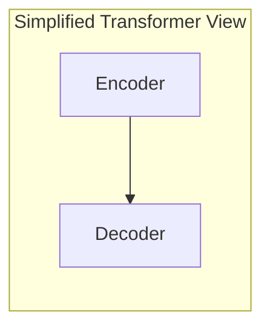

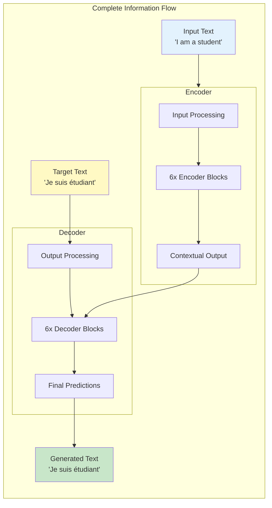

### The Original "Attention Is All You Need" Architecture

The Transformer was proposed in 2017 as a new simple network architecture based solely on attention mechanisms, dispensing with recurrence and convolutions entirely. The original transformer model uses an encoder-decoder architecture specifically designed for sequence-to-sequence tasks like machine translation.

### Stack of Identical Blocks

An important detail: both encoder and decoder don't have just one block. They have **N=6 identical blocks** stacked on top of each other. In the original paper, the authors used 6 blocks for both encoder and decoder through experimentation - this gave them the best results.

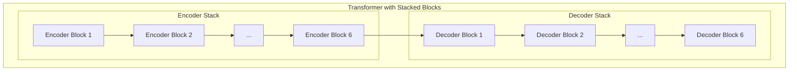

**Key Insight**: All encoder blocks are identical in architecture but have different learned parameters. Same applies to decoder blocks. This means if you understand one encoder block, you understand all six!

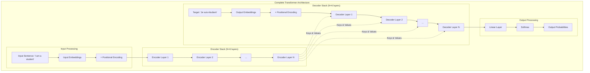

### Key Design Principles

1. **Pure Attention**: The model is completely based on attention mechanisms, eliminating recurrence
2. **Parallelization**: Not relying on recurrent structure allows the model to be highly parallelizable
3. **Encoder-Decoder Structure**: Encoder extracts features from input, decoder generates output
4. **Identical Layers**: Both encoder and decoder consist of stacks of identical layers

---

## Understanding the Encoder Stack

### Before the Encoder: The Critical Input Processing Block

Before we dive into the encoder itself, we need to understand what happens in the **Input Processing Block**. This is absolutely crucial because the encoder cannot directly work with raw text - it needs numerical representations. The instructor emphasizes that this input processing involves **three very important operations** that happen before the main encoder processing begins.

Let's trace through the complete journey using the example sentence: **"How are you"**

#### Step 1: Tokenization - Breaking Down the Sentence

The first operation that happens in the input block is **tokenization**. As the instructor explains, this is a fundamental NLP concept where you take a given sentence and divide it into tokens.

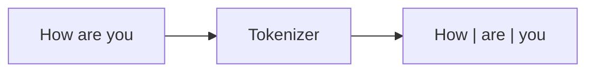

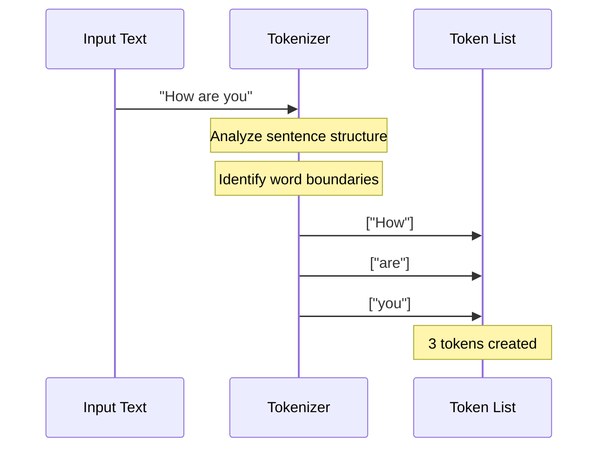

**What exactly happens here?**
- The sentence "How are you" enters the tokenization block
- Tokens can be single words, two words, or even three words depending on the tokenization strategy
- For now, we're using **word-level tokenization** 
- The tokenizer breaks down our sentence into individual words

**Result**: `["How", "are", "you"]` - Three separate tokens

**Why is this important?** The transformer needs to process each unit of meaning separately. Words are the basic building blocks, so we need to identify and separate them first.

#### Step 2: Text Vectorization (Embedding) - Converting Words to Numbers

The instructor emphasizes a critical point: **transformers cannot process words directly - no machine can process words!** You need to convert them to numbers somehow. This is where the **embedding layer** comes in.

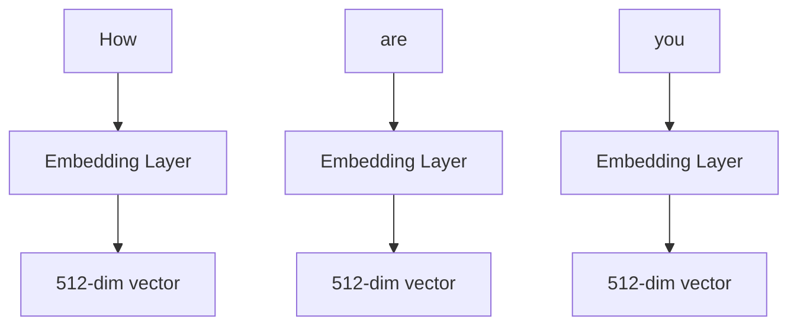

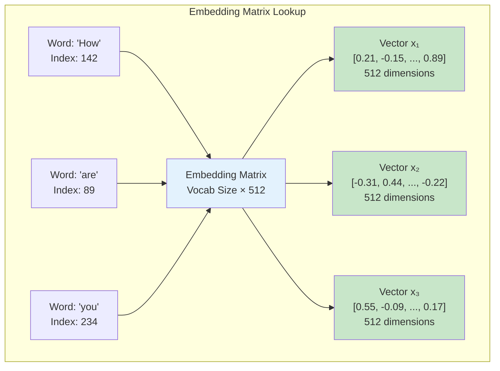

**The Embedding Process Explained:**
- Each word is taken and fed into the embedding layer
- The embedding layer's job is to generate a vector **for every word**
- In our case, it will be a **512-dimensional vector** (this is the standard dimension used in the original transformer)
- So "How" gets converted to 512 numbers, "are" gets converted to 512 numbers, and "you" gets converted to 512 numbers

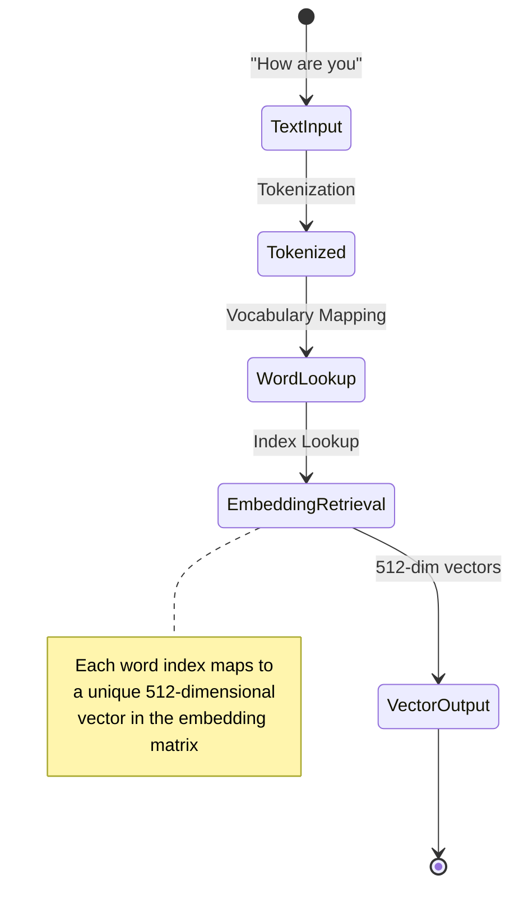

**Result**: 
- "How" → 512-dimensional vector (x₁)
- "are" → 512-dimensional vector (x₂) 
- "you" → 512-dimensional vector (x₃)

**Important Note**: The instructor mentions that this embedding concept has been covered in detail in previous videos, so we won't go too deep into how embeddings work internally.

#### Step 3: Positional Encoding - Solving the Position Problem

The instructor highlights a **critical problem** at this stage:

**The Problem**: After embedding, we have no information about which word comes first, which comes second, and which comes third. But **positional information is very important** - you should always know which words come earlier and which come later in a sentence.

**The Solution**: We use a technique called **positional encoding** that has been covered in detail in a previous video.

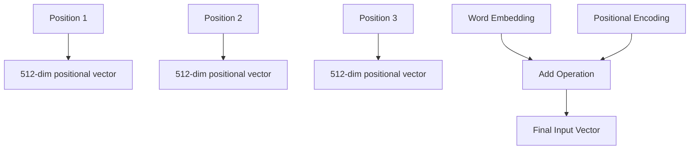

**How Positional Encoding Works:**
- For each position (position 1, position 2, position 3), positional encoding generates a vector
- Position 1 gets a 512-dimensional vector
- Position 2 gets a 512-dimensional vector  
- Position 3 gets a 512-dimensional vector
- **Key insight**: All these vectors are also 512-dimensional, same as our word embeddings!

**The Addition Operation:**
Since both word embeddings and positional encodings are 512-dimensional, we can add them together:

```
x₁_final = word_embedding("How") + positional_encoding(position_1)
x₂_final = word_embedding("are") + positional_encoding(position_2)  
x₃_final = word_embedding("you") + positional_encoding(position_3)
```

**Final Result**: We now have three 512-dimensional vectors (x₁, x₂, x₃) that contain both semantic information (what the word means) and positional information (where it appears in the sentence). These are ready to enter the first encoder block.

**Critical Insight**: The instructor emphasizes that this dimension consistency (512) is maintained throughout the entire transformer architecture. No matter where you check in the architecture, you'll always find 3×512 dimensions - this consistency is crucial for the architecture to work.

### Encoder Architecture Overview

Now that we have our processed input, let's see what happens inside each encoder block. The encoder consists of a stack of N = 6 identical layers. Each layer is composed of two sublayers:

1. **Multi-head self-attention mechanism**
2. **Position-wise fully connected feed-forward network**

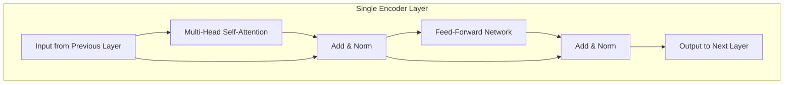

### Journey Through a Single Encoder Block

Now let's trace our three vectors (x₁, x₂, x₃) representing "How are you" through the first encoder block step by step. The instructor emphasizes that we'll focus on the operations happening in this specific section of the encoder block first.

#### Part 1: Multi-Head Self-Attention + Add & Norm

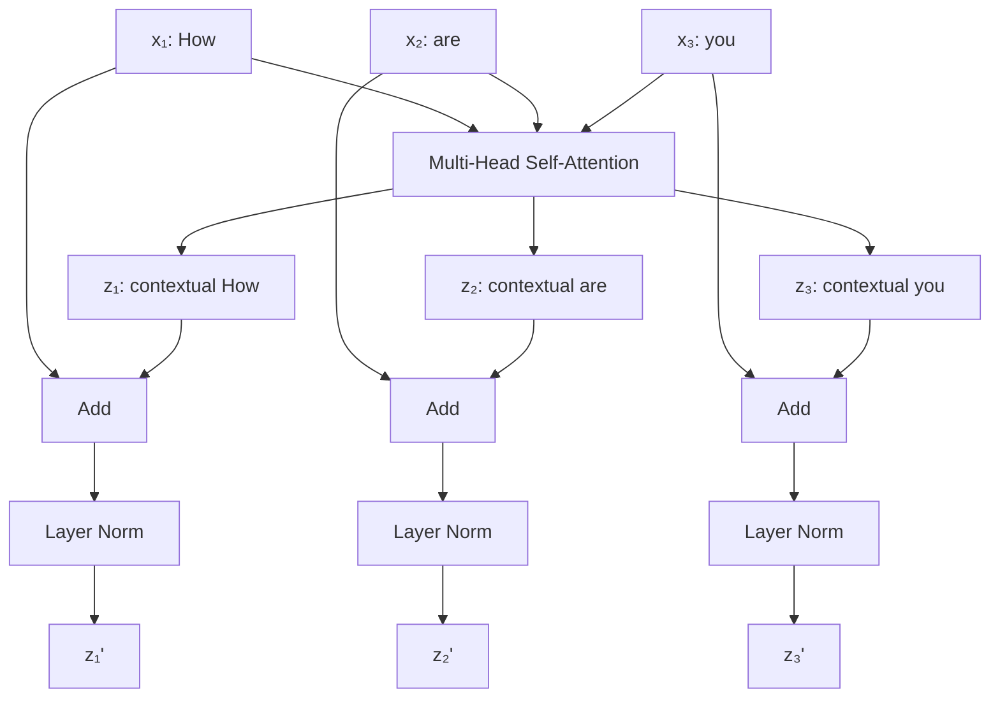

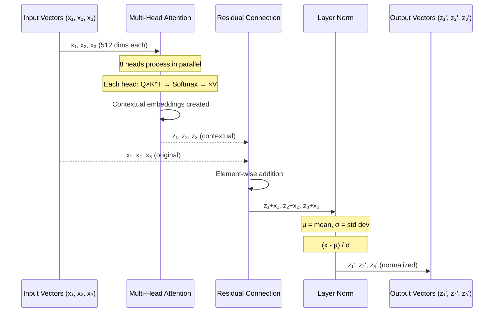

**What happens here - Detailed Explanation:**

1. **Multi-Head Self-Attention Processing**: 
   - The instructor reminds us that since all the previous concepts have been covered in detail, we won't go deep into the internals again
   - The key thing to remember is **why we apply self-attention**: to solve the problem of contextual embeddings
   - **The Problem**: Consider the word "bank" in two sentences:
     - "I deposited money in the bank" (financial institution)
     - "I sat by the river bank" (geographical location)
   - Both sentences would have the same embedding for "bank" initially, but they mean different things
   - **The Solution**: Self-attention allows each word to look at all other words in the sentence and adjust its representation based on context
   - **Multi-Head is even better**: Instead of one opinion, we get multiple perspectives (multiple heads) giving us more diverse embeddings

   **What our vectors become:**
   - When x₁ (representing "How") goes through multi-head attention, it becomes z₁ (contextual "How")
   - When x₂ (representing "are") goes through multi-head attention, it becomes z₂ (contextual "are")  
   - When x₃ (representing "you") goes through multi-head attention, it becomes z₃ (contextual "you")
   - **Critical point**: Each output vector is still 512-dimensional

2. **Residual Connection (Add Operation)**: 
   - The instructor explains that we see this "Add & Norm" block, where "Add" refers to **residual connections**
   - **What happens**: The original input vectors (x₁, x₂, x₃) are copied and bypass the multi-head attention block
   - These original vectors are then **added** to the attention output vectors (z₁, z₂, z₃)
   - **Mathematical operation**: 
     ```
     z₁' = x₁ + z₁
     z₂' = x₂ + z₂  
     z₃' = x₃ + z₃
     ```
   - **Why this works**: Both sets of vectors are 512-dimensional, so mathematical operations are possible
   - **Result**: We get new vectors z₁', z₂', z₃' which are still 512-dimensional

3. **Layer Normalization**: 
   - The instructor explains that we need to normalize because the numbers can be in any range after addition
   - **The Process**: For each vector (like z₁'), we:
     - Take all 512 numbers in that vector
     - Calculate their mean and standard deviation
     - Normalize all 512 numbers to bring them to a smaller, defined range
   - **Why this is important**: Neural network training is generally more stable when numbers are in a smaller range
   - **Result**: We get normalized vectors z₁ᴺᵒʳᵐ, z₂ᴺᵒʳᵐ, z₃ᴺᵒʳᵐ (still 512-dimensional each)

**Current State**: At this point, we have three 512-dimensional vectors that contain contextual information and are properly normalized, ready for the next part of the encoder block.

#### Part 2: Feed-Forward Network + Add & Norm

Now our z₁ᴺᵒʳᵐ, z₂ᴺᵒʳᵐ, z₃ᴺᵒʳᵐ vectors enter the feed-forward network. The instructor emphasizes that we need to understand the architecture of this feed-forward neural network from the research paper.

**Feed-Forward Network Architecture - Detailed Breakdown:**

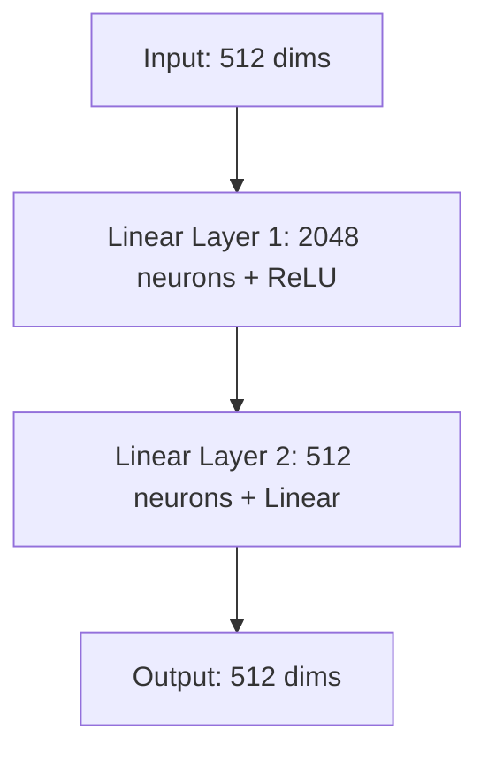

**The instructor explains the exact architecture:**

1. **Input Layer**: 512 units (this is not counted as a neural network layer - it's just the input)
2. **Hidden Layer 1**: 2048 neurons with ReLU activation function
3. **Output Layer**: 512 neurons with linear activation function

**Detailed Architecture Explanation from the Video:**

The instructor provides a comprehensive breakdown of the feed-forward network architecture, explaining that this is a simple neural network with very specific dimensions that are crucial to understand:

**Weight and Bias Details:**
- **Between Input and Hidden Layer 1**: 
  - Weights: 512 × 2048 = 1,048,576 weights (called W₁)
  - Biases: 2048 biases (called b₁)
- **Between Hidden Layer 1 and Output**: 
  - Weights: 2048 × 512 = 1,048,576 weights (called W₂)
  - Biases: 512 biases (called b₂)

**Critical Insight from the Instructor:**
The instructor emphasizes that this feed-forward network is **not doing anything fancy** - it's just a simple neural network. But the specific dimensions (512 → 2048 → 512) are carefully chosen. The expansion to 2048 dimensions in the hidden layer allows the model to capture more complex patterns, while the compression back to 512 ensures compatibility with the rest of the architecture.

**Mathematical Operations Explained:**
When the instructor walks through the matrix operations, he explains that:

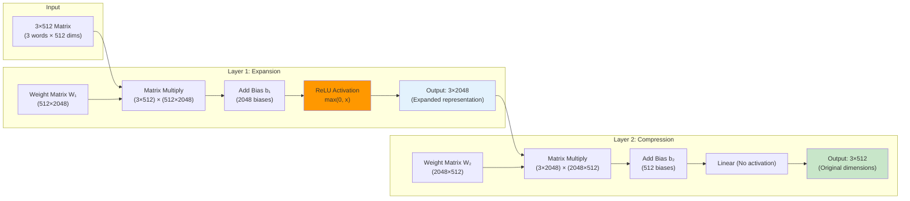

1. **First transformation**: The 3×512 input matrix is multiplied by the 512×2048 weight matrix, resulting in a 3×2048 output
2. **ReLU activation**: This provides the crucial non-linearity that allows the model to learn complex patterns
3. **Second transformation**: The 3×2048 matrix is multiplied by the 2048×512 weight matrix, bringing it back to 3×512
4. **Linear activation**: No activation function is applied in the final layer, just the linear transformation

**How Our Vectors Are Processed:**

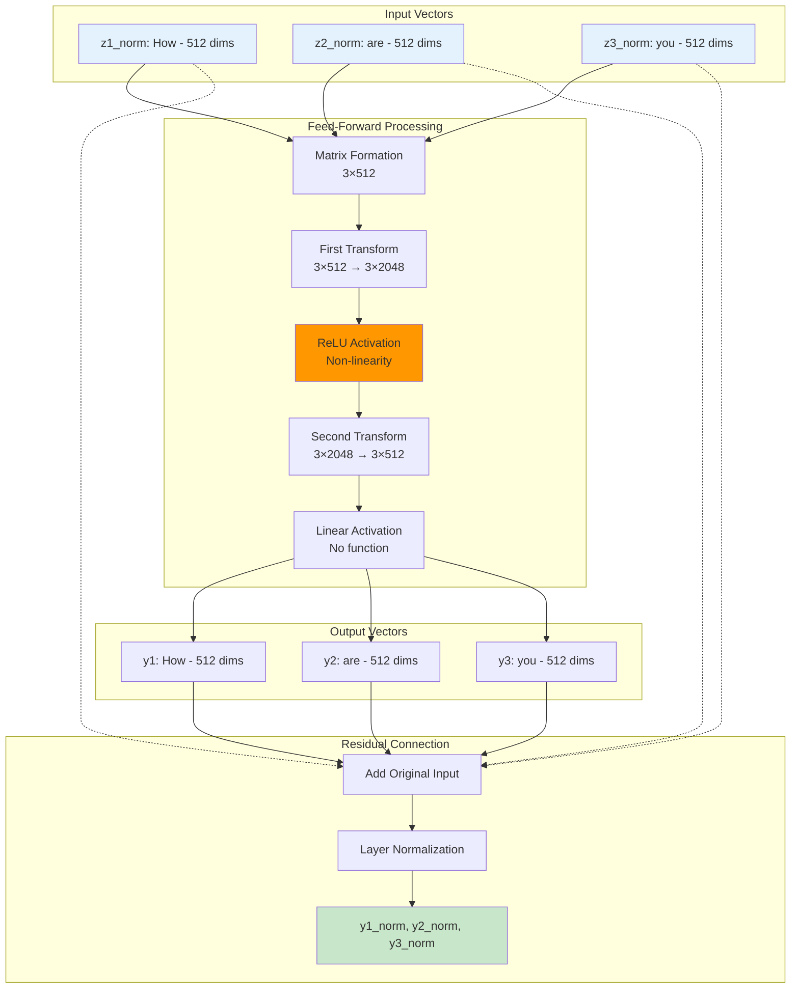

**The instructor explains the matrix processing:**

1. **Matrix Formation**: The three vectors are stacked to form a 3×512 matrix (3 words, each 512 dimensions)

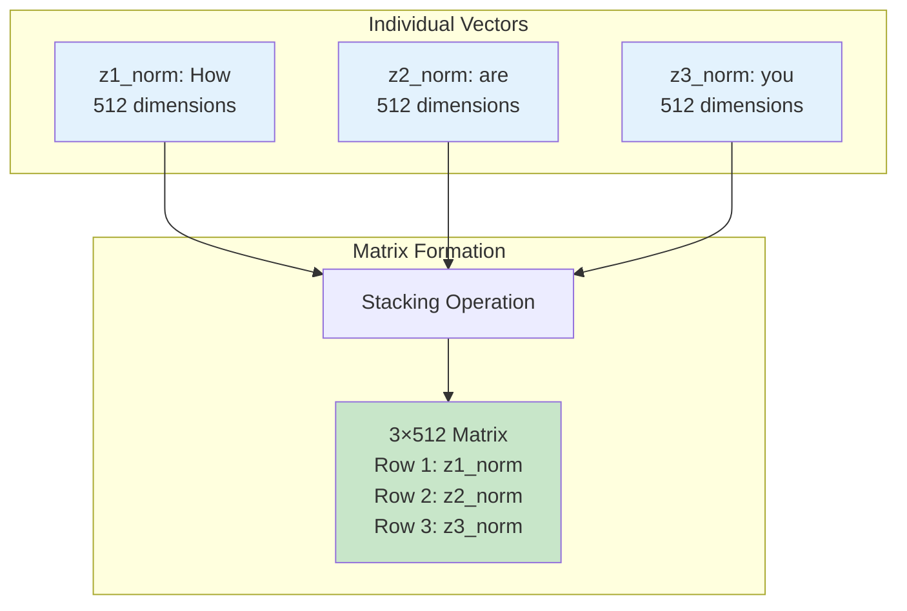
2. **First Transformation**: 
   - Matrix multiplication: (3×512) × (512×2048) = (3×2048)
   - Add bias b₁ and apply ReLU activation
   - Result: 3×2048 matrix (dimension increased from 512 to 2048)

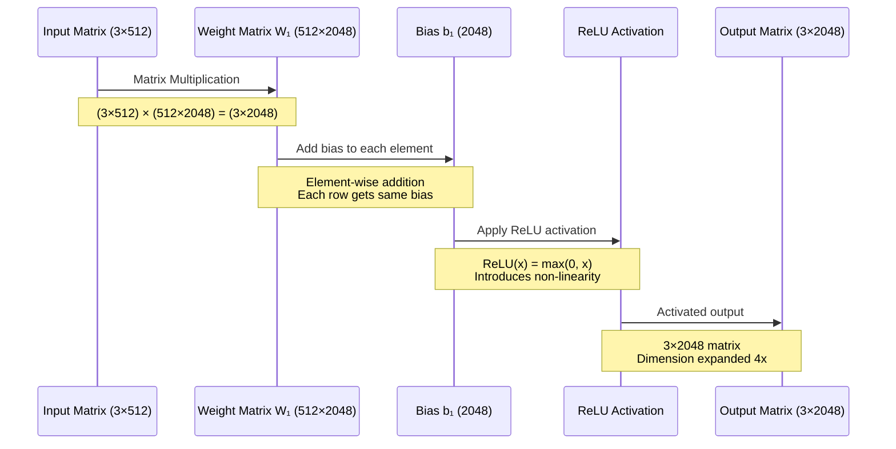
3. **Second Transformation**: 
   - Matrix multiplication: (3×2048) × (2048×512) = (3×512)  
   - Add bias b₂ with linear activation
   - Result: 3×512 matrix (dimension back to 512)

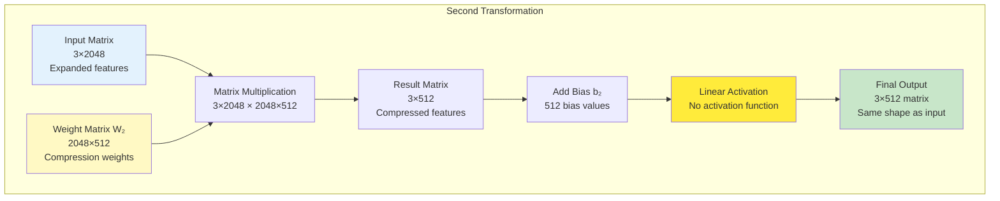

**Key Insights from the Instructor:**
- **Why increase then decrease dimensions?** The instructor explains that we first increase the dimension (512 → 2048) and then decrease it back (2048 → 512)
- **What's the benefit?** The ReLU activation in the first layer provides non-linearity, which helps the model capture complex patterns
- **Final output**: We get back three 512-dimensional vectors, same shape as input

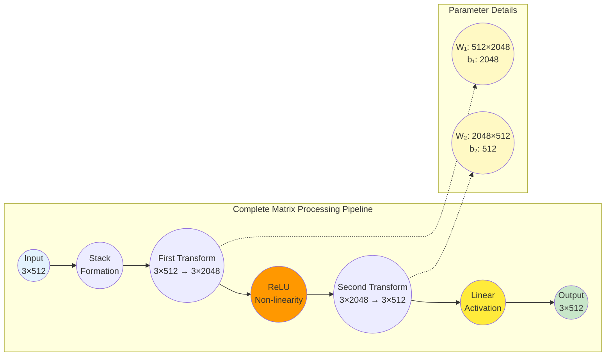

**Mathematical Visualization of the Process:**

```mermaid
classDiagram
    class MatrixOperations {
        +input_matrix: 3×512
        +weight_matrix_1: 512×2048
        +bias_1: 2048
        +weight_matrix_2: 2048×512
        +bias_2: 512
        +output_matrix: 3×512
        
        +first_transform() 3×2048
        +apply_relu() 3×2048
        +second_transform() 3×512
        +calculate_parameters() int
    }
    
    class DimensionFlow {
        +step_1: "3×512 → Stack vectors"
        +step_2: "3×512 × 512×2048 = 3×2048"
        +step_3: "3×2048 + bias → ReLU"
        +step_4: "3×2048 × 2048×512 = 3×512"
        +step_5: "3×512 + bias → Linear"
        +total_params: "2,098,176"
    }
    
    class NonLinearityRole {
        +linear_attention: "Q×K^T, Softmax, ×V"
        +problem: "Cannot capture complex patterns"
        +solution: "ReLU introduces non-linearity"
        +benefit: "Complex language patterns"
    }
    
    MatrixOperations --> DimensionFlow
    MatrixOperations --> NonLinearityRole
```

**Additional Explanation from the Video:**

The instructor provides a deeper understanding of why this feed-forward network structure is so important:

**The Non-Linearity Problem:**
- **Multi-head attention is essentially linear**: All the operations in self-attention (matrix multiplications, additions) are linear transformations
- **Linear operations have limitations**: They cannot capture complex, non-linear patterns that exist in human language
- **The solution**: The feed-forward network introduces non-linearity through the ReLU activation function

```mermaid
graph TD
    subgraph "Linear Operations Only"
        A1["Input: 'bank'"] --> B1["Self-Attention<br/>(Linear)"]
        B1 --> C1["Same transformation<br/>for all contexts"]
        C1 --> D1["Limited pattern<br/>recognition"]
    end
    
    subgraph "With Non-linearity"
        A2["Input: 'bank'"] --> B2["Self-Attention<br/>(Linear)"]
        B2 --> E2["Feed-Forward<br/>with ReLU"]
        E2 --> F2["Complex patterns<br/>captured"]
        F2 --> G2["Context-specific<br/>understanding"]
    end
    
    style D1 fill:#ffcdd2
    style G2 fill:#c8e6c9
    style E2 fill:#ff9800
```

**Why 2048 Dimensions Specifically:**
The instructor explains that the expansion from 512 to 2048 dimensions serves a specific purpose:

```mermaid
graph TD
    subgraph "Dimension Expansion Purpose"
        A((512 dims)) --> B((2048 dims))
        B --> C((512 dims))
        
        D((More neurons)) --> B
        E((Avoid bottleneck)) --> B
        F((Feature extraction)) --> C
    end
    
    style B fill:#e3f2fd
    style D fill:#c8e6c9
    style E fill:#c8e6c9
    style F fill:#c8e6c9
```

- **Increased representational capacity**: The hidden layer with 2048 neurons can capture more complex patterns than a smaller layer
- **Information bottleneck prevention**: By expanding dimensions, we avoid information loss that might occur with smaller hidden layers
- **Computational efficiency**: The specific ratio (4:1, from 512 to 2048) has been found to work well in practice

**The Role in the Overall Architecture:**
The instructor emphasizes that this feed-forward network is not just an add-on - it's a crucial component that:
- Provides the non-linearity that self-attention lacks
- Allows the model to learn complex language patterns
- Maintains the 512-dimensional consistency throughout the architecture

**Detailed Explanation from the Video:**

The instructor provides a critical insight about layer normalization at this stage. After the feed-forward network processing, the numbers in our vectors can be in any range - they might be very large positive numbers, very large negative numbers, or very small numbers. This variability in number ranges can make the training process unstable.

```mermaid
graph TD
    subgraph "Before Normalization"
        A1["Vector y₁<br/>[-1000, 500, -2000, ..., 8000]<br/>Wide range of values"]
        A2["Vector y₂<br/>[0.001, -5000, 300, ..., -900]<br/>Unstable for training"]
        A3["Vector y₃<br/>[10000, -0.5, 750, ..., -3000]<br/>Different scales"]
    end
    
    subgraph "Normalization Process"
        B1["Calculate Mean μ"]
        B2["Calculate Std Dev σ"]
        B3["Apply: (x - μ) / σ"]
    end
    
    subgraph "After Normalization"
        C1["Vector y₁ᴺᵒʳᵐ<br/>[-0.5, 0.2, -1.1, ..., 0.8]<br/>Standardized range"]
        C2["Vector y₂ᴺᵒʳᵐ<br/>[0.1, -0.9, 0.3, ..., -0.4]<br/>Stable for training"]
        C3["Vector y₃ᴺᵒʳᵐ<br/>[1.2, -0.3, 0.6, ..., -0.7]<br/>Consistent scale"]
    end
    
    A1 --> B1
    A2 --> B1
    A3 --> B1
    B1 --> B2 --> B3
    B3 --> C1
    B3 --> C2
    B3 --> C3
    
    style A1 fill:#ffcdd2
    style A2 fill:#ffcdd2
    style A3 fill:#ffcdd2
    style C1 fill:#c8e6c9
    style C2 fill:#c8e6c9
    style C3 fill:#c8e6c9
```

**Why Normalization is Crucial:**
- **Range Stabilization**: When numbers are spread across different ranges, neural network training becomes difficult and unstable
- **Training Efficiency**: Neural networks generally perform better when the numbers are in a smaller, more controlled range
- **Convergence**: Normalization helps the model converge faster and more reliably during training

**The Normalization Process:**
For each vector (like y₁), the layer normalization:
1. Takes all 512 numbers in that vector
2. Calculates their mean and standard deviation
3. Normalizes all 512 numbers to bring them to a standardized range
4. This ensures that the numbers are in a smaller, more manageable range for the next layer

**Second Add & Norm Operation:**
- **Residual Connection**: Again, we use the bypass mechanism - the original input (z₁ᴺᵒʳᵐ, z₂ᴺᵒʳᵐ, z₃ᴺᵒʳᵐ) is added to the feed-forward output
- **Why it works**: Both are 512-dimensional, so addition is possible
- **Layer Normalization**: Same process as before - normalize each vector to a stable range

**Final Result**: We get y₁ⁿᵒʳᵐ, y₂ⁿᵒʳᵐ, y₃ⁿᵒʳᵐ - three 512-dimensional vectors that:
- Contain contextual information about each word
- Have been processed through non-linear transformations  
- Are normalized for stable training
- Will serve as input to the **next encoder block**

**Important Architecture Note**: Each encoder block has its own parameters. The weights and biases in encoder block 1 are different from those in encoder block 2, and so on. Though the architecture is identical (copy-paste), the learned parameter values are different for each block.

### The Journey Through Multiple Encoder Blocks

An interesting and crucial aspect to understand is how the output from one encoder block becomes the input to the next encoder block. The normalization process creates y1_norm, y2_norm, y3_norm vectors, and these become the input for the next encoder block.

```mermaid
graph TD
    subgraph "Encoder Block 1"
        A[x1, x2, x3<br/>Initial input] --> B[Multi-Head Attention] 
        B --> C[Add & Norm]
        C --> D[Feed-Forward]
        D --> E[Add & Norm]
        E --> F[y1_norm, y2_norm, y3_norm<br/>Block 1 output]
    end
    
    subgraph "Encoder Block 2"
        G[y1_norm, y2_norm, y3_norm<br/>Block 2 input] --> H[Multi-Head Attention]
        H --> I[Add & Norm]
        I --> J[Feed-Forward]
        J --> K[Add & Norm]
        K --> L[z1_norm, z2_norm, z3_norm<br/>Block 2 output]
    end
    
    subgraph "Encoder Block 3"
        M[z1_norm, z2_norm, z3_norm<br/>Block 3 input] --> N[Multi-Head Attention]
        N --> O[Add & Norm]
        O --> P[Feed-Forward]
        P --> Q[Add & Norm]
        Q --> R[Next Block Input]
    end
    
    F --> G
    L --> M
    
    style F fill:#c8e6c9
    style G fill:#e3f2fd
    style L fill:#c8e6c9
    style M fill:#e3f2fd
```

**Key Points About the Journey:**

1. **Same Operations, Different Parameters**: Each encoder block performs identical operations (multi-head attention, add & norm, feed-forward, add & norm) but with different learned parameters.

2. **Seamless Flow**: The output from one block seamlessly becomes the input to the next block, creating a continuous processing pipeline.

3. **Progressive Understanding**: Each block builds upon the understanding of previous blocks, creating increasingly sophisticated representations.

### Parameter Independence Across Encoder Blocks

A crucial concept to understand is that while the architecture is identical across all encoder blocks, the parameters (weights and biases) are completely different for each block.

```mermaid
classDiagram
    class EncoderBlock1 {
        +multi_head_attention: MHA_Block1
        +feed_forward: FF_Block1
        +layer_norm1: LN1_Block1
        +layer_norm2: LN2_Block1
        +parameters: θ₁
        
        +process(x1, x2, x3): y1_norm, y2_norm, y3_norm
    }
    
    class EncoderBlock2 {
        +multi_head_attention: MHA_Block2
        +feed_forward: FF_Block2
        +layer_norm1: LN1_Block2
        +layer_norm2: LN2_Block2
        +parameters: θ₂
        
        +process(y1_norm, y2_norm, y3_norm): z1_norm, z2_norm, z3_norm
    }
    
    class EncoderBlock6 {
        +multi_head_attention: MHA_Block6
        +feed_forward: FF_Block6
        +layer_norm1: LN1_Block6
        +layer_norm2: LN2_Block6
        +parameters: θ₆
        
        +process(input): final_output
    }
    
    EncoderBlock1 --> EncoderBlock2 : output becomes input
    EncoderBlock2 --> EncoderBlock6 : continues through all blocks
```

**Important Distinctions:**

- **Architecture**: Copy-paste identical across all blocks
- **Parameters**: Completely different and learned independently
- **Purpose**: Each block learns different aspects of language understanding
- **Training**: Backpropagation updates each block's parameters differently

### Complete Processing Summary

Let's trace the complete journey from input sentence to final encoder output:

```mermaid
sequenceDiagram
    participant Input as "How are you"
    participant Tokenizer as Tokenization
    participant Embedding as Word Embedding
    participant PosEnc as Positional Encoding
    participant Block1 as Encoder Block 1
    participant Block2 as Encoder Block 2
    participant Block6 as Encoder Block 6
    participant Decoder as Decoder
    
    Input->>Tokenizer: "How are you"
    Tokenizer->>Embedding: ["How", "are", "you"]
    Embedding->>PosEnc: [x1, x2, x3] (512 dims each)
    PosEnc->>Block1: [x1+pos1, x2+pos2, x3+pos3]
    
    Note over Block1: Multi-Head Attention<br/>Add & Norm<br/>Feed-Forward<br/>Add & Norm
    Block1->>Block2: [y1_norm, y2_norm, y3_norm]
    
    Note over Block2: Same operations<br/>Different parameters
    Block2->>Block6: [z1_norm, z2_norm, z3_norm]
    
    Note over Block6: Final processing<br/>Encoder Block 6
    Block6->>Decoder: [final1, final2, final3]
    
    Note over Input,Decoder: Dimension consistency: 3×512 throughout entire process
```

**Critical Insight - Dimension Consistency**: Throughout this entire journey, the dimensions remain constant at 3×512. Whether you check the output after the input processing, after encoder block 1, block 2, or the final encoder block 6, you will always find 3×512 dimensions. This consistency is fundamental to the transformer architecture.

```mermaid
stateDiagram-v2
    [*] --> Input_Processing: "How are you"
    
    state Input_Processing {
        [*] --> Tokenization
        Tokenization --> Embedding
        Embedding --> Positional_Encoding
        Positional_Encoding --> [*]
    }
    
    Input_Processing --> Encoder_Block_1: 3×512 dimensions
    
    state Encoder_Block_1 {
        [*] --> Multi_Head_Attention_1
        Multi_Head_Attention_1 --> Add_Norm_1
        Add_Norm_1 --> Feed_Forward_1
        Feed_Forward_1 --> Add_Norm_2
        Add_Norm_2 --> [*]
    }
    
    Encoder_Block_1 --> Encoder_Block_2: 3×512 dimensions
    
    state Encoder_Block_2 {
        [*] --> Multi_Head_Attention_2
        Multi_Head_Attention_2 --> Add_Norm_3
        Add_Norm_3 --> Feed_Forward_2
        Feed_Forward_2 --> Add_Norm_4
        Add_Norm_4 --> [*]
    }
    
    Encoder_Block_2 --> Encoder_Block_6: 3×512 dimensions
    
    state Encoder_Block_6 {
        [*] --> Multi_Head_Attention_6
        Multi_Head_Attention_6 --> Add_Norm_11
        Add_Norm_11 --> Feed_Forward_6
        Feed_Forward_6 --> Add_Norm_12
        Add_Norm_12 --> [*]
    }
    
    Encoder_Block_6 --> Decoder: 3×512 dimensions
    
    note right of Input_Processing
        Dimensions: 3×512
        (3 words, 512 dims each)
    end note
    
    note right of Encoder_Block_1
        Dimensions: 3×512
        (Maintained throughout)
    end note
    
    note right of Encoder_Block_2
        Dimensions: 3×512
        (Never changes)
    end note
    
    note right of Encoder_Block_6
        Dimensions: 3×512
        (Consistent to the end)
    end note
```

### Feed-Forward Network Architecture Reminder

Since the feed-forward network architecture is crucial and sometimes not clearly explained, let's emphasize the exact structure:

```mermaid
graph LR
    subgraph "Feed-Forward Network Architecture"
        A((Input<br/>512 neurons)) --> B((Hidden Layer<br/>2048 neurons<br/>ReLU activation))
        B --> C((Output Layer<br/>512 neurons<br/>Linear activation))
    end
    
    subgraph "Parameters"
        D((W₁: 512×2048<br/>b₁: 2048))
        E((W₂: 2048×512<br/>b₂: 512))
    end
    
    A -.-> D
    B -.-> E
    
    style B fill:#ff9800
    style C fill:#c8e6c9
```

**Architecture Summary:**
- **Two layers**: First layer (512 → 2048 neurons) with ReLU activation
- **Second layer**: (2048 → 512 neurons) with linear activation
- **Total parameters**: 2,098,176 parameters per feed-forward network
- **Purpose**: Introduces non-linearity and complex pattern recognition

### Why This Design Works

**The Magic of Self-Attention**: 

```mermaid
graph TD
    subgraph "Example: Word 'bank' in Different Contexts"
        subgraph "Sentence 1: River bank"
            A1["bank"] --> B1["Attention Weights"]
            C1["river: 0.7"] --> B1
            D1["to: 0.1"] --> B1
            E1["the: 0.2"] --> B1
            B1 --> F1["Contextual: bank<br/>(geographical)"]
        end
        
        subgraph "Sentence 2: Financial bank"
            A2["bank"] --> B2["Attention Weights"]
            C2["money: 0.6"] --> B2
            D2["withdraw: 0.3"] --> B2
            E2["to: 0.1"] --> B2
            B2 --> F2["Contextual: bank<br/>(financial)"]
        end
    end
    
    style F1 fill:#e3f2fd
    style F2 fill:#fff9c4
    style C1 fill:#c8e6c9
    style C2 fill:#c8e6c9
    style D2 fill:#c8e6c9
```

Consider these two sentences:
- "I went to the river **bank**" 
- "I went to the **bank** to withdraw money"

Without context, "bank" has the same embedding in both sentences. But after self-attention:
- In sentence 1: "bank" attends to "river" and understands it's a geographical location
- In sentence 2: "bank" attends to "money" and "withdraw" and understands it's a financial institution

**Why Multiple Encoder Blocks**: 

```mermaid
graph LR
    subgraph "Progressive Understanding Through Layers"
        A((Input Text)) --> B((Encoder Block 1-2))
        B --> C((Encoder Block 3-4))
        C --> D((Encoder Block 5-6))
        
        B --> E((Word relationships))
        C --> F((Phrase structures))
        D --> G((Abstract concepts))
    end
    
    style B fill:#e3f2fd
    style C fill:#fff9c4
    style D fill:#c8e6c9
```

Each encoder block can capture different levels of linguistic complexity:
- **Block 1-2**: Basic word relationships and syntax
- **Block 3-4**: Phrase-level understanding  
- **Block 5-6**: Sentence-level semantic understanding

---

## Understanding the Decoder Stack

### Decoder Architecture Overview

The decoder also consists of a stack of N = 6 identical layers, but each layer is composed of **three sublayers**:

1. **Masked multi-head self-attention** (to prevent looking at future tokens)
2. **Multi-head cross-attention** (to attend to encoder output)
3. **Position-wise fully connected feed-forward network**

```mermaid
graph TD
    subgraph "Single Decoder Layer"
        A[Previous Output] --> B[Masked Multi-Head Self-Attention]
        B --> C[Add & Norm]
        A --> C
        C --> D[Multi-Head Cross-Attention]
        D --> E[Add & Norm]
        C --> E
        E --> F[Feed-Forward Network]
        F --> G[Add & Norm]
        E --> G
        G --> H[Output to Next Layer]
        
        I[Encoder Output] --> D
    end
```

### How the Decoder Works

The decoder operates in an **autoregressive manner**, generating one token at a time. Each decoder layer contains:

1. **Masked Self-Attention**: 
   - Allows each position to attend only to earlier positions
   - Prevents the model from "cheating" by looking at future tokens

2. **Cross-Attention**: 
   - Queries come from the decoder
   - Keys and Values come from the encoder output
   - Enables the decoder to attend to the entire input sequence

3. **Feed-Forward Network**: 
   - Same as in the encoder

### Example: Decoding "Je suis étudiant"

```mermaid
stateDiagram-v2
    direction LR
    [*] --> Start: <start>
    Start --> Je: Predict "Je"
    Je --> Suis: Predict "suis"
    Suis --> Etudiant: Predict "étudiant"
    Etudiant --> End: Predict <end>
    End --> [*]
    
    note right of Je
        Input: <start>
        Cross-attention to encoder
        Output: "Je"
    end note
    
    note right of Suis
        Input: <start> Je
        Cross-attention to encoder
        Output: "suis"
    end note
    
    note right of Etudiant
        Input: <start> Je suis
        Cross-attention to encoder
        Output: "étudiant"
    end note
```

```python
# Autoregressive decoding process
input_sentence = "I am a student"
target_sequence = ["<start>", "Je", "suis", "étudiant", "<end>"]

# Step 1: Start with <start> token
# Step 2: Predict "Je" using masked self-attention and cross-attention
# Step 3: Use "<start> Je" to predict "suis"
# Step 4: Use "<start> Je suis" to predict "étudiant"
# Step 5: Use "<start> Je suis étudiant" to predict "<end>"

# At each step, the decoder:
# 1. Applies masked self-attention to current sequence
# 2. Applies cross-attention to encoder output
# 3. Processes through feed-forward network
# 4. Predicts next token
```

```mermaid
flowchart TB
    subgraph "Decoder Step-by-Step Process"
        subgraph "Step 1"
            A1["<start>"] --> B1[Masked Self-Attention]
            B1 --> C1[Cross-Attention]
            C1 --> D1[Feed-Forward]
            D1 --> E1["Predict: Je"]
        end
        
        subgraph "Step 2"
            A2["<start> Je"] --> B2[Masked Self-Attention]
            B2 --> C2[Cross-Attention]
            C2 --> D2[Feed-Forward]
            D2 --> E2["Predict: suis"]
        end
        
        subgraph "Step 3"
            A3["<start> Je suis"] --> B3[Masked Self-Attention]
            B3 --> C3[Cross-Attention]
            C3 --> D3[Feed-Forward]
            D3 --> E3["Predict: étudiant"]
        end
        
        ENC[Encoder Output<br/>I am a student] --> C1
        ENC --> C2
        ENC --> C3
    end
    
    style ENC fill:#e3f2fd
    style E1 fill:#c8e6c9
    style E2 fill:#c8e6c9
    style E3 fill:#c8e6c9
```

---

## How Encoder and Decoder Work Together

### The Complete Translation Process

```mermaid
sequenceDiagram
    participant Input as Input Sentence
    participant Encoder as Encoder Stack
    participant Decoder as Decoder Stack
    participant Output as Output Sentence
    
    Input->>Encoder: "I am a student"
    Encoder->>Encoder: Process through 6 encoder layers
    Encoder->>Encoder: Self-attention + Feed-forward
    Encoder->>Decoder: Contextual representations
    Decoder->>Decoder: Start with <start> token
    Decoder->>Decoder: Masked self-attention + Cross-attention
    Decoder->>Output: "Je"
    Decoder->>Decoder: "<start> Je" + Cross-attention
    Decoder->>Output: "suis"
    Decoder->>Decoder: "<start> Je suis" + Cross-attention
    Decoder->>Output: "étudiant"
    Decoder->>Output: Final: "Je suis étudiant"
```

### Key Interactions

1. **Encoder Processing**: 
   - Processes the entire input sequence simultaneously
   - Creates rich contextual representations for each input token

2. **Decoder Processing**:
   - Generates output tokens one at a time
   - Uses cross-attention to access encoder representations
   - Uses masked self-attention to maintain autoregressive property

3. **Information Flow**:
   - Encoder output (Keys and Values) flows to all decoder layers
   - Decoder maintains causal structure through masking

---

## Key Components Integration

### How All Components Work Together

Now let's see how all the components we've studied individually work together:

```mermaid
graph LR
    A[Input Embeddings] --> B[Positional Encoding]
    B --> C[Multi-Head Self-Attention]
    C --> D[Layer Normalization]
    D --> E[Feed-Forward Network]
    E --> F[Layer Normalization]
    F --> G[Next Layer]
```

```mermaid
classDiagram
    class TransformerBlock {
        +input_embeddings: Vector[512]
        +positional_encoding: Vector[512]
        +multi_head_attention: MultiHeadAttention
        +layer_norm1: LayerNormalization
        +feed_forward: FeedForward
        +layer_norm2: LayerNormalization
        +residual_connections: ResidualConnection
        
        +forward(x): Vector[512]
        +self_attention(x): Vector[512]
        +add_and_norm(x, residual): Vector[512]
    }
    
    class MultiHeadAttention {
        +num_heads: int = 8
        +d_model: int = 512
        +d_k: int = 64
        +W_q, W_k, W_v: Matrix
        +W_o: Matrix
        
        +forward(Q, K, V): Vector[512]
        +scaled_dot_product_attention(): Vector[64]
        +concatenate_heads(): Vector[512]
    }
    
    class FeedForward {
        +d_model: int = 512
        +d_ff: int = 2048
        +W1: Matrix[512x2048]
        +W2: Matrix[2048x512]
        +relu: ReLU
        
        +forward(x): Vector[512]
        +linear1(x): Vector[2048]
        +linear2(x): Vector[512]
    }
    
    TransformerBlock --> MultiHeadAttention
    TransformerBlock --> FeedForward
```

### The Role of Each Component

```mermaid
mindmap
    root((Transformer Components))
        Positional Encoding
            Sequence awareness
            Position information
            Sine/cosine functions
        Multi-Head Attention
            8 parallel heads
            Different subspaces
            Contextual understanding
        Layer Normalization
            Training stability
            Gradient flow
            Convergence speed
        Residual Connections
            Deep network training
            Vanishing gradients
            Feature preservation
        Feed-Forward Networks
            Non-linearity
            Pattern recognition
            512→2048→512
```

1. **Positional Encoding**: Injects position information since transformers lack recurrence
2. **Multi-Head Attention**: Allows the model to focus on different representation subspaces
3. **Layer Normalization**: Stabilizes training and improves convergence
4. **Residual Connections**: Enable training of deep networks
5. **Feed-Forward Networks**: Provide non-linear transformations

---

## Visualizations and Animations

### Interactive Transformer Visualization

<iframe src="https://poloclub.github.io/transformer-explainer/" width="100%" height="600px" frameborder="0"></iframe>

*Interactive visualization of how transformers work in large language models*

### The Illustrated Transformer

<iframe src="https://jalammar.github.io/illustrated-transformer/" width="100%" height="600px" frameborder="0"></iframe>

*Comprehensive visual guide to transformer architecture*

### Attention Visualization

<iframe src="https://github.com/jessevig/bertviz" width="100%" height="400px" frameborder="0"></iframe>

*Tool for visualizing attention patterns in transformer models*

### Architecture Comparison

```mermaid
graph TB
    A1[Token 1] --> B1[Hidden State 1]
    B1 --> A2[Token 2] --> B2[Hidden State 2]
    B2 --> A3[Token 3] --> B3[Hidden State 3]
    
    C1[Token 1] --> D[Multi-Head Attention]
    C2[Token 2] --> D
    C3[Token 3] --> D
    D --> E1[Output 1]
    D --> E2[Output 2]
    D --> E3[Output 3]
```

---

## Practical Implementation

### Essential Code Structure

```python
class TransformerModel(nn.Module):
    def __init__(self, vocab_size, d_model=512, num_heads=8, num_layers=6):
        super().__init__()
        self.encoder = TransformerEncoder(num_layers, d_model, num_heads)
        self.decoder = TransformerDecoder(num_layers, d_model, num_heads)
        self.output_projection = nn.Linear(d_model, vocab_size)
    
    def forward(self, src, tgt):
        # Encode input sequence
        encoder_output = self.encoder(src)
        
        # Decode target sequence
        decoder_output = self.decoder(tgt, encoder_output)
        
        # Project to vocabulary
        output = self.output_projection(decoder_output)
        return output
```

```mermaid
graph TD
    A((Initialize)) --> B((Input Embeddings))
    B --> C((Positional Encoding))
    C --> D((Multi-Head Attention))
    D --> E((Add & Norm))
    E --> F((Feed-Forward))
    F --> G((Add & Norm))
    G --> H((Encoder Output))
    
    H --> I((Masked Self-Attention))
    I --> J((Add & Norm))
    J --> K((Cross-Attention))
    K --> L((Add & Norm))
    L --> M((Feed-Forward))
    M --> N((Add & Norm))
    N --> O((Linear + Softmax))
    O --> P((Final Output))
    
    style A fill:#e3f2fd
    style P fill:#c8e6c9
    style H fill:#fff9c4
```

### Key Implementation Details

```mermaid
graph LR
    subgraph "Preprocessing"
        A((Tokenization)) --> B((Embedding Lookup))
        B --> C((Positional Encoding))
    end
    
    subgraph "Encoder"
        C --> D((Multi-Head Attention))
        D --> E((Add & Norm 1))
        E --> F((Feed-Forward))
        F --> G((Add & Norm 2))
    end
    
    subgraph "Decoder"
        G --> H((Masked Self-Attention))
        H --> I((Cross-Attention))
        I --> J((Output Generation))
    end
    
    subgraph "Postprocessing"
        J --> K((Linear Projection))
        K --> L((Softmax))
    end
    
    style A fill:#e3f2fd
    style L fill:#c8e6c9
    style G fill:#fff9c4
```

1. **Mask Generation**: 
   - Source mask for padding tokens
   - Target mask for future tokens (causal masking)

2. **Positional Encoding**:
   - Sine/cosine functions for position information
   - Added to input embeddings

3. **Multi-Head Attention**:
   - Multiple attention heads for different representation subspaces
   - Parallel processing of attention computations

```mermaid
pie title Transformer Parameter Distribution
    "Multi-Head Attention" : 25
    "Feed-Forward Networks" : 67
    "Embeddings" : 5
    "Layer Normalization" : 2
    "Positional Encoding" : 1
```

---

## Three Important Questions from the Video

As Nitesh explains in the video, there are three crucial questions that naturally arise when studying the transformer encoder architecture. Let's address each one:

### Question 1: Why Do We Use Residual Connections?

```mermaid
graph LR
    A[Input] --> B[Multi-Head Attention]
    A --> C[Add]
    B --> C
    C --> D[Layer Norm]
```

**The Instructor's Honest Answer**: The exact reason isn't clearly explained in the original "Attention is All You Need" paper. The instructor emphasizes that this is one of those questions that doesn't have a crystal-clear answer because even the original paper doesn't provide detailed explanations.

However, the instructor provides two main theories based on research and practical experience:

#### Theory 1: Stable Training (from ResNet Experience)
**The Gradient Flow Problem:**

```mermaid
graph TD
    subgraph "Without Residual Connections"
        A1["Layer 6"] --> B1["Layer 5<br/>gradient × 0.1"]
        B1 --> C1["Layer 4<br/>gradient × 0.01"]
        C1 --> D1["Layer 3<br/>gradient × 0.001"]
        D1 --> E1["Layer 2<br/>gradient × 0.0001"]
        E1 --> F1["Layer 1<br/>gradient ≈ 0<br/>No learning!"]
    end
    
    subgraph "With Residual Connections"
        A2["Layer 6"] --> B2["Layer 5"]
        B2 --> C2["Layer 4"]
        C2 --> D2["Layer 3"]
        D2 --> E2["Layer 2"]
        E2 --> F2["Layer 1<br/>Meaningful gradient<br/>Effective learning!"]
        
        A2 -.->|"Skip<br/>Connection"| C2
        C2 -.->|"Skip<br/>Connection"| E2
        B2 -.->|"Skip<br/>Connection"| D2
        D2 -.->|"Skip<br/>Connection"| F2
    end
    
    style F1 fill:#ffcdd2
    style F2 fill:#c8e6c9
```

- **Vanishing Gradient Problem**: In very deep neural networks, as you perform backpropagation and move backwards through the layers, gradients become very small
- **Why this happens**: Each layer's gradient depends on the previous layer's gradient, and multiplying small numbers repeatedly makes them even smaller
- **The Crisis**: Eventually, the gradients become so small that the early layers barely get updated, making training ineffective

**How Residual Connections Help:**
- **Alternate Path**: Residual connections provide an "alternate route" for gradients to flow backward
- **Skipping Complexity**: Instead of going through the complex multi-head attention computation, gradients can take the "shortcut" path
- **Result**: Even if the main path has vanishing gradients, the skip connection ensures some meaningful gradient reaches the earlier layers
- **Evidence**: This technique was first successful in ResNet architectures for computer vision

#### Theory 2: Feature Preservation and Safety Net
**The Transformation Risk:**

```mermaid
graph TD
    subgraph "Risk Without Residual Connection"
        A1["Good Input<br/>Features"] --> B1["Complex<br/>Transformation"]
        B1 --> C1["Potentially Worse<br/>Features"]
        C1 --> D1["Forced to use<br/>degraded features"]
    end
    
    subgraph "Safety With Residual Connection"
        A2["Good Input<br/>Features"] --> B2["Complex<br/>Transformation"]
        B2 --> C2["Transformed<br/>Features"]
        A2 -.->|"Preserved<br/>Original"| E2["Add"]
        C2 --> E2
        E2 --> F2["Model can choose:<br/>• Use transformation<br/>• Use original<br/>• Use both"]
    end
    
    style D1 fill:#ffcdd2
    style F2 fill:#c8e6c9
    style E2 fill:#ff9800
```

- **What if attention makes things worse?** Imagine a scenario where the multi-head attention transformation actually degrades the quality of your embeddings
- **The Problem**: Your original embeddings (x₁, x₂, x₃) might be reasonably good, but after passing through attention, they become less useful
- **Without Residual Connections**: You'd be stuck with the worse representations and have to continue with them

**How Residual Connections Provide Safety:**
- **Preservation**: The original features are preserved alongside the transformed ones
- **Model's Choice**: The model can choose to rely more on the original features if the transformation isn't helpful
- **Identity Operation**: In the worst case, if the transformation is completely unhelpful, the model can learn to ignore it and just use the original features

**Real-World Evidence**: The instructor shares a compelling story:
- A developer on Kaggle was implementing the transformer architecture from scratch using PyTorch
- **The Mistake**: He accidentally forgot to add residual connections (everything else was implemented correctly)
- **The Result**: His model's performance was significantly poor
- **The Fix**: When he realized his mistake and added back the residual connections, the performance immediately improved to expected levels
- **The Lesson**: This proves that residual connections are crucial for transformer performance, even if we don't fully understand why

### Question 2: Why Do We Need Feed-Forward Networks?

```mermaid
graph TD
    A[After Self-Attention] --> B[Feed-Forward Network]
    B --> C[512 → 2048 → 512]
    C --> D[Non-linear Transformation]
```

**The Instructor's Honest Assessment**: Again, this is a question that doesn't have a completely clear answer. The instructor emphasizes that this is another "gray area" where the original paper doesn't provide detailed explanations, and it remains an active area of research.

**The Common Explanation - Non-linearity:**

**Understanding the Linearity Problem:**
- **Multi-Head Attention is Linear**: If you examine self-attention operations closely, you'll notice they're fundamentally linear operations
- **What does this mean?**: Matrix multiplications, additions, and even the attention mechanism itself are linear transformations
- **The Limitation**: Linear operations cannot capture complex, non-linear patterns that exist in human language

**How Feed-Forward Networks Help:**
- **ReLU Activation**: The first layer of the feed-forward network uses ReLU activation function
- **Non-linearity Introduction**: ReLU is a non-linear function that can capture complex patterns
- **Complex Pattern Recognition**: If your data has non-linear complexity, you need non-linear transformations to capture it

**Why This Might Be Important:**
- **Language Complexity**: Human language has complex, non-linear patterns that purely linear operations might miss
- **Pattern Capture**: The feed-forward network might be capturing these complex linguistic patterns that self-attention alone cannot handle

**Additional Insight from the Video:**

The instructor provides a more practical explanation of why feed-forward networks are crucial:

**The Problem with Pure Attention:**

```mermaid
graph TD
    subgraph "Pure Attention Limitations"
        A((Word Relationships)) --> B((Q × K^T))
        B --> C((Softmax))
        C --> D((× V))
        D --> E((Only Linear Patterns))
        
        F((Complex Language)) --> G((Cannot be captured!))
    end
    
    style E fill:#ffcdd2
    style G fill:#ff5252
```

- **Attention is fundamentally linear**: All matrix operations in self-attention (Q×K^T, softmax, multiplication with V) are linear transformations
- **Limited expressiveness**: Linear transformations can only capture linear relationships between words
- **Real-world complexity**: Human language has complex, non-linear patterns that require non-linear processing

**The Solution - Non-linear Transformation:**

```mermaid
graph LR
    subgraph "Feed-Forward Solution"
        A((Linear Output)) --> B((512 → 2048))
        B --> C((ReLU))
        C --> D((Complex Patterns))
        D --> E((2048 → 512))
        E --> F((Rich Features))
    end
    
    style C fill:#ff9800
    style F fill:#c8e6c9
```

- **ReLU introduces non-linearity**: The feed-forward network's ReLU activation function allows the model to capture non-linear patterns
- **Dimension expansion benefit**: The 512→2048 expansion allows the model to explore a higher-dimensional space for pattern recognition
- **Dimension compression**: The 2048→512 compression forces the model to distill the most important information

**Fascinating Research Discovery**: 
The instructor mentions an interesting paper that provides a different perspective:

**"Transformer Feed-Forward Layers Are Key-Value Memories"**
- **Alternative Theory**: This research suggests that feed-forward layers actually function as key-value memory stores
- **What this means**: Instead of just providing non-linearity, they might be storing and retrieving information like a database
- **Current Status**: This is still active research, and the instructor admits he hasn't fully explored this paper yet
- **Invitation for Collaboration**: The instructor encourages viewers to read this paper and share insights in the comments

**A Striking Statistic**: 
The instructor highlights a crucial fact that many people don't realize:
- **Parameter Distribution**: Feed-forward networks contain **2/3 of all transformer parameters**
- **Comparison**: This is much more than what self-attention layers contain
- **The Paradox**: Despite having most of the parameters, their exact role is still being researched
- **Research Gap**: This shows how much we still don't understand about transformer internals

**The Bottom Line**: 
While the commonly accepted answer is "to add non-linearity," the instructor emphasizes that this is still an area of active research, and our understanding continues to evolve.

### Question 3: Why Use 6 Encoder Blocks?

```mermaid
graph TD
    A[Single Block] --> B[Limited Representation Power]
    C[Multiple Blocks] --> D[High Representation Power]
    D --> E[Better Language Understanding]
```

**The Instructor's Clear Answer**: This question has a more straightforward answer compared to the previous two. The instructor breaks this down into two parts:

#### Part A: Why Multiple Blocks? (The Fundamental Question)

**The Core Challenge - Language Complexity:**
- **Human Language is Extremely Complex**: The instructor emphasizes that understanding human language and processing it correctly is incredibly difficult
- **Single Block Limitation**: If you use only one encoder block, you cannot get satisfactory results
- **Insufficient Language Understanding**: A single block cannot develop proper language understanding capabilities

**The Deep Learning Solution:**
- **Representation Power**: You need a model with very high representation power to handle language complexity
- **Stacking Strategy**: This high representation power comes only when you stack multiple layers on top of each other
- **Deep Learning Philosophy**: The instructor explains that "deep" in deep learning specifically means stacking multiple layers to create deeper representations

**Why Stacking Works:**
- **Hierarchical Learning**: Each layer can learn increasingly complex patterns
- **Progressive Abstraction**: Lower layers learn basic patterns, higher layers learn more abstract concepts
- **Cumulative Understanding**: Each layer builds upon the understanding of previous layers

#### Part B: Why 6 Specifically? (The Empirical Question)

**The Experimental Answer:**
- **Empirical Result**: The creators of the transformer architecture tried different numbers of layers through experimentation
- **Best Performance**: 6 layers gave them the best results for their specific tasks and datasets
- **Not a Magic Number**: The instructor emphasizes that 6 is not some magical number with theoretical significance

**Detailed Explanation from the Video:**

The instructor provides additional context about why 6 layers became the standard:

**The Research Process:**

```mermaid
graph TD
    subgraph "Layer Experimentation Results"
        A["1-2 Layers"] --> B["Poor Performance<br/>Cannot capture<br/>language complexity"]
        C["3-4 Layers"] --> D["Better but<br/>still limited"]
        E["5-6 Layers"] --> F["Optimal Performance<br/>Best results"]
        G["7-8+ Layers"] --> H["Diminishing Returns<br/>Higher cost<br/>Minimal improvement"]
    end
    
    subgraph "Performance vs Layers"
        I["Performance"] --> J["Sweet Spot: 6 Layers"]
        K["Computational Cost"] --> J
        L["Training Time"] --> J
    end
    
    style B fill:#ffcdd2
    style F fill:#c8e6c9
    style H fill:#fff9c4
    style J fill:#ff9800
```

- **Extensive Experimentation**: The original transformer authors tested various numbers of layers (1, 2, 3, 4, 5, 6, 7, 8, etc.)
- **Performance Evaluation**: They measured performance on machine translation tasks for each configuration
- **Optimal Sweet Spot**: 6 layers provided the best balance between model complexity and performance
- **Computational Constraints**: Going beyond 6 layers showed diminishing returns while significantly increasing computational costs

**Why Not More or Less?**

```mermaid
graph LR
    subgraph "Layer Count Trade-offs"
        A["Too Few (1-3)"] --> B["❌ Cannot learn<br/>complex patterns<br/>❌ Poor translation<br/>❌ Limited understanding"]
        
        C["Just Right (6)"] --> D["✅ Sufficient depth<br/>✅ Good performance<br/>✅ Reasonable cost<br/>✅ Stable training"]
        
        E["Too Many (8+)"] --> F["⚠️ Diminishing returns<br/>⚠️ High GPU cost<br/>⚠️ Overfitting risk<br/>⚠️ Slow training"]
    end
    
    style B fill:#ffcdd2
    style D fill:#c8e6c9
    style F fill:#fff9c4
```

- **Too Few Layers (1-3)**: Insufficient representational capacity to capture complex language patterns
- **Too Many Layers (8+)**: Diminishing returns, increased computational cost, and potential overfitting
- **The Goldilocks Zone**: 6 layers hit the "just right" balance for the original tasks

**Variability Across Applications:**
- **Different Architectures**: You'll see different numbers of layers in different transformer architectures
- **Task Dependent**: The optimal number depends on:
  - The specific application you're building the transformer for
  - The complexity of your task
  - The amount of data you have
  - Computational constraints

**Examples of Variation:**
- **BERT**: Uses different numbers of layers in different variants
- **GPT**: Different versions use different numbers of layers
- **T5**: Uses different layer counts for different model sizes

**The Deep Learning Principle:**
The instructor explains the fundamental principle behind deep learning:
- **"Deep" Means Stacking**: Deep learning is all about stacking multiple layers
- **Hierarchical Representations**: The goal is to create hierarchical representations of increasing complexity
- **Pattern Discovery**: The belief is that through deeper networks, you can discover hidden patterns in data that shallower networks cannot capture

**Language-Specific Reasoning:**

```mermaid
graph TD
    subgraph "Hierarchical Language Processing"
        A["Layer 1-2"] --> B["Basic Features<br/>• Character patterns<br/>• Word boundaries<br/>• Simple syntax"]
        
        C["Layer 3-4"] --> D["Intermediate Features<br/>• Phrases<br/>• Dependencies<br/>• Grammar rules"]
        
        E["Layer 5-6"] --> F["Complex Features<br/>• Semantic meaning<br/>• Context understanding<br/>• Abstract concepts"]
        
        B --> G["Progressive<br/>Abstraction"]
        D --> G
        F --> G
        
        G --> H["Complete Language<br/>Understanding"]
    end
    
    style B fill:#e3f2fd
    style D fill:#fff9c4
    style F fill:#c8e6c9
    style H fill:#ff9800
```

- **Linguistic Hierarchy**: Language has natural hierarchical structure (phonemes → words → phrases → sentences → meaning)
- **Progressive Understanding**: Each encoder layer can specialize in understanding different levels of this hierarchy
- **Comprehensive Processing**: Multiple layers ensure that all aspects of language are properly processed

**The Bottom Line**: 
The instructor concludes that while the specific number (6) is empirical, the need for multiple layers is fundamental to achieving the high representation power required for complex language understanding tasks.

---

## Key Takeaways

### Revolutionary Aspects

1. **Parallelization**: Unlike RNNs, transformers can process all positions simultaneously
2. **Attention Mechanism**: Direct modeling of dependencies regardless of distance
3. **Scalability**: Architecture scales well with data and computation
4. **Transfer Learning**: Pre-trained models can be fine-tuned for various tasks

### Architectural Innovations

1. **Encoder-Decoder Design**: 
   - Encoder processes input into contextual representations
   - Decoder generates output autoregressively

2. **Pure Attention**: 
   - Eliminates recurrence and convolutions
   - Relies entirely on attention mechanisms

3. **Identical Layer Stacking**: 
   - Both encoder and decoder use stacks of identical layers
   - Enables very deep networks

4. **Residual Connections and Layer Normalization**: 
   - Stabilizes training of deep networks
   - Improves gradient flow

### Impact on Modern AI

The transformer architecture has become the foundation for:

- **BERT**: Encoder-only model for understanding tasks
- **GPT**: Decoder-only model for generation tasks
- **T5**: Encoder-decoder model for text-to-text tasks
- **Vision Transformers**: Applying transformers to computer vision
- **Multimodal Models**: Combining text, images, and other modalities

### Performance Advantages

1. **Training Speed**: Highly parallelizable architecture
2. **Long-Range Dependencies**: Better than RNNs at capturing distant relationships
3. **Transfer Learning**: Excellent for pre-training and fine-tuning
4. **Scalability**: Performance consistently improves with scale

---

## Summary

The complete Transformer architecture elegantly combines:

- **Encoder-decoder structure** for sequence-to-sequence tasks
- **Multi-head attention** for capturing complex relationships
- **Positional encoding** for sequence understanding without recurrence
- **Residual connections and layer normalization** for stable training
- **Parallel processing** for computational efficiency

This architecture represents a fundamental shift from recurrent models to attention-based models, enabling the current revolution in natural language processing and artificial intelligence.

The key insight is that **attention is all you need** - by using attention mechanisms alone, transformers can model complex dependencies in sequences more effectively than previous architectures while being much more parallelizable.

**Final Insights from the Complete Video Analysis:**

The instructor's comprehensive explanation from the Hindi transcript reveals several crucial insights:

1. **Input Processing is Foundational**: The three-step process (tokenization → embedding → positional encoding) is essential for transformers to work with raw text

2. **Architectural Consistency**: The 512-dimensional vectors are maintained throughout the entire architecture, ensuring mathematical compatibility

3. **Component Interactions**: Each component (self-attention, feed-forward networks, residual connections, layer normalization) serves a specific purpose in the overall system

4. **Honest Assessment**: The instructor's transparency about unanswered questions (like the exact reasons for residual connections and feed-forward networks) shows that transformer research is still evolving

5. **Practical Importance**: Understanding these architectural choices helps in implementing and debugging transformer models in practice

**Next Steps**: With this understanding of the complete architecture, you can now explore specific transformer variants (BERT, GPT, T5) and understand how they adapt this foundational architecture for different tasks.

The instructor's teaching methodology of combining theoretical understanding with practical examples, while being honest about research limitations, provides a complete foundation for mastering transformer architectures.