# Day 81: Masked Multi-head Attention in Transformer Decoder

## Paper References
- **Attention Is All You Need** (Vaswani et al., 2017): [https://arxiv.org/abs/1706.03762](https://arxiv.org/abs/1706.03762)
- **The Annotated Transformer** (Harvard NLP): [http://nlp.seas.harvard.edu/2018/04/03/attention.html](http://nlp.seas.harvard.edu/2018/04/03/attention.html)

## Introduction: The Decoder's Dilemma

The Transformer decoder presents a fascinating architectural challenge that sits at the heart of modern language models. While the encoder processes all input tokens simultaneously using parallel self-attention, the decoder must maintain sequential generation during inference while achieving efficient parallel training. This fundamental tension between training efficiency and inference causality is resolved through **masked multi-head attention** - a sophisticated mechanism that prevents future information leakage while enabling batch processing.

This video explores the critical sentence: *"The Transformer decoder is autoregressive at inference time and non-autoregressive at training time"* - a statement that reveals the ingenious solution to one of sequence modeling's most significant challenges.

## Understanding Autoregressive Models

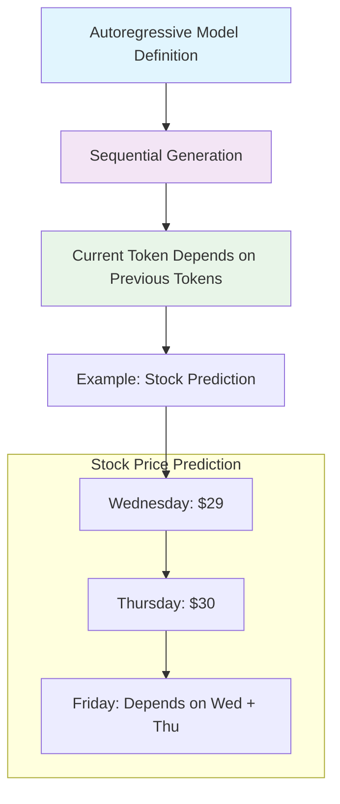

In deep learning context, autoregressive models generate data points in sequence by conditioning each new point on previously generated ones. This is the natural behavior for language generation tasks where:

- Each word depends on the context of previous words
- Future tokens are unknown during generation
- Sequential processing is inherent to the task

## The Training vs Inference Paradox

### Inference Time: Forced Autoregression

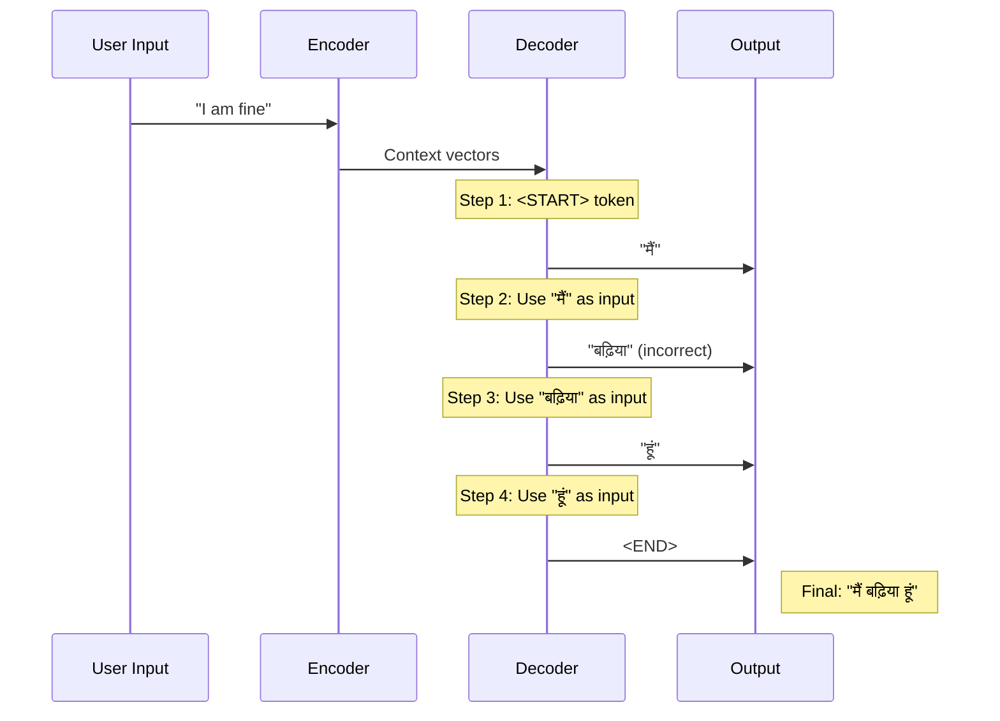

During inference, the decoder **must** be autoregressive because:
1. The next token's input depends on the previous token's output
2. Future tokens are genuinely unknown
3. No alternative exists - you cannot predict what hasn't been generated yet

### Training Time: The Efficiency Challenge

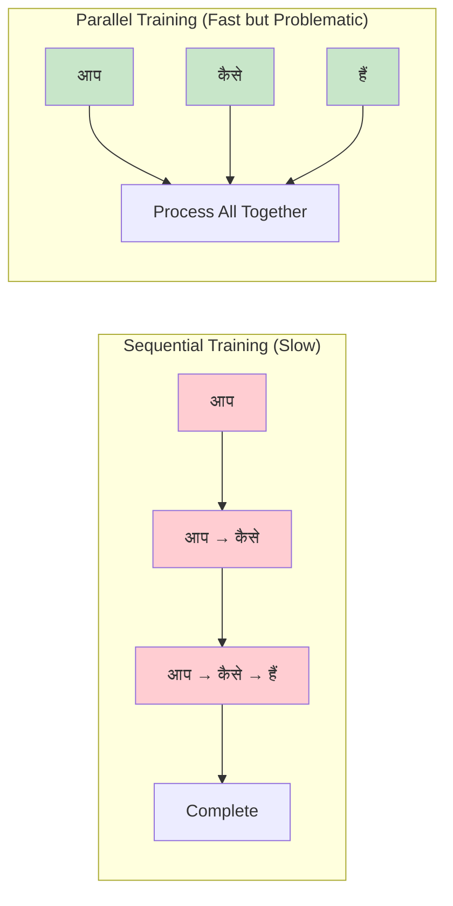

The training dilemma arises because:
- **Sequential training** is accurate but extremely slow
- **Parallel training** is fast but creates data leakage
- For long sequences (300+ tokens), sequential training becomes prohibitively expensive

## The Data Leakage Problem

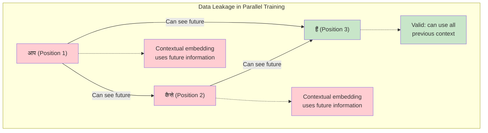

**The Core Problem**: In parallel training, when calculating contextual embeddings:
- Token "आप" can see future tokens "कैसे" and "हैं"
- Token "कैसे" can see future token "हैं" 
- This creates unfair advantage during training that won't exist during inference

**Mathematical Representation**:
```
Contextual(आप) = 0.8 × Emb(आप) + 0.1 × Emb(कैसे) + 0.1 × Emb(हैं)
```
During inference, tokens "कैसे" and "हैं" don't exist when processing "आप"!

## Self-Attention Mechanics: The Foundation

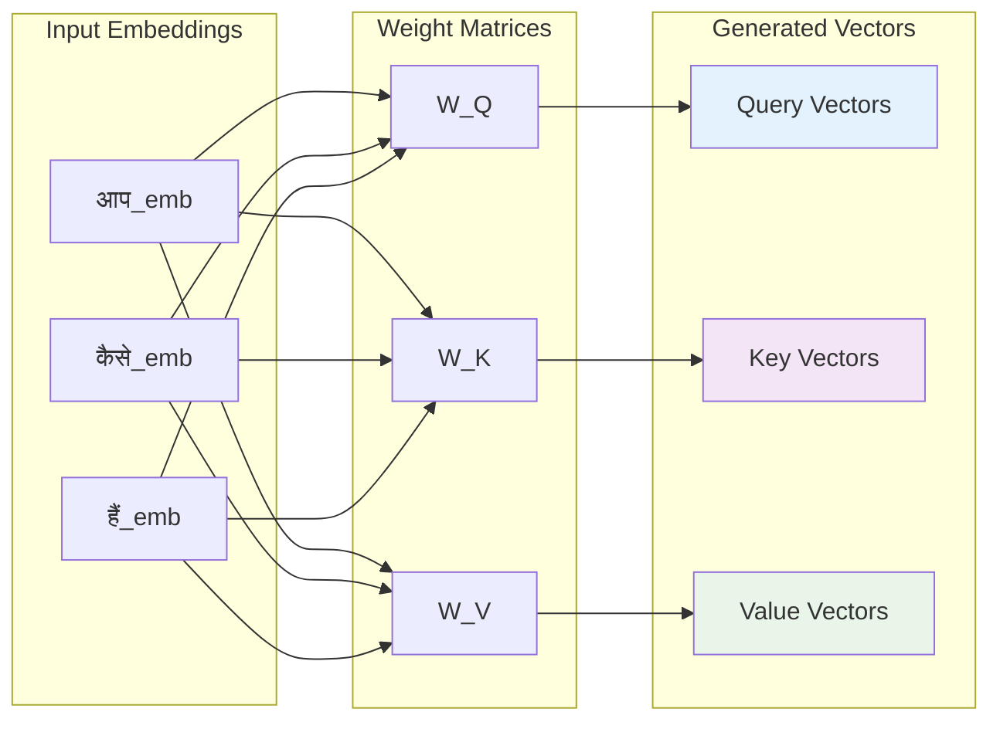

**Self-Attention Process**:
1. **Linear Transformations**: Each embedding is multiplied by WQ, WK, WV matrices
2. **Attention Score Calculation**: Q · K^T produces attention scores
3. **Scaling**: Divide by √(d_k) for numerical stability
4. **Softmax**: Convert scores to probabilities
5. **Weighted Sum**: Multiply attention weights with value vectors

## The Masking Solution

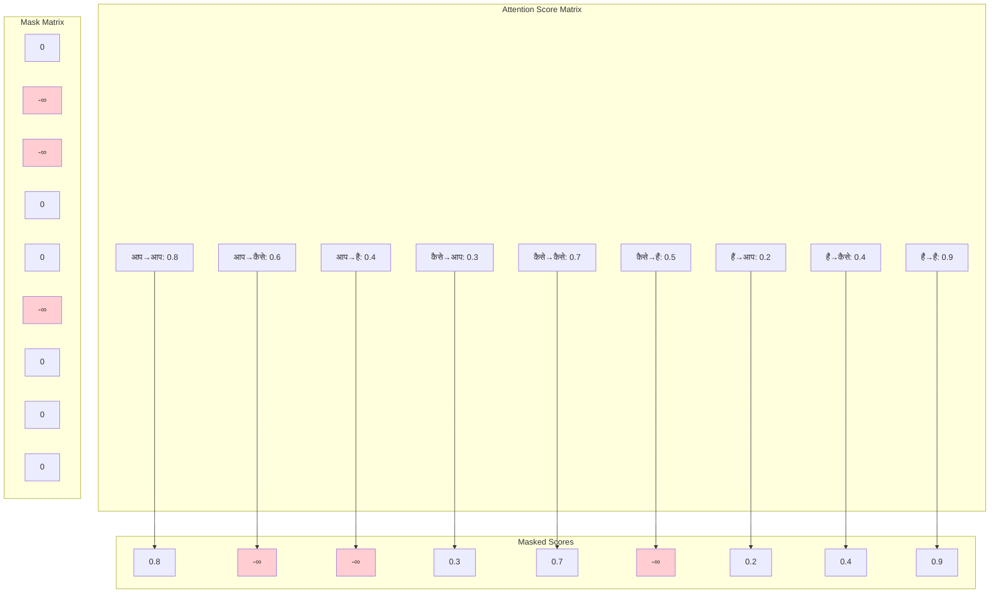

**Masking Process**:
1. **Create Mask Matrix**: Same dimensions as attention scores
2. **Set Future Positions**: -∞ for future tokens, 0 for allowed positions
3. **Add Mask**: Attention_scores + Mask_matrix
4. **Apply Softmax**: softmax(-∞) = 0, eliminating future information

## Step-by-Step Masking Implementation

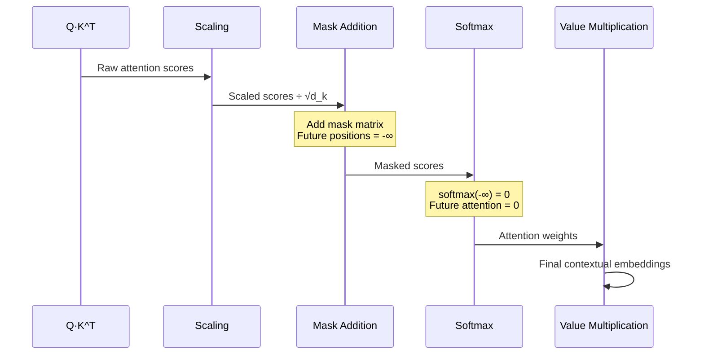

**Mathematical Implementation**:
```python
# Attention calculation with masking
def masked_attention(Q, K, V, mask):
    # Calculate attention scores
    scores = torch.matmul(Q, K.transpose(-2, -1)) / math.sqrt(d_k)
    
    # Apply mask (set future positions to -∞)
    scores = scores.masked_fill(mask == 0, -1e9)
    
    # Apply softmax
    attention_weights = F.softmax(scores, dim=-1)
    
    # Calculate contextual embeddings
    contextual = torch.matmul(attention_weights, V)
    
    return contextual
```

## The Elegant Solution: Best of Both Worlds

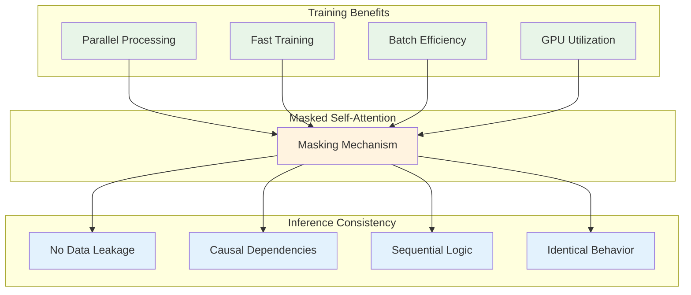

**Achievement**: Masked self-attention enables:
- **Parallel training** for efficiency
- **Causal consistency** for correctness
- **Identical behavior** between training and inference logic
- **Scalable processing** for long sequences

## Detailed Mathematical Walkthrough

### Without Masking (Problematic)
```
Contextual(आप) = w₁₁ × V(आप) + w₁₂ × V(कैसे) + w₁₃ × V(हैं)
Contextual(कैसे) = w₂₁ × V(आप) + w₂₂ × V(कैसे) + w₂₃ × V(हैं)
Contextual(हैं) = w₃₁ × V(आप) + w₃₂ × V(कैसे) + w₃₃ × V(हैं)
```

**Problem**: w₁₂, w₁₃, w₂₃ represent future information access

### With Masking (Correct)
```
Contextual(आप) = w₁₁ × V(आप) + 0 × V(कैसे) + 0 × V(हैं)
Contextual(कैसे) = w₂₁ × V(आप) + w₂₂ × V(कैसे) + 0 × V(हैं)
Contextual(हैं) = w₃₁ × V(आप) + w₃₂ × V(कैसे) + w₃₃ × V(हैं)
```

**Solution**: Future weights (w₁₂, w₁₃, w₂₃) are zeroed through masking

## Practical Implementation Considerations

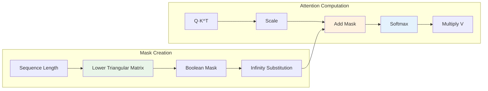

**Key Implementation Details**:
1. **Mask Shape**: [seq_len, seq_len] lower triangular matrix
2. **Mask Values**: 0 for allowed positions, -∞ for blocked positions
3. **Numerical Stability**: Use -1e9 instead of true -∞
4. **Broadcasting**: Ensure mask dimensions match attention scores

## Training vs Inference Behavior Comparison

```mermaid
graph TD
    subgraph "Training Phase"
        TR1[Full Target Sequence Available]
        TR2[Teacher Forcing]
        TR3[Parallel Processing]
        TR4[Masked Self-Attention]
        TR5[Fast Batch Training]
    end
    
    subgraph "Inference Phase"
        IN1[Generate Token by Token]
        IN2[Use Previous Outputs]
        IN3[Sequential Processing]
        IN4[Standard Self-Attention]
        IN5[Slower Generation]
    end
    
    TR1 --> TR2
    TR2 --> TR3
    TR3 --> TR4
    TR4 --> TR5
    
    IN1 --> IN2
    IN2 --> IN3
    IN3 --> IN4
    IN4 --> IN5
    
    style TR4 fill:#e8f5e8
    style IN4 fill:#e3f2fd
```

**Critical Insight**: The same model behaves differently in training vs inference:
- **Training**: Non-autoregressive (parallel) with masking
- **Inference**: Autoregressive (sequential) by necessity

## Performance Impact Analysis

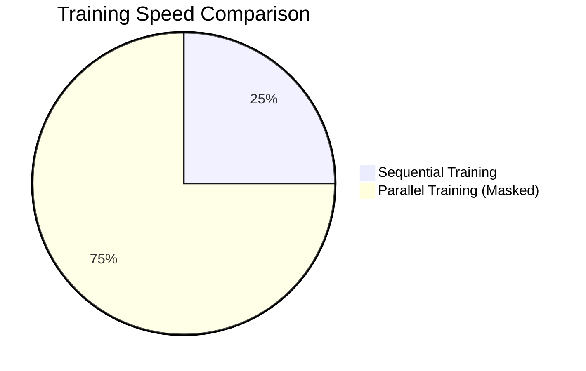

**Performance Metrics**:
- **Sequential Training**: O(n) time complexity for n tokens
- **Parallel Training**: O(1) time complexity with masking
- **Memory Usage**: Higher for parallel due to full attention matrix
- **GPU Utilization**: Dramatically improved with parallel processing

## Key Takeaways

1. **Autoregressive Necessity**: Sequence generation inherently requires autoregressive behavior during inference due to causal dependencies.

2. **Training Efficiency**: Masked self-attention enables parallel training while maintaining causal consistency.

3. **Data Leakage Prevention**: Masking prevents future information access during training, ensuring fair evaluation.

4. **Architectural Elegance**: The solution achieves optimal training efficiency without compromising inference correctness.

5. **Scalability**: The approach scales effectively to long sequences where sequential training becomes prohibitive.

6. **Implementation Simplicity**: Despite conceptual complexity, the implementation requires only a mask matrix addition.

The masked multi-head attention mechanism represents a masterful solution to the fundamental tension between training efficiency and inference causality in sequence modeling. By understanding this mechanism deeply, we gain insight into why Transformers have become the foundation of modern language models and how they achieve their remarkable balance of performance and accuracy.

[End of Notes]