# Day 81: Masked Multi-head Attention in Transformer Decoder

## Paper References
- **Attention Is All You Need** (Vaswani et al., 2017): [https://arxiv.org/abs/1706.03762](https://arxiv.org/abs/1706.03762)
- **The Annotated Transformer** (Harvard NLP): [http://nlp.seas.harvard.edu/2018/04/03/attention.html](http://nlp.seas.harvard.edu/2018/04/03/attention.html)

## Introduction: The Decoder's Journey

Welcome to the midway point of our Transformer architecture exploration! After spending 10 comprehensive videos understanding the Transformer, we've successfully decoded the entire encoder architecture. Now, we're embarking on the second half of our journey - understanding the decoder, which admittedly is architecturally more complex and challenging.

The Transformer architecture has become the backbone of modern AI advancements. Whether you look at GPT, BERT, or any recent language model, you'll find Transformers at their core. This makes our deep understanding of this architecture critically important.


Following our proven philosophy of understanding building blocks before assembling the complete picture, today we focus on one of the most crucial components of the decoder: **Masked Multi-head Attention**.

## The Critical Sentence

Before diving deep, let me present a sentence that encapsulates the entire essence of today's topic:

> **"The Transformer decoder is autoregressive at inference time and non-autoregressive at training time."**

This seemingly paradoxical statement holds the key to understanding why masked self-attention exists and how it enables efficient training while maintaining correct inference behavior.

## 📋 Quick Access to Interactive Resources

| 🎯 Resource Type | 🔗 Direct Links | 📝 Description |
|------------------|------------------|----------------|
| **🎮 Interactive Demos** | [Illustrated Transformer](http://jalammar.github.io/illustrated-transformer/) | Step-by-step walkthrough |
| **💻 Code Notebooks** | [Google Colab Demo](https://colab.research.google.com/github/huggingface/notebooks/blob/main/course/en/chapter3/section4_tf.ipynb) | Hands-on implementation |
| **🔥 Attention Viz** | [BertViz Tool](https://github.com/jessevig/bertviz) | Live attention heatmaps |
| **🧠 3D Visualization** | [LLM 3D Explorer](https://bbycroft.net/llm) | 3D transformer visualization |
| **🎬 Animations** | [Attention Patterns](https://poloclub.github.io/attention-viz/) | Interactive attention exploration |
| **🚀 Playground** | [HF Transformer Hub](https://transformer.huggingface.co/) | Live transformer experiments |

## Interactive Visualizations and Animations

Explore these interactive resources to visualize masked attention in action:

### 🎮 Interactive Attention Visualizers
- **The Illustrated Transformer**: [http://jalammar.github.io/illustrated-transformer/](http://jalammar.github.io/illustrated-transformer/) - Interactive step-by-step walkthrough
- **Tensor2Tensor Visualization**: [https://colab.research.google.com/github/tensorflow/tensor2tensor/blob/master/tensor2tensor/notebooks/hello_t2t.ipynb](https://colab.research.google.com/github/tensorflow/tensor2tensor/blob/master/tensor2tensor/notebooks/hello_t2t.ipynb) - Live attention head visualization
- **BertViz**: [https://github.com/jessevig/bertviz](https://github.com/jessevig/bertviz) - Interactive BERT/GPT attention visualization tool

### 📊 Animated Attention Demos
- **Attention Mechanism Animation**: [https://d2l.ai/chapter_attention-mechanisms/attention-mechanisms.html](https://d2l.ai/chapter_attention-mechanisms/attention-mechanisms.html) - Step-by-step attention calculation
- **Masking Visualization**: [https://nlp.seas.harvard.edu/2018/04/03/attention.html#attention](https://nlp.seas.harvard.edu/2018/04/03/attention.html#attention) - Harvard's annotated transformer with live masking demo
- **Attention Patterns**: [https://poloclub.github.io/attention-viz/](https://poloclub.github.io/attention-viz/) - Interactive attention pattern exploration
- **Transformer Visualization**: [https://bbycroft.net/llm](https://bbycroft.net/llm) - 3D visualization of transformer operations

### 💻 Interactive Code Demos

**Try these live coding environments:**

[](https://colab.research.google.com/github/huggingface/notebooks/blob/main/course/en/chapter3/section4_tf.ipynb)

- **Masked Attention Demo**: [Interactive Implementation](https://colab.research.google.com/drive/1rjW0RBClIaKyj1NnP3TZJr1gSqvYk-dY) - Build masked attention from scratch
- **Attention Visualization**: [BertViz Tutorial](https://github.com/jessevig/bertviz/blob/master/bertviz_tutorial.ipynb) - Step-by-step attention analysis

### 🎮 Interactive Transformer Playground

> **🔗 Live Transformer Demo**
> 
> **Visit:** [Hugging Face Transformer Playground](https://transformer.huggingface.co/)
> 
> Experiment with different attention patterns and see masking in real-time!

## Understanding Autoregressive Models

### Definition in Deep Learning Context


Autoregressive models are a class of models that generate data points in a sequence by conditioning each new data point on previously generated points. Think of it as a model that must look back at what it has already produced to decide what to produce next.

### Stock Market Analogy

Imagine a machine learning model predicting daily stock prices:
- **Wednesday**: Model predicts $29
- **Thursday**: Model predicts $30 (using Wednesday's data)
- **Friday**: Model must use both Wednesday ($29) and Thursday ($30) to predict
- **Future days**: Each prediction builds on all previous predictions

This sequential dependency is the hallmark of autoregressive behavior.

### Revisiting Encoder-Decoder Architecture

```mermaid
sequenceDiagram
    participant I as Input (English)
    participant E as Encoder (LSTM)
    participant C as Context Vector
    participant D as Decoder (LSTM)
    participant O as Output (Hindi)
    
    I->>E: "Nice to meet you"
    E->>C: Process sequentially
    C->>D: Summary vector
    
    Note over D: Step 1
    D->>O: "आपसे" (using <START> + context)
    
    Note over D: Step 2
    O->>D: "आपसे" as input
    D->>O: "मिलकर" (using previous + context)
    
    Note over D: Step 3
    O->>D: "मिलकर" as input
    D->>O: "अच्छा" (using previous + context)
    
    Note over D: Step 4
    O->>D: "अच्छा" as input
    D->>O: "लगा" (using previous + context)
    
    Note over D: Step 5
    O->>D: "लगा" as input
    D->>O: "<END>" (using previous + context)
```

In the classic encoder-decoder architecture:
1. Each output word depends on the previously generated word
2. Generation must happen sequentially
3. This is autoregressive behavior in action

### Why Autoregressive is Necessary


You cannot generate an entire paragraph at once because:
- Later words depend on earlier words for context
- The meaning and grammatical structure evolve sequentially
- This is the fundamental nature of sequential data

## The Training vs Inference Paradox

### Inference Time: Natural Autoregression

```mermaid
graph TD
    subgraph "Inference Process"
        A[Input: I am fine] --> B[Encoder]
        B --> C[Context Vectors]
        
        subgraph "Decoder Steps"
            D1[START → मैं]
            D2[मैं → घटिया]
            D3[घटिया → हूं]
            D4[हूं → END]
            
            D1 --> D2
            D2 --> D3
            D3 --> D4
        end
        
        C --> D1
        C --> D2
        C --> D3
        C --> D4
    end
    
    style D2 fill:#ffcdd2
    Note1[Error: Should be correct word]
    D2 -.-> Note1
```

During inference:
1. We generate one word at a time
2. Each word becomes input for the next step
3. We cannot parallelize - we must wait for each output
4. This is genuinely autoregressive and cannot be avoided

### 🔄 Animated Token Generation


### 🔄 Token Generation Simulator

> **🎯 Try the Interactive Token Generator**
> 
> **🔗 Link:** [TensorFlow Transformer Tutorial](https://tensorflow.org/text/tutorials/transformer)
> 
> See step-by-step token generation with masking!

*Interactive environment for experimenting with autoregressive generation*

### Training Time: The Efficiency Challenge

```mermaid
graph LR
    subgraph "Sequential Training (Slow)"
        A1[Step 1: आप]
        A2[Step 2: आप → कैसे]
        A3[Step 3: कैसे → हैं]
        A4[Step 4: हैं → END]
        
        A1 --> A2
        A2 --> A3
        A3 --> A4
    end
    
    subgraph "Time Complexity"
        T1[For 3 words: 4 decoder runs]
        T2[For 300 words: 301 decoder runs]
        T3[For 1M examples: Extremely slow!]
        
        T1 --> T2
        T2 --> T3
    end
    
    style A1 fill:#ffcdd2
    style A2 fill:#ffcdd2
    style A3 fill:#ffcdd2
    style A4 fill:#ffcdd2
    style T3 fill:#ff5252
```

The problem with sequential training:
- Each word requires a complete forward pass through the decoder
- For a paragraph of 300 words, you need 301 decoder operations
- With a dataset of 100,000 examples, training becomes prohibitively slow

### Teacher Forcing: The Game Changer

```mermaid
sequenceDiagram
    participant D as Data
    participant M as Model
    participant O as Output
    participant L as Loss
    
    Note over D: Training data:<br/>"How are you" → "आप कैसे हैं"
    
    D->>M: <START>
    M->>O: "तुम" (wrong)
    Note over M: Teacher forcing:<br/>Use "आप" from data
    
    D->>M: "आप" (correct from data)
    M->>O: "कैसे" (correct)
    
    D->>M: "कैसे" (from data)
    M->>O: "थे" (wrong)
    Note over M: Still use "हैं" from data
    
    D->>M: "हैं" (from data)
    M->>O: <END>
    
    O->>L: Compare: "तुम कैसे थे" vs "आप कैसे हैं"
```

Teacher forcing means:
1. During training, we always use the correct previous word from our dataset
2. We don't depend on the model's previous predictions
3. This breaks the sequential dependency!

### The Parallel Training Opportunity

```mermaid
graph TD
    subgraph "Realization"
        A[All Target Words Available] --> B[No Need for Sequential Processing]
        B --> C[Can Process All Words in Parallel]
        
        subgraph "Parallel Input"
            D[<START>]
            E[आप]
            F[कैसे]
            G[हैं]
        end
        
        C --> D
        C --> E
        C --> F
        C --> G
        
        subgraph "Parallel Output"
            H[आप]
            I[कैसे]
            J[हैं]
            K[<END>]
        end
        
        D --> H
        E --> I
        F --> J
        G --> K
    end
    
    style B fill:#c8e6c9
    style C fill:#a5d6a7
```

Because of teacher forcing:
- We know all input words beforehand (from the dataset)
- We don't need to wait for previous predictions
- We can process everything in parallel!

## The Decoder Architecture: Looking Inside the Black Box

So far we've been treating the decoder as a black box, saying "something happens inside but we don't know what calculations are running." Now it's time to look inside and see what's actually happening in the decoder.


### Introducing the First Block: Masked Multi-Head Attention

Let me introduce you to the **first block** in the decoder architecture. Look carefully - it's called **"Masked Multi-Head Attention"**.

Now, I want you to forget about the "Masked" part for a moment because we don't know what masking is yet. But we do know **Multi-Head Attention** - we studied it thoroughly in the encoder!

### Simplifying: Multi-Head → Self-Attention

To simplify our discussion, let's remember what Multi-Head Attention actually is:
- Multi-Head Attention = Multiple Self-Attention heads running in parallel
- If we used just one head, Multi-Head Attention = Self-Attention

So let's simplify and say that the **first block in the decoder is a Self-Attention block**.

## Opening the Decoder Black Box: Deep Dive into Self-Attention Mechanics

So far we've been treating the decoder as a black box, saying "something happens inside but we don't know what calculations are running." Now it's time to look inside and see what's actually happening in the decoder.

### The Three Weight Matrices: WQ, WK, WV

Let's trace through exactly what happens when we process our target sentence "आप कैसे हैं" through the decoder's self-attention mechanism.

```mermaid
graph TD
    subgraph "Decoder Self-Attention: The Core Mechanism"
        A[Three Weight Matrices] --> B[WQ Weight Matrix Green]
        A --> C[WK Weight Matrix Pink] 
        A --> D[WV Weight Matrix Blue]
        
        subgraph "For Each Word Embedding"
            E[आप embedding] --> F[Dot Product with WQ]
            E --> G[Dot Product with WK]
            E --> H[Dot Product with WV]
            
            I[कैसे embedding] --> J[Dot Product with WQ]
            I --> K[Dot Product with WK] 
            I --> L[Dot Product with WV]
            
            M[हैं embedding] --> N[Dot Product with WQ]
            M --> O[Dot Product with WK]
            M --> P[Dot Product with WV]
        end
        
        F --> Q[Query Vector q_आप]
        G --> R[Key Vector k_आप]
        H --> S[Value Vector v_आप]
        
        J --> T[Query Vector q_कैसे]
        K --> U[Key Vector k_कैसे]
        L --> V[Value Vector v_हैं]
        
        N --> W[Query Vector q_हैं]
        O --> X[Key Vector k_हैं]
        P --> Y[Value Vector v_हैं]
    end
    
    style B fill:#c8e6c9
    style C fill:#f8bbd9
    style D fill:#bbdefb
    style Q fill:#c8e6c9
    style R fill:#f8bbd9
    style S fill:#bbdefb
```

### Step-by-Step Process Explanation

The instructor emphasizes a crucial point: **Don't get confused by the diagram** - the green matrices are exactly the same, the pink matrices are exactly the same, and the blue matrices are exactly the same.

Here's what we're doing:
1. **Take each word's embedding** and perform dot product with all three weight matrices
2. **From each embedding**, we get three new vectors
3. **For every word** in our sentence, we now have its own query vector, key vector, and value vector

### Creating Q, K, V Matrices for Efficiency


For convenience, we can stack up all the query vectors to create the **Query Matrix**, all key vectors to create the **Key Matrix**, and all value vectors to create the **Value Matrix**. This allows us to perform matrix operations all at once rather than doing individual operations on all words.

### The Core Self-Attention Calculation

Now comes the main work of self-attention:

```mermaid
graph TD
    subgraph "Self-Attention Calculation Steps"
        A[Step 1: Q × K^T] --> B[Attention Scores Matrix]
        B --> C[Step 2: Scale by 1/√dk]
        C --> D[Scaled Attention Matrix]
        D --> E[Step 3: Apply Softmax]
        E --> F[Attention Weights Matrix]
        F --> G[Step 4: Multiply with V]
        G --> H[Contextual Embeddings]
    end
    
    subgraph "Matrix Details"
        I[Light Yellow Matrix]
        J[Contains Attention Scores]
        K[Each Value = Attention Score]
        
        I --> J
        J --> K
    end
    
    B -.-> I
    
    style B fill:#fff9c4
    style F fill:#c8e6c9
    style H fill:#a5d6a7
```

**Step 1**: Perform dot product between Query and Key matrices. This gives us a new matrix where every value represents an attention score.

**Step 2**: Scale these attention scores by dividing each item by √dk (where dk is the dimension of the vectors). This gives us the yellow matrix.

**Step 3**: Apply softmax operation to get the final weights that we'll use to calculate contextual embeddings.

### Calculating Contextual Embeddings: The Mathematical Details

Here's exactly how we calculate contextual embeddings using our attention weights:

```mermaid
graph TD
    subgraph "Contextual Embedding for आप"
        A[w11 × v_आप] --> D[+]
        B[w12 × v_कैसे] --> D
        C[w13 × v_हैं] --> D
        D --> E[Contextual_आप]
    end
    
    subgraph "Contextual Embedding for कैसे"
        F[w21 × v_आप] --> I[+]
        G[w22 × v_कैसे] --> I
        H[w23 × v_हैं] --> I
        I --> J[Contextual_कैसे]
    end
    
    subgraph "Contextual Embedding for हैं"
        K[w31 × v_आप] --> N[+]
        L[w32 × v_कैसे] --> N
        M[w33 × v_हैं] --> N
        N --> O[Contextual_हैं]
    end
    
    style E fill:#c8e6c9
    style J fill:#c8e6c9
    style O fill:#c8e6c9
```

**For आप's contextual embedding**:
- Take the first weight w11 and multiply it with आप's value vector
- Take the second item w12 and multiply it with कैसे's value vector  
- Take the third item w13 and multiply it with हैं's value vector
- Add all three together to get आप's contextual embedding

**Similarly for कैसे's contextual embedding**:
- Take w21 and multiply with आप's value vector
- Take w22 and multiply with कैसे's value vector
- Take w23 and multiply with हैं's value vector
- Add them together for कैसे's contextual embedding

The same process applies for हैं's contextual embedding using the third row weights.

### The Critical Moment: Identifying the Problem

Here comes the crucial realization - **what we DON'T want to happen**:

```mermaid
graph TD
    subgraph "Problematic Calculations"
        A[आप's contextual embedding] --> B[Should NOT use कैसे's contribution]
        A --> C[Should NOT use हैं's contribution]
        
        D[कैसे's contextual embedding] --> E[Should NOT use हैं's contribution]
        
        subgraph "Why This is Wrong"
            F[When आप was generated]
            G[कैसे and हैं didn't exist yet]
            H[This is future information!]
            
            F --> G
            G --> H
        end
    end
    
    subgraph "Weights to Zero Out"
        I[w12: आप sees कैसे] 
        J[w13: आप sees हैं]
        K[w23: कैसे sees हैं]
    end
    
    B -.-> I
    C -.-> J
    E -.-> K
    
    style I fill:#ffcdd2
    style J fill:#ffcdd2  
    style K fill:#ffcdd2
    style H fill:#f44336
```

**The Problem**: When calculating आप's contextual embedding, we need contributions from कैसे and हैं to be zero because when आप was being generated, कैसे and हैं were not yet in the picture.

**The Solution Insight**: If we can somehow make w12, w13, and w23 equal to zero, then automatically all these problematic contributions will become zero, and our problem will be solved.

## The Masking Solution: Making Future Weights Zero

But the question arises: **How do we make these three weights zero?**

This is where the concept of **masking** comes into play. We will add one more step to our entire flow.

### Step-by-Step Masking Process

```mermaid
graph TD
    subgraph "Original Flow"
        A[Q × K^T] --> B[Attention Scores Matrix]
        B --> C[Scale by 1/√dk]  
        C --> D[Scaled Attention Matrix Yellow]
    end
    
    subgraph "NEW STEP: Masking"
        E[Create Mask Matrix]
        F[Same Dimensions as Attention Matrix]
        G[Future Positions = -∞]
        H[Valid Positions = 0]
        
        E --> F
        F --> G
        F --> H
    end
    
    subgraph "Mask Application"
        D --> I[Add Mask to Scaled Matrix]
        I --> J[Future Scores Become -∞]
        J --> K[Apply Softmax]
        K --> L[softmax of -∞ = 0]
        L --> M[Future Weights = 0!]
    end
    
    style E fill:#ffc107
    style J fill:#ffcdd2
    style L fill:#4caf50
    style M fill:#4caf50
```

### Creating the Mask Matrix

Let's understand this step by step:

**Step 1**: After we get our scaled attention matrix (the yellow matrix), we create a new matrix called the **Mask** with exactly the same dimensions.

**Step 2**: In this mask matrix, wherever we want zeros (future positions), we put **-∞ (minus infinity)**.

```mermaid
graph LR
    subgraph "Mask Matrix Creation"
        A[3×3 Mask Matrix] --> B[Position 1,2: -∞]
        A --> C[Position 1,3: -∞]  
        A --> D[Position 2,3: -∞]
        A --> E[All Other Positions: 0]
    end
    
    subgraph "Logic"
        F[Future Token Positions]
        G[Current/Past Token Positions]
        
        F --> B
        F --> C
        F --> D
        G --> E
    end
    
    style B fill:#ffcdd2
    style C fill:#ffcdd2
    style D fill:#ffcdd2
    style E fill:#c8e6c9
```

### The Mathematical Magic of Masking

Now when we add these two matrices together:

```mermaid
graph TD
    subgraph "Matrix Addition"
        A[Scaled Attention Matrix] --> D[+]
        B[Mask Matrix] --> D
        D --> E[Combined Matrix]
    end
    
    subgraph "Results"
        E --> F[Position 1,2: Value + (-∞) = -∞]
        E --> G[Position 1,3: Value + (-∞) = -∞] 
        E --> H[Position 2,3: Value + (-∞) = -∞]
        E --> I[Other Positions: Value + 0 = Value]
    end
    
    subgraph "After Softmax"
        F --> J[softmax of -∞ = 0]
        G --> K[softmax of -∞ = 0]
        H --> L[softmax of -∞ = 0]
        I --> M[softmax of Value = Normal Weight]
    end
    
    style F fill:#ffcdd2
    style G fill:#ffcdd2
    style H fill:#ffcdd2
    style J fill:#4caf50
    style K fill:#4caf50
    style L fill:#4caf50
```

**The Magic**: When we add the mask matrix to our attention matrix:
- Positions (1,2), (1,3), and (2,3) become -∞
- All other positions remain as they were (since we added 0)
- When we apply softmax to this matrix, **softmax(-∞) = 0**
- This gives us exactly the zeros we wanted!

### The Final Result: Achieving Causality

```mermaid
graph TD
    subgraph "Final Contextual Embeddings"
        A[आप's contextual] --> B[w11×v_आप + 0×v_कैसे + 0×v_हैं]
        C[कैसे's contextual] --> D[w21×v_आप + w22×v_कैसे + 0×v_हैं]  
        E[हैं's contextual] --> F[w31×v_आप + w32×v_कैसे + w33×v_हैं]
    end
    
    subgraph "Result"
        G[आप uses only itself]
        H[कैसे uses आप and itself]
        I[हैं uses all three tokens]
        
        B --> G
        D --> H
        F --> I
    end
    
    style G fill:#c8e6c9
    style H fill:#c8e6c9
    style I fill:#c8e6c9
```

Because the problematic weights became zero:
- **आप's contextual embedding** is calculated using only आप's value vector
- **कैसे's contextual embedding** is calculated using आप's and कैसे's value vectors
- **हैं's contextual embedding** uses all three value vectors

### How Masking Solves the Autoregressive Problem


This way, we're getting the **best of both worlds**:
1. **Parallel processing** - we can process all tokens simultaneously
2. **No data leakage** - current tokens don't get future information
3. **Training efficiency** - we achieve non-autoregressive behavior during training
4. **Inference correctness** - we maintain autoregressive logic

### The Process: From Words to Self-Attention

Let's trace through what happens with our target sentence "आप कैसे हैं":

```mermaid
sequenceDiagram
    participant W as Words: आप कैसे हैं
    participant E as Embedding Layer
    participant SA as Self-Attention Block
    participant CE as Contextual Embeddings
    
    W->>E: Send three words
    Note over E: Convert to vectors
    E->>SA: आप_emb, कैसे_emb, हैं_emb
    Note over SA: Process all together
    SA->>CE: Contextual representations
```

**Step 1: Embedding Creation**
- Take the three words: आप, कैसे, हैं
- Send them to the embedding layer
- Get three embedding vectors (one for each word)

**Step 2: Self-Attention Processing**
- Send all three embeddings to the self-attention block **simultaneously**
- This is where the magic (and the problem) happens!

## Revisiting Self-Attention: The Contextual Embedding Generator

Let me take you back to our earlier videos where I explained what self-attention does. Remember the simple description I gave you?

> **Self-Attention is a block that takes a word's embedding and generates a contextual embedding from it.**

### The Bank Example Revisited

Do you remember our classic example with two sentences?
1. **"River bank"** - bank means shoreline/edge
2. **"Money bank"** - bank means financial institution

```mermaid
graph LR
    subgraph "River Bank Context"
        A1[river] --> SA1[Self-Attention]
        B1[bank] --> SA1
        SA1 --> C1[river: contextual]
        SA1 --> D1[bank: physical location]
    end
    
    subgraph "Money Bank Context"
        A2[money] --> SA2[Self-Attention]
        B2[bank] --> SA2
        SA2 --> C2[money: contextual]
        SA2 --> D2[bank: financial institution]
    end
    
    style D1 fill:#e8f5e8
    style D2 fill:#fff3e0
```

The same word "bank" gets **different contextual embeddings** based on its surrounding context:
- With "river" → bank means shoreline
- With "money" → bank means financial institution

This is the **power of self-attention**: it creates context-aware representations!

### Applying This to Our Decoder Problem

Now let's apply this to our situation where we have the sentence "आप कैसे हैं" going through self-attention:

```mermaid
graph TD
    subgraph "Self-Attention Processing"
        A[आप embedding] --> SA[Self-Attention Block]
        B[कैसे embedding] --> SA
        C[हैं embedding] --> SA
        
        SA --> D[आप contextual]
        SA --> E[कैसे contextual]
        SA --> F[हैं contextual]
    end
    
    subgraph "Context Consideration"
        G[आप considers: कैसे, हैं]
        H[कैसे considers: आप, हैं]
        I[हैं considers: आप, कैसे]
    end
    
    D -.-> G
    E -.-> H
    F -.-> I
    
    style SA fill:#ff9800
```

### The Mathematical Representation

I showed you in previous videos that contextual embeddings can be mathematically represented as weighted combinations:

```
Contextual(आप) = 0.8 × Emb(आप) + 0.1 × Emb(कैसे) + 0.1 × Emb(हैं)
Contextual(कैसे) = 0.15 × Emb(आप) + 0.75 × Emb(कैसे) + 0.10 × Emb(हैं)  
Contextual(हैं) = 0.10 × Emb(आप) + 0.20 × Emb(कैसे) + 0.70 × Emb(हैं)
```

These are just example numbers, but they show how each word's contextual representation is built using **all words in the sequence**.

## The Critical Realization: You're Making a HUGE Mistake!

Now I want to make a **very deep point** that will clarify why sending all words in parallel is a **massive mistake**.

### The Timeline Problem

Think about when you're actually **writing/generating** this sentence:

```mermaid
timeline
    title Token Generation Timeline
    
    section Time Step 1
        Only "आप" exists : Nothing else has been generated yet
        
    section Time Step 2  
        "आप कैसे" exists : "हैं" doesn't exist yet
        
    section Time Step 3
        "आप कैसे हैं" : All tokens now exist
```

**The Problem**: When you were at Time Step 1 (generating "आप"), the words "कैसे" and "हैं" **didn't exist yet**!

But your equation demands:
```
Contextual(आप) = 0.8 × Emb(आप) + 0.1 × Emb(कैसे) + 0.1 × Emb(हैं)
                                        ↑              ↑
                                  DOESN'T EXIST   DOESN'T EXIST
```

### The Unfair Advantage

```mermaid
graph TD
    subgraph "Training Time (Unfair)"
        A[Current Token: आप]
        B[Can see: कैसे ✓]
        C[Can see: हैं ✓]
        D[Uses future information!]
        
        A --> B
        A --> C
        B --> D
        C --> D
    end
    
    subgraph "Inference Time (Reality)"
        E[Current Token: आप]
        F[कैसे: Unknown ❌]
        G[हैं: Unknown ❌]
        H[Only past information]
        
        E --> F
        E --> G
        F --> H
        G --> H
    end
    
    style D fill:#ff5252
    style H fill:#4caf50
```

This creates an **unfair advantage** during training:
- **Training**: Model can "cheat" by seeing future tokens
- **Inference**: Model cannot see future tokens (they don't exist yet!)

This is **data leakage** - you're giving your model extra information during training that it won't have during inference.

## The Dilemma: Stuck Between Two Bad Options

Let me summarize your situation - you're trapped in a classic dilemma:

### Option 1: Sequential Training (Correct but Slow)
```mermaid
graph LR
    A[✅ No Data Leakage] --> B[❌ Extremely Slow]
    B --> C[❌ Poor GPU Utilization]  
    C --> D[❌ Training Bottleneck]
```

**Advantages**: No cheating, fair training
**Disadvantages**: Painfully slow, inefficient

### Option 2: Parallel Training (Fast but Cheating)
```mermaid
graph LR
    A[✅ Very Fast Training] --> B[❌ Data Leakage]
    B --> C[❌ Training ≠ Inference]
    C --> D[❌ Poor Generalization]
```

**Advantages**: Lightning fast, efficient GPU usage
**Disadvantages**: Cheating, unfair training

### The Question: Is There a Third Option?

```mermaid
mindmap
  root((The Dilemma))
    Sequential
      No Cheating ✓
      Very Slow ❌
    Parallel  
      Very Fast ✓
      Data Leakage ❌
    Mystery Solution?
      Fast Training ✓
      No Cheating ✓
      Best of Both Worlds?
```

**The Answer**: YES! But to understand it, we need to dive deep into the **mechanics of self-attention** and find the solution hidden in its calculations.

The answer lies in understanding **exactly how self-attention works** and **where we can intervene** to prevent the data leakage while maintaining parallel processing.

## The Data Leakage Problem

### Understanding the Issue

```mermaid
graph TD
    subgraph "Parallel Processing Problem"
        A[Self-Attention Sees All Tokens]
        
        subgraph "Token: आप (Position 1)"
            B1[Can see: आप ✓]
            B2[Can see: कैसे ✗]
            B3[Can see: हैं ✗]
        end
        
        subgraph "Token: कैसे (Position 2)"
            C1[Can see: आप ✓]
            C2[Can see: कैसे ✓]
            C3[Can see: हैं ✗]
        end
        
        subgraph "Token: हैं (Position 3)"
            D1[Can see: आप ✓]
            D2[Can see: कैसे ✓]
            D3[Can see: हैं ✓]
        end
    end
    
    A --> B1
    A --> C1
    A --> D1
    
    style B2 fill:#ffcdd2
    style B3 fill:#ffcdd2
    style C3 fill:#ffcdd2
```

When we process all tokens in parallel through self-attention:
- Token "आप" can see future tokens "कैसे" and "हैं"
- This is information it wouldn't have during inference
- This creates an unfair advantage during training

### Mathematical Representation of the Problem

```mermaid
graph LR
    subgraph "Contextual Embeddings (Problematic)"
        A[Context_आप = 0.8×Emb_आप + 0.1×Emb_कैसे + 0.1×Emb_हैं]
        B[Context_कैसे = 0.15×Emb_आप + 0.75×Emb_कैसे + 0.1×Emb_हैं]
        C[Context_हैं = 0.1×Emb_आप + 0.2×Emb_कैसे + 0.7×Emb_हैं]
    end
    
    subgraph "Problem Areas"
        P1[Future: 0.1×Emb_कैसे]
        P2[Future: 0.1×Emb_हैं]
        P3[Future: 0.1×Emb_हैं]
    end
    
    A -.-> P1
    A -.-> P2
    B -.-> P3
    
    style P1 fill:#ffcdd2
    style P2 fill:#ffcdd2
    style P3 fill:#ffcdd2
```

The mathematical issue:
- When computing context for "आप", we're using embeddings of "कैसे" and "हैं"
- These tokens don't exist yet when generating "आप"
- This is classic data leakage - using future information to predict the past

### 🎯 Animated Data Leakage Demonstration

```mermaid
flowchart TD
    subgraph "Time Step 1: Processing आप"
        A1[Input: आप]
        A2{Self-Attention}
        A3[Can see: कैसे ⚠️]
        A4[Can see: हैं ⚠️]
        A5[Context: Invalid!]
        
        A1 --> A2
        A2 --> A3
        A2 --> A4
        A3 --> A5
        A4 --> A5
    end
    
    subgraph "What Should Happen"
        B1[Input: आप]
        B2{Masked Attention}
        B3[Cannot see future]
        B4[Context: Valid!]
        
        B1 --> B2
        B2 --> B3
        B3 --> B4
    end
    
    style A3 fill:#ff5252
    style A4 fill:#ff5252
    style A5 fill:#ff5252
    style B3 fill:#4caf50
    style B4 fill:#4caf50
```

### 📊 Data Leakage Prevention Demo

> **⚠️ Data Leakage Visualizer**
> 
> **🔍 Explore:** [BertViz Interactive Tool](https://github.com/jessevig/bertviz)
> 
> See how masking prevents future information leakage!

*Interactive demonstration of causal masking effects*

### Why This is Catastrophic

```mermaid
graph TD
    subgraph "Training vs Inference Mismatch"
        A[Training: Has Future Information]
        B[Inference: No Future Information]
        C[Model Learns Wrong Patterns]
        D[Poor Real-World Performance]
        
        A --> C
        B --> C
        C --> D
    end
    
    subgraph "Analogy"
        E[Like studying with answers visible]
        F[Then taking test without answers]
        G[Results in failure]
        
        E --> F
        F --> G
    end
    
    D -.-> G
    
    style C fill:#ffcdd2
    style D fill:#f44336
    style G fill:#f44336
```

This creates a fundamental mismatch:
- Model trains with "cheating" (seeing future)
- Model must inference without "cheating"
- Performance degrades dramatically

## Self-Attention Deep Dive: Finding the Solution

### Revisiting Self-Attention Mechanics

```mermaid
graph TD
    subgraph "Step 1: Embeddings"
        E1[आप_emb]
        E2[कैसे_emb]
        E3[हैं_emb]
    end
    
    subgraph "Step 2: Linear Transformations"
        W[Weight Matrices]
        WQ[W_Q]
        WK[W_K]
        WV[W_V]
        
        W --> WQ
        W --> WK
        W --> WV
    end
    
    subgraph "Step 3: Q, K, V Generation"
        Q[Query Matrix]
        K[Key Matrix]
        V[Value Matrix]
    end
    
    E1 --> WQ
    E2 --> WQ
    E3 --> WQ
    WQ --> Q
    
    E1 --> WK
    E2 --> WK
    E3 --> WK
    WK --> K
    
    E1 --> WV
    E2 --> WV
    E3 --> WV
    WV --> V
    
    style Q fill:#e3f2fd
    style K fill:#f3e5f5
    style V fill:#e8f5e8
```

The self-attention process:
1. Convert embeddings to Q, K, V vectors using learned weight matrices
2. Each word gets its own query, key, and value vectors
3. These are stacked into matrices for efficient computation

### Attention Score Calculation

```mermaid
graph LR
    subgraph "Attention Computation"
        A[Q × K^T] --> B[Attention Scores]
        B --> C[Scale by 1/√d_k]
        C --> D[Scaled Scores]
        D --> E[Softmax]
        E --> F[Attention Weights]
        F --> G[Multiply with V]
        G --> H[Contextual Embeddings]
    end
    
    subgraph "Matrix Dimensions"
        I[Q: 3×d]
        J[K: 3×d]
        K[Scores: 3×3]
        L[Output: 3×d]
    end
    
    style B fill:#fff3e0
    style F fill:#e8f5e8
    style H fill:#c5e1a5
```

### The Bank Example: Understanding Contextual Embeddings

```mermaid
graph TD
    subgraph "Example 1: River Bank"
        A1[river] --> SA1[Self-Attention]
        B1[bank] --> SA1
        SA1 --> C1[river_context]
        SA1 --> D1[bank_context: physical location]
    end
    
    subgraph "Example 2: Money Bank"
        A2[money] --> SA2[Self-Attention]
        B2[bank] --> SA2
        SA2 --> C2[money_context]
        SA2 --> D2[bank_context: financial institution]
    end
    
    subgraph "Key Insight"
        E[Same word bank]
        F[Different contexts]
        G[Different embeddings]
        
        E --> F
        F --> G
    end
    
    D1 -.-> E
    D2 -.-> E
    
    style D1 fill:#e8f5e8
    style D2 fill:#fff3e0
```

Self-attention creates context-aware representations:
- The word "bank" gets different embeddings based on surrounding words
- This is the power of self-attention - contextual understanding
- But in our decoder, this power becomes a problem when it sees the future

### Identifying the Problem in Our Calculation

```mermaid
graph TD
    subgraph "Attention Weight Matrix"
        direction LR
        A[w11 w12 w13]
        B[w21 w22 w23]
        C[w31 w32 w33]
    end
    
    subgraph "Contextual Embedding Calculation"
        D[Context_आप = w11×V_आप + w12×V_कैसे + w13×V_हैं]
        E[Context_कैसे = w21×V_आप + w22×V_कैसे + w23×V_हैं]
        F[Context_हैं = w31×V_आप + w32×V_कैसे + w33×V_हैं]
    end
    
    subgraph "Problem Weights"
        P1[w12: आप sees कैसे]
        P2[w13: आप sees हैं]
        P3[w23: कैसे sees हैं]
    end
    
    A --> D
    B --> E
    C --> F
    
    D -.-> P1
    D -.-> P2
    E -.-> P3
    
    style P1 fill:#ffcdd2
    style P2 fill:#ffcdd2
    style P3 fill:#ffcdd2
```

The solution insight:
- We need to zero out w12, w13, and w23
- These represent future information flow
- But how do we selectively zero these during training?

## The Masking Solution

### Creating the Mask Matrix

```mermaid
graph TD
    subgraph "Step 1: Identify Future Positions"
        A[3×3 Matrix] --> B[Lower Triangular Pattern]
        B --> C["1s for valid, 0s for future"]
    end
    
    subgraph "Step 2: Create Mask"
        D[Valid: 0]
        E[Future: -∞]
        F[Mask Matrix with -inf values]
    end
    
    C --> D
    C --> E
    D --> F
    E --> F
    
    style E fill:#ffcdd2
    style F fill:#e8f5e8
```

### Applying the Mask

```mermaid
sequenceDiagram
    participant S as Scaled Scores
    participant M as Mask Matrix
    participant MS as Masked Scores
    participant SM as Softmax
    participant W as Final Weights
    
    S->>M: Original attention scores
    M->>MS: Add mask values
    Note over MS: Future positions become -∞
    MS->>SM: Apply softmax
    Note over SM: softmax(-∞) = 0
    SM->>W: Future attention weights = 0
```

### 🎬 Animated Masking Process

### 🎬 Masking Animation Demo

> **🎯 Interactive Masking Demo**
> 
> **📱 Try:** [Transformer Attention Visualizer](https://poloclub.github.io/transformer-attention/)
> 
> Watch how masking progressively zeros out future positions!

*Step-by-step visualization of the masking process*

### Progressive Masking Visualization

```mermaid
stateDiagram-v2
    [*] --> UnmaskedScores : Calculate Q·K^T
    UnmaskedScores --> MaskCreation : Create triangular mask
    MaskCreation --> MaskAddition : Add mask to scores
    MaskAddition --> SoftmaxApplication : Apply softmax
    SoftmaxApplication --> ZeroedWeights : Future weights = 0
    ZeroedWeights --> ContextualEmbeddings : Multiply with values
    ContextualEmbeddings --> [*]
    
    note right of MaskCreation
        Lower triangular matrix
        0 for valid, -∞ for future
    end note
    
    note right of ZeroedWeights
        softmax(-∞) = 0
        Causal attention achieved
    end note
```

### The Mathematical Magic

```mermaid
graph LR
    subgraph "Before Masking"
        A[Future weights exist]
        B[Data leakage occurs]
        C[Training ≠ Inference]
    end
    
    subgraph "After Masking"
        D[Future weights = 0]
        E[No data leakage]
        F[Training = Inference logic]
    end
    
    subgraph "Result"
        G[Parallel training ✓]
        H[Causal consistency ✓]
        I[Best of both worlds!]
    end
    
    A --> D
    B --> E
    C --> F
    
    D --> G
    E --> H
    F --> I
    
    style A fill:#ffcdd2
    style D fill:#c8e6c9
    style I fill:#4caf50
```

The masking achieves:
1. **Zeroing future contributions**: Through -∞ → softmax → 0
2. **Maintaining causality**: Each token only sees its past
3. **Enabling parallelism**: All computations happen simultaneously

### Visual Representation of Masked Attention

```mermaid
graph TD
    subgraph "Token 1: आप"
        A1[Sees: आप ✓]
        A2[Sees: कैसे ✗]
        A3[Sees: हैं ✗]
        A4[Context from आप only]
    end
    
    subgraph "Token 2: कैसे"
        B1[Sees: आप ✓]
        B2[Sees: कैसे ✓]
        B3[Sees: हैं ✗]
        B4[Context from आप and कैसे]
    end
    
    subgraph "Token 3: हैं"
        C1[Sees: आप ✓]
        C2[Sees: कैसे ✓]
        C3[Sees: हैं ✓]
        C4[Context from all three tokens]
    end
    
    A1 --> A4
    B1 --> B4
    B2 --> B4
    C1 --> C4
    C2 --> C4
    C3 --> C4
    
    style A2 fill:#ffcdd2
    style A3 fill:#ffcdd2
    style B3 fill:#ffcdd2
    style A4 fill:#c8e6c9
    style B4 fill:#c8e6c9
    style C4 fill:#c8e6c9
```

### 🔥 Interactive Attention Heatmap

### 🔥 Attention Heatmap Comparison

> **🔥 Live Attention Heatmaps**
> 
> **🎮 Interactive:** [HF Attention Visualizer](https://huggingface.co/spaces/nielsr/attention-visualizer)
> 
> Compare masked vs unmasked attention patterns in real-time!

*Real-time comparison of different attention mechanisms*

### Attention Pattern Comparison

```mermaid
gitgraph
    commit id: "Token 1"
    commit id: "Token 2"
    commit id: "Token 3"
    
    branch masked
    checkout masked
    commit id: "Mask Future"
    commit id: "Causal Pattern"
    
    checkout main
    branch unmasked
    commit id: "See All"
    commit id: "Data Leakage"
```

## Implementation Details

### Creating the Mask in Code

```python
import torch
import torch.nn.functional as F
import math

def create_causal_mask(seq_len):
    """
    Create a causal mask for masked self-attention
    Returns a lower triangular matrix with 0s and -inf
    """
    # Create a lower triangular matrix of 1s
    mask = torch.tril(torch.ones(seq_len, seq_len))
    
    # Convert to 0s and -inf
    # Where mask is 0, we set to -inf (future positions)
    # Where mask is 1, we set to 0 (valid positions)
    mask = mask.masked_fill(mask == 0, float('-inf'))
    mask = mask.masked_fill(mask == 1, float(0.0))
    
    return mask

# Example for sequence length 3
mask = create_causal_mask(3)
print(mask)
# Output:
# tensor([[0., -inf, -inf],
#         [0.,  0., -inf],
#         [0.,  0.,   0.]])
```

### Masked Self-Attention Implementation

```python
def masked_self_attention(query, key, value, mask=None, d_k=64):
    """
    Compute masked self-attention
    
    Args:
        query: [batch_size, seq_len, d_model]
        key: [batch_size, seq_len, d_model]
        value: [batch_size, seq_len, d_model]
        mask: [seq_len, seq_len] causal mask
        d_k: dimension of key vectors
    
    Returns:
        output: [batch_size, seq_len, d_model]
        attention_weights: [batch_size, seq_len, seq_len]
    """
    batch_size, seq_len = query.shape[0], query.shape[1]
    
    # Step 1: Calculate attention scores
    # Q * K^T / sqrt(d_k)
    scores = torch.matmul(query, key.transpose(-2, -1)) / math.sqrt(d_k)
    
    # Step 2: Apply mask (if provided)
    if mask is not None:
        # Expand mask for batch dimension
        mask = mask.unsqueeze(0).expand(batch_size, -1, -1)
        # Add mask to scores (future positions become -inf)
        scores = scores + mask
    
    # Step 3: Apply softmax
    # softmax(-inf) = 0, eliminating future attention
    attention_weights = F.softmax(scores, dim=-1)
    
    # Step 4: Apply attention weights to values
    output = torch.matmul(attention_weights, value)
    
    return output, attention_weights

# Example usage
batch_size, seq_len, d_model = 2, 3, 64
d_k = d_model

# Create random Q, K, V matrices
Q = torch.randn(batch_size, seq_len, d_model)
K = torch.randn(batch_size, seq_len, d_model)
V = torch.randn(batch_size, seq_len, d_model)

# Create causal mask
mask = create_causal_mask(seq_len)

# Apply masked self-attention
output, attention_weights = masked_self_attention(Q, K, V, mask, d_k)

print(f"Output shape: {output.shape}")
print(f"Attention weights shape: {attention_weights.shape}")
print(f"\nAttention weights for first example:")
print(attention_weights[0])
# Notice how upper triangle values are 0!
```

### Practical Considerations

```python
class MaskedMultiHeadAttention(torch.nn.Module):
    """
    Masked Multi-Head Attention module for Transformer decoder
    """
    def __init__(self, d_model, n_heads):
        super().__init__()
        self.d_model = d_model
        self.n_heads = n_heads
        self.d_k = d_model // n_heads
        
        # Linear projections for Q, K, V
        self.W_q = torch.nn.Linear(d_model, d_model)
        self.W_k = torch.nn.Linear(d_model, d_model)
        self.W_v = torch.nn.Linear(d_model, d_model)
        self.W_o = torch.nn.Linear(d_model, d_model)
        
    def forward(self, x, mask=None):
        batch_size, seq_len, _ = x.shape
        
        # 1. Linear projections in batch from d_model => h x d_k
        Q = self.W_q(x).view(batch_size, seq_len, self.n_heads, self.d_k)
        K = self.W_k(x).view(batch_size, seq_len, self.n_heads, self.d_k)
        V = self.W_v(x).view(batch_size, seq_len, self.n_heads, self.d_k)
        
        # 2. Transpose for attention calculation
        Q = Q.transpose(1, 2)  # [batch, n_heads, seq_len, d_k]
        K = K.transpose(1, 2)
        V = V.transpose(1, 2)
        
        # 3. Calculate attention with mask
        attention_output, _ = self.scaled_dot_product_attention(Q, K, V, mask)
        
        # 4. Concatenate heads
        attention_output = attention_output.transpose(1, 2).contiguous().view(
            batch_size, seq_len, self.d_model
        )
        
        # 5. Final linear projection
        output = self.W_o(attention_output)
        
        return output
    
    def scaled_dot_product_attention(self, Q, K, V, mask=None):
        scores = torch.matmul(Q, K.transpose(-2, -1)) / math.sqrt(self.d_k)
        
        if mask is not None:
            # Expand mask for n_heads dimension
            mask = mask.unsqueeze(1).expand(-1, self.n_heads, -1, -1)
            scores = scores.masked_fill(mask == float('-inf'), float('-inf'))
        
        attention_weights = F.softmax(scores, dim=-1)
        output = torch.matmul(attention_weights, V)
        
        return output, attention_weights
```

## The Complete Picture: Training vs Inference

### 🎥 Interactive Training vs Inference Demo

<iframe src="https://jalammar.github.io/visualizing-neural-machine-translation-mechanics-of-seq2seq-models-with-attention/" width="100%" height="400" frameborder="0"></iframe>

*Interactive visualization showing attention mechanics in sequence-to-sequence models*

### Training Phase Flow

```mermaid
graph TD
    subgraph "Training Phase"
        A[Complete Target Sequence Available]
        B[Apply Teacher Forcing]
        C[Process All Tokens in Parallel]
        D[Use Masked Self-Attention]
        E[Prevent Future Information]
        F[Calculate Loss]
        G[Backpropagate]
        H[Update Weights]
        
        A --> B
        B --> C
        C --> D
        D --> E
        E --> F
        F --> G
        G --> H
    end
    
    subgraph "Key Benefits"
        I[Fast Training]
        J[GPU Efficiency]
        K[Batch Processing]
        L[No Sequential Bottleneck]
        
        C --> I
        C --> J
        C --> K
        C --> L
    end
    
    style D fill:#4caf50
    style E fill:#4caf50
    style I fill:#81c784
    style J fill:#81c784
    style K fill:#81c784
    style L fill:#81c784
```

### Inference Phase Flow

```mermaid
graph TD
    subgraph "Inference Phase"
        A[Start with <START> Token]
        B[Generate Token 1]
        C[Use Token 1 as Input]
        D[Generate Token 2]
        E[Use Token 2 as Input]
        F[Continue Until <END>]
        
        A --> B
        B --> C
        C --> D
        D --> E
        E --> F
    end
    
    subgraph "Characteristics"
        G[Sequential Generation]
        H[True Autoregressive]
        I[No Future Information]
        J[One Token at a Time]
        
        F --> G
        F --> H
        F --> I
        F --> J
    end
    
    style A fill:#2196f3
    style G fill:#64b5f6
    style H fill:#64b5f6
    style I fill:#64b5f6
    style J fill:#64b5f6
```

### The Unified Architecture

```mermaid
graph TD
    subgraph "Masked Multi-Head Attention"
        A[Input Embeddings]
        B[Add Positional Encoding]
        C[Create Q, K, V]
        D[Calculate Attention Scores]
        E[Apply Causal Mask]
        F[Softmax]
        G[Weighted Sum with V]
        H[Output]
        
        A --> B
        B --> C
        C --> D
        D --> E
        E --> F
        F --> G
        G --> H
    end
    
    subgraph "Training Behavior"
        I[All tokens processed together]
        J[Mask prevents future access]
        K[Parallel computation]
    end
    
    subgraph "Inference Behavior"
        L[Process token by token]
        M[Natural causality]
        N[Sequential computation]
    end
    
    H --> I
    H --> L
    E -.-> J
    E -.-> M
    
    style E fill:#ffc107
    style J fill:#4caf50
    style K fill:#4caf50
    style M fill:#2196f3
    style N fill:#2196f3
```

## Why This Solution is Elegant

### The Dilemma Resolution

```mermaid
mindmap
  root((The Dilemma))
    Sequential Training
      Correct Behavior
      Extremely Slow
      Poor GPU Utilization
      Training Bottleneck
    Parallel Training
      Fast Execution
      Data Leakage
      Training ≠ Inference
      Poor Generalization
    Masked Attention (Solution)
      Parallel Processing ✓
      No Data Leakage ✓
      Training = Inference Logic ✓
      Efficient GPU Usage ✓
      Scalable to Long Sequences ✓
```

### Performance Comparison

```mermaid
graph LR
    subgraph "Sequential Approach"
        A[300 tokens] --> B[301 decoder runs]
        B --> C[Time: O of n]
        C --> D[GPU Usage: ~25%]
    end
    
    subgraph "Masked Parallel Approach"
        E[300 tokens] --> F[1 decoder run]
        F --> G[Time: O of 1]
        G --> H[GPU Usage: ~95%]
    end
    
    subgraph "Improvement"
        I[300x faster!]
        J[4x better GPU usage]
    end
    
    D --> I
    H --> I
    D --> J
    H --> J
    
    style I fill:#4caf50
    style J fill:#4caf50
```

### 📈 Live Performance Metrics

<iframe src="https://wandb.ai/site/articles/attention-mechanisms" width="100%" height="300" frameborder="0"></iframe>

*Training metrics and performance comparisons for different attention mechanisms*

### GPU Utilization Animation

```mermaid
gantt
    title GPU Utilization: Sequential vs Parallel
    dateFormat  X
    axisFormat %d
    
    section Sequential Training
    Token 1    :active, s1, 0, 1
    Token 2    :s2, after s1, 1
    Token 3    :s3, after s2, 1
    Token 4    :s4, after s3, 1
    Idle Time  :crit, idle1, after s4, 6
    
    section Parallel Training
    All Tokens :active, p1, 0, 1
    Processing :p2, after p1, 1
    Complete   :milestone, after p2, 0
```

### Memory Usage Comparison

```mermaid
pie title Memory Allocation
    "Attention Matrix" : 45
    "Layer Computations" : 30
    "Gradients" : 15
    "Activations" : 10
```

## Key Insights and Takeaways

### 1. The Fundamental Trade-off
- **Sequence generation** requires autoregressive behavior (no way around it)
- **Efficient training** requires parallel processing
- These seem contradictory but aren't!

### 2. The Masking Innovation
- Simple addition of a mask matrix solves the entire problem
- Prevents future information access while maintaining parallelism
- Elegant mathematical solution using -∞ and softmax properties

### 3. Teacher Forcing Enables Parallelism
- During training, we have all target tokens available
- We don't need to wait for model predictions
- This breaks the sequential dependency chain

### 4. Implementation Simplicity
- Despite conceptual complexity, implementation is straightforward
- Just add a triangular mask before softmax
- No architectural changes needed

### 5. Why This Matters
- This innovation is why Transformers can train on massive datasets
- Without it, training GPT-3 would take years instead of weeks
- It's a cornerstone of modern NLP success

### 6. The Bigger Picture
- Masked attention is used in every modern language model
- GPT, BERT, T5 - all rely on this mechanism
- Understanding it deeply gives insight into how LLMs work

## 🎬 Advanced Visualizations and Animations

### Gradient Flow Animation

```mermaid
graph TB
    subgraph "Forward Pass"
        A[Input Embeddings] --> B[Masked Attention]
        B --> C[Feed Forward]
        C --> D[Output Logits]
    end
    
    subgraph "Backward Pass"
        D --> E[Loss Gradient]
        E --> F[Attention Gradients]
        F --> G[Mask Preserves Causality]
        G --> H[Parameter Updates]
    end
    
    style B fill:#ffc107
    style F fill:#ff9800
    style G fill:#4caf50
```

### 📊 Real-time Transformer Playground

### 🧠 Advanced Transformer Analysis

> **🧠 Transformer Circuits Explorer**
> 
> **🔬 Research Tool:** [Anthropic's Transformer Circuits](https://transformer-circuits.pub/)
> 
> **🎯 Interactive Demo:** [3D LLM Visualization](https://bbycroft.net/llm)
> 
> Explore how masked attention affects different layers and heads!

*Deep dive into transformer internals and attention patterns*

### Multi-Head Attention Visualization

```mermaid
mindmap
  root((Multi-Head Attention))
    Head 1
      Position Info
      Syntax Patterns
      Local Dependencies
    Head 2  
      Semantic Relations
      Long-range Deps
      Context Integration
    Head 3
      Factual Knowledge
      Entity Relations
      Common Sense
    Masking Effect
      Preserves Causality
      Maintains Efficiency
      Enables Parallelism
```

### Computational Complexity Comparison

```mermaid
xychart-beta
    title "Training Time Complexity"
    x-axis [1, 10, 100, 1000, 10000]
    y-axis "Time (seconds)" 0 --> 1000
    line "Sequential Training" [1, 10, 100, 1000, 10000]
    line "Masked Parallel Training" [1, 2, 3, 4, 5]
```

## Conclusion

The masked multi-head attention mechanism represents one of the most elegant solutions in deep learning. It resolves a fundamental contradiction in sequence modeling: how to maintain causal consistency while achieving parallel training efficiency.

By preventing future information access through a simple masking operation, we achieve:
- **Training efficiency** comparable to non-sequential models
- **Inference correctness** maintaining true autoregressive behavior
- **Scalability** to handle sequences of any length
- **Simplicity** in implementation despite solving a complex problem

This mechanism is not just a technical detail - it's the key innovation that makes training large language models practical. Without masked attention, the Transformer revolution in NLP would not have been possible.

Understanding masked attention deeply means understanding:
- Why Transformers can be trained efficiently
- How causality is maintained in language models
- The elegant interplay between mathematical properties (softmax of -∞) and practical needs
- The foundation upon which all modern LLMs are built

## Instructor's Closing Thoughts: The Philosophy of Deep Learning

The instructor concludes with a profound reflection on the teaching approach:

> "I want to be very honest with you. I think maybe this has become a one-hour video. On any other channel, maybe this could have been explained to you in 10 minutes, and I'm totally okay if someone can really explain this topic in 10 minutes. But I took one hour to explain this, and I took one hour only because I feel that after this one-hour explanation, this topic is not just something you know, but I feel like you might even be able to catch someone and teach them."

### The Teaching Philosophy

```mermaid
mindmap
  root((Teaching Philosophy))
    Surface Understanding
      Quick 10-minute explanation
      Basic concept grasp
      Functional knowledge
    Deep Understanding
      Comprehensive 1-hour exploration
      Teaching-level confidence
      Implementation clarity
      Mathematical intuition
    Value Proposition
      Can teach others
      True mastery
      Interview readiness
      Research foundation
```

### The Confidence Level Achieved

The instructor emphasizes that after this comprehensive explanation:

1. **You don't just know the topic** - you understand it at a fundamental level
2. **You can teach others** - the ultimate test of understanding
3. **You have the confidence** to implement and modify the mechanism
4. **You understand the 'why'** behind every design decision

### The Extra 50 Minutes Investment

```mermaid
graph LR
    subgraph "10-Minute Approach"
        A[Surface Knowledge]
        B[Basic Implementation]
        C[Memorization]
    end
    
    subgraph "60-Minute Deep Dive"
        D[Mathematical Intuition]
        E[Design Rationale]
        F[Teaching Ability]
        G[Innovation Potential]
    end
    
    subgraph "Return on Investment"
        H[Interview Success]
        I[Research Contributions]
        J[Architecture Innovations]
        K[Problem Solving]
    end
    
    D --> H
    E --> I
    F --> J
    G --> K
    
    style H fill:#4caf50
    style I fill:#4caf50
    style J fill:#4caf50
    style K fill:#4caf50
```

The instructor took those extra 50 minutes to impart **teaching-level confidence and knowledge** rather than just functional understanding.

### The Journey We're On

```mermaid
timeline
    title Beautiful Journey: Explaining Transformer Architecture
    
    section Foundation
        Attention Mechanism : Deep understanding of core concepts
        Self-Attention : Mathematical foundations
        Multi-Head Attention : Parallel processing insights
    
    section Encoder Mastery
        Layer Normalization : Stabilization techniques
        Feed Forward Networks : Transformation layers
        Positional Encoding : Sequence information
    
    section Decoder Deep Dive
        Masked Self-Attention : Today's breakthrough
        Cross-Attention : Coming next
        Output Generation : Final pieces
    
    section Complete Architecture
        Full Understanding : Teaching-level mastery
        Implementation Ready : Code with confidence
        Innovation Prepared : Build new architectures
```

The instructor emphasizes that we're on a **"beautiful journey to explain the Transformers architecture"** where each component builds on the previous understanding.

### The Impact of This Approach

This comprehensive explanation enables:

1. **True Understanding**: Not just knowing what, but understanding why
2. **Teaching Ability**: Being able to explain complex concepts to others
3. **Implementation Confidence**: Writing code with full comprehension
4. **Innovation Potential**: Building upon solid foundations
5. **Interview Readiness**: Answering deep technical questions
6. **Research Foundation**: Contributing to the field meaningfully

### Final Appreciation

The instructor's approach demonstrates that:
- **Quality over speed** in learning complex topics
- **Deep understanding** creates lasting knowledge
- **Teaching others** is the ultimate test of mastery
- **Time investment** in fundamentals pays exponential dividends

This one-hour journey through masked attention may seem long, but the depth of understanding gained is invaluable. You now possess not just knowledge of what masked attention is, but why it exists, how it works, and why it's revolutionary. This understanding will serve you well in comprehending, implementing, and innovating with Transformer models.

---

**Request for Support**: If you appreciated this deep-dive approach, please:
- 👍 Like this comprehensive explanation
- 🔔 Subscribe to support this detailed teaching methodology
- 🚀 Continue this beautiful journey through the Transformer architecture

*The journey continues with cross-attention and the complete decoder architecture in upcoming sessions.*

[End of Comprehensive Notes]