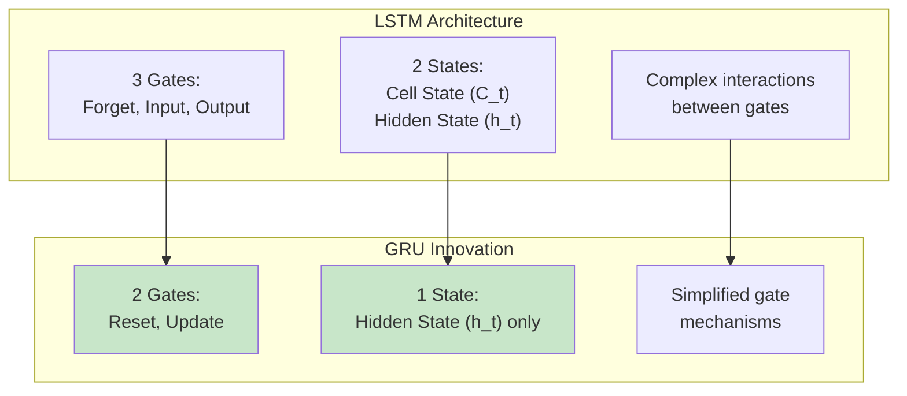
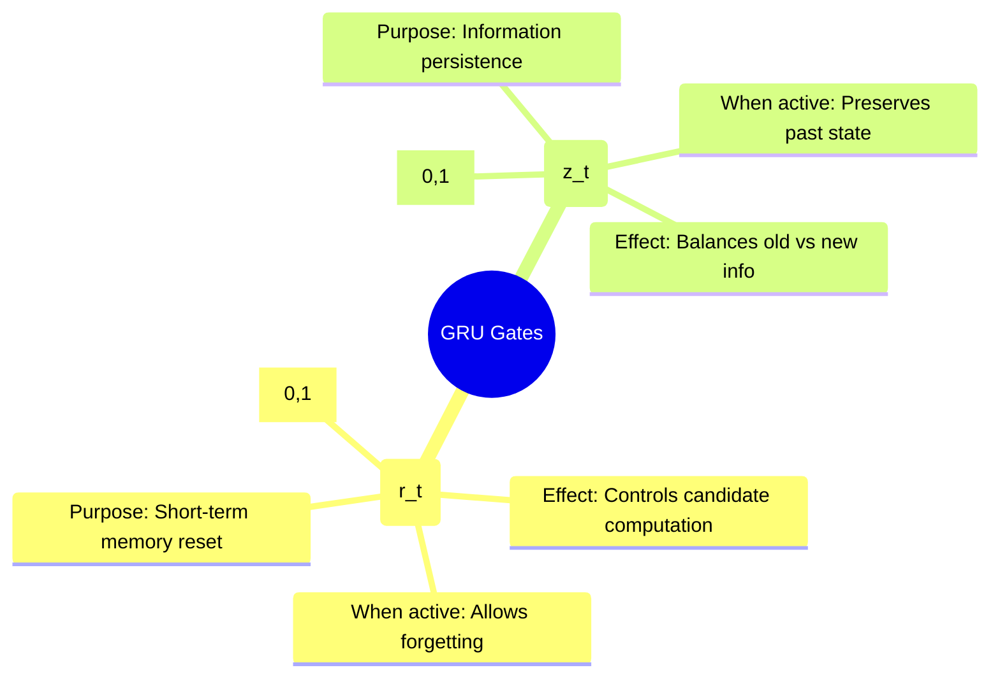
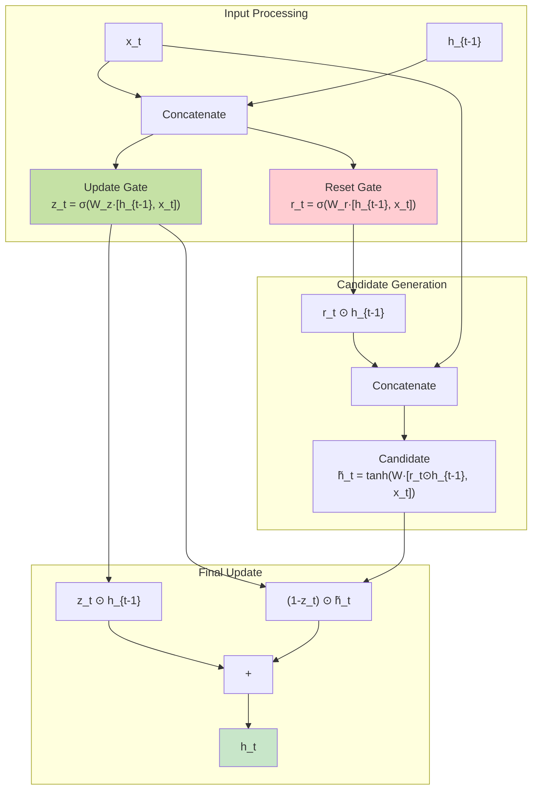
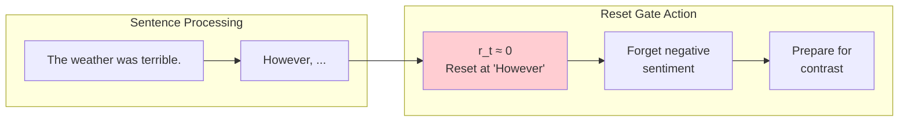
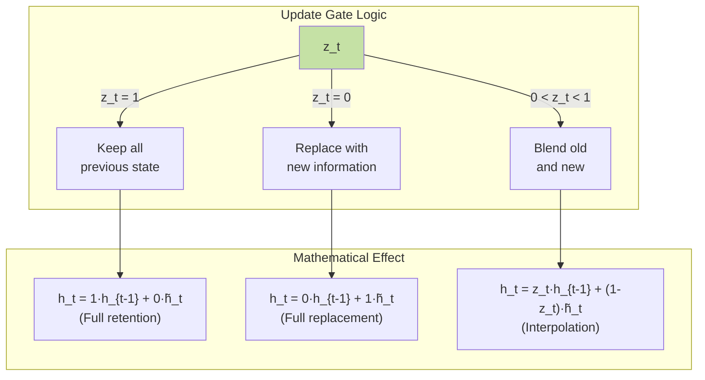
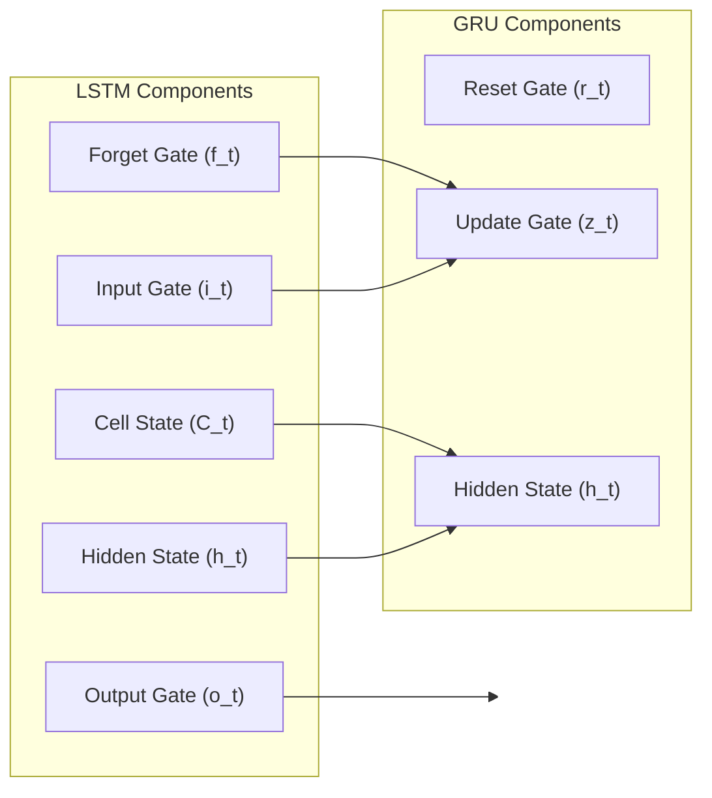
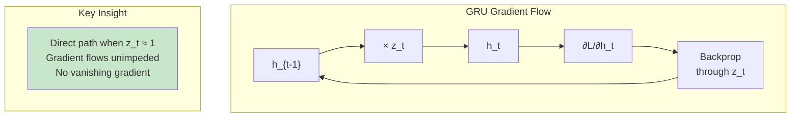
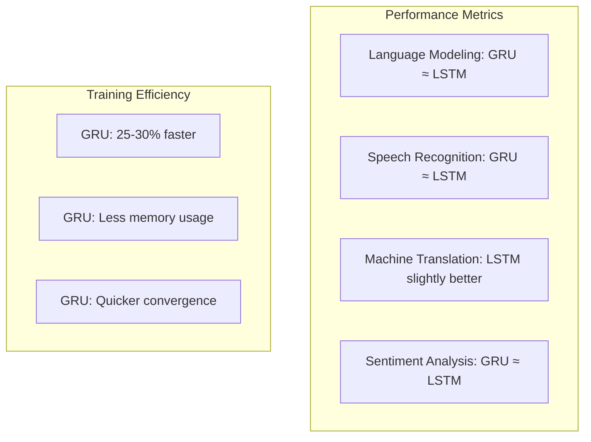
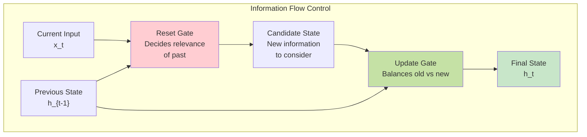
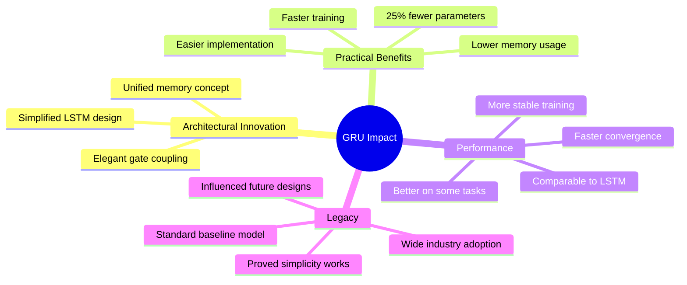

# GRU - Gated Recurrent Unit | Simplified LSTM Architecture

## Overview

**Gated Recurrent Unit (GRU)** represents an elegant simplification of the LSTM architecture, introduced in 2014 by **Kyunghyun Cho** and colleagues. The material explores how GRUs achieve comparable performance to LSTMs while using **fewer parameters and gates**, making them computationally more efficient. This architectural innovation demonstrates that solving the vanishing gradient problem doesn't necessarily require the full complexity of LSTMs, leading to a more streamlined approach that has become widely adopted in modern deep learning applications.


*GRU cell architecture showing the two-gate system (reset and update gates) and simplified information flow*

## Building Upon LSTM Foundations

### The Motivation Behind GRU

After LSTMs proved successful in handling long-term dependencies, researchers questioned whether all three gates were necessary. The key insights that led to GRU development:

1. **LSTM Complexity**: Three gates, two separate memory states
2. **Redundancy Question**: Do we really need separate forget and input gates?
3. **Parameter Efficiency**: Can we achieve similar results with fewer parameters?
4. **Computational Speed**: Simpler architecture means faster training

### Evolution from LSTM to GRU



## GRU Architecture: The Two-Gate System

### Core Components

**GRU Animated Visualization**:


*Animated visualization of GRU showing simplified gate mechanisms and single state pathway*

### The Two Gates Explained

**1. Reset Gate (r_t)**:
- Controls how much past information to forget
- Similar to LSTM's forget gate but with different mechanics
- Allows model to drop irrelevant information

**2. Update Gate (z_t)**:
- Decides how much past information to carry forward
- Combines functionality of LSTM's forget and input gates
- Controls the balance between old and new information



### Mathematical Formulation

**Gate Computations**:



### Step-by-Step Information Flow

**1. Gate Calculation Phase**:
```
r_t = σ(W_r · [h_{t-1}, x_t] + b_r)  # Reset gate
z_t = σ(W_z · [h_{t-1}, x_t] + b_z)  # Update gate
```

**2. Candidate State Generation**:
```
h̃_t = tanh(W · [r_t ⊙ h_{t-1}, x_t] + b)
```

**3. Final State Update**:
```
h_t = z_t ⊙ h_{t-1} + (1 - z_t) ⊙ h̃_t
```

## Understanding the Reset Gate Mechanism

### Purpose and Function

The reset gate determines how much of the previous hidden state should be used when computing the new candidate values.


*Detailed view of reset gate operation in GRU cell*

**Reset Gate Behavior**:
- **r_t ≈ 0**: Ignore previous hidden state (reset memory)
- **r_t ≈ 1**: Use previous hidden state fully
- **0 < r_t < 1**: Partial use of previous information

### Practical Example



## Understanding the Update Gate Mechanism

### Purpose and Function

The update gate controls how much information flows from the previous state versus how much new information to incorporate.

**Update Gate as Information Gatekeeper**:



### The Interpolation Mechanism

**Key Innovation**: GRU uses linear interpolation between old and new states:
- Smoother transitions than LSTM's additive approach
- More stable gradient flow
- Natural forgetting mechanism

## GRU vs LSTM: Detailed Comparison

### Architectural Differences



### Parameter Count Comparison

| Component | LSTM | GRU | Reduction |
|-----------|------|-----|-----------|
| Gates | 3 | 2 | 33% fewer |
| State Vectors | 2 (C_t, h_t) | 1 (h_t) | 50% fewer |
| Weight Matrices | 4 sets | 3 sets | 25% fewer |
| Total Parameters | 4 × (n² + nm + n) | 3 × (n² + nm + n) | ~25% fewer |

Where n = hidden size, m = input size

### Computational Efficiency

**GRU Advantages**:
1. **Fewer Operations**: 25% fewer matrix multiplications
2. **Memory Efficient**: Single state vector reduces memory usage
3. **Faster Training**: Simpler backpropagation
4. **Easier Optimization**: Fewer hyperparameters to tune

## Visual Comparison of Information Flow

### LSTM vs GRU Side-by-Side


*Side-by-side comparison of LSTM (left) and GRU (right) architectures*

**Key Observations**:
- GRU has no separate cell state line
- Fewer connections and operations
- More direct information flow
- Simpler gradient paths

## Mathematical Deep Dive

### Complete GRU Equations

**1. Reset Gate**:
```
r_t = σ(W_rx · x_t + W_rh · h_{t-1} + b_r)
```

**2. Update Gate**:
```
z_t = σ(W_zx · x_t + W_zh · h_{t-1} + b_z)
```

**3. Candidate Hidden State**:
```
h̃_t = tanh(W_hx · x_t + W_hh · (r_t ⊙ h_{t-1}) + b_h)
```

**4. Final Hidden State**:
```
h_t = z_t ⊙ h_{t-1} + (1 - z_t) ⊙ h̃_t
```

### Gradient Flow Analysis



## Practical Implementation Example

### GRU Cell in PyTorch (Conceptual)

```python
class GRUCell:
    def __init__(self, input_size, hidden_size):
        # Initialize weight matrices
        self.W_r = init_weights(input_size + hidden_size, hidden_size)
        self.W_z = init_weights(input_size + hidden_size, hidden_size)
        self.W_h = init_weights(input_size + hidden_size, hidden_size)
    
    def forward(self, x_t, h_prev):
        # Concatenate inputs
        concat = concatenate([h_prev, x_t])
        
        # Compute gates
        r_t = sigmoid(concat @ self.W_r)
        z_t = sigmoid(concat @ self.W_z)
        
        # Compute candidate
        concat_reset = concatenate([r_t * h_prev, x_t])
        h_tilde = tanh(concat_reset @ self.W_h)
        
        # Compute new hidden state
        h_t = z_t * h_prev + (1 - z_t) * h_tilde
        
        return h_t
```

## When to Use GRU vs LSTM

### GRU is Preferred When:

1. **Limited Computational Resources**
   - Faster training required
   - Memory constraints exist
   - Real-time applications

2. **Smaller Datasets**
   - Fewer parameters = less overfitting risk
   - Easier to train with limited data

3. **Similar Performance Acceptable**
   - Many tasks show negligible difference
   - Simplicity valued over marginal gains

### LSTM is Preferred When:

1. **Very Long Sequences**
   - Cell state provides extra memory capacity
   - Complex long-term dependencies

2. **Abundant Resources**
   - Can afford computational cost
   - Large datasets available

3. **Maximum Performance Critical**
   - Even small improvements matter
   - State-of-the-art results required

## Real-World Performance Comparison

### Empirical Results

Research has shown that on many tasks, GRU and LSTM perform comparably:



## Advanced GRU Variants

### 1. Minimal Gated Unit (MGU)
- Further simplification with single gate
- Minimal parameters while maintaining performance

### 2. Light GRU
- Removes reset gate entirely
- Ultra-efficient for embedded systems

### 3. Coupled Input-Forget Gate GRU
- Inspired by LSTM coupling
- Better gradient flow properties

## Visualization of Gate Interactions

### How Gates Work Together



## Key Insights and Design Philosophy

### The Elegance of Simplification

**Core Principle**: GRU demonstrates that architectural elegance often trumps complexity:

1. **Unified Memory**: Single hidden state serves dual purpose
2. **Gate Coupling**: Update gate handles both forgetting and input
3. **Linear Interpolation**: Natural blending mechanism
4. **Fewer Parameters**: Reduced overfitting risk

### Mathematical Beauty

The update equation reveals GRU's elegance:
```
h_t = z_t ⊙ h_{t-1} + (1 - z_t) ⊙ h̃_t
```

This single equation:
- Implements selective memory
- Ensures smooth transitions
- Maintains gradient flow
- Reduces to simple cases naturally

## Common Misconceptions

### Misconception 1: "GRU is Always Better"
**Reality**: Task-dependent; LSTM sometimes superior for complex sequences

### Misconception 2: "Fewer Parameters = Worse Performance"
**Reality**: Often matches LSTM performance with better efficiency

### Misconception 3: "GRU Can't Handle Long Dependencies"
**Reality**: Handles long-term dependencies nearly as well as LSTM

## Practical Training Tips

### Hyperparameter Guidelines

1. **Hidden Size**: Start with 50-200 for most tasks
2. **Learning Rate**: Often higher than LSTM (less complex)
3. **Dropout**: Apply between GRU layers, not within
4. **Initialization**: Xavier/He initialization works well

### Common Pitfalls

1. **Over-parameterization**: Don't use huge hidden sizes
2. **Gradient Clipping**: Still necessary for very long sequences
3. **Batch Normalization**: Tricky with recurrent connections

## Future Perspectives

### Beyond Gates: Modern Developments

1. **Attention Mechanisms**: Often replace gated RNNs entirely
2. **Transformer Models**: Parallel processing advantage
3. **Hybrid Architectures**: GRU + Attention combinations
4. **Neural Architecture Search**: Automated gate discovery

### GRU's Lasting Impact

Despite newer architectures, GRU remains relevant for:
- Edge computing applications
- Real-time processing needs
- Resource-constrained environments
- Baseline comparisons

## Summary: The Power of Simplicity

### GRU's Key Achievements



## Thought-Provoking Questions

1. **The Optimal Complexity Question**: GRU shows that LSTM's three-gate system might be over-engineered for many tasks. How do we determine the optimal architectural complexity for a given problem? Could neural architecture search find even simpler but effective designs?

2. **Biological Plausibility**: GRU's interpolation mechanism (z·old + (1-z)·new) resembles how biological neurons might blend signals. Does this mathematical elegance hint at fundamental principles of information processing in natural intelligence?

3. **The Future of Gating**: With attention mechanisms and transformers dominating, is the concept of gates becoming obsolete? Or might there be a synthesis where gating mechanisms enhance attention-based models for better efficiency?

[End of Notes]