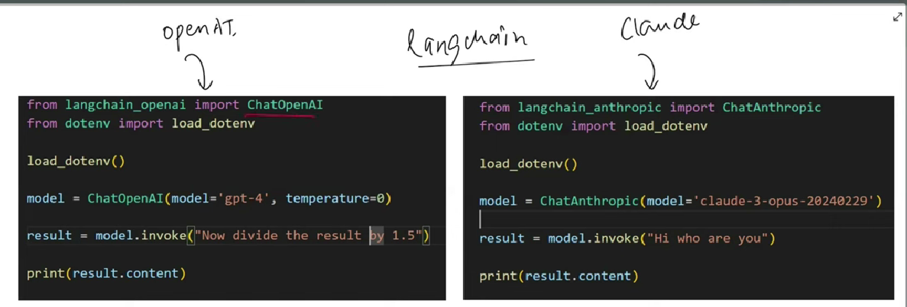
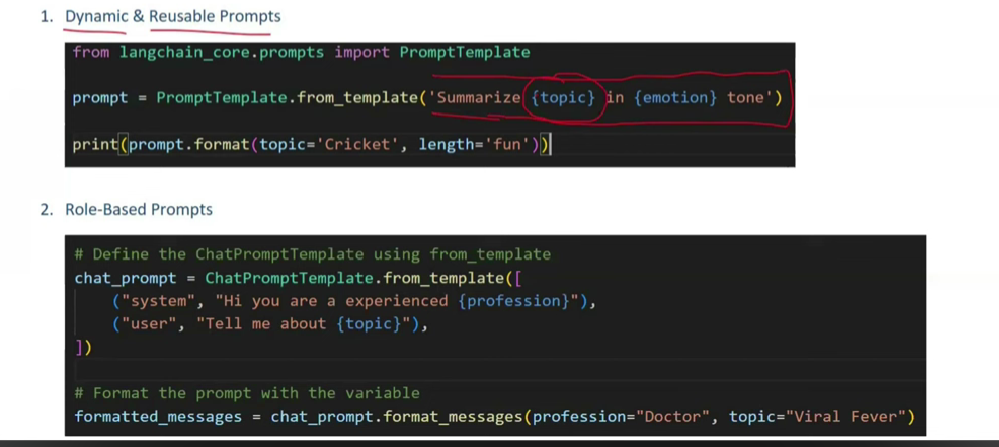
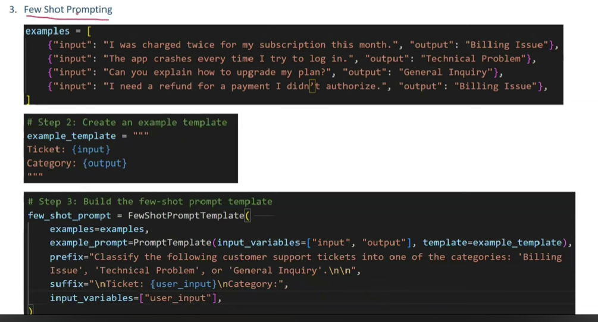
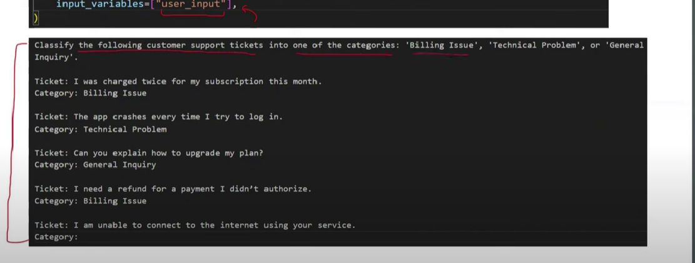
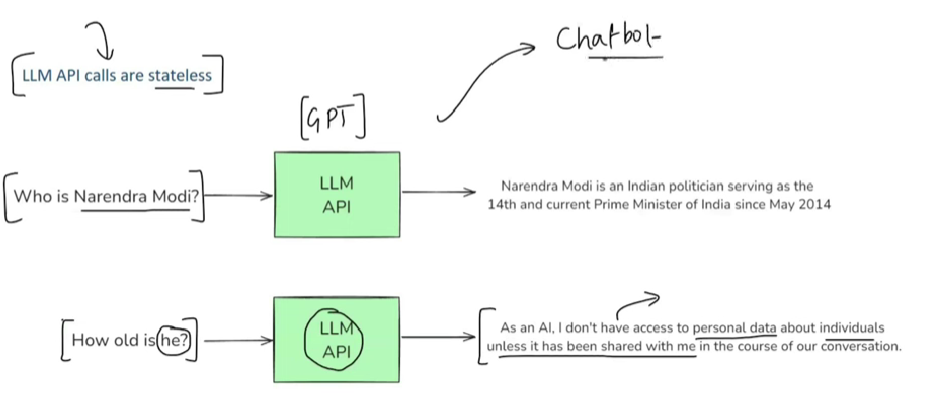

**LLM-powered applications**. It emphasizes understanding the framework's organization and the thought process behind its development, setting a foundation for more detailed, code-based explorations in the future.

Before diving into the components, a recap of prior information highlights:

- **LangChain's Core Purpose:** To enable the building of applications leveraging Large Language Models (LLMs).
- **The Need for LangChain:** Developing complex LLM applications from scratch (e.g., a system to interact with PDFs) involves numerous components and interactions. LangChain provides **orchestration**, building efficient **pipelines** (called **Chains**) with minimal code. A key advantage is its **model-agnostic nature**, allowing users to switch LLM providers (e.g., from OpenAI's GPT to Google's Gemini) with very few code modifications.
- **Common Applications:** Building **conversational chatbots**, **AI knowledge assistants**, and **AI Agents**.

The material then outlines the **six core components of LangChain**:

1.  **Models:**

    - **Significance:** This is described as the most crucial component, serving as the **core interface** for interaction with various AI models.
    - **Problem Addressed:** Historically, building chatbots faced challenges in Natural Language Understanding (NLU) and context-aware text generation. LLMs, trained on vast internet data, solved these but introduced new issues:
      - **Size:** LLMs are massive (often >100GB), making them difficult for individuals or small companies to host and run.
      - **APIs as a Solution:** Large companies (OpenAI, Google, Anthropic) began offering their LLMs via **APIs**, allowing users to pay per use without hosting the models.
      - **Implementation Discrepancies:** A new problem arose as different LLM providers developed their APIs differently. This meant an application developer needing to use multiple LLMs or switch between them would have to write and rewrite significant amounts of code, as API calls and response structures varied.
    - **LangChain's Contribution:** The **Models** component **standardizes** these interactions. It provides a unified way to communicate with different AI models, meaning only minor code changes (e.g., one or two lines) are needed to switch between providers like OpenAI and Claude. This standardization also extends to the format of the results received, simplifying parsing.
    - **Types of Models supported by LangChain:**
      - **Language Models (LLMs):** These are models that take text as input and produce text as output (text-in, text-out). They are the foundation for applications like chatbots and AI agents. The material mentions LangChain supports a wide array of providers, including ChatAnthropic, ChatMistralAI, ChatOpenAI, ChatVertexAI (Google), ChatBedrock (AWS), and ChatHuggingFace, detailing features like **tool calling**, **structured output**, **JSON mode**, local runnability, and **multimodal input**.
      - **Embedding Models:** These models take text as input and produce a **vector (embedding)** as output. Their primary use case is for **semantic search**. LangChain supports various embedding model providers like OpenAI, MistralAI, IBM, and Llama.
    - **Key Takeaway:** The **Models** component abstracts the complexities of individual AI model APIs, offering a consistent and flexible way to integrate diverse AI capabilities.

2.  **Prompts:**

        - **Definition:** **Prompts** are the inputs provided to an LLM.
        - **Importance:** The output of an LLM is highly sensitive to the prompt. Even slight changes in wording can lead to vastly different results. This has given rise to the field of **Prompt Engineering**.
        - **LangChain's Contribution:** LangChain recognizes the critical role of prompts and provides robust tools to create, manage, and reuse them effectively. It allows for the construction of **dynamic and powerful prompts**.
        - **Examples of Prompting Techniques in LangChain:**
          - **Dynamic and Reusable Prompts:** Creating templates with **placeholders** (e.g., `Summarize this {topic} in this {tone}`) that can be filled at runtime. This allows one prompt structure to be used for many different inputs.
          - **Role-Based Prompts:** Defining a persona for the LLM through a system-level prompt (e.g., "You are an experienced {profession}") and then combining it with a user's query (e.g., "Tell me about {topic}"). This guides the LLM to respond from a specific perspective.
          - **Few-Shot Prompts:** Providing the LLM with several examples of input-output pairs before asking the actual query. This helps the LLM understand the desired format or type of response (e.g., classifying customer support tickets by showing examples of tickets and their categories).
        - **Key Takeaway:** The **Prompts** component equips developers with the tools to craft sophisticated inputs, significantly influencing the quality and relevance of LLM outputs.

    
    
    

3.  **Chains:**

    - **Definition:** **Chains** are fundamental to LangChain (evident in its name) and are used to build **pipelines** or sequences of operations.
    - **Core Functionality:** They allow for linking multiple calls to LLMs or other utilities. The defining feature is that the **output of one component in a chain automatically becomes the input for the subsequent component**, without requiring manual code to manage this data flow.
    - **Example Use Case:** An application that takes a long English text, first translates it to Hindi using one LLM call, and then summarizes the Hindi text using a second LLM call. LangChain's **Chains** manage the intermediate output (translated text) and feed it to the next step (summarization) seamlessly.
    - **Types of Chains:**
      - **Sequential Chains:** Operations are performed one after another.
      - **Parallel Chains:** Multiple operations can be executed concurrently, and their results potentially combined. For instance, generating a report on a topic by querying two different LLMs simultaneously and then having a third LLM combine their outputs.
      - **Conditional Chains:** The path of execution within a chain can vary based on certain conditions. For example, an AI agent processing user feedback might thank the user if the feedback is positive, but trigger an email to customer support if it's negative.
    - **Key Takeaway:** **Chains** are powerful for creating complex applications by simplifying the process of linking multiple steps and managing the flow of data between them.

4.  **Indexes:**

    - **Purpose:** **Indexes** connect LLM applications to **external knowledge sources** such as PDFs, websites, or databases. This allows LLMs to answer questions about information not present in their original training data (e.g., private company data).
    - **Problem Addressed:** Standard LLMs like ChatGPT cannot answer questions specific to a user's private documents or a company's internal knowledge base because they weren't trained on that data (e.g., "What is my company's leave policy?").
    - **LangChain's Solution:** **Indexes** provide the mechanism to structure and retrieve information from these external sources so that LLMs can use it. This is often part of a pattern called **Retrieval Augmented Generation (RAG)**.
    - **Core Sub-Components of Indexes:**
      - **Document Loaders:** Responsible for loading data from various sources (e.g., a PDF from Google Drive, content from a website, records from a database).
      - **Text Splitters:** Break down large documents into smaller, manageable **chunks** (e.g., by page, paragraph, or a fixed number of characters). This is crucial for effective semantic search.
      - **Vector Stores (Vector Databases):** Store **embeddings** (numerical vector representations) of the text chunks. These embeddings capture the semantic meaning of the text.
      - **Retrievers:** When a user asks a query, the retriever:
        1.  Generates an embedding for the user's query.
        2.  Performs a **semantic search** in the **vector store** to find the most relevant text chunks (i.e., those whose embeddings are closest to the query's embedding).
        3.  Passes these relevant chunks, along with the original query, to an LLM.
        4.  The LLM then generates an answer based on the provided context from the retrieved chunks.
    - **Key Takeaway:** **Indexes** enable LLMs to access and utilize custom or external data, dramatically expanding their utility for personalized and enterprise applications by grounding their responses in specific, relevant information.

5.  **Memory:**

    - **Problem Addressed:** LLM API calls are inherently **stateless**. This means each interaction with an LLM via its API is independent and has no recollection of previous interactions. For example, if you ask an LLM "Who is Narendra Modi?" and then follow up with "How old is he?", a stateless LLM won't know who "he" refers to. This is a significant issue for building conversational applications like chatbots where context is crucial.
      
    - **LangChain's Contribution:** The **Memory** component provides a way to add statefulness or "memory" to LLM interactions, allowing conversations to maintain context.
    - **Types of Memory in LangChain:**
      - **ConversationBufferMemory:** Stores the entire chat history of the current conversation. This complete history is then sent with each new API call, giving the LLM full context. A potential downside is that as the conversation grows, the amount of text sent (and processed) increases, which can become costly.
      - **ConversationBufferWindowMemory:** Stores only the last 'N' interactions (e.g., the last 100 messages). This keeps the context manageable while still providing recent history.
      - **Summarizer-Based Memory:** Instead of sending the full or windowed history, this type of memory generates a summary of the conversation so far and sends that summary with new API calls. This can save on token costs.
      - **Custom Memory:** Allows for more advanced scenarios where specific pieces of information (e.g., user preferences, key facts mentioned earlier) are explicitly stored and retrieved.
    - **Key Takeaway:** **Memory** is essential for creating coherent, context-aware conversational AI applications by enabling LLMs to remember and refer to previous parts of an interaction.

6.  **Agents:**
    - **Concept:** **AI Agents** are presented as an evolution of chatbots, representing a significant area of current AI development ("the next big thing").
    - **LLM Foundations:** LLMs excel at Natural Language Understanding (NLU) and text generation, making chatbots an obvious initial application.
    - **Distinction between Chatbots and AI Agents:**
      - Chatbots primarily understand user queries and generate textual replies.
      - **AI Agents** can also understand and reply, but critically, they can also **take actions** by interacting with their environment or other tools.
    - **Key Capabilities of AI Agents (beyond chatbots):**
      - **Reasoning Capability:** Agents can break down complex user requests into smaller, manageable steps and plan a sequence of actions to achieve a goal. The material mentions **Chain of Thought (CoT) prompting** as a technique that facilitates this step-by-step reasoning.
      - **Access to Tools:** Agents can be given access to various **tools** (e.g., a calculator, a weather API, a search engine, database query interfaces, other software APIs). They can decide which tool to use, provide it with the necessary input, and use its output to proceed.
    - **How AI Agents Work (Illustrative Example):**
      - User Query: "Can you multiply today's temperature of Delhi by 3?"
      - Agent's Process:
        1.  **Reasoning:** The agent understands it needs two pieces of information: Delhi's current temperature and the ability to multiply.
        2.  **Tool Use (Weather API):** It identifies the need for the current temperature and uses its "Weather API" tool, inputting "Delhi" to get, for example, "25°C".
        3.  **Tool Use (Calculator):** It then recognizes the need for multiplication and uses its "Calculator" tool with inputs "25" and "3" to get "75".
        4.  **Response:** The agent provides "75" as the final answer.
    - **LangChain's Role:** LangChain significantly simplifies the development of such **AI Agents**.
    - **Key Takeaway:** **Agents** empower LLMs to go beyond mere conversation, allowing them to interact with external systems and perform tasks, acting more like autonomous assistants.

The material concludes by stating that future content in the series will delve into each of these components in more detail, starting with the **Models** component.

**Stimulating Learning Prompts:**

1.  Considering the **Models** component standardizes interaction with diverse LLMs, what new challenges or opportunities might arise as the number and variety of specialized LLMs continue to grow?
2.  The **Agents** component combines LLM reasoning with tool usage. How might the reliability and safety of such agents be ensured, especially when tools can perform real-world actions?
