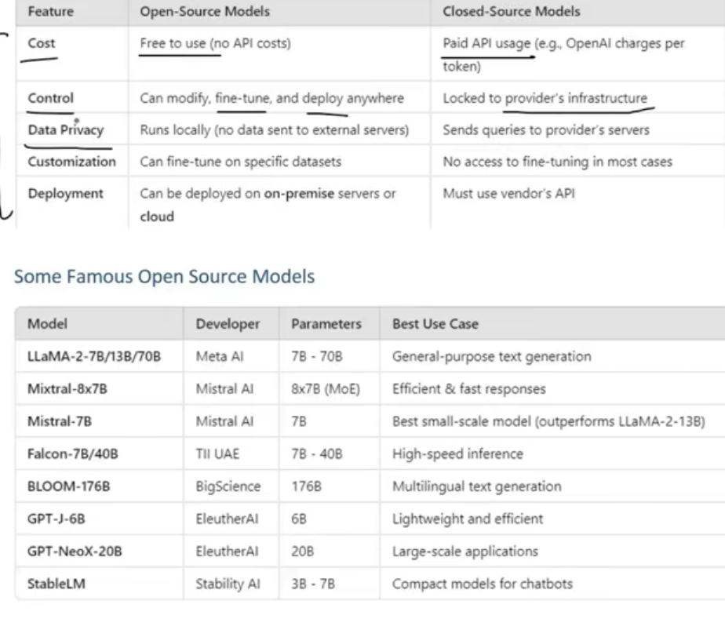

### Notes on LangChain Models

- The material provides a comprehensive overview of the **Model component** within the **LangChain framework**. This component is presented as a crucial abstraction layer that simplifies interaction with a diverse range of Artificial Intelligence (AI) models. Its primary purpose is to offer a **common interface**, enabling developers to seamlessly connect and utilize different AI models without needing to adapt their code extensively for each specific model's API.

- Two fundamental categories of models are distinguished within LangChain:

  - **Language Models**:
    - **Definition**: These models are characterized by their ability to process textual input and generate textual output.
    - **Significance**: They form the backbone of applications requiring natural language understanding and generation, such as chatbots, text summarization, and content creation.
    - The material describes a visual where text goes in, is processed by the model, and text comes out.
  - **Embedding Models**:
    - **Definition**: These models take textual input and transform it into **embeddings**, which are numerical (vector) representations of the text.
    - **Significance**: Embeddings capture the **contextual meaning** or semantic information of the text. This is vital for tasks like **semantic search** (finding content based on meaning rather than just keywords) and is a core element in building **RAG (Retrieval Augmented Generation)** based applications, where LLMs can "chat" with documents by first understanding their content through embeddings.
    - The material describes a visual where text goes in, is processed, and a series of numbers (vectors) comes out.

- The discussion on **Language Models** further differentiates between two sub-types:

  - **LLMs (Large Language Models - traditional sense within LangChain)**:
    - **Characteristics**: Described as general-purpose models that typically take a single string as input and return a single string as output.
    - **Context**: The material indicates that these are becoming somewhat legacy within LangChain, with a shift in recommendation towards Chat Models for new projects. An example given is using OpenAI's `GPT-3.5-turbo-instruct`.
  - **Chat Models**:
    - **Characteristics**: These are specialized for conversational tasks. They are designed to take a sequence of messages (e.g., system message, user message, AI message) as input and return chat messages as output.
    - **Advantages**: They inherently support **conversation history** (memory) and **role awareness** (e.g., assigning a persona to the AI like "You are a knowledgeable doctor").
    - **Recommendation**: The material strongly emphasizes that **Chat Models** are the preferred and more modern approach for building conversational AI applications within LangChain. Examples include using `ChatOpenAI` (for GPT-4), `ChatAnthropic` (for Claude), and `ChatGoogleGenerativeAI` (for Gemini).

- A significant portion of the material is dedicated to the practical implementation and coding aspects, covering:

  - **Setup**: Importance of a proper coding environment (virtual environment, library installation via `requirements.txt`), and secure management of API keys using `.env` files (e.g., `OPENAI_API_KEY`, `ANTHROPIC_API_KEY`, `GOOGLE_API_KEY`, `HUGGING_FACE_HUB_ACCESS_TOKEN`).
  - **Interaction Pattern**: The **`invoke` method** is highlighted as a common and important function in LangChain for interacting with these models, whether LLMs or Chat Models. For Chat Models, the output is often an `AIMessage` object, and the textual content is accessed via an attribute like `.content`.
  - **Model Parameters**: Key parameters like **`temperature`** (controlling creativity/randomness of output) and **`max_tokens`** (or `max_new_tokens`, limiting output length and cost) are explained.
  - **Closed-Source vs. Open-Source Models**:
    - **Closed-Source Models**:
      - **Description**: These are proprietary models provided by companies, typically accessed via paid APIs (e.g., OpenAI's GPT series, Anthropic's Claude, Google's Gemini).
      - **Pros**: Often highly capable, well-refined, and easier to get started with if API access is available.
      - **Cons**: Costs associated with API usage, data privacy concerns (data sent to third-party servers), and limited control/customization.
    - **Open-Source Models**:
      - **Description**: Freely available models that can be downloaded, modified, fine-tuned, and deployed without restrictions from a central provider. **Hugging Face** is identified as the primary repository for these models.
      - **Pros**: No direct API costs for inference if run locally, full control and customization (including fine-tuning), enhanced data privacy (data can stay on-premises).
      - **Cons**: Can require significant **hardware resources** (especially GPUs for larger models), more complex setup and maintenance, and potentially less refined out-of-the-box performance compared to top-tier closed-source models.
        
      - **Usage Methods**:
        - **Hugging Face Inference API**: Using models hosted on Hugging Face via their API (e.g., using `ChatHuggingFace` with `HuggingFaceEndpoint`). This still involves an API call but provides access to many open-source models.
        - **Local Download and Execution**: Downloading models (e.g., TinyLlama, sentence-transformers like 'all-MiniLM-L6-v2') and running them on the user's own machine (e.g., using `ChatHuggingFace` with `HuggingFacePipeline` for language models, or `HuggingFaceEmbeddings` for embedding models). The material notes the potential for slow performance on machines without adequate hardware.

- The **Embedding Models** section details:

  - **OpenAI Embeddings**: Using the `OpenAIEmbeddings` class, with methods like **`embed_query`** (for a single piece of text) and **`embed_documents`** (for a list of texts). The ability to specify the model (e.g., `text-embedding-3-large`) and desired output **dimensions** is mentioned, along with their relative cost-effectiveness.
  - **Hugging Face Embeddings**: Using the `HuggingFaceEmbeddings` class to leverage open-source sentence transformer models locally. The first run typically involves downloading the model files.

- A practical application, **Document Similarity Search**, is built to illustrate the utility of embedding models:

  - **Core Idea**: To find which document in a collection is semantically closest to a user's query.
  - **Methodology**:
    1.  Generate embeddings for all documents in the collection.
    2.  Generate an embedding for the user's query.
    3.  Calculate **cosine similarity** between the query embedding and each document embedding. Cosine similarity measures the cosine of the angle between two vectors, indicating their orientation similarity.
    4.  The document with the highest cosine similarity score is deemed the most relevant.
  - **Tools**: `OpenAIEmbeddings` (or any other embedding model), `scikit-learn`'s `cosine_similarity`, and `numpy`.
  - **Connection to RAG**: This process is foundational to RAG, where retrieved similar documents provide context to an LLM for generating an answer. The material briefly touches upon the idea that document embeddings would ideally be stored in a **vector database** for efficient retrieval in real-world RAG applications, avoiding re-computation.

- **Overall Flow**: The material follows a logical progression from foundational concepts (what are LangChain models) to specific types (Language vs. Embedding, LLM vs. Chat), then to practical coding with various providers (OpenAI, Anthropic, Google, Hugging Face for both closed and open-source), and culminates in a simple application demonstrating a key use case (document similarity for semantic search).

**Stimulating Learning Prompts:**

1.  Given the shift towards Chat Models for their conversational capabilities, under what specific, niche scenarios might the older LLM interface (string-in, string-out) still offer advantages in a LangChain application?
2.  The material highlights hardware requirements as a potential drawback for local open-source model deployment. How might advancements in model quantization or edge computing influence the accessibility and practicality of using these models locally in the future?
