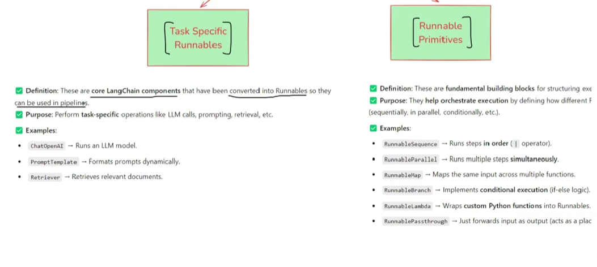

### Holistic Deep Dive Summary

The material provides a continuation of the discussion on **Runnables** in LangChain, emphasizing their role in creating standardized and flexible LLM applications. It begins with a recap of why **Runnables** were introduced—to overcome the lack of standardization in early LangChain **components** and enable seamless connection between them using a unified **`invoke`** method.

The core of the material distinguishes between two main types of runnables:

1.  **Task-specific Runnables**: These are the fundamental LangChain components (like prompt templates, LLMs, parsers) adapted to the runnable interface, each serving a distinct purpose in an LLM chain.
2.  **Runnable Primitives**: These are specialized runnables designed to orchestrate and structure the flow of execution between other runnables. They are the building blocks for constructing complex workflows, enabling sequential, parallel, and conditional logic.

The information presented then systematically explores key **Runnable Primitives**, explaining their purpose and illustrating their use with conceptual examples and code snippets. These include `RunnableSequence`, `RunnableParallel`, `RunnablePassthrough`, `RunnableLambda`, and `RunnableBranch`.

Finally, the material introduces the **LangChain Expression Language (LCEL)**, highlighting its utility in providing a more concise and declarative syntax for defining chains, especially for the common use case of sequential operations using the pipe (`|`) operator as a replacement for explicitly using `RunnableSequence`. The overall message underscores that understanding these primitives and LCEL is crucial for effectively building sophisticated applications in LangChain.

### Recap: The Journey to Runnables

- **Initial LangChain Components**: The information recalls that LangChain initially offered various **components** like **Prompt Templates**, **LLMs**, **Parsers**, and **Retrievers**. These were essential for building LLM applications.
  - **Significance**: Provided the foundational elements for LLM application development.
- **Problem of Standardization**: A major challenge was the lack of a standardized interface across these **components**. Different components had distinct methods for interaction (e.g., `format` for prompts, `predict` for LLMs, `parse` for parsers).
  - **Significance**: This heterogeneity made it cumbersome to connect components and build flexible, complex workflows.
- **Introduction of Runnables**: To address this, LangChain introduced the **Runnable** protocol (often an abstract class).
  - **Mechanism**: Components were made to inherit from or conform to this **Runnable** interface, which standardized interaction methods, most notably requiring an **`invoke`** method.
  - **Significance**: This **standardization** ensured that any runnable component could seamlessly connect with another, allowing the output of one to automatically become the input for the next. This dramatically improved the ease of creating flexible and powerful chains.

### Types of Runnables

The material categorizes runnables into two primary types:

- **Task-specific Runnables**:
  - **Definition**: These are the core LangChain **components** (e.g., **`ChatOpenAI`**, **`PromptTemplate`**, **Retrievers**, **OutputParsers**) that have been adapted to the **Runnable** interface.
  - **Context & Significance**: Each **task-specific runnable** has a defined role (e.g., a **`PromptTemplate`** formats input, **`ChatOpenAI`** interacts with the OpenAI API). By becoming **runnables**, they gain the ability to be easily integrated into **pipelines** (chains) with a consistent interaction pattern.
- **Runnable Primitives**:
  - **Definition**: These are foundational building blocks specifically designed for structuring the **execution logic** and **data flow** within AI workflows composed of other runnables.
  - **Context & Significance**: They **orchestrate** how different **task-specific runnables** (or even other primitives) interact. They define the "how" of the chain's operation—whether runnables execute **sequentially**, **in parallel**, or based on certain **conditions**. The material emphasizes that these primitives are key to building complex chains.

### Detailed Exploration of Runnable Primitives

The content explains several key **Runnable Primitives**:

1.  **`RunnableSequence`**:

    - **Purpose**: To connect two or more runnables in a **sequential** manner.
    - **Mechanism**: The output of the first runnable in the sequence is automatically passed as input to the second, and so on.
    - **Context & Significance**: This is one of the most fundamental primitives, as many LLM tasks involve a step-by-step processing flow (e.g., creating a prompt, sending it to an LLM, then parsing the output). The information notes that a similar, custom-built "RunnableConnector" was demonstrated previously.
    - **Example from content**: Creating a chain: Prompt -> Model -> Parser, and then extending it to: Prompt1 -> Model -> Parser -> Prompt2 -> Model -> Parser (for generating a joke and then its explanation).
    - **Code Example**:

      ```python
      from langchain_openai import ChatOpenAI
      from langchain_core.prompts import PromptTemplate
      from langchain_core.output_parsers import StrOutputParser
      from dotenv import load_dotenv
      from langchain.schema.runnable import RunnableSequence

      load_dotenv()

      prompt1 = PromptTemplate(
          template='Write a joke about {topic}',
          input_variables=['topic']
      )

      model = ChatOpenAI()

      parser = StrOutputParser()

      prompt2 = PromptTemplate(
          template='Explain the following joke - {text}',
          input_variables=['text']
      )

      chain = RunnableSequence(prompt1, model, parser, prompt2, model, parser)

      print(chain.invoke({'topic':'AI'}))
      ```

2.  **`RunnableParallel`**:

    - **Purpose**: To execute multiple runnables (or chains) **concurrently**, with each receiving the same input.
    - **Mechanism**: Each branch of the parallel execution processes the input independently. The collective output is a **dictionary**, where keys are user-defined identifiers for each parallel branch, and the values are their respective outputs.
    - **Context & Significance**: Extremely useful when multiple, distinct operations need to be performed on the same piece of input data simultaneously.
    - **Example from content**: Taking a topic (e.g., "AI") and generating both a tweet and a LinkedIn post about it in parallel. Each generation process (Prompt -> Model -> Parser) runs independently.
    - **Code Example**:

      ```python
      from langchain_openai import ChatOpenAI
      from langchain_core.prompts import PromptTemplate
      from langchain_core.output_parsers import StrOutputParser
      from dotenv import load_dotenv
      from langchain.schema.runnable import RunnableSequence, RunnableParallel

      load_dotenv()

      prompt1 = PromptTemplate(
          template='Generate a tweet about {topic}',
          input_variables=['topic']
      )

      prompt2 = PromptTemplate(
          template='Generate a Linkedin post about {topic}',
          input_variables=['topic']
      )

      model = ChatOpenAI()

      parser = StrOutputParser()

      parallel_chain = RunnableParallel({
          'tweet': RunnableSequence(prompt1, model, parser),
          'linkedin': RunnableSequence(prompt2, model, parser)
      })

      result = parallel_chain.invoke({'topic':'AI'})

      print(result['tweet'])
      print(result['linkedin'])
      ```

3.  **`RunnablePassthrough`**:

    - **Purpose**: A special primitive that passes its input directly to its output **without any modification**.
    - **Mechanism**: `Input -> RunnablePassthrough -> Input`.
    - **Context & Significance**: While seemingly simple, it's highly valuable in scenarios, particularly with **`RunnableParallel`**, where one might need to carry forward the original input (or an intermediate result) alongside the output of another processing branch. This allows subsequent parts of a chain to access both the original data and the newly processed data.
    - **Example from content**: In a workflow to generate a joke and then explain it, if the goal is to output both the joke _and_ its explanation, `RunnablePassthrough` can be used in a parallel structure. One branch generates the explanation from the joke, while the other (using `RunnablePassthrough`) simply forwards the joke itself. The final output is a dictionary containing both.
    - **Code Example**:

      ```python
      from langchain_openai import ChatOpenAI
      from langchain_core.prompts import PromptTemplate
      from langchain_core.output_parsers import StrOutputParser
      from dotenv import load_dotenv
      from langchain.schema.runnable import RunnableSequence, RunnableParallel, RunnablePassthrough

      load_dotenv()

      prompt1 = PromptTemplate(
          template='Write a joke about {topic}',
          input_variables=['topic']
      )

      model = ChatOpenAI()

      parser = StrOutputParser()

      prompt2 = PromptTemplate(
          template='Explain the following joke - {text}',
          input_variables=['text']
      )

      joke_gen_chain = RunnableSequence(prompt1, model, parser)

      parallel_chain = RunnableParallel({
          'joke': RunnablePassthrough(),
          'explanation': RunnableSequence(prompt2, model, parser)
      })

      final_chain = RunnableSequence(joke_gen_chain, parallel_chain)

      print(final_chain.invoke({'topic':'cricket'}))
      ```

4.  **`RunnableLambda`**:

    - **Purpose**: To convert any arbitrary **Python function** into a fully-fledged **Runnable**.
    - **Mechanism**: Wraps a Python function, making it compatible with the runnable interface and allowing it to be seamlessly integrated into a LangChain sequence or parallel structure.
    - **Context & Significance**: This primitive offers great flexibility by enabling the inclusion of **custom logic**, data transformations, or any operation not covered by standard LangChain components, directly within a chain. It allows developers to "inject" their own Python code as a step in the runnable pipeline.
    - **Example from content**: Defining a Python function to count the number of words in a given text (a generated joke). This function, when wrapped with `RunnableLambda`, can be added to a chain that first generates the joke, then in parallel, passes the joke through this custom word-counting runnable and also through `RunnablePassthrough` to output both the joke and its word count.
    - **Code Example**:

      ```python
      from langchain_openai import ChatOpenAI
      from langchain_core.prompts import PromptTemplate
      from langchain_core.output_parsers import StrOutputParser
      from dotenv import load_dotenv
      from langchain.schema.runnable import RunnableSequence, RunnableLambda, RunnablePassthrough, RunnableParallel

      load_dotenv()

      def word_count(text):
          return len(text.split())

      prompt = PromptTemplate(
          template='Write a joke about {topic}',
          input_variables=['topic']
      )

      model = ChatOpenAI()

      parser = StrOutputParser()

      joke_gen_chain = RunnableSequence(prompt, model, parser)

      parallel_chain = RunnableParallel({
          'joke': RunnablePassthrough(),
          'word_count': RunnableLambda(word_count)
      })

      final_chain = RunnableSequence(joke_gen_chain, parallel_chain)

      result = final_chain.invoke({'topic':'AI'})

      final_result = """{} \n word count - {}""".format(result['joke'], result['word_count'])

      print(final_result)
      ```

5.  **`RunnableBranch`**:

    - **Purpose**: To introduce **conditional execution logic** into a chain, akin to an "if-elif-else" statement in programming.
    - **Mechanism**: It is configured with a series of `(condition_function, runnable_true)` pairs and a `default_runnable`. When invoked, it evaluates the conditions sequentially. The input is passed to the `runnable_true` corresponding to the first condition that evaluates to true. If no conditions are met, the `default_runnable` is executed.
    - **Context & Significance**: Enables the creation of dynamic and adaptive chains where the processing path can change based on the input data or intermediate results.
    - **Example from content**: Generating a detailed report on a topic. A `RunnableBranch` checks if the generated report's word count exceeds a certain threshold (e.g., 300 words). If it does (condition true), a summarization chain (Prompt -> Model -> Parser) is triggered. If not (default), the original report is passed through as is (using `RunnablePassthrough`).
    - **Code Example**:

      ```python
      from langchain_openai import ChatOpenAI
      from langchain_core.prompts import PromptTemplate
      from langchain_core.output_parsers import StrOutputParser
      from dotenv import load_dotenv
      from langchain.schema.runnable import RunnableSequence, RunnableParallel, RunnablePassthrough, RunnableBranch, RunnableLambda

      load_dotenv()

      prompt1 = PromptTemplate(
          template='Write a detailed report on {topic}',
          input_variables=['topic']
      )

      prompt2 = PromptTemplate(
          template='Summarize the following text \n {text}',
          input_variables=['text']
      )

      model = ChatOpenAI()

      parser = StrOutputParser()

      report_gen_chain = prompt1 | model | parser

      branch_chain = RunnableBranch(
          (lambda x: len(x.split())>300, prompt2 | model | parser),
          RunnablePassthrough()
      )

      final_chain = RunnableSequence(report_gen_chain, branch_chain)

      print(final_chain.invoke({'topic':'Russia vs Ukraine'}))
      ```

### LangChain Expression Language (LCEL)

- **Concept**: **LCEL** is presented as a **declarative syntax** designed to simplify the way chains, particularly **sequential chains**, are defined in LangChain.
- **Mechanism**: Its most prominent feature is the use of the **pipe operator (`|`)** as a more intuitive and concise shorthand for **`RunnableSequence`**. For instance, a sequence like `prompt | model | parser` is functionally equivalent to explicitly defining a `RunnableSequence` with these three components.
- **Context & Significance**: The material points out that **`RunnableSequence`** is very frequently used. LCEL aims to make the definition of such sequences cleaner and more readable. It's an abstraction that enhances developer ergonomics.
- **Future Outlook**: The information suggests that while LCEL currently focuses on improving the syntax for sequential chains, there's potential for it to expand in the future to offer similar declarative ways to define other complex structures, like parallel executions or branches.
- **Practical Implication**: Going forward, the material advises using the LCEL pipe operator for defining sequential chains instead of explicitly instantiating `RunnableSequence`, as it's the more modern and preferred approach.

### Overall Key Takeaways from the Material

- The evolution towards **Runnables** and **LCEL** in LangChain has been driven by the need for **standardization, flexibility, and ease of use** in building complex LLM applications.
- **Runnable Primitives** are powerful tools that provide the necessary constructs to define sophisticated execution flows (sequential, parallel, conditional).
- Mastering these primitives (`RunnableSequence`, `RunnableParallel`, `RunnablePassthrough`, `RunnableLambda`, `RunnableBranch`) and leveraging **LCEL** for cleaner syntax are crucial for developers to effectively design and implement advanced LangChain applications. The content positions these concepts as foundational for building any kind of chain.

### Stimulating Learning Prompts

1.  The material highlights how `RunnableLambda` allows custom Python functions within chains. How might this capability be used to integrate external API calls (not inherently LangChain components) or complex data validation logic into a LangChain workflow?
2.  Given that LCEL currently simplifies `RunnableSequence` with the `|` operator, what kind of syntax could you imagine for `RunnableParallel` or `RunnableBranch` if LCEL were to be extended for them, and what benefits would such an extension offer?
