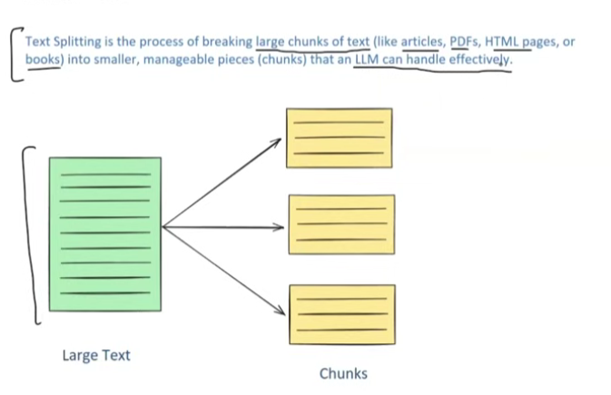

**Text Splitting**, a crucial process in developing **Large Language Model (LLM)** powered applications, particularly **Retrieval Augmented Generation (RAG)** systems. It involves breaking down large pieces of text (like articles, PDFs, HTML pages, or books) into smaller, manageable chunks that an LLM can handle effectively. The code or tool that performs this action is called a **Text Splitter**.


- **Importance of Text Splitting in LLM Applications:**
  - **Overcoming Model Limitations:** Many embedding models and LLMs have **context length limits** (a maximum input size, often measured in **tokens** – which, for simplicity in this context, can be thought of as words). Text splitting allows processing of documents that would otherwise exceed these limits. For example, an LLM with a 50,000-token limit cannot process a 100,000-word PDF directly; splitting the PDF into smaller chunks is necessary.
  - **Enhancing Downstream Task Performance:** Splitting text generally improves the quality of output for tasks like:
    - **Embedding:** Creating numerical vector representations of text. Embedding smaller chunks often results in higher **embedding quality**, meaning the vectors capture the **semantic meaning** more accurately than embedding a very large text block at once. The material gives an example of a text about IPL teams (CSK, MI, RCB); embedding each team's paragraph separately yields better semantic representation than embedding the entire text.
    - **Semantic Search:** Finding relevant documents based on meaning. Searching over smaller, more focused chunks leads to more **precise and improved search quality**. The example provided involves querying "Which IPL team does Virat Kohli play for?" and comparing the query embedding with embeddings of individual team documents (CSK, MI, RCB).
    - **Summarization:** LLMs can sometimes "drift" or **hallucinate** (generate information not present in the source) when summarizing very large texts. Splitting the text first leads to better and more factual summarization.
  - **Optimizing Computational Resources:** Working with smaller text chunks is more **memory-efficient** and allows for better **parallelization of processing tasks**, reducing overall computational requirements.
- The material plans to discuss four main types of text splitters available in **LangChain**:
  1.  Length-based
  2.  Text structure-based
  3.  Document structure-based
  4.  Semantic meaning-based
- **Length-Based Text Splitting:**

  - This is the simplest and fastest method. It involves pre-defining the **chunk size** (in characters or tokens) and splitting the text every time that size is reached.
  - The material demonstrates this using a visualization tool where text is split into 100-character chunks.
  - **Advantage:** Simplicity, ease of implementation, and speed.
  - **Disadvantage:** It disregards **linguistic structure, grammar, and semantic meaning**. This can lead to text being cut off mid-word, mid-sentence, or mid-paragraph, potentially separating related information and reducing the quality of embeddings if context is lost.
  - In LangChain, this can be implemented using the `CharacterTextSplitter` class. Key parameters include `chunk_size` (e.g., 100 characters), `chunk_overlap` (initially set to 0), and `separator` (initially an empty string, meaning split strictly by character count).
[chunkviz](https://chunkviz.up.railway.app/)

  ```python
  from langchain.text_splitter import CharacterTextSplitter
  from langchain_community.document_loaders import PyPDFLoader

  loader = PyPDFLoader('dl-curriculum.pdf')
  docs = loader.load()

  splitter = CharacterTextSplitter(
      chunk_size=200,
      chunk_overlap=0,
      separator=''
  )

  result = splitter.split_documents(docs)
  print(result[1].page_content)
  ```

  - The material shows how to connect **Document Loaders** (e.g., `PyPDFLoader` to load a PDF) with text splitters. The `load` method of a loader provides document objects (one per page in a PDF), which can then be passed to the `split_documents` method of the splitter. Each resulting chunk is itself a document object with `page_content` and `metadata`.
  - **Chunk Overlap:** This parameter specifies how many characters should overlap between consecutive chunks.
    - **Purpose:** To help retain context that might be lost due to abrupt splits. By starting the next chunk slightly before the previous one ended, some information is shared, potentially preserving semantic continuity.
    - **Trade-off:** While high overlap maintains more context, it also creates more chunks, increasing computation. A common recommendation for RAG applications is 10-20% overlap relative to the chunk size.

- **Text Structure-Based Text Splitting (Recursive Character Text Splitting):**

  - This technique considers the inherent structure of text (paragraphs, sentences, words). It's one of the most commonly used methods.
  - The **`RecursiveCharacterTextSplitter`** in LangChain is highlighted. It uses a predefined list of **separators** in a specific order of priority, typically:
    1.  Paragraphs (e.g., `\n\n`)
    2.  Sentences/Lines (e.g., `\n`)
    3.  Spaces (for words)
    4.  Characters (if all else fails to meet chunk size)

  ```python
  from langchain.text_splitter import RecursiveCharacterTextSplitter

  text = """
  Space exploration has led to incredible scientific discoveries. From landing on the Moon to exploring Mars, humanity continues to push the boundaries of what's possible beyond our planet.

  These missions have not only expanded our knowledge of the universe but have also contributed to advancements in technology here on Earth. Satellite communications, GPS, and even certain medical imaging techniques trace their roots back to innovations driven by space programs.
  """

  # Initialize the splitter
  splitter = RecursiveCharacterTextSplitter(
      chunk_size=500,
      chunk_overlap=0,
  )

  # Perform the split
  chunks = splitter.split_text(text)

  print(len(chunks))
  print(chunks)
  ```

  - **Process:** The splitter first tries to split by the highest priority separator (e.g., paragraphs). If a resulting chunk is still too large for the defined `chunk_size`, it then tries the next separator (e.g., sentences) on that chunk, and so on, recursively. It also tries to merge small chunks to get as close to the `chunk_size` as possible without exceeding it, while respecting the separators.
  - The material provides a detailed example walkthrough:
    - Text: "My name is Nitish. I am 35 years old.\n\nI live in Gurgaon. How are you?" (with character counts per line)
    - With `chunk_size` = 10: It first splits by `\n\n`. The resulting paragraphs are still too large. It then splits by `\n` (lines/sentences). These are still too large. It then splits by space (words). Finally, it merges words to get chunks like "My name is" (10 chars) and "Nitish" (6 chars), trying to respect the 10-char limit.
    - With `chunk_size` = 25: It splits by `\n\n`, then by `\n`. The resulting sentences ("My name is Nitish," "I am 35 years old," etc.) are within the 25-char limit, so it stops there, resulting in sentence-level chunks.
    - With `chunk_size` = 50: It splits by `\n\n`. The resulting paragraphs ("My name is Nitish. I am 35 years old." and "I live in Gurgaon. How are you?") are within the 50-char limit, leading to paragraph-level chunks.
  - **Advantage:** This method is better at preserving the semantic integrity of the text by trying to split along natural boundaries (paragraphs, sentences) before resorting to word or character splits. This generally leads to more meaningful chunks.

- **Document Structure-Based Text Splitting:**

  - This extends the idea of structure-based splitting to documents that are not plain text but have their own structural syntax, like **code (Python, Java, etc.), Markdown, or HTML**.
  - It uses the `RecursiveCharacterTextSplitter` but with **language-specific separators**.
  - For **Python code**, separators might include `class ` (for classes), `def ` (for functions), then the standard `\n\n`, `\n`, space, and characters.

  ```python
  # Python code splitting example
  from langchain.text_splitter import RecursiveCharacterTextSplitter, Language

  text = """
  class Student:
      def __init__(self, name, age, grade):
          self.name = name
          self.age = age
          self.grade = grade  # Grade is a float (like 8.5 or 9.2)

      def get_details(self):
          return self.name"

      def is_passing(self):
          return self.grade >= 6.0

  # Example usage
  student1 = Student("Aarav", 20, 8.2)
  print(student1.get_details())
  """

  splitter = RecursiveCharacterTextSplitter.from_language(
      language=Language.PYTHON,
      chunk_size=300,
      chunk_overlap=0,
  )

  chunks = splitter.split_text(text)
  ```

  - For **Markdown**, separators might include those for headings (`#`), lists, etc.

  ```python
  # Markdown splitting example
  from langchain.text_splitter import RecursiveCharacterTextSplitter, Language

  text = """
  # Project Name: Smart Student Tracker

  A simple Python-based project to manage and track student data, including their grades, age, and academic status.

  ## Features

  - Add new students with relevant info
  - View student details
  - Check if a student is passing
  - Easily extendable class-based design

  ## 🛠 Tech Stack

  - Python 3.10+
  - No external dependencies
  """

  splitter = RecursiveCharacterTextSplitter.from_language(
      language=Language.MARKDOWN,
      chunk_size=200,
      chunk_overlap=0,
  )

  chunks = splitter.split_text(text)
  ```

- **Semantic Meaning-Based Text Splitting:**

  - This approach splits text based on **semantic similarity** between segments, rather than fixed lengths or syntactic structures. The goal is to create chunks that are semantically coherent.
  - **Problem Scenario:** The material presents a paragraph where the first part discusses agriculture and farmers, and the second part abruptly shifts to discussing IPL (a cricket league). A structure-based splitter with a decent chunk size might keep these two distinct topics in the same chunk, which is not ideal for embedding quality. Ideally, agriculture, IPL, and a subsequent paragraph on terrorism should be three separate chunks.

  ```python
  from langchain_experimental.text_splitter import SemanticChunker
  from langchain_openai.embeddings import OpenAIEmbeddings
  from dotenv import load_dotenv

  load_dotenv()

  text_splitter = SemanticChunker(
      OpenAIEmbeddings(),
      breakpoint_threshold_type="standard_deviation",
      breakpoint_threshold_amount=3
  )

  sample = """
  Farmers were working hard in the fields, preparing the soil and planting seeds for the next season. The sun was bright, and the air smelled of earth and fresh grass. The Indian Premier League (IPL) is the biggest cricket league in the world. People all over the world watch the matches and cheer for their favourite teams.

  Terrorism is a big danger to peace and safety. It causes harm to people and creates fear in cities and villages. When such attacks happen, they leave behind pain and sadness. To fight terrorism, we need strong laws, alert security forces, and support from people who care about peace and safety.
  """

  docs = text_splitter.create_documents([sample])
  print(len(docs))
  print(docs)
  ```

  - **Method:**
    1.  Split the text into smaller units (e.g., sentences).
    2.  Generate **embeddings** (vector representations) for each sentence using an **embedding model** (e.g., OpenAI's embedding model).
    3.  Calculate the **similarity** (e.g., cosine similarity) between embeddings of consecutive sentences (e.g., S1-S2, S2-S3, S3-S4).
    4.  Identify points where the similarity score drops significantly, indicating a change in topic. These points become split points.
  - The **`SemanticChunker`** (from `langchain_experimental.text_splitter`) in LangChain implements this. It's considered **experimental**.
  - It uses an **embedding model** and a `breakpoint_threshold_type`. One such type is **`standard_deviation`**. This means a split occurs if the distance (or dissimilarity) between sentence embeddings is, for example, more than one standard deviation away from the mean distance calculated across all consecutive sentence pairs. Other threshold types include percentile, interquartile range, and gradient.
  - **Challenges:** This method is newer and its performance can be inconsistent. The material notes that the `SemanticChunker`'s results were not always perfectly accurate in the presenter's experience.
  - **Potential:** Despite current limitations, this approach is promising as embedding models become more powerful, potentially becoming a primary splitting method in the future.

- **Overall Recommendation:** The presenter suggests that **`RecursiveCharacterTextSplitter`** (text structure-based) is currently the most robust and widely used splitter for general purposes due to its balance of simplicity and ability to respect text structure.

**Stimulating Learning Prompts:**

1.  The material emphasizes that `RecursiveCharacterTextSplitter` is often preferred. In what specific scenarios might a simpler `CharacterTextSplitter` (length-based) still be an adequate or even advantageous choice, despite its disregard for semantic boundaries?
2.  Considering the trade-offs involved in `chunk_overlap` (context preservation vs. increased computation), how might one empirically determine an optimal overlap percentage for a specific dataset and downstream task (e.g., Q&A over a set of legal documents)?

[End of Notes]
