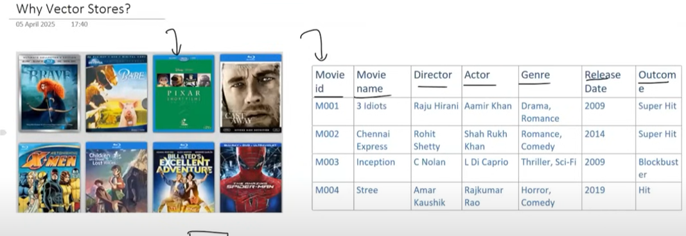

**Vector Stores**, a crucial component for **RAG (Retrieval Augmented Generation)** applications, by first illustrating their necessity through a real-world example and then delving into their features and implementation within the **LangChain** framework.

- **The "Why": Need for Vector Stores Illustrated with a Movie Recommender System**
  
  _ The initial problem presented is building a movie catalog website that evolves to include a movie recommendation system.
  _ A naive approach using **keyword matching** (comparing directors, actors, genres, release dates) is highlighted as flawed.
  _ **Limitation 1**: It can produce illogical recommendations (e.g., "My Name is Khan" and "Kabhi Alvida Naa Kehna" recommended together due to shared director/actor, despite different thematic content). This happens because **keyword matching** focuses on superficial attributes rather than the core meaning or plot.
  _ **Limitation 2**: It can fail to identify genuinely similar movies that lack common keywords (e.g., "Taare Zameen Par" and "A Beautiful Mind" share thematic similarities of a protagonist with a condition but also brilliance, but have different keywords).
  _ A better approach is to compare the **plot or story** of movies. This requires:
  _ Acquiring movie plot data.
  _ A system to compare the **semantic meaning** of these plots.
  _ **Embeddings** are introduced as the solution to represent the semantic meaning of text (movie plots) as numerical vectors. A **neural network** processes the text and outputs a vector (e.g., 512 or 784 dimensions) that captures the meaning.
  _ By converting all movie plots into **embedding vectors**, similarity can be determined by calculating the **angular distance** (e.g., using **cosine similarity**) between these vectors in a high-dimensional space. Vectors with smaller angular distances are more similar.
  _ **Challenges in Implementing an Embedding-Based Recommender System**:
  _ **Generating Embedding Vectors**: Processing a large number of movies to create embeddings.
  _ **Storage**: Storing these embedding vectors efficiently. Traditional relational databases (like MySQL, Oracle) are not suitable for storing embeddings in a way that allows for efficient similarity calculations.
  _ **Semantic Search**: Performing similarity searches (e.g., finding the top 5 similar movies to a given movie) across a vast number of vectors (e.g., 1 million) can be computationally expensive if done naively (comparing one by one). This necessitates an intelligent and fast search mechanism.
  
  _ **Vector Stores** are presented as the solution to these three challenges: generating (or rather, facilitating the use of) embeddings, storing them, and enabling efficient semantic search.

- **What is a Vector Store?**

  - A **Vector Store** is defined as a system designed to store and retrieve data represented as numerical vectors.
  - **Key Features of Vector Stores**:
    - **Storage**: Allows storing vectors and their associated **metadata** (e.g., movie ID, movie name). Offers options for in-memory (for quick lookups, volatile) or on-disk (for durability, large-scale use, persistent) storage.
    - **Similarity Search**: Enables retrieving vectors most similar to a query vector. This is the core function for tasks like recommendation or question-answering.
    - **Indexing**: Provides data structures or methods for fast similarity searches on high-dimensional vectors. This addresses the challenge of slow linear search.
      - An example technique discussed is using **clustering**:
        1.  Cluster all vectors (e.g., 1 million vectors into 10 clusters of 100,000 vectors each).
        2.  Calculate a **centroid vector** for each cluster.
        3.  When a query vector comes, compare it first with the 10 centroid vectors.
        4.  Identify the closest cluster (e.g., Cluster 3).
        5.  Perform the detailed similarity search only within the vectors of that chosen cluster (100,000 comparisons instead of 1 million).
      - This is a form of **Approximate Nearest Neighbor (ANN)** lookup, which trades perfect accuracy for significant speed gains.
    - **CRUD Operations**: Supports Create, Read, Update, and Delete operations for vectors, similar to traditional databases.

- **Use Cases for Vector Stores**:

  - Recommender Systems (as detailed in the example).
  - Semantic Search in any application dealing with vector similarity.
  - **RAG (Retrieval Augmented Generation)**: A primary focus, where vector stores are used to find relevant document chunks to augment LLM responses.
  - Image or Multimedia Search (by converting media into vector embeddings).

- **Vector Store vs. Vector Database**

  - These terms are often used interchangeably.
  - A **Vector Store** is typically a lightweight library or service focused on storing vectors and performing similarity searches. It might lack traditional database features like transactions, rich query languages (SQL-like), or role-based access control. Example: **FAISS** (Facebook AI Similarity Search). Ideal for prototyping and smaller-scale applications.
  - A **Vector Database** is a full-fledged database system designed to store and query vectors, offering additional features like:
    - Distributed architecture (for scalability).
    - Backup and restore capabilities.
    - ACID transactions (or near-ACID).
    - Concurrency control.
    - Authentication and authorization.
    - Examples: **Milvus, Quadrant, Weaviate, Pinecone**. Ideal for production environments with large datasets and scaling needs.
  - The key distinction: **A vector database is effectively a vector store with extra database-like features.** Therefore, every vector database is a vector store, but not every vector store is a vector database.

- **Vector Stores in LangChain**

  - LangChain recognized early the importance of embedding vectors for LLM applications, especially RAG.
  - It provides extensive support for various vector stores (**FAISS, Pinecone, Chroma, Quadrant, Weaviate**, etc.) through **wrapper components**.
  - A core design principle in LangChain is that these wrappers share **common method signatures** (e.g., `from_documents`, `from_texts`, `add_documents`, `add_texts`, `similarity_search`).
  - This common interface allows developers to easily switch between different vector store implementations (e.g., from FAISS to Pinecone) with minimal code changes.
  - Key common methods provided:
    - `from_documents` / `from_texts`: Create a vector store.
    - `add_documents` / `add_texts`: Add new vectors.
    - `similarity_search`: Conduct semantic search.
    - Metadata-based filtering.

- **Practical Example with ChromaDB in LangChain (using Google Colab)**

  - **ChromaDB** is described as a lightweight, open-source vector database, friendly for local development and small to medium-scale production. It sits somewhere between a simple vector store and a full-fledged vector database.
  - **ChromaDB Data Hierarchy**: Tenant (user/org/team) -> Database -> Collection (like a table in RDBMS) -> Documents (each with an embedding vector and metadata).
  - **Steps shown in the code example**:

    1.  **Installation**: `langchain-openai`, `langchain`, `chromadb`, etc.
    2.  **Imports**: `OpenAIEmbeddings` from `langchain_openai`, `Chroma` from `langchain.vectorstores`.

    ```python
    from langchain_openai import OpenAIEmbeddings
    from langchain.vectorstores import Chroma
    from langchain.schema import Document
    ```

    3.  **Document Preparation**: Creating LangChain `Document` objects. Each `Document` has `page_content` (the actual text) and `metadata` (e.g., IPL team for a cricketer).

    ```python
    # Create LangChain documents for IPL players
    doc1 = Document(
            page_content="Virat Kohli is one of the most successful and consistent batsmen in IPL history. Known for his aggressive batting style and fitness, he has led the Royal Challengers Bangalore in multiple seasons.",
            metadata={"team": "Royal Challengers Bangalore"}
        )
    doc2 = Document(
            page_content="Rohit Sharma is the most successful captain in IPL history, leading Mumbai Indians to five titles. He's known for his calm demeanor and ability to play big innings under pressure.",
            metadata={"team": "Mumbai Indians"}
        )
    doc3 = Document(
            page_content="MS Dhoni, famously known as Captain Cool, has led Chennai Super Kings to multiple IPL titles. His finishing skills, wicketkeeping, and leadership are legendary.",
            metadata={"team": "Chennai Super Kings"}
        )
    doc4 = Document(
            page_content="Jasprit Bumrah is considered one of the best fast bowlers in T20 cricket. Playing for Mumbai Indians, he is known for his yorkers and death-over expertise.",
            metadata={"team": "Mumbai Indians"}
        )
    doc5 = Document(
            page_content="Ravindra Jadeja is a dynamic all-rounder who contributes with both bat and ball. Representing Chennai Super Kings, his quick fielding and match-winning performances make him a key player.",
            metadata={"team": "Chennai Super Kings"}
        )

    docs = [doc1, doc2, doc3, doc4, doc5]
    ```

    4.  **Vector Store Creation/Initialization**:

    ```python
    vector_store = Chroma(
        embedding_function=OpenAIEmbeddings(),
        persist_directory='my_chroma_db',
        collection_name='sample'
    )
    ```

        * ChromaDB stores its data in a SQLite3 file locally when a `persist_directory` is specified.

    5.  **Adding Documents**:

    ```python
    # add documents
    vector_store.add_documents(docs)
    ```

    6.  **Viewing Documents**:

    ```python
    # view documents
    vector_store.get(include=['embeddings', 'documents', 'metadatas'])
    ```

    7.  **Similarity Search**:

    ```python
    # search documents
    vector_store.similarity_search(
        query='Who among these are a bowler?',
        k=2
    )

    # search with similarity score
    vector_store.similarity_search_with_score(
        query='Who among these are a bowler?',
        k=2
    )
    ```

    8.  **Filtering with Metadata**:

    ```python
    # meta-data filtering
    vector_store.similarity_search_with_score(
        query="",
        filter={"team": "Chennai Super Kings"}
    )
    ```

    9.  **Updating Documents**:

    ```python
    # update documents
    updated_doc1 = Document(
        page_content="Virat Kohli, the former captain of Royal Challengers Bangalore (RCB), is renowned for his aggressive leadership and consistent batting performances. He holds the record for the most runs in IPL history, including multiple centuries in a single season. Despite RCB not winning an IPL title under his captaincy, Kohli's passion and fitness set a benchmark for the league. His ability to chase targets and anchor innings has made him one of the most dependable players in T20 cricket.",
        metadata={"team": "Royal Challengers Bangalore"}
    )

    vector_store.update_document(document_id='09a39dc6-3ba6-4ea7-927e-fdda591da5e4', document=updated_doc1)

    # view documents after update
    vector_store.get(include=['embeddings','documents', 'metadatas'])
    ```

    10. **Deleting Documents**:

    ```python
    # delete document
    vector_store.delete(ids=['09a39dc6-3ba6-4ea7-927e-fdda591da5e4'])

    # view documents after deletion
    vector_store.get(include=['embeddings','documents', 'metadatas'])
    ```

**Stimulating Learning Prompts:**

1.  The material mentions **Approximate Nearest Neighbor (ANN)** search as a technique for speeding up similarity queries. What are the potential trade-offs of using ANN search compared to an exact nearest neighbor search in a RAG system?
2.  Given LangChain's common interface for vector stores, what factors would you consider when choosing a specific vector store (e.g., Chroma, FAISS, Pinecone, Weaviate) for a new project?
