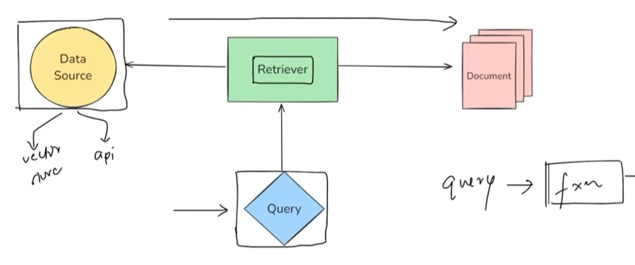

### Core Concepts of Retrievers in LangChain

- **Retrievers** are fundamental components in LangChain, especially crucial for building **Retrieval Augmented Generation (RAG)** based applications. They act as the fourth core component, following document loaders, text splitters, and vector stores, in the RAG pipeline.
- **Definition**: A **retriever** is a component designed to **fetch relevant documents** from a data source in response to a user's query.
   
  \* **Significance**: This is the core mechanism for providing context to Large Language Models (LLMs) in RAG systems, allowing them to generate answers based on specific, up-to-date, or proprietary information.
- **Functionality**: Conceptually, a retriever operates like a function that takes a user's query as input and outputs a list of **LangChain Document objects**.
  - **Significance**: This standardized input/output allows retrievers to be seamlessly integrated into larger LangChain workflows. The process involves searching a data source (like a vector store or an API) to identify and return documents that are most pertinent to the query.
- **Runnables**: A key characteristic of LangChain retrievers is that they are **Runnables**.
  - **Significance**: This means they can be easily incorporated into **chains** (sequences of calls to components) or have their `invoke` method called directly. This flexibility is vital for constructing complex RAG systems and enhancing modularity.
- **Variety**: LangChain offers multiple types of retrievers, each suited for different use cases and data sources.
  - **Significance**: This variety allows developers to choose the most effective retrieval strategy for their specific needs, optimizing for relevance, diversity, or efficiency.

---

### Types of Retrievers

Retrievers in LangChain can be broadly categorized based on two main aspects:

1.  **Data Source**: Different retrievers are designed to work with specific types of data sources.

    - **Examples**:
      - **Wikipedia Retriever**: Fetches articles from Wikipedia.
      - **Vector Store-based Retrievers**: Search for documents within a vector database (e.g., Chroma, FAISS).
      - **ArXiv Retriever**: Retrieves research papers from the ArXiv repository.
    - **Significance**: This categorization helps in selecting a retriever that can directly interface with the existing or chosen knowledge base.

2.  **Search Strategy/Mechanism**: Retrievers can also differ in the underlying algorithms or methods they use to find and rank relevant documents.
    - **Examples**:
      - **Maximum Marginal Relevance (MMR)**: Aims to retrieve documents that are not only relevant but also diverse, avoiding redundancy.
      - **Multi-Query Retriever**: Generates multiple variations of the user's query to capture different facets of the information need, then aggregates the results.
      - **Contextual Compression Retriever**: First retrieves documents and then compresses them by extracting only the parts relevant to the query.
    - **Significance**: The choice of search strategy directly impacts the quality, relevance, and diversity of the documents retrieved, which in turn affects the final output of the RAG system.

---

### In-Depth Look at Specific Retriever Types

#### 1. Retrievers Based on Data Source

- **Wikipedia Retriever**:
  - **Function**: Queries the Wikipedia API to fetch relevant content. It typically uses **keyword matching** to determine relevance.
  - **Usage**: Involves creating an instance of `WikipediaRetriever`, specifying parameters like `top_k_results` (number of documents to return) and `lang` (language). The `invoke` method is then used with the user's query.
  - **Key Distinction**: It's considered a retriever rather than just a document loader because it performs an internal search and relevance ranking based on the query, not just loading all available data.

```python
from langchain_community.retrievers import WikipediaRetriever

# Initialize the retriever (optional: set language and top_k)
retriever = WikipediaRetriever(top_k_results=2, lang="en")

# Define your query
query = "the geopolitical history of india and pakistan from the perspective of a chinese"

# Get relevant Wikipedia documents
docs = retriever.invoke(query)

# Print results
for i, doc in enumerate(docs):
    print(f"\n--- Result {i+1} ---")
    print(f"Title: {doc.metadata['title']}")
    print(f"Content:\n{doc.page_content[:200]}...")
```

Output:

```
--- Result 1 ---
Title: United States aid to Pakistan
Content: The United States had been providing military aid and economic assistance to Pakistan...

--- Result 2 ---
Title: Foreign relations of Pakistan
Content: The Islamic Republic of Pakistan emerged as an independent country...
```

- **Vector Store Retriever**:
  - **Function**: This is the most common type. It searches and fetches documents from a **vector store** (like Chroma or FAISS) based on **semantic similarity** using **vector embeddings**.
  - **Process**:

```python
from langchain_community.vectorstores import Chroma
from langchain_openai import OpenAIEmbeddings
from langchain_core.documents import Document

# Step 1: Your source documents
documents = [
    Document(page_content="LangChain helps developers build LLM applications easily."),
    Document(page_content="Chroma is a vector database optimized for LLM-based search."),
    Document(page_content="Embeddings convert text into high-dimensional vectors."),
    Document(page_content="OpenAI provides powerful embedding models."),
]

# Step 2: Initialize embedding model
embedding_model = OpenAIEmbeddings()

# Step 3: Create Chroma vector store in memory
vectorstore = Chroma.from_documents(
    documents=documents,
    embedding=embedding_model,
    collection_name="my_collection"
)

# Step 4: Convert vectorstore into a retriever
retriever = vectorstore.as_retriever(search_kwargs={"k": 2})

query = "What is Chroma used for?"
results = retriever.invoke(query)

for i, doc in enumerate(results):
    print(f"\n--- Result {i+1} ---")
    print(doc.page_content)
```

Output:

```
--- Result 1 ---
Chroma is a vector database optimized for LLM-based search.
--- Result 2 ---
LangChain helps developers build LLM applications easily.
```

        1.  Documents are stored in a vector store, and each is converted into a dense vector (embedding) using an embedding model.
        2.  A user's query is also converted into a vector.
        3.  The retriever compares the query vector with the document vectors in the store to find the most similar (relevant) documents.
    * **Usage**: Created from an existing vector store object using the `.as_retriever()` method. It can be configured with parameters like `k` (number of results to return).
    * **Rationale for use over direct vector store search**: While vector stores offer direct similarity search, using a **Vector Store Retriever** provides two main benefits:
        1.  It's a **Runnable** object, making it easy to integrate into LangChain chains.
        2.  It allows for the application of more **advanced search strategies** beyond basic similarity search, by combining it with other retriever types or configurations.

#### 2. Retrievers Based on Search Strategy

- **Maximum Marginal Relevance (MMR) Retriever**:
  - **Problem Solved**: Standard similarity search can return multiple documents that are highly relevant but also very similar to each other (redundant).
  - **Core Philosophy**: MMR aims to select results that are not only **relevant** to the query but also **different from each other**, thus providing diverse perspectives.
  - **Mechanism**: It first picks the most relevant document. Then, for subsequent selections, it picks documents that are relevant to the query but also maximally dissimilar to the documents already selected.
  - **Usage**: Implemented by setting the `search_type` parameter to `"mmr"` when calling `.as_retriever()` on a vector store. A `lambda_mult` parameter (0 to 1) controls the trade-off: 1 behaves like standard similarity search, while 0 emphasizes diversity. \* **Significance**: Useful when a broader understanding or a variety of viewpoints on a topic is needed from the retrieved documents.

```python
# Sample documents for MMR example
docs = [
    Document(page_content="LangChain makes it easy to work with LLMs."),
    Document(page_content="LangChain is used to build LLM based applications."),
    Document(page_content="Chroma is used to store and search document embeddings."),
    Document(page_content="Embeddings are vector representations of text."),
    Document(page_content="MMR helps you get diverse results when doing similarity search."),
    Document(page_content="LangChain supports Chroma, FAISS, Pinecone, and more."),
]

from langchain_community.vectorstores import FAISS
# Initialize OpenAI embeddings and create vector store
embedding_model = OpenAIEmbeddings()
vectorstore = FAISS.from_documents(documents=docs, embedding=embedding_model)

# Enable MMR in the retriever
retriever = vectorstore.as_retriever(
    search_type="mmr", # <-- This enables MMR
    search_kwargs={"k": 3, "lambda_mult": 0.5} # k = top results, lambda_mult = relevance-diversity balance
)

query = "What is langchain?"
results = retriever.invoke(query)

for i, doc in enumerate(results):
    print(f"\n--- Result {i+1} ---")
    print(doc.page_content)
```

Output:

```
--- Result 1 ---
LangChain is used to build LLM based applications.
--- Result 2 ---
Embeddings are vector representations of text.
--- Result 3 ---
LangChain supports Chroma, FAISS, Pinecone, and more.
```

- **Multi-Query Retriever**:
  - **Problem Solved**: User queries can sometimes be **ambiguous** or too broad, leading to suboptimal retrieval.
  - **Mechanism**:
    1.  The user's original query is passed to an **LLM**.
    2.  The LLM generates **multiple different versions (perspectives)** of that query, aiming to cover various interpretations or sub-topics.
    3.  Each generated query is then run against a base retriever (e.g., a standard vector store retriever).
    4.  The results from all these queries are collected, duplicates are removed, and the top N documents are returned.
  - **Usage**: Created using `MultiQueryRetriever.from_llm()`, providing an LLM for query generation and a base retriever for fetching documents. \* **Significance**: Helps in disambiguating queries and improving the chances of retrieving truly relevant documents by exploring multiple angles of the initial query.

```python
from langchain_community.vectorstores import FAISS
from langchain_openai import OpenAIEmbeddings, ChatOpenAI
from langchain_core.documents import Document
from langchain.retrievers.multi_query import MultiQueryRetriever

# Sample documents
all_docs = [
    Document(page_content="Regular walking boosts heart health and can reduce symptoms of depression.", metadata={"source": "H1"}),
    Document(page_content="Consuming leafy greens and fruits helps detox the body and improve longevity.", metadata={"source": "H2"}),
    Document(page_content="Deep sleep is crucial for cellular repair and emotional regulation.", metadata={"source": "H3"}),
    Document(page_content="Mindfulness and controlled breathing lower cortisol and improve mental clarity.", metadata={"source": "H4"}),
    Document(page_content="Drinking sufficient water throughout the day helps maintain metabolism and energy.", metadata={"source": "H5"}),
]

# Initialize embeddings and create vector store
embedding_model = OpenAIEmbeddings()
vectorstore = FAISS.from_documents(documents=all_docs, embedding=embedding_model)

# Create retrievers for comparison
similarity_retriever = vectorstore.as_retriever(search_type="similarity", search_kwargs={"k": 3})
multiquery_retriever = MultiQueryRetriever.from_llm(
    retriever=vectorstore.as_retriever(search_kwargs={"k": 3}),
    llm=ChatOpenAI(model="gpt-3.5-turbo")
)

query = "How to improve energy levels and maintain balance?"
similarity_results = similarity_retriever.invoke(query)
multiquery_results = multiquery_retriever.invoke(query)

print("Standard Similarity Search Results:")
for i, doc in enumerate(similarity_results):
    print(f"\n--- Result {i+1} ---")
    print(doc.page_content)

print("\nMulti-Query Search Results:")
for i, doc in enumerate(multiquery_results):
    print(f"\n--- Result {i+1} ---")
    print(doc.page_content)
```

Output:

```
Standard Similarity Search Results:
--- Result 1 ---
Drinking sufficient water throughout the day helps maintain metabolism and energy.
--- Result 2 ---
Mindfulness and controlled breathing lower cortisol and improve mental clarity.
--- Result 3 ---
Regular walking boosts heart health and can reduce symptoms of depression.

Multi-Query Search Results:
--- Result 1 ---
Drinking sufficient water throughout the day helps maintain metabolism and energy.
--- Result 2 ---
Deep sleep is crucial for cellular repair and emotional regulation.
--- Result 3 ---
Consuming leafy greens and fruits helps detox the body and improve longevity.
```

- **Contextual Compression Retriever**:
  - **Problem Solved**: Retrieved documents might be lengthy and contain a mix of relevant and irrelevant information. Passing entire large documents to an LLM can be inefficient and might dilute the relevant context.
  - **Mechanism**:
    1.  A **base retriever** first fetches a set of documents.
    2.  A **compressor** (typically an LLM) then processes each retrieved document in the context of the original user query.
    3.  The compressor extracts and retains only the parts of each document that are directly relevant to the query, discarding the rest.
  - **Usage**: Involves a `base_retriever` and a `base_compressor` (e.g., `LLMChainExtractor`). The `ContextualCompressionRetriever` orchestrates this two-step process.
  - **When to Use**:
    - When documents are long and may contain mixed information.
    - To reduce the amount of text passed to the LLM, potentially saving costs and staying within context length limits.
    - To improve the accuracy of the RAG pipeline by providing more focused context. \* **Significance**: Enhances the quality of context provided to the LLM by filtering out noise and focusing on the most pertinent information within retrieved documents.

```python
from langchain_community.vectorstores import FAISS
from langchain_openai import OpenAIEmbeddings, ChatOpenAI
from langchain.retrievers.contextual_compression import ContextualCompressionRetriever
from langchain.retrievers.document_compressors import LLMChainExtractor
from langchain_core.documents import Document

# Sample documents with mixed content
docs = [
    Document(page_content=(
        """The Grand Canyon is one of the most visited natural wonders in the world.
        Photosynthesis is the process by which green plants convert sunlight into energy.
        Millions of tourists travel to see it every year."""
    ), metadata={"source": "Doc1"}),
    Document(page_content=(
        """In medieval Europe, castles were built primarily for defense.
        The chlorophyll in plant cells captures sunlight during photosynthesis.
        Knights wore armor made of metal."""
    ), metadata={"source": "Doc2"})
]

# Create vector store and base retriever
embedding_model = OpenAIEmbeddings()
vectorstore = FAISS.from_documents(docs, embedding_model)
base_retriever = vectorstore.as_retriever(search_kwargs={"k": 2})

# Set up the compression retriever
llm = ChatOpenAI(model="gpt-3.5-turbo")
compressor = LLMChainExtractor.from_llm(llm)
compression_retriever = ContextualCompressionRetriever(
    base_retriever=base_retriever,
    base_compressor=compressor
)

# Query about photosynthesis
query = "What is photosynthesis?"
compressed_results = compression_retriever.invoke(query)

for i, doc in enumerate(compressed_results):
    print(f"\n--- Result {i+1} ---")
    print(doc.page_content)
```

Output:

```
--- Result 1 ---
Photosynthesis is the process by which green plants convert sunlight into energy.
--- Result 2 ---
The chlorophyll in plant cells captures sunlight during photosynthesis.
```

---

### Importance and Broader Context of Retrievers

- **Beyond the Basics**: The material mentions several other advanced retrievers like **Parent Document Retriever**, **Time-Weighted Vector Retriever**, **Self-Query Retriever**, **Ensemble Retriever**, and **Multi-Retriever**. This indicates a rich ecosystem for fine-tuning retrieval logic.
- **Improving RAG Performance**: The primary motivation for the existence of diverse and advanced retrievers is to **enhance the performance of RAG systems**. When basic retrieval methods yield suboptimal results, developers can experiment with these more sophisticated retrievers to improve relevance, reduce redundancy, handle ambiguity, or manage large documents more effectively.
- **Advanced RAG**: The concept of "Advanced RAG" often involves leveraging these specialized retrievers to build more robust and accurate question-answering or content generation systems.

---

### Stimulating Learning Prompts

1.  How might the choice of an **embedding model** influence the effectiveness of a **Vector Store Retriever**, and in what scenarios might one type of embedding model be preferred over another for retrieval tasks?
2.  Considering the **Multi-Query Retriever** and the **MMR Retriever**, how could their strengths be combined or used in sequence to potentially achieve even better retrieval results for complex, multifaceted queries?

---

### Code Examples and Implementation

#### Setup and Configuration

```python
import os
 

!pip install langchain chromadb faiss-cpu openai tiktoken langchain_openai langchain-community wikipedia
```

#### Wikipedia Retriever Example

```python
from langchain_community.retrievers import WikipediaRetriever

# Initialize the retriever (optional: set language and top_k)
retriever = WikipediaRetriever(top_k_results=2, lang="en")

# Define your query
query = "the geopolitical history of india and pakistan from the perspective of a chinese"

# Get relevant Wikipedia documents
docs = retriever.invoke(query)

docs
```

Output:

```
[Document(metadata={'title': 'United States aid to Pakistan', 'summary': 'The United States had been providing military aid and economic assistance to Pakistan...'}, page_content="The United States had been providing military aid and economic assistance to Pakistan..."),
Document(metadata={'title': 'Foreign relations of Pakistan', 'summary': "The Islamic Republic of Pakistan emerged as an independent country through the partition of India..."}, page_content='The Islamic Republic of Pakistan emerged as an independent country...')]

# Print retrieved content
for i, doc in enumerate(docs):
    print(f"\n--- Result {i+1} ---")
    print(f"Content:\n{doc.page_content}...") # truncate for display
```

#### Vector Store Retriever Example

```python
from langchain_community.vectorstores import Chroma
from langchain_openai import OpenAIEmbeddings
from langchain_core.documents import Document

# Step 1: Your source documents
documents = [
    Document(page_content="LangChain helps developers build LLM applications easily."),
    Document(page_content="Chroma is a vector database optimized for LLM-based search."),
    Document(page_content="Embeddings convert text into high-dimensional vectors."),
    Document(page_content="OpenAI provides powerful embedding models."),
]

# Step 2: Initialize embedding model
embedding_model = OpenAIEmbeddings()

# Step 3: Create Chroma vector store in memory
vectorstore = Chroma.from_documents(
    documents=documents,
    embedding=embedding_model,
    collection_name="my_collection"
)

# Step 4: Convert vectorstore into a retriever
retriever = vectorstore.as_retriever(search_kwargs={"k": 2})

query = "What is Chroma used for?"
results = retriever.invoke(query)

for i, doc in enumerate(results):
    print(f"\n--- Result {i+1} ---")
    print(doc.page_content)
```

Output:

```
--- Result 1 ---
Chroma is a vector database optimized for LLM-based search.
--- Result 2 ---
LangChain helps developers build LLM applications easily.
```

#### Maximum Marginal Relevance (MMR) Example

```python
# Sample documents
docs = [
    Document(page_content="LangChain makes it easy to work with LLMs."),
    Document(page_content="LangChain is used to build LLM based applications."),
    Document(page_content="Chroma is used to store and search document embeddings."),
    Document(page_content="Embeddings are vector representations of text."),
    Document(page_content="MMR helps you get diverse results when doing similarity search."),
    Document(page_content="LangChain supports Chroma, FAISS, Pinecone, and more."),
]

from langchain_community.vectorstores import FAISS
# Initialize OpenAI embeddings
embedding_model = OpenAIEmbeddings()

# Step 2: Create the FAISS vector store from documents
vectorstore = FAISS.from_documents(
    documents=docs,
    embedding=embedding_model
)

# Enable MMR in the retriever
retriever = vectorstore.as_retriever(
    search_type="mmr", # <-- This enables MMR
    search_kwargs={"k": 3, "lambda_mult": 0.5} # k = top results, lambda_mult = relevance-diversity balance
)

query = "What is langchain?"
results = retriever.invoke(query)

for i, doc in enumerate(results):
    print(f"\n--- Result {i+1} ---")
    print(doc.page_content)
```

Output:

```
--- Result 1 ---
LangChain is used to build LLM based applications.
--- Result 2 ---
Embeddings are vector representations of text.
--- Result 3 ---
LangChain supports Chroma, FAISS, Pinecone, and more.
```

#### Multi-Query Retriever Example

```python
from langchain_community.vectorstores import FAISS
from langchain_openai import OpenAIEmbeddings
from langchain_core.documents import Document
from langchain_openai import ChatOpenAI
from langchain.retrievers.multi_query import MultiQueryRetriever

# Relevant health & wellness documents
all_docs = [
    Document(page_content="Regular walking boosts heart health and can reduce symptoms of depression.", metadata={"source": "H1"}),
    Document(page_content="Consuming leafy greens and fruits helps detox the body and improve longevity.", metadata={"source": "H2"}),
    Document(page_content="Deep sleep is crucial for cellular repair and emotional regulation.", metadata={"source": "H3"}),
    Document(page_content="Mindfulness and controlled breathing lower cortisol and improve mental clarity.", metadata={"source": "H4"}),
    Document(page_content="Drinking sufficient water throughout the day helps maintain metabolism and energy.", metadata={"source": "H5"}),
    Document(page_content="The solar energy system in modern homes helps balance electricity demand.", metadata={"source": "I1"}),
    Document(page_content="Python balances readability with power, making it a popular system design language.", metadata={"source": "I2"}),
    Document(page_content="Photosynthesis enables plants to produce energy by converting sunlight.", metadata={"source": "I3"}),
    Document(page_content="The 2022 FIFA World Cup was held in Qatar and drew global energy and excitement.", metadata={"source": "I4"}),
    Document(page_content="Black holes bend spacetime and store immense gravitational energy.", metadata={"source": "I5"}),
]

# Initialize OpenAI embeddings
embedding_model = OpenAIEmbeddings()
# Create FAISS vector store
vectorstore = FAISS.from_documents(documents=all_docs, embedding=embedding_model)

# Create retrievers
similarity_retriever = vectorstore.as_retriever(search_type="similarity", search_kwargs={"k": 5})
multiquery_retriever = MultiQueryRetriever.from_llm(
    retriever=vectorstore.as_retriever(search_kwargs={"k": 5}),
    llm=ChatOpenAI(model="gpt-3.5-turbo")
)

# Query
query = "How to improve energy levels and maintain balance?"
# Retrieve results
similarity_results = similarity_retriever.invoke(query)
multiquery_results= multiquery_retriever.invoke(query)

for i, doc in enumerate(similarity_results):
    print(f"\n--- Result {i+1} ---")
    print(doc.page_content)
print("*"*150)
for i, doc in enumerate(multiquery_results):
    print(f"\n--- Result {i+1} ---")
    print(doc.page_content)
```

Output:

```
--- Result 1 ---
Drinking sufficient water throughout the day helps maintain metabolism and energy.
--- Result 2 ---
Mindfulness and controlled breathing lower cortisol and improve mental clarity.
--- Result 3 ---
Regular walking boosts heart health and can reduce symptoms of depression.
--- Result 4 ---
Deep sleep is crucial for cellular repair and emotional regulation.
--- Result 5 ---
The solar energy system in modern homes helps balance electricity demand.
******************************************************************************************************************************************************
--- Result 1 ---
Drinking sufficient water throughout the day helps maintain metabolism and energy.
--- Result 2 ---
Mindfulness and controlled breathing lower cortisol and improve mental clarity.
--- Result 3 ---
Regular walking boosts heart health and can reduce symptoms of depression.
--- Result 4 ---
Consuming leafy greens and fruits helps detox the body and improve longevity.
--- Result 5 ---
Deep sleep is crucial for cellular repair and emotional regulation.
```

#### Contextual Compression Retriever Example

```python
from langchain_community.vectorstores import FAISS
from langchain_openai import OpenAIEmbeddings, ChatOpenAI
from langchain.retrievers.contextual_compression import ContextualCompressionRetriever
from langchain.retrievers.document_compressors import LLMChainExtractor
from langchain_core.documents import Document

# Recreate the document objects from the previous data
docs = [
    Document(page_content=(
        """The Grand Canyon is one of the most visited natural wonders in the world.
        Photosynthesis is the process by which green plants convert sunlight into energy.
        Millions of tourists travel to see it every year. The rocks date back millions of years."""
    ), metadata={"source": "Doc1"}),
    Document(page_content=(
        """In medieval Europe, castles were built primarily for defense.
        The chlorophyll in plant cells captures sunlight during photosynthesis.
        Knights wore armor made of metal. Siege weapons were often used to breach castle walls."""
    ), metadata={"source": "Doc2"}),
    Document(page_content=(
        """Basketball was invented by Dr. James Naismith in the late 19th century.
        It was originally played with a soccer ball and peach baskets. NBA is now a global league."""
    ), metadata={"source": "Doc3"}),
    Document(page_content=(
        """The history of cinema began in the late 1800s. Silent films were the earliest form.
        Thomas Edison was among the pioneers. Photosynthesis does not occur in animal cells.
        Modern filmmaking involves complex CGI and sound design."""
    ), metadata={"source": "Doc4"})
]

# Create a FAISS vector store from the documents
embedding_model = OpenAIEmbeddings()
vectorstore = FAISS.from_documents(docs, embedding_model)

base_retriever = vectorstore.as_retriever(search_kwargs={"k": 5})

# Set up the compressor using an LLM
llm = ChatOpenAI(model="gpt-3.5-turbo")
compressor = LLMChainExtractor.from_llm(llm)

# Create the contextual compression retriever
compression_retriever = ContextualCompressionRetriever(
    base_retriever=base_retriever,
    base_compressor=compressor
)

# Query the retriever
query = "What is photosynthesis?"
compressed_results = compression_retriever.invoke(query)

for i, doc in enumerate(compressed_results):
    print(f"\n--- Result {i+1} ---")
    print(doc.page_content)
```

Output:

```
--- Result 1 ---
Photosynthesis is the process by which green plants convert sunlight into energy.
--- Result 2 ---
The chlorophyll in plant cells captures sunlight during photosynthesis.
```
