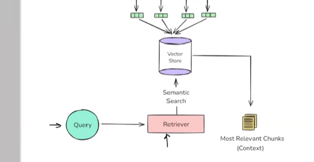

**Retrieval Augmented Generation (RAG)** as a crucial and highly utilized application in the current wave of generative AI. The content aims to provide a theoretical and conceptual understanding of RAG, including its historical context and the problems it addresses.

* **Foundational Components for RAG**:
    * The material recaps four essential components, previously discussed, that form the building blocks of RAG:
        * **Document Loaders**: Utilities to load data from various sources. Their significance lies in their ability to ingest information into the system.
        * **Text Splitters**: Tools to segment large texts into smaller, manageable **chunks**. This is important for processing and for fitting information within the context windows of LLMs.
        * **Vector Stores**: Databases designed to store text converted into **embeddings** (numerical representations). These are crucial for enabling efficient similarity searches.
        * **Retrievers**: Mechanisms that perform **semantic search** within vector stores to find relevant information. Their role is to fetch the most pertinent data based on a query.
    * Understanding these components is presented as a prerequisite to grasping RAG.

* **The "Why" Behind RAG – Addressing LLM Limitations**:
    * **Large Language Models (LLMs)** are described as powerful tools, typically transformer-based neural networks with numerous **parameters** (weights and biases). They are **pre-trained** on vast amounts of data, storing this knowledge within their parameters, referred to as **parametric knowledge**. Users access this knowledge via **prompting**.  
    * Despite their capabilities, LLMs face limitations:
        * **Private Data**: LLMs cannot answer questions about private or proprietary data not included in their pre-training datasets (e.g., specific content within a company's internal videos).
        * **Knowledge Cutoff**: LLMs have a **knowledge cutoff date**, meaning they lack information about events or data that emerged after their last pre-training. This makes them unsuitable for queries requiring real-time or very recent information. (Note: Some commercial models like ChatGPT might have internet Browse capabilities, but this is not inherent to all LLMs, especially open-source ones).
        * **Hallucination**: LLMs can generate factually incorrect information with high confidence. This probabilistic nature can lead to made-up "facts" being presented as truth.
    * **Initial Attempt to Solve Limitations: Fine-Tuning**:
        * **Fine-tuning** is introduced as a technique to adapt a pre-trained LLM by further training it on a smaller, domain-specific dataset. The goal is to imbue the LLM with specialized knowledge.
        * **Analogy**: An engineering graduate (pre-trained LLM) undergoing company-specific training (fine-tuning) to become job-ready.
        * **Types of Fine-Tuning**:
            * **Supervised Fine-Tuning**: Training with labeled data, often in a "prompt" and "desired output" format.
            * **Continued Pre-training**: An unsupervised method involving further training on domain-specific unlabeled text, essentially extending the pre-training process.
            * Other techniques mentioned: **RLHF (Reinforcement Learning from Human Feedback)**, **LoRA (Low-Rank Adaptation)**, and **QLoRA**.
        * **Fine-Tuning Process**: Typically involves (1) Data Collection (labeled, domain-specific), (2) Method Selection (e.g., full parameter vs. parameter-efficient like LoRA), (3) Training (for a few epochs), and (4) Evaluation (assessing quality, factuality, hallucination rate).
        * **How Fine-Tuning Addresses LLM Limitations**:
            * Private Data: By training on private data, it becomes part of the LLM's parametric knowledge.
            * Recent Data: Can be addressed by repeatedly fine-tuning with updated domain-specific information, though this can be frequent.
            * Hallucination: Can be reduced by including examples in the training data that instruct the LLM to admit ignorance for tricky or out-of-scope questions.
        * **Problems with Fine-Tuning**:
            * **Computationally Expensive**: Training large models incurs significant costs.
            * **Requires Technical Expertise**: Not a straightforward process for everyone; needs AI engineers/data scientists.
            * **Frequent Updates are Problematic**: Constant re-training is needed for rapidly changing information, which is costly and complex, especially for removing outdated information.
    * **Alternative Solution: In-Context Learning (ICL)**:
        * **In-Context Learning** is defined as a core capability of large LLMs (e.g., GPT-3, Claude, Llama) where the model learns to perform a task based purely on examples provided within the **prompt**, without any updates to its weights (parametric knowledge).
        * This is often achieved through ** फ्यू-शॉर्ट प्रॉम्टिंग (few-shot prompting)**[link](https://arxiv.org/pdf/2005.14165.pdf), where a few examples of input-output pairs are given in the prompt to guide the model.
        * **Emergent Property**: ICL is described as an **emergent property** – a behavior that appears in a system when it reaches a certain scale or complexity, even if not explicitly programmed. This capability was notably observed with the advent of larger models like **GPT-3** (175 billion parameters) and was highlighted in the paper "Language Models are Few-Shot Learners." Earlier, smaller models (like GPT-1, GPT-2) did not exhibit strong ICL.
        * Alignment techniques (like supervised fine-tuning and RLHF) were later used to enhance this property in models like GPT-3.5 and GPT-4.
    * **From In-Context Learning to RAG**:
        * The idea is to enhance ICL by providing not just examples, but the actual **context** needed to answer a query directly within the prompt.
        * Example: For a chatbot answering questions about a long video lecture, instead of sending the whole transcript (which might exceed context limits), one would send the user's question along with the specific segment of the transcript relevant to that question. 

        * This precise concept is **RAG (Retrieval Augmented Generation)**: making an LLM smarter by providing extra, relevant information (context) at the time of the query.

* **The "How" of RAG – System Architecture**:
    * RAG combines **Information Retrieval** (an established field) and **Text Generation** (popularized by LLMs).
    * The RAG process is broadly divided into four steps:
    
        1.  **Indexing**:
            * The process of preparing an **external knowledge base** so it can be efficiently searched. This knowledge base is the source of the **context**.
            * **Sub-steps in Indexing**:
                * **Document Ingestion/Loading**: Fetching source knowledge (e.g., from servers, Google Drive, AWS S3) into memory using **document loaders**. The data is often loaded as a string.
                * **Text Chinking/Splitting**: Breaking down large documents into smaller, semantically meaningful **chunks**. This is done because LLMs have context length limitations and semantic search performs better on smaller, focused pieces of text. **Text splitters** (e.g., Recursive Character Text Splitter, Semantic Chunker) are used.
                
                * **Embedding Generation**: Converting each text chunk into a dense vector (**embedding**) that captures its semantic meaning. This is done using an **embedding model** (e.g., OpenAI embeddings, Sentence Transformers). Embeddings are crucial for semantic search.
                * **Storing in a Vector Store**: Saving these embedding vectors, along with the original text chunks and any metadata, in a **vector database/store** (e.g., FAISS, Chroma for local; Pinecone, Weaviate, Milvus, Qdrant for cloud). This vector store becomes the searchable external knowledge base.
        2.  **Retrieval**:
            * The real-time process of finding the most relevant pieces of information (chunks) from the pre-built index (vector store) based on the user's query.
            
            * **Sub-steps in Retrieval**:
                * **Query Embedding**: The user's query is converted into an embedding vector using the *same embedding model* used during indexing.
                * **Semantic Search**: The query vector is compared against the vectors in the vector store to find the closest (most semantically similar) chunk vectors. Various search techniques can be used (simple similarity, MMR, contextual compression).
                * **Ranking**: The retrieved relevant vectors/chunks are ranked based on similarity (e.g., using cosine similarity) or more advanced **re-ranking algorithms**.
                * **Fetching Top Results**: The text chunks corresponding to the top-ranked N vectors are fetched. These chunks form the **context**.
        3.  **Augmentation**:
        
            * The user's original query and the retrieved **context** are combined to create a comprehensive **prompt**.
            * This prompt typically instructs the LLM to answer the query based *only* on the provided context and to state "I don't know" if the context is insufficient, which helps mitigate hallucination.
        4.  **Generation**:
        
            * The augmented prompt (containing the query and context) is sent to an **LLM**.
            * The LLM uses its text generation capabilities and the provided context (leveraging in-context learning) along with its own parametric knowledge to generate a response to the query.

* **How RAG Solves LLM Limitations and its Advantages**:
    * **Private Data**: RAG directly addresses this by making private data searchable and retrievable as context. The external knowledge base is built from this private data.
    * **Recent Data/Knowledge Cutoff**: This is handled by regularly updating the external knowledge base (vector store) with new documents/information. This is significantly cheaper and simpler than re-training/fine-tuning an LLM, as only new embeddings need to be generated and stored.
    * **Hallucination**: RAG reduces hallucination by "grounding" the LLM's response to the provided context. The prompt explicitly instructs the LLM to use only this context.
    * **Advantages over Fine-Tuning**:
        * **Cheaper**: Avoids the high computational costs of model training. Updating the vector store is less expensive.
        * **Simpler**: Less complex than fine-tuning, as it doesn't involve model training intricacies. No labeled dataset in the "prompt-completion" format is strictly required for the external data.

* The material concludes by stating that a practical implementation of a RAG-based system using LangChain will be covered in the next video.

**Stimulating Learning Prompts**:
1.  Considering the described RAG pipeline, what are potential failure points or challenges that might arise in a production RAG system?
2.  How might the quality of the **embedding model** chosen impact the overall performance of a RAG system, particularly in the **Retrieval** step?

[End of Notes]