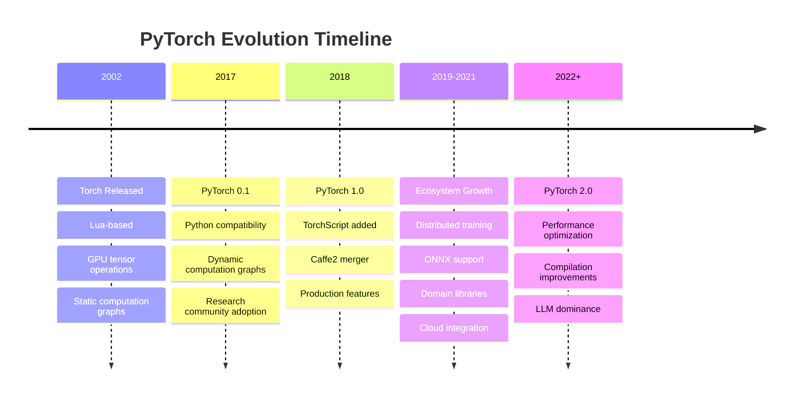
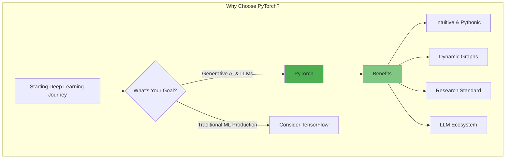

# 1. High-Level Synthesis

**The Core Essence**: The material introduces PyTorch as the de facto deep learning library for building LLM applications, presenting it as an essential stepping stone before diving into generative AI. The content traces PyTorch's evolution from its origins in Torch (2002) to becoming the most popular deep learning framework, particularly after the generative AI boom. The presenter emphasizes that PyTorch has become critical for anyone targeting generative AI engineering roles.

**Key Objectives & Outcomes**:
1. **Understand PyTorch's unique position** in the deep learning ecosystem as the preferred framework for research, experimentation, and increasingly, production deployments
2. **Master the evolutionary journey** from Torch to PyTorch, understanding how key features like dynamic computation graphs revolutionized deep learning development
3. **Make an informed choice** between PyTorch and TensorFlow based on comprehensive comparison and current industry trends

# 2. Detailed Analysis & Core Concepts

## The Context: Why PyTorch Now?

The presenter begins by establishing the current AI landscape: "अभी हमारे चारों तरफ AI का एक boom आया हुआ है" (There's an AI boom all around us). This boom is primarily driven by generative AI technology. The material highlights:

- Massive startup funding in generative AI
- New job openings for generative AI engineers
- PyTorch becoming the foundation for LLM applications

The presenter's mission: Over the next 6-8 months, create extensive generative AI content, starting with PyTorch as the essential foundation.

## What is PyTorch?

**Simple Definition**: "PyTorch is an open-source, Python-based deep learning library जिसको use करके आप बहुत powerful neural network applications बना सकते हो" (using which you can build very powerful neural network applications).

## The Origin Story: From Torch to PyTorch

### Torch (2002)
The journey begins with **Torch**, a powerful scientific computing framework that emerged in 2002. Key features:
- **Tensor-based operations** (multi-dimensional array computations)
- **GPU acceleration** for tensor operations
- Originally intended for scientific computing

Deep learning researchers realized: "अगर हम GPU पे tensor-based operations चला सकते हैं, it means we can use this framework to build deep learning applications as well."

### Two Major Problems with Torch

**Problem 1: Lua Programming Language**
- Torch was entirely written in Lua
- Required learning Lua before using Torch
- Created friction: "If you are a beginner और आपको Torch इस्तेमाल करना है तो आपको पहले Lua सीखना पड़ेगा"

**Problem 2: Static Computation Graphs**
- Once model is built, computation graph is fixed
- Cannot be modified at runtime
- Limited flexibility for experimentation and debugging

### The Birth of PyTorch (2017)

Meta AI (then Facebook AI) researchers identified these problems and proposed a solution:
- **Merge Torch's powerful capabilities with Python's simplicity**
- "PyTorch is the product of the marriage between Torch and Python"
- Torch की सारी powerful capabilities + Python की simplicity और ecosystem


## PyTorch Evolution Timeline

### Version 0.1 (2017) - The Foundation

**Two Core Features**:

1. **Python Compatibility**
   - Not just coding in Python, but compatibility with entire Python ecosystem
   - Works seamlessly with NumPy, SciPy, and other libraries
   - "आप existing workflow में PyTorch को घुसा सकते हो" (You can integrate PyTorch into existing workflows)

2. **Dynamic Computation Graphs**
   - Revolutionary feature that differentiated PyTorch
   - Graphs can be modified at runtime
   - Enabled easy experimentation and debugging

### Understanding Computation Graphs

The material provides an excellent analogy:

**Static Computation Graph** (Used by TensorFlow 1.x, Torch):
- Like a government agency planning roads
- Create a map/blueprint first
- Once finalized, road must follow exact blueprint
- Cannot adapt if obstacles (like a temple) are discovered

**Dynamic Computation Graph** (PyTorch's innovation):
- Road plan can be modified during construction
- If temple found, route can be adjusted
- "On the go आपको flexibility रहती है" (You have flexibility on the go)

```mermaid
graph LR
    subgraph "Mathematical Expression"
        A[a] --> P1[+]
        B[b] --> P1
        P1 --> M[×]
        C[c] --> M
        M --> R[Result: (a+b)×c]
    end
```

### Impact of Version 0.1
- Researchers loved it for experimentation
- PhD students adopted it widely
- Most research papers started using PyTorch code
- "Early on PyTorch के जो सबसे पहले users थे वो mostly researchers थे"

### Version 1.0 (2018) - Bridging Research and Production

**Goal**: "Bridge the gap between research and production environments"

**Major Additions**:

1. **TorchScript**
   - Model serialization and optimization
   - Run models without Python dependency
   - Deploy anywhere, even without PyTorch installed

2. **Caffe2 Merger**
   - Caffe2 was specialized for production deployment
   - High-performance, scalable deep learning
   - Merger made PyTorch strong in both research AND production

### Subsequent Versions - Ecosystem Growth

**Key Additions**:

1. **Distributed Training Support**
   - Train on multiple machines and GPUs
   - Essential for large datasets

2. **ONNX Support**
   - Open Neural Network Exchange format
   - Interoperability between frameworks
   - "PyTorch में trained model को आप किसी और library में use कर सकते हो"

3. **Quantization**
   - Compress models by reducing precision
   - Example: Float32 (32 bits) → Int8 (8 bits)
   - Reduces model size by ~75%
   - Essential for mobile deployment

4. **Domain-Specific Libraries**:
   - **TorchVision**: Computer vision (datasets, models, transforms)
   - **TorchText**: NLP tasks
   - **TorchAudio**: Audio processing

### Community Growth Impact

**Community Libraries**:
- **PyTorch Lightning**: High-level API (like Keras for TensorFlow)
- **Hugging Face Transformers**: Built on PyTorch, became the go-to for transformers
- **Cloud Provider Support**: Native PyTorch support in AWS, Google Cloud, Azure

### Version 2.0 - Performance Optimization

**Focus**: Speed and efficiency improvements

**Key Improvements**:
- Compilation technique optimization
- Better hardware utilization (GPU, TPU)
- Higher throughput
- Custom hardware support

Result: "पहले वाले versions के comparison में... ज्यादा fast थे और कम resources में भी ज्यादा efficiently काम कर रहे थे"

## Core Features of PyTorch

### 1. Efficient Tensor Computations
- Multi-dimensional array operations
- Foundation for all deep learning data representation
- "Everything, every data can be represented using tensors"

### 2. GPU Acceleration
- Seamless CPU to GPU transfer
- Dramatic speedup for computations
- Simple API for device management

### 3. Dynamic Computation Graphs
- Modify network architecture at runtime
- Easier debugging and experimentation
- Key differentiator from early TensorFlow

### 4. Automatic Differentiation (Autograd)
- Essential for backpropagation
- Automatically calculates gradients
- "PyTorch में जो implementation है automatic differentiation का वह कितना helpful है"

### 5. Distributed Training
- Scale across multiple machines
- Multiple GPU clusters support
- Essential for large-scale models

### 6. Interoperability
- Python ecosystem compatibility
- ONNX format support
- Integration with other frameworks

## PyTorch vs TensorFlow: The Ultimate Comparison

The material provides a detailed comparison table:

### Language Support
- **PyTorch**: Python only
- **TensorFlow**: Multiple languages (Python, JavaScript, Java, C++, Swift)
- **Verdict**: Depends on use case

### Ease of Use
- **PyTorch**: More intuitive, Pythonic
- **TensorFlow**: More complex, steeper learning curve
- **Verdict**: PyTorch wins

### Deployment and Production
- **PyTorch**: TorchScript, PyTorch Mobile, improving rapidly
- **TensorFlow**: TensorFlow Serving, TensorFlow Lite, TensorFlow.js (mature ecosystem)
- **Verdict**: TensorFlow wins

### Performance
- **PyTorch**: Slight hit due to dynamic graphs, but optimized in v2.0
- **TensorFlow**: Originally faster with static graphs, now comparable
- **Verdict**: Comparable

### Community and Ecosystem
- **PyTorch**: Growing rapidly, dominant in research
- **TensorFlow**: Established, consistent
- **Verdict**: PyTorch gaining momentum

### Mobile/Embedded Deployment
- **PyTorch**: Still developing
- **TensorFlow**: Mature with TensorFlow Lite
- **Verdict**: TensorFlow wins

### The Decisive Factor: Google Trends Analysis


The presenter shows worldwide data from the last 5 years:
- Before 2022: TensorFlow dominated
- After 2021: PyTorch overtook TensorFlow
- In AI-advanced regions (US, China): PyTorch already dominant
- India: Still more TensorFlow (lagging trend)

**Key Reason**: "जो यह LLMs का एक kind of boost आया है AI community में... LLMs around जितना भी development होता है वह PyTorch में होता है"

## Core PyTorch Modules and Libraries

### Core Modules (Built-in)
1. **torch**: Core module with everything
2. **torch.autograd**: Automatic differentiation
3. **torch.nn**: Neural network layers, activations, loss functions
4. **torch.optim**: Optimization algorithms (SGD, Adam, RMSprop)
5. **torch.utils.data**: DataLoader and Dataset classes
6. **torch.jit**: TorchScript functionality
7. **torch.distributed**: Distributed training
8. **torch.cuda**: GPU acceleration
9. **torch.quantization**: Model compression
10. **torch.onnx**: ONNX compatibility

### Domain-Specific Libraries
1. **TorchVision**: Computer vision toolkit
2. **TorchText**: NLP utilities (less used now due to Hugging Face)
3. **TorchAudio**: Audio processing
4. **TorchArrow**: Tabular data
5. **TorchServe**: Model serving in production

### Ecosystem Libraries
1. **Hugging Face Transformers**: The go-to for transformer models
2. **PyTorch Lightning**: High-level wrapper
3. **FastAI**: Another high-level API
4. **PyTorch Geometric**: Graph neural networks
5. **Optuna**: Hyperparameter tuning

## Real-World Applications

### Major Companies Using PyTorch

1. **Meta (Facebook)**
   - Entire recommendation system
   - Computer vision tasks
   - Close collaboration on PyTorch development

2. **Microsoft**
   - Azure Machine Learning
   - Various AI products

3. **Tesla**
   - Autopilot system entirely in PyTorch
   - "पूरा का पूरा PyTorch में लिखा हुआ है"

4. **OpenAI**
   - GPT models trained using PyTorch
   - Core framework for their research

5. **Uber**
   - Demand forecasting
   - Route optimization
   - Created Pyro (probabilistic programming) on PyTorch

## Learning Roadmap

The presenter outlines the playlist structure:

1. **Fundamentals**
   - Tensors and tensor operations
   - Computation graphs
   - Autograd mechanism

2. **Neural Network Building**
   - How to create networks in PyTorch
   - Optimization techniques
   - Loss functions

3. **Different Architectures**
   - Artificial Neural Networks (ANNs)
   - Convolutional Neural Networks (CNNs)
   - Recurrent Neural Networks (RNNs)

4. **Advanced Topics**
   - TorchServe for deployment
   - TorchScript for production
   - Model saving and ONNX format

# 3. Visual Enhancement






# 4. Code Integration

While the material doesn't include actual code, it describes the conceptual structure:

```python
# Conceptual PyTorch workflow structure
import torch
import torch.nn as nn
import torch.optim as optim
from torch.utils.data import DataLoader, Dataset

# 1. Tensor Operations (Foundation)
tensor = torch.tensor([1, 2, 3])  # Basic tensor
gpu_tensor = tensor.cuda()  # GPU acceleration

# 2. Dynamic Computation Graph
# Graph built during forward pass
# Can change architecture based on input

# 3. Neural Network Definition
class MyNetwork(nn.Module):
    def __init__(self):
        super().__init__()
        # Define layers
        
    def forward(self, x):
        # Dynamic graph creation happens here
        return output

# 4. Automatic Differentiation
loss.backward()  # Autograd calculates all gradients

# 5. Optimization
optimizer = optim.Adam(model.parameters())
optimizer.step()  # Update weights

# 6. Distributed Training
# Scale across multiple GPUs/machines

# 7. Production Deployment
# TorchScript for serialization
# ONNX for interoperability
```

# 5. Insightful Conclusion & Reflection

**Key Limitations/Future Directions**:

1. **Mobile Deployment**: While improving, PyTorch still lags behind TensorFlow in mobile/embedded deployment maturity
2. **Multi-language Support**: Limited to Python, unlike TensorFlow's broader language support
3. **Production Tooling**: Though rapidly improving, production deployment tools are still catching up to TensorFlow's mature ecosystem

**Stimulating Questions**:

1. Given that dynamic computation graphs provide flexibility but potentially sacrifice performance, how might future frameworks balance these trade-offs as models grow to billions of parameters?

2. With PyTorch dominating LLM development and TensorFlow strong in production deployment, will we see a convergence of features or continued specialization?

3. As the presenter notes, "companies are seeking people who have got good command over PyTorch" - how might this shift in industry demand influence the future development priorities of competing frameworks?

[End of Notes]