# Tensors in PyTorch: Complete Guide

## High-Level Synthesis

### Core Essence
The material presents **tensors** as the fundamental building blocks of deep learning, serving as specialized multidimensional arrays designed for mathematical and computational efficiency. The content establishes tensors as the primary data structure in PyTorch, enabling efficient representation and manipulation of real-world data across various modalities (images, text, audio, video).

### Key Objectives & Outcomes
1. **Foundational Understanding**: Master tensor concepts from 0D scalars to 5D video data structures
2. **Practical Implementation**: Learn comprehensive tensor manipulation techniques in PyTorch
3. **Performance Optimization**: Understand CPU vs GPU tensor operations for computational efficiency

## Detailed Analysis & Core Concepts

### What Are Tensors?

**Tensors** are specialized multidimensional arrays designed for mathematical and computational efficiency. They represent a generalization of arrays to n-dimensions, where the **dimension** indicates how many directions the tensor spans.

#### Tensor Dimensions with Deep Learning Examples

**0D Tensor (Scalar)**
- Single number with no directional span
- **Deep Learning Example**: Loss values after forward pass
- The loss function computes a single scalar value indicating the difference between predicted and actual outputs

```python
# Example: Loss value in training
loss_value = 0.456  # This is a 0D tensor/scalar
```

**1D Tensor (Vector)**
- Spans one direction
- **Deep Learning Example**: Word embeddings in NLP
- Each word in a sentence is represented as a 1D vector using embeddings
- Word2Vec and GloVe produce such representations

```python
# Example: Word embedding for "hello"
word_embedding = [0.2, -0.1, 0.8, 0.3, -0.5]  # 5-dimensional embedding
```

**2D Tensor (Matrix)**
- Spans two directions
- **Deep Learning Example**: Grayscale images
- Each pixel contains a single intensity value arranged in a grid structure

```python
# Example: 28x28 grayscale image (like MNIST)
image_shape = (28, 28)  # Height x Width
```

**3D Tensor**
- Spans three directions
- **Deep Learning Example**: RGB/colored images
- Three channels: Red, Green, Blue
- Shape representation: (Height, Width, Channels)

```python
# Example: 256x256 RGB image
rgb_image_shape = (256, 256, 3)  # Height x Width x Channels
```

**4D Tensor**
- Spans four directions
- **Deep Learning Example**: Batches of RGB images
- Common in neural network training where data is processed in batches
- Shape: (Batch_Size, Height, Width, Channels)

```python
# Example: Batch of 32 RGB images, each 128x128
batch_shape = (32, 128, 128, 3)  # Batch x Height x Width x Channels
```

**5D Tensor**
- Spans five directions
- **Deep Learning Example**: Video data
- Videos are sequences of frames, where each frame is an image
- Shape: (Batch_Size, Frames, Height, Width, Channels)

```python
# Example: 10 video clips, each with 16 frames of 64x64 RGB
video_shape = (10, 16, 64, 64, 3)  # Batch x Frames x Height x Width x Channels
```

### Why Tensors Are Crucial in Deep Learning

#### 1. **Mathematical Operation Efficiency**
Tensors excel at common mathematical computations required in neural networks:
- **Element-wise operations**: Addition, multiplication, subtraction
- **Matrix operations**: Dot products, matrix multiplication
- **Activation functions**: ReLU, sigmoid, softmax

#### 2. **Real-World Data Representation**
All major data modalities in deep learning can be represented as tensors:
- **Images**: 2D (grayscale) or 3D (RGB) tensors
- **Audio**: 1D or 2D tensors (time series or spectrograms)
- **Video**: 4D or 5D tensors (sequences of images)
- **Text**: 1D or 2D tensors (token sequences or embeddings)

#### 3. **Hardware Acceleration**
Tensors are optimized for hardware acceleration:
- **GPU Processing**: Parallel computation across multiple cores
- **TPU Support**: Tensor Processing Units for specialized operations
- **Performance Boost**: Up to 100x speed improvement over CPU-only processing

### Deep Learning Usage Patterns

#### Data Storage
- **Training Data**: Images, text, audio stored as tensors
- **Preprocessing**: Tokenization, normalization, augmentation operations

#### Model Parameters
- **Weights and Biases**: Neural network parameters stored as tensors
- **Layer Representations**: Dense layers, convolutional filters

#### Mathematical Operations
- **Forward Pass**: W×X + b computations throughout the network
- **Activation Functions**: ReLU, sigmoid, tanh applied element-wise
- **Loss Computation**: Error calculation between predictions and targets

#### Training Process
- **Forward Propagation**: Input → Hidden Layers → Output
- **Backpropagation**: Gradient computation and parameter updates
- **Optimization**: Weight updates using gradient descent variants

## PyTorch Tensor Operations

### Environment Setup

```python
import torch
import numpy as np

# Check PyTorch version
print(torch.__version__)

# Check GPU availability
if torch.cuda.is_available():
    print("GPU is available")
    print(f"GPU Name: {torch.cuda.get_device_name(0)}")
else:
    print("GPU is not available, using CPU")
```

### Tensor Creation Methods

#### 1. **Empty Tensor Allocation**
```python
# Creates tensor with uninitialized values
empty_tensor = torch.empty(2, 3)  # 2x3 matrix
print(type(empty_tensor))  # torch.Tensor
```

#### 2. **Initialized Tensors**
```python
# Zeros tensor
zeros_tensor = torch.zeros(2, 3)  # All elements are 0

# Ones tensor  
ones_tensor = torch.ones(2, 3)   # All elements are 1

# Random tensor (0 to 1)
random_tensor = torch.rand(2, 3)  # Uniform distribution [0, 1)
```

#### 3. **Reproducible Random Tensors**
```python
# Set seed for reproducibility
torch.manual_seed(100)
reproducible_tensor = torch.rand(2, 3)
# Same seed will produce same random values
```

#### 4. **Custom Value Tensors**
```python
# From Python lists
custom_tensor = torch.tensor([1, 2, 3, 4, 5])

# From nested lists (2D)
matrix_tensor = torch.tensor([[1, 2, 3], [4, 5, 6]])
```

#### 5. **Utility Functions**
```python
# Range tensor
range_tensor = torch.arange(0, 10, 2)  # [0, 2, 4, 6, 8]

# Linearly spaced
linspace_tensor = torch.linspace(0, 10, 10)  # 10 evenly spaced values

# Identity matrix
identity_tensor = torch.eye(4)  # 4x4 identity matrix

# Filled tensor
filled_tensor = torch.full((3, 3), 5)  # 3x3 matrix filled with 5
```

### Tensor Properties and Shape Manipulation

#### Shape Information
```python
x = torch.tensor([[1, 2, 3], [4, 5, 6]])
print(x.shape)  # torch.Size([2, 3])

# Create tensors with same shape
same_shape_zeros = torch.zeros_like(x)
same_shape_ones = torch.ones_like(x)
same_shape_random = torch.rand_like(x.float())  # Requires float type
```

#### Data Types
```python
# Check data type
print(x.dtype)  # torch.int64

# Specify data type during creation
float_tensor = torch.tensor([1.0, 2.0, 3.0], dtype=torch.float32)
int_tensor = torch.tensor([1, 2, 3], dtype=torch.int32)

# Convert existing tensor
converted_tensor = x.to(torch.float32)
```

### Mathematical Operations

#### Scalar Operations
```python
x = torch.tensor([[1, 2], [3, 4]])

# Element-wise scalar operations
result_add = x + 2        # Add 2 to all elements
result_multiply = x * 100  # Multiply all elements by 100
result_divide = x / 3     # Divide all elements by 3
result_power = x ** 2     # Square all elements
result_modulo = (x * 100) % 2  # Modulo operation
```

#### Element-wise Tensor Operations
```python
a = torch.tensor([[1, 2], [3, 4]])
b = torch.tensor([[2, 3], [4, 5]])

# Element-wise operations
addition = a + b
subtraction = a - b
multiplication = a * b
division = a / b
modulo = a % b
```

#### Single Tensor Operations
```python
c = torch.tensor([1, -2, 3, -4])

# Mathematical functions
absolute = torch.abs(c)        # Absolute values
negative = torch.neg(c)        # Negate all values

# Rounding operations
d = torch.tensor([1.9, 2.3, 3.7, 4.4])
rounded = torch.round(d)       # Round to nearest integer
ceiling = torch.ceil(d)        # Round up
floor = torch.floor(d)         # Round down

# Clamping (constraining values to range)
clamped = torch.clamp(d, 2, 3)  # Constrain values between 2 and 3
```

### Reduction Operations

```python
e = torch.tensor([[1, 2, 3], [4, 5, 6]], dtype=torch.float32)

# Aggregate operations
total_sum = torch.sum(e)           # Sum all elements
total_mean = torch.mean(e)         # Mean of all elements
total_median = torch.median(e)     # Median value
total_max = torch.max(e)           # Maximum value
total_min = torch.min(e)           # Minimum value
total_product = torch.prod(e)      # Product of all elements
total_std = torch.std(e)           # Standard deviation
total_var = torch.var(e)           # Variance

# Dimension-specific operations
column_sum = torch.sum(e, dim=0)   # Sum along columns
row_sum = torch.sum(e, dim=1)      # Sum along rows
column_mean = torch.mean(e, dim=0) # Mean along columns

# Argmax and argmin (indices of max/min values)
max_index = torch.argmax(e)        # Index of maximum value
min_index = torch.argmin(e)        # Index of minimum value
```

### Linear Algebra Operations

```python
# Matrix multiplication
f = torch.tensor([[1, 2, 3], [4, 5, 6]])  # 2x3 matrix
g = torch.tensor([[7, 8], [9, 10], [11, 12]])  # 3x2 matrix
matmul_result = torch.matmul(f, g)  # Results in 2x2 matrix

# Dot product (for vectors)
vec1 = torch.tensor([1, 2])
vec2 = torch.tensor([3, 4])
dot_product = torch.dot(vec1, vec2)  # Scalar result

# Matrix operations (for square matrices)
square_matrix = torch.tensor([[1.0, 2.0], [3.0, 4.0]])
transpose = torch.transpose(square_matrix, 0, 1)  # Transpose
determinant = torch.det(square_matrix)            # Determinant
inverse = torch.inverse(square_matrix)            # Inverse
```

### Comparison Operations

```python
i = torch.tensor([1, 2, 3])
j = torch.tensor([2, 2, 1])

# Element-wise comparisons
greater = i > j           # Boolean tensor
less = i < j
equal = i == j
not_equal = i != j
greater_equal = i >= j
less_equal = i <= j
```

### Special Mathematical Functions

```python
k = torch.tensor([1.0, 2.0, 3.0])

# Logarithmic and exponential
log_result = torch.log(k)           # Natural logarithm
exp_result = torch.exp(k)           # Exponential
sqrt_result = torch.sqrt(k)         # Square root

# Activation functions
sigmoid_result = torch.sigmoid(k)   # Sigmoid activation
softmax_result = torch.softmax(k, dim=0)  # Softmax along dimension
relu_result = torch.relu(k)         # ReLU activation
```

### In-Place Operations

```python
a = torch.tensor([[1, 2], [3, 4]])
b = torch.tensor([[2, 3], [4, 5]])

# Regular operation (creates new tensor)
result = a + b  # New tensor created

# In-place operation (modifies original tensor)
a.add_(b)  # 'a' is modified in-place
print(a)   # Shows modified values

# Other in-place operations
a.mul_(2)      # Multiply in-place
a.relu_()      # Apply ReLU in-place
```

### Tensor Copying

```python
# Assignment creates reference (not copy)
a = torch.tensor([[1, 2], [3, 4]])
b = a  # b points to same memory location

# Changes in a affect b
a[0, 0] = 0
print(b)  # b is also changed

# Proper copying
a = torch.tensor([[1, 2], [3, 4]])
b = a.clone()  # Creates independent copy

# Now changes in a don't affect b
a[0, 0] = 10
print(a)  # Shows change
print(b)  # Remains unchanged
```

### GPU Operations

```python
# Check GPU availability
device = torch.device("cuda" if torch.cuda.is_available() else "cpu")

# Create tensor on GPU
gpu_tensor = torch.rand(2, 3, device=device)

# Move existing tensor to GPU
cpu_tensor = torch.rand(2, 3)
gpu_tensor = cpu_tensor.to(device)

# Performance comparison
import time

# Large matrices for comparison
size = 10000
a_cpu = torch.rand(size, size)
b_cpu = torch.rand(size, size)

# CPU computation
start_time = time.time()
result_cpu = torch.matmul(a_cpu, b_cpu)
cpu_time = time.time() - start_time

# GPU computation (if available)
if torch.cuda.is_available():
    a_gpu = a_cpu.to("cuda")
    b_gpu = b_cpu.to("cuda")
    
    start_time = time.time()
    result_gpu = torch.matmul(a_gpu, b_gpu)
    gpu_time = time.time() - start_time
    
    print(f"CPU time: {cpu_time:.2f} seconds")
    print(f"GPU time: {gpu_time:.2f} seconds")
    print(f"Speedup: {cpu_time/gpu_time:.2f}x")
```

### Tensor Reshaping

```python
# Original tensor
a = torch.tensor([[1, 2, 3, 4], [5, 6, 7, 8], [9, 10, 11, 12], [13, 14, 15, 16]])
print(a.shape)  # torch.Size([4, 4])

# Basic reshape
reshaped = a.reshape(2, 8)  # 2x8 matrix
print(reshaped.shape)

# Flatten to 1D
flattened = a.flatten()
print(flattened.shape)  # torch.Size([16])

# Permute dimensions
b = torch.rand(2, 3, 4)
permuted = b.permute(2, 0, 1)  # Changes from (2,3,4) to (4,2,3)
print(permuted.shape)

# Unsqueeze (add dimension)
c = torch.rand(226, 226, 3)  # Typical image shape
batched = c.unsqueeze(0)  # Add batch dimension
print(batched.shape)  # torch.Size([1, 226, 226, 3])

# Squeeze (remove dimension)
d = torch.rand(1, 2, 3)
squeezed = d.squeeze(0)  # Remove first dimension
print(squeezed.shape)  # torch.Size([2, 3])
```

### NumPy Interoperability

```python
import numpy as np

# PyTorch tensor to NumPy array
tensor = torch.tensor([1, 2, 3, 4])
numpy_array = tensor.numpy()
print(type(numpy_array))  # <class 'numpy.ndarray'>

# NumPy array to PyTorch tensor
np_array = np.array([5, 6, 7, 8])
tensor_from_numpy = torch.from_numpy(np_array)
print(type(tensor_from_numpy))  # <class 'torch.Tensor'>
```

## Visual Enhancement

### Comprehensive Tensor Dimension Visualization

#### Interactive Tensor Concepts from Jay Alammar's Illustrated Series

*The Transformer model showing how tensors flow between components to turn input into output*

#### Feature Visualization from Distill.pub

*Interactive visualization of how neural networks build understanding through tensor operations*

### Tensor Dimension Progressive Visualization

```mermaid
graph TD
    A[📊 0D Tensor - Scalar] --> B["🔢 Single Number<br/>loss_value = 0.456<br/>📦 Bucket with one drop"]
    C[📈 1D Tensor - Vector] --> D["🔢 Array: [0.2, -0.1, 0.8]<br/>📝 Word embedding<br/>📦 Bucket with line of numbers"]
    E[🏞️ 2D Tensor - Matrix] --> F["🔢 Grid: [[1,2], [3,4]]<br/>🖼️ Grayscale image (28×28)<br/>📊 Excel spreadsheet"]
    G[🌈 3D Tensor - RGB] --> H["🔢 Height × Width × Channels<br/>🖼️ Color image (256×256×3)<br/>📚 Stack of matrices"]
    I[📦 4D Tensor - Batch] --> J["🔢 Batch × H × W × C<br/>🖼️ 32 images (32×128×128×3)<br/>📦 Box of image stacks"]
    K[🎬 5D Tensor - Video] --> L["🔢 Batch × Frames × H × W × C<br/>🎥 10 clips (10×16×64×64×3)<br/>🎭 Timeline of image boxes"]
```



### Advanced Tensor Operations Flow

```mermaid
flowchart TD
    A[🔧 Data Input] --> B{🏗️ Tensor Creation}
    B --> |"torch.zeros()<br/>torch.ones()<br/>torch.rand()"| C[💾 Memory Allocation]
    C --> D{⚙️ Device Selection}
    D --> |CPU| E[🖥️ CPU Processing]
    D --> |GPU| F[🚀 GPU Processing]
    E --> G[🔢 Mathematical Operations]
    F --> G
    G --> |"Element-wise<br/>Matrix mult<br/>Reductions"| H[📐 Shape Manipulation]
    H --> |"reshape()<br/>transpose()<br/>squeeze()"| I[🧠 Model Training]
    I --> J[📊 Loss Computation]
    J --> K[⬅️ Backpropagation]
    K --> L[🔄 Parameter Updates]
    L --> |Loop| I
```



### GPU Performance Acceleration Visualization

```mermaid
graph LR
    A[🔍 Large Matrix Operations<br/>10000×10000] --> B[🖥️ CPU Processing]
    A --> C[🚀 GPU Processing]
    B --> D["⏱️ Sequential Cores<br/>~17 seconds<br/>💭 One operation at a time"]
    C --> E["⚡ Parallel Cores<br/>~0.57 seconds<br/>🔥 Thousands simultaneous"]
    E --> F["🎯 30x Speedup<br/>💰 Cost efficiency<br/>⚡ Energy efficiency"]
    
    style F fill:#90EE90
    style D fill:#FFB6C1
```



### Tensor Reshaping Operations

```mermaid
flowchart TD
    A["🔲 Original Tensor<br/>(4, 4)"] --> B{🔄 Reshaping Operations}
    B --> |"reshape(2, 8)"| C["📏 Reshaped<br/>(2, 8)"]
    B --> |"flatten()"| D["📐 Flattened<br/>(16,)"]
    B --> |"unsqueeze(0)"| E["📦 Add Dimension<br/>(1, 4, 4)"]
    B --> |"squeeze()"| F["🗜️ Remove Dimension<br/>(4, 4)"]
    B --> |"transpose(0,1)"| G["🔄 Transposed<br/>(4, 4)"]
    B --> |"permute(2,0,1)"| H["🔀 Permuted<br/>(channels, height, width)"]
```



### Mathematical Operations Hierarchy

```mermaid
graph TD
    A[🧮 Tensor Operations] --> B[📊 Scalar Operations]
    A --> C[🔢 Element-wise Operations]
    A --> D[📉 Reduction Operations]
    A --> E[🧊 Linear Algebra]
    A --> F[🔍 Comparison Operations]
    
    B --> B1["x + 2<br/>x * 100<br/>x ** 2"]
    C --> C1["a + b<br/>a * b<br/>torch.abs(a)"]
    D --> D1["torch.sum()<br/>torch.mean()<br/>torch.max()"]
    E --> E1["torch.matmul()<br/>torch.dot()<br/>torch.inverse()"]
    F --> F1["a > b<br/>a == b<br/>a <= b"]
```



### Memory Management and Copying

```mermaid
flowchart LR
    A[🏗️ Original Tensor] --> B{📋 Copying Strategy}
    B --> |"b = a"| C["🔗 Reference Copy<br/>⚠️ Shared Memory<br/>Changes affect both"]
    B --> |"b = a.clone()"| D["📦 Deep Copy<br/>✅ Independent Memory<br/>Changes isolated"]
    
    C --> E["💾 Same ID<br/>id(a) == id(b)"]
    D --> F["💾 Different ID<br/>id(a) ≠ id(b)"]
    
    style C fill:#FFB6C1
    style D fill:#90EE90
```



### Tensor Data Type Flow

```mermaid
flowchart TD
    A[🔧 Tensor Creation] --> B{📊 Data Type Selection}
    B --> |"dtype=torch.float32"| C[🔢 Float Tensors]
    B --> |"dtype=torch.int64"| D[🔢 Integer Tensors]
    B --> |"dtype=torch.bool"| E[✅ Boolean Tensors]
    
    C --> F[🔄 Type Conversion]
    D --> F
    E --> F
    
    F --> |".to(torch.float32)"| G[🎯 Target Type]
    F --> |".float()"| H[🎯 Quick Float]
    F --> |".int()"| I[🎯 Quick Integer]
```



### Interactive Tensor Visualization Resources

#### From Jay Alammar's Illustrated Machine Learning
- **Transformer Attention Visualization**: Interactive diagrams showing how attention mechanisms work with tensor operations
- **Neural Network Weight Visualization**: Step-by-step tensor transformations in neural networks

#### From Distill.pub Interactive Diagrams
- **Feature Visualization**: How neural networks build understanding through tensor operations
- **t-SNE Playground**: Interactive dimensionality reduction of high-dimensional tensors
- **Neural Network Training Dynamics**: Real-time tensor transformation visualization

#### Educational Tools for Tensor Visualization

**TorchShow - Simple One-Line Visualization**
```python
import torchshow as ts
# Visualize any tensor with one line
ts.show(tensor)  # Automatically detects type and creates appropriate visualization
ts.save(tensor, "output.png")  # Save for presentations
```

**TensorWatch - Real-time Monitoring**
```python
import tensorwatch as tw
# Create real-time visualizations
watcher = tw.Watcher()
stream = watcher.create_stream(name='tensor_stream')
# Visualize tensor evolution during training
```

**TorchView - Model Architecture Visualization**
```python
from torchview import draw_graph
# Visualize model with tensor shapes
model_graph = draw_graph(model, input_size=(batch_size, channels, height, width))
```

### Creative Visual Metaphors for Teaching

#### The "Bucket" Analogy for Tensors
- **0D Tensor**: A bucket with a single drop of water (one number)
- **1D Tensor**: A bucket with a line of marbles (array of numbers)
- **2D Tensor**: A bucket organized like an Excel spreadsheet (matrix)
- **3D Tensor**: Multiple stacked spreadsheets (like a deck of cards)
- **4D+ Tensors**: Boxes containing multiple decks of cards

#### Real-World Data Mapping Examples
- **Medical Scans**: 3D tensors representing MRI slices
- **Stock Market Data**: Time series as 2D tensors (time × features)
- **Social Media**: Text as 2D tensors (posts × word embeddings)
- **Weather Data**: 4D tensors (time × latitude × longitude × measurements)

## Code Integration

### Comprehensive Tensor Operations Example

```python
import torch
import numpy as np
import time

class TensorOperations:
    def __init__(self):
        self.device = torch.device("cuda" if torch.cuda.is_available() else "cpu")
        print(f"Using device: {self.device}")
    
    def create_tensors(self):
        """Demonstrate various tensor creation methods"""
        # Basic creation
        empty_tensor = torch.empty(2, 3)
        zeros_tensor = torch.zeros(2, 3)
        ones_tensor = torch.ones(2, 3)
        random_tensor = torch.rand(2, 3)
        
        # Custom tensors
        custom_tensor = torch.tensor([[1, 2, 3], [4, 5, 6]])
        
        # Utility tensors
        range_tensor = torch.arange(0, 10, 2)
        identity_tensor = torch.eye(3)
        
        return {
            'empty': empty_tensor,
            'zeros': zeros_tensor,
            'ones': ones_tensor,
            'random': random_tensor,
            'custom': custom_tensor,
            'range': range_tensor,
            'identity': identity_tensor
        }
    
    def mathematical_operations(self, tensor1, tensor2):
        """Demonstrate mathematical operations"""
        # Element-wise operations
        addition = tensor1 + tensor2
        multiplication = tensor1 * tensor2
        
        # Reduction operations
        sum_result = torch.sum(tensor1)
        mean_result = torch.mean(tensor1.float())
        max_result = torch.max(tensor1)
        
        # Matrix operations
        if tensor1.dim() == 2 and tensor2.dim() == 2:
            matmul_result = torch.matmul(tensor1, tensor2.T)
        else:
            matmul_result = None
        
        return {
            'addition': addition,
            'multiplication': multiplication,
            'sum': sum_result,
            'mean': mean_result,
            'max': max_result,
            'matmul': matmul_result
        }
    
    def gpu_performance_comparison(self, size=1000):
        """Compare CPU vs GPU performance"""
        # Create large random matrices
        a_cpu = torch.rand(size, size)
        b_cpu = torch.rand(size, size)
        
        # CPU computation
        start_time = time.time()
        result_cpu = torch.matmul(a_cpu, b_cpu)
        cpu_time = time.time() - start_time
        
        results = {'cpu_time': cpu_time, 'gpu_time': None, 'speedup': None}
        
        # GPU computation (if available)
        if torch.cuda.is_available():
            a_gpu = a_cpu.to(self.device)
            b_gpu = b_cpu.to(self.device)
            
            # Warm up GPU
            _ = torch.matmul(a_gpu, b_gpu)
            
            start_time = time.time()
            result_gpu = torch.matmul(a_gpu, b_gpu)
            torch.cuda.synchronize()  # Wait for GPU to finish
            gpu_time = time.time() - start_time
            
            results.update({
                'gpu_time': gpu_time,
                'speedup': cpu_time / gpu_time
            })
        
        return results
    
    def tensor_reshaping(self, tensor):
        """Demonstrate tensor reshaping operations"""
        original_shape = tensor.shape
        
        # Basic reshape
        reshaped = tensor.reshape(-1)  # Flatten
        
        # Add/remove dimensions
        unsqueezed = tensor.unsqueeze(0)  # Add batch dimension
        squeezed = unsqueezed.squeeze(0)  # Remove batch dimension
        
        # Transpose
        if tensor.dim() >= 2:
            transposed = tensor.transpose(0, 1)
        else:
            transposed = tensor
        
        return {
            'original_shape': original_shape,
            'reshaped': reshaped,
            'unsqueezed': unsqueezed,
            'squeezed': squeezed,
            'transposed': transposed
        }

# Usage example
if __name__ == "__main__":
    ops = TensorOperations()
    
    # Create tensors
    tensors = ops.create_tensors()
    print("Created tensors:", [k for k in tensors.keys()])
    
    # Mathematical operations
    results = ops.mathematical_operations(tensors['custom'], tensors['custom'])
    print("Mathematical operations completed")
    
    # Performance comparison
    perf_results = ops.gpu_performance_comparison(1000)
    print(f"Performance - CPU: {perf_results['cpu_time']:.4f}s")
    if perf_results['gpu_time']:
        print(f"Performance - GPU: {perf_results['gpu_time']:.4f}s")
        print(f"Speedup: {perf_results['speedup']:.2f}x")
    
    # Tensor reshaping
    reshape_results = ops.tensor_reshaping(tensors['custom'])
    print("Tensor reshaping completed")
```

## Key Limitations & Future Directions

### Current Limitations
1. **Memory Management**: Large tensors can quickly exhaust GPU memory
2. **Data Type Constraints**: Some operations require specific data types (float vs int)
3. **Broadcasting Rules**: Understanding tensor broadcasting can be complex
4. **Gradient Tracking**: Automatic differentiation overhead for non-training operations

### Future Directions
1. **Mixed Precision Training**: Using float16 for memory efficiency
2. **Distributed Computing**: Multi-GPU and multi-node tensor operations
3. **Custom CUDA Kernels**: Optimized operations for specific use cases
4. **Sparse Tensors**: Efficient representation for sparse data structures

## Stimulating Questions

1. **Architectural Implications**: How does tensor dimension choice affect neural network architecture design and computational complexity?

2. **Memory Optimization**: What strategies can be employed to minimize memory usage when working with large tensor datasets while maintaining computational efficiency?

3. **Hardware Evolution**: As specialized AI hardware (TPUs, NPUs) evolves, how might tensor operations and representations need to adapt for optimal performance?
 