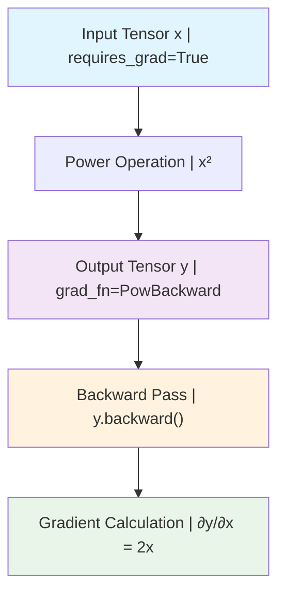
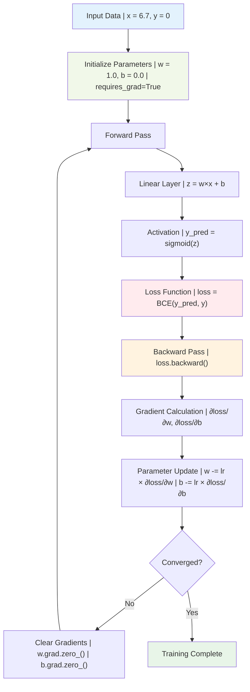
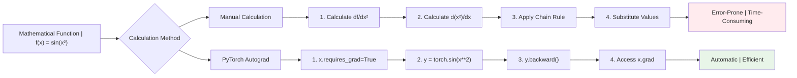
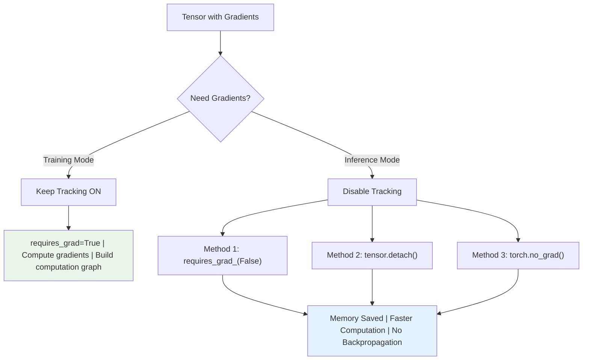

# PyTorch Autograd: Complete Guide to Automatic Differentiation

## High-Level Synthesis

### Core Essence
The material presents **PyTorch Autograd** as a fundamental component that provides automatic differentiation operations, enabling gradient computation essential for training machine learning and deep learning models using optimization algorithms like gradient descent. The content establishes autograd as the core mechanism that makes neural network training feasible by automatically calculating derivatives in complex nested functions.

### Key Objectives & Outcomes
1. **Foundational Understanding**: Master the concept of automatic differentiation and its critical importance in neural network training
2. **Practical Implementation**: Learn comprehensive gradient calculation techniques using PyTorch's autograd system
3. **Real-World Application**: Understand how autograd simplifies complex derivative calculations that would be nearly impossible to compute manually

## Detailed Analysis & Core Concepts

### The Need for Autograd

#### Manual Derivative Calculation Challenges

**Simple Case: y = x²**
For basic mathematical relationships, manual derivative calculation is straightforward:
- Given: y = x²
- Derivative: dy/dx = 2x
- Implementation: Simple Python function can calculate this

```python
def dydx(x):
    return 2 * x

# For x = 2: dy/dx = 4
# For x = 3: dy/dx = 6
```

**Nested Functions: Increased Complexity**
When dealing with nested functions, complexity increases significantly:
- Given: y = x², z = sin(y)
- Required: dz/dx using chain rule
- Manual calculation: dz/dx = (dz/dy) × (dy/dx) = cos(x²) × 2x

**Multiple Nesting Levels**
As nesting increases, manual calculation becomes exponentially more difficult:
- More derivative terms to calculate
- Complex chain rule applications
- Higher probability of calculation errors

#### Deep Learning Connection

**Neural Networks as Nested Functions**
Every neural network can be viewed as a nested function where:
- **Forward Pass**: Input flows through layers: x → z₁ → y_pred → loss
- **Mathematical Relationship**: Each layer represents a mathematical operation
- **Parameter Dependencies**: Loss indirectly depends on all weights and biases

**Training Process Overview**
Neural network training follows a four-step process:

1. **Forward Pass**: Compute predictions from inputs
2. **Loss Calculation**: Compare predictions with actual targets
3. **Backpropagation**: Calculate gradients using chain rule
4. **Parameter Updates**: Update weights and biases using optimization algorithms

**Example: Simple Perceptron**
```
Input: Student CGPA (x = 6.7)
Target: Placement status (y = 0)
Network: Single neuron with sigmoid activation

Forward Pass:
z = w×x + b
y_pred = sigmoid(z)
loss = binary_cross_entropy(y_pred, y)

Backpropagation:
∂loss/∂w = (∂loss/∂y_pred) × (∂y_pred/∂z) × (∂z/∂w)
∂loss/∂b = (∂loss/∂y_pred) × (∂y_pred/∂z) × (∂z/∂b)
```

### What is Autograd?

**Formal Definition**
Autograd is a core component of PyTorch that provides **automatic differentiation operations**. It enables gradient computation which is essential for training machine learning/deep learning models using optimization algorithms like gradient descent.

**Key Characteristics**
- **Automatic**: No manual derivative calculation required
- **Efficient**: Optimized for computational performance
- **Flexible**: Works with complex nested functions
- **Dynamic**: Builds computation graphs on-the-fly

### Autograd in Action: Three Examples

#### Example 1: Simple Function (y = x²)

**Manual Calculation First**
```python
def dy_dx(x):
    return 2*x

# Test manual calculation
dy_dx(3)  # Output: 6
```

**Setup and Forward Pass with Autograd**
```python
import torch

# Create tensor with gradient tracking enabled
x = torch.tensor(3.0, requires_grad=True)
y = x ** 2

# Print tensors to see autograd information
print(x)  # tensor(3., requires_grad=True)
print(y)  # tensor(9., grad_fn=<PowBackward0>)
```

**Understanding the Output**
- **requires_grad=True**: Tells PyTorch to track operations for gradient calculation
- **grad_fn=<PowBackward0>**: Indicates the operation used to create this tensor (power function)

**Computation Graph Creation**
PyTorch automatically creates a computation graph:
```
[x] → [Power Operation] → [y]
     (x²)
```

**Backward Pass and Gradient Calculation**
```python
# Perform backward pass
y.backward()

# Access computed gradients
print(x.grad)  # tensor(6.)
```

**Verification**
- Manual calculation: dy/dx = 2x = 2(3) = 6
- Autograd result: 6.0 ✓

#### Example 2: Nested Functions (z = sin(x²))

**Mathematical Setup**
- y = x²
- z = sin(y)
- Find: dz/dx for x = 4 (as per Colab)

**Manual Calculation First**
```python
import math

def dz_dx(x):
    return 2 * x * math.cos(x**2)

# Test manual calculation
dz_dx(4)  # Output: -7.661275842587077
```

**Implementation with Autograd**
```python
# Setup tensors
x = torch.tensor(4.0, requires_grad=True)

# Forward pass
y = x ** 2
z = torch.sin(y)

print(x)  # tensor(4., requires_grad=True)
print(y)  # tensor(16., grad_fn=<PowBackward0>)
print(z)  # tensor(-0.2879, grad_fn=<SinBackward0>)
```

**Computation Graph**
```
[x] → [Power] → [y] → [Sin] → [z]
     (x²)           (sin(y))
```

**Gradient Calculation**
```python
# Backward pass
z.backward()

# Get gradient
print(x.grad)  # tensor(-7.6613)
```

**Important Note about Intermediate Gradients**
```python
# This will give a warning - intermediate tensors don't store gradients by default
print(y.grad)  # UserWarning: The .grad attribute of a Tensor that is not a leaf Tensor is being accessed
```

**Manual Verification**
Using chain rule: dz/dx = cos(x²) × 2x = cos(16) × 8 = -0.9576 × 8 = -7.6613 ✓

#### Example 3: Neural Network Training

**Problem Setup**
- **Dataset**: Single student with CGPA = 6.7, Placement = 0 (not placed)
- **Network**: Single neuron with sigmoid activation
- **Goal**: Train network to predict placement status

**Manual Gradient Calculation**
Required derivatives:
- ∂loss/∂w = (∂loss/∂y_pred) × (∂y_pred/∂z) × (∂z/∂w)
- ∂loss/∂b = (∂loss/∂y_pred) × (∂y_pred/∂z) × (∂z/∂b)

**Derivative Formulas**
```python
# Individual derivatives
dl_dy_pred = (y_pred - y) / (y_pred * (1 - y_pred))  # Binary cross-entropy
dy_pred_dz = y_pred * (1 - y_pred)                   # Sigmoid derivative
dz_dw = x                                            # Linear layer w.r.t weight
dz_db = 1                                            # Linear layer w.r.t bias

# Final gradients using chain rule
dl_dw = dl_dy_pred * dy_pred_dz * dz_dw  # Simplifies to: (y_pred - y) * x
dl_db = dl_dy_pred * dy_pred_dz * dz_db  # Simplifies to: (y_pred - y)
```

**Setup - Data and Initial Parameters**
```python
import torch

# Inputs
x = torch.tensor(6.7)  # Input feature
y = torch.tensor(0.0)  # True label (binary)

w = torch.tensor(1.0)  # Weight
b = torch.tensor(0.0)  # Bias
```

**Loss Function Definition**
```python
# Binary Cross-Entropy Loss for scalar
def binary_cross_entropy_loss(prediction, target):
    epsilon = 1e-8  # To prevent log(0)
    prediction = torch.clamp(prediction, epsilon, 1 - epsilon)
    return -(target * torch.log(prediction) + (1 - target) * torch.log(1 - prediction))
```

**Manual Implementation (Complex)**
```python
# Forward pass
z = w * x + b  # Weighted sum (linear part)
y_pred = torch.sigmoid(z)  # Predicted probability

# Compute binary cross-entropy loss
loss = binary_cross_entropy_loss(y_pred, y)
print(loss)  # tensor(6.7012)

# Manual backpropagation calculations
# Derivatives:
# 1. dL/d(y_pred): Loss with respect to the prediction (y_pred)
dloss_dy_pred = (y_pred - y)/(y_pred*(1-y_pred))

# 2. dy_pred/dz: Prediction (y_pred) with respect to z (sigmoid derivative)
dy_pred_dz = y_pred * (1 - y_pred)

# 3. dz/dw and dz/db: z with respect to w and b
dz_dw = x  # dz/dw = x
dz_db = 1  # dz/db = 1 (bias contributes directly to z)

# Chain rule application
dL_dw = dloss_dy_pred * dy_pred_dz * dz_dw
dL_db = dloss_dy_pred * dy_pred_dz * dz_db

print(f"Manual Gradient of loss w.r.t weight (dw): {dL_dw}")  # 6.691762447357178
print(f"Manual Gradient of loss w.r.t bias (db): {dL_db}")    # 0.998770534992218
```

**Autograd Implementation (Simple)**
```python
# Reset inputs and enable gradient tracking
x = torch.tensor(6.7)
y = torch.tensor(0.0)

# Network parameters with gradient tracking
w = torch.tensor(1.0, requires_grad=True)
b = torch.tensor(0.0, requires_grad=True)

print(w)  # tensor(1., requires_grad=True)
print(b)  # tensor(0., requires_grad=True)

# Forward pass
z = w*x + b
print(z)  # tensor(6.7000, grad_fn=<AddBackward0>)

y_pred = torch.sigmoid(z)
print(y_pred)  # tensor(0.9988, grad_fn=<SigmoidBackward0>)

loss = binary_cross_entropy_loss(y_pred, y)
print(loss)  # tensor(6.7012, grad_fn=<NegBackward0>)

# Backward pass (single line!)
loss.backward()

# Access gradients
print(w.grad)  # tensor(6.6918)
print(b.grad)  # tensor(0.9988)
```

**Results Comparison**
- Manual calculation: dw = 6.6918, db = 0.9988
- Autograd calculation: dw = 6.6918, db = 0.9988 ✓

### Computation Graphs

**What are Computation Graphs?**
Computation graphs are **directed acyclic graphs (DAGs)** that PyTorch uses internally to track operations and compute gradients efficiently.

**Graph Components**
- **Leaf Nodes**: Input tensors (those created directly)
- **Intermediate Nodes**: Results of operations on other tensors
- **Root Nodes**: Final output tensors (usually loss values)

**Example Computation Graph**
For the neural network example:
```
[w] ──┐
      ├─→ [×] ──┐
[x] ──┘         ├─→ [+] ──→ [z] ──→ [sigmoid] ──→ [y_pred] ──→ [loss]
                │
[b] ────────────┘
```

**Forward vs Backward Flow**
- **Forward Direction**: Calculate outputs from inputs
- **Backward Direction**: Calculate gradients from outputs to inputs using chain rule

**Important Notes**
- **Leaf Tensors**: Only leaf tensors store gradients by default
- **Intermediate Gradients**: Not stored unless explicitly requested
- **Memory Efficiency**: Intermediate results discarded after backward pass

### Advanced Autograd Concepts

#### Vector Inputs and Multi-variable Functions

**Working with Vectors**
```python
# Vector input
x = torch.tensor([1.0, 2.0, 3.0], requires_grad=True)
print(x)  # tensor([1., 2., 3.], requires_grad=True)

y = (x**2).mean()
print(y)  # tensor(4.6667, grad_fn=<MeanBackward0>)

# Backward pass
y.backward()

# Gradients for each element
print(x.grad)  # tensor([0.6667, 1.3333, 2.0000])
```

**Mathematical Explanation**
For y = (x₁² + x₂² + x₃²) / 3:
- ∂y/∂x₁ = 2x₁/3 = 2(1)/3 = 0.6667
- ∂y/∂x₂ = 2x₂/3 = 2(2)/3 = 1.3333  
- ∂y/∂x₃ = 2x₃/3 = 2(3)/3 = 2.0000

#### Gradient Accumulation

**The Problem**
By default, gradients accumulate across multiple backward passes:

```python
# Clearing grad demonstration
x = torch.tensor(2.0, requires_grad=True)
print(x)  # tensor(2., requires_grad=True)

y = x ** 2
print(y)  # tensor(4., grad_fn=<PowBackward0>)

# First backward pass
y.backward()
print(x.grad)  # tensor(4.)

# Clear gradients properly
print(x.grad.zero_())  # tensor(0.)
```

**Why This Matters**
In neural network training:
- Each batch requires fresh gradient calculations
- Accumulated gradients lead to incorrect parameter updates
- Always clear gradients before each training step

#### Disabling Gradient Tracking

**When to Disable Gradients**
- **Inference Time**: No backpropagation needed
- **Memory Optimization**: Saves computational resources
- **Evaluation Mode**: Testing trained models

**Three Methods for Disabling Gradient Tracking**

**Method 1: requires_grad_(False)**
```python
# disable gradient tracking
x = torch.tensor(2.0, requires_grad=True)
print(x)  # tensor(2., requires_grad=True)

y = x ** 2
print(y)  # tensor(4., grad_fn=<PowBackward0>)

y.backward()
print(x.grad)  # tensor(4.)

# option 1 - requires_grad_(False)
x.requires_grad_(False)
print(x)  # tensor(2.)

y = x ** 2
print(y)  # tensor(4.) - No grad_fn

# This will error now
# y.backward()  # RuntimeError: element 0 of tensors does not require grad
```

**Method 2: detach()**
```python
x = torch.tensor(2.0, requires_grad=True)
print(x)  # tensor(2., requires_grad=True)

z = x.detach()
print(z)  # tensor(2.) - No gradient tracking

y = x ** 2
print(y)  # tensor(4., grad_fn=<PowBackward0>)

y1 = z ** 2
print(y1)  # tensor(4.) - No grad_fn

y.backward()  # This works
# y1.backward()  # This would error
```

**Method 3: torch.no_grad() Context Manager**
```python
x = torch.tensor(2.0, requires_grad=True)
print(x)  # tensor(2., requires_grad=True)

y = x ** 2
print(y)  # tensor(4., grad_fn=<PowBackward0>)

y.backward()
# Tensor is ready for next operation
```

## Visual Enhancement

### Computation Graph Visualization



### Neural Network Training Flow



### Autograd vs Manual Calculation Comparison



### Gradient Tracking Control



## Code Integration

### Complete Neural Network Training Example

```python
import torch
import torch.nn.functional as F

class SimpleNeuralNetwork:
    def __init__(self, learning_rate=0.01):
        # Initialize parameters with gradient tracking
        self.w = torch.tensor(1.0, requires_grad=True)
        self.b = torch.tensor(0.0, requires_grad=True)
        self.learning_rate = learning_rate
        
    def forward(self, x):
        """Forward pass through the network"""
        z = self.w * x + self.b
        y_pred = torch.sigmoid(z)
        return y_pred
    
    def compute_loss(self, y_pred, y_true):
        """Compute binary cross-entropy loss"""
        # Add small epsilon to prevent log(0)
        epsilon = 1e-15
        y_pred = torch.clamp(y_pred, epsilon, 1 - epsilon)
        loss = -(y_true * torch.log(y_pred) + (1 - y_true) * torch.log(1 - y_pred))
        return loss
    
    def backward(self):
        """Clear gradients before backward pass"""
        if self.w.grad is not None:
            self.w.grad.zero_()
        if self.b.grad is not None:
            self.b.grad.zero_()
    
    def update_parameters(self):
        """Update parameters using computed gradients"""
        with torch.no_grad():  # No gradient tracking for parameter updates
            self.w -= self.learning_rate * self.w.grad
            self.b -= self.learning_rate * self.b.grad
    
    def train_step(self, x, y_true):
        """Complete training step"""
        # Clear gradients
        self.backward()
        
        # Forward pass
        y_pred = self.forward(x)
        
        # Compute loss
        loss = self.compute_loss(y_pred, y_true)
        
        # Backward pass
        loss.backward()
        
        # Update parameters
        self.update_parameters()
        
        return loss.item(), y_pred.item()

# Usage example
def train_simple_network():
    # Initialize network
    network = SimpleNeuralNetwork(learning_rate=0.1)
    
    # Training data: CGPA vs Placement
    x_train = torch.tensor(6.7)
    y_train = torch.tensor(0.0)  # Not placed
    
    print("Training Simple Neural Network")
    print("=" * 40)
    print(f"Initial w: {network.w.item():.4f}, b: {network.b.item():.4f}")
    
    # Training loop
    for epoch in range(100):
        loss, prediction = network.train_step(x_train, y_train)
        
        if epoch % 20 == 0:
            print(f"Epoch {epoch:3d}: Loss = {loss:.4f}, "
                  f"Prediction = {prediction:.4f}, "
                  f"w = {network.w.item():.4f}, b = {network.b.item():.4f}")
    
    print("=" * 40)
    print("Training Complete!")
    
    # Test the trained network
    with torch.no_grad():
        test_cgpa = torch.tensor([5.0, 7.0, 8.5])
        for cgpa in test_cgpa:
            prediction = network.forward(cgpa)
            print(f"CGPA: {cgpa.item():.1f} -> Placement Probability: {prediction.item():.4f}")

# Advanced gradient manipulation example
def gradient_manipulation_example():
    """Demonstrate advanced gradient concepts"""
    print("\nAdvanced Gradient Manipulation")
    print("=" * 40)
    
    # 1. Gradient accumulation demonstration
    print("1. Gradient Accumulation:")
    x = torch.tensor(3.0, requires_grad=True)
    
    # First computation
    y1 = x ** 2
    y1.backward()
    print(f"   After first backward: x.grad = {x.grad}")
    
    # Second computation without clearing
    y2 = x ** 3
    y2.backward()
    print(f"   After second backward: x.grad = {x.grad} (accumulated!)")
    
    # Clear and recompute
    x.grad.zero_()
    y3 = x ** 3
    y3.backward()
    print(f"   After clearing and recomputing: x.grad = {x.grad}")
    
    # 2. Multi-variable gradients
    print("\n2. Multi-variable Gradients:")
    x_vec = torch.tensor([1.0, 2.0, 3.0], requires_grad=True)
    y_vec = (x_vec ** 2).sum()
    y_vec.backward()
    print(f"   Input: {x_vec.data}")
    print(f"   Function: sum(x²) = {y_vec.item()}")
    print(f"   Gradients: {x_vec.grad}")
    
    # 3. Gradient control
    print("\n3. Gradient Control:")
    x_control = torch.tensor(5.0, requires_grad=True)
    
    # With gradients
    y_with_grad = x_control ** 2
    print(f"   With gradients: grad_fn = {y_with_grad.grad_fn}")
    
    # Without gradients (detach)
    x_detached = x_control.detach()
    y_detached = x_detached ** 2
    print(f"   Detached: grad_fn = {y_detached.grad_fn}")
    
    # Without gradients (context manager)
    with torch.no_grad():
        y_no_grad = x_control ** 2
        print(f"   No grad context: grad_fn = {y_no_grad.grad_fn}")

# Performance comparison: Manual vs Autograd
def performance_comparison():
    """Compare manual vs autograd gradient calculation"""
    import time
    
    print("\nPerformance Comparison: Manual vs Autograd")
    print("=" * 50)
    
    # Setup
    x_val = 3.0
    iterations = 100000
    
    # Manual calculation
    start_time = time.time()
    for _ in range(iterations):
        # Simulate complex function: f(x) = sin(x²)
        y_manual = (x_val ** 2)
        sin_y = torch.sin(torch.tensor(y_manual))
        # Manual gradient: cos(x²) * 2x
        grad_manual = torch.cos(torch.tensor(x_val ** 2)) * 2 * x_val
    manual_time = time.time() - start_time
    
    # Autograd calculation
    start_time = time.time()
    for _ in range(iterations):
        x_auto = torch.tensor(x_val, requires_grad=True)
        y_auto = torch.sin(x_auto ** 2)
        y_auto.backward()
        grad_auto = x_auto.grad
    autograd_time = time.time() - start_time
    
    print(f"Manual calculation time: {manual_time:.4f}s")
    print(f"Autograd calculation time: {autograd_time:.4f}s")
    print(f"Ratio (manual/autograd): {manual_time/autograd_time:.2f}x")
    print(f"Manual gradient: {grad_manual.item():.6f}")
    print(f"Autograd gradient: {grad_auto.item():.6f}")

if __name__ == "__main__":
    # Run all examples
    train_simple_network()
    gradient_manipulation_example()
    performance_comparison()
```

### Comprehensive Autograd Utilities

```python
import torch
import matplotlib.pyplot as plt
from typing import List, Tuple, Optional

class AutogradVisualizer:
    """Utility class for visualizing autograd concepts"""
    
    @staticmethod
    def plot_function_and_gradient(func, x_range: Tuple[float, float], 
                                 num_points: int = 100, point_x: float = None):
        """Plot function and its gradient"""
        x_vals = torch.linspace(x_range[0], x_range[1], num_points)
        y_vals = []
        grad_vals = []
        
        for x_val in x_vals:
            x = torch.tensor(x_val, requires_grad=True)
            y = func(x)
            y.backward()
            
            y_vals.append(y.item())
            grad_vals.append(x.grad.item())
        
        plt.figure(figsize=(12, 4))
        
        # Plot function
        plt.subplot(1, 2, 1)
        plt.plot(x_vals.numpy(), y_vals, 'b-', linewidth=2, label='f(x)')
        if point_x is not None:
            x_point = torch.tensor(point_x, requires_grad=True)
            y_point = func(x_point)
            plt.plot(point_x, y_point.item(), 'ro', markersize=8, label=f'x={point_x}')
        plt.xlabel('x')
        plt.ylabel('f(x)')
        plt.title('Function')
        plt.grid(True, alpha=0.3)
        plt.legend()
        
        # Plot gradient
        plt.subplot(1, 2, 2)
        plt.plot(x_vals.numpy(), grad_vals, 'r-', linewidth=2, label="f'(x)")
        if point_x is not None:
            x_point = torch.tensor(point_x, requires_grad=True)
            y_point = func(x_point)
            y_point.backward()
            plt.plot(point_x, x_point.grad.item(), 'ro', markersize=8, 
                    label=f"f'({point_x})={x_point.grad.item():.3f}")
        plt.xlabel('x')
        plt.ylabel("f'(x)")
        plt.title('Gradient')
        plt.grid(True, alpha=0.3)
        plt.legend()
        
        plt.tight_layout()
        plt.show()

class GradientChecker:
    """Utility for checking gradient calculations"""
    
    @staticmethod
    def numerical_gradient(func, x: torch.Tensor, h: float = 1e-5) -> torch.Tensor:
        """Compute numerical gradient using finite differences"""
        grad = torch.zeros_like(x)
        
        for i in range(x.numel()):
            # Create copies for f(x+h) and f(x-h)
            x_plus_h = x.clone()
            x_minus_h = x.clone()
            
            x_plus_h.view(-1)[i] += h
            x_minus_h.view(-1)[i] -= h
            
            # Numerical gradient: (f(x+h) - f(x-h)) / (2*h)
            grad.view(-1)[i] = (func(x_plus_h) - func(x_minus_h)) / (2 * h)
        
        return grad
    
    @staticmethod
    def check_gradients(func, x: torch.Tensor, tolerance: float = 1e-6) -> bool:
        """Compare autograd vs numerical gradients"""
        # Autograd gradient
        x_auto = x.clone().requires_grad_(True)
        y_auto = func(x_auto)
        y_auto.backward()
        autograd_grad = x_auto.grad.clone()
        
        # Numerical gradient
        numerical_grad = GradientChecker.numerical_gradient(func, x)
        
        # Compare
        diff = torch.abs(autograd_grad - numerical_grad)
        max_diff = torch.max(diff)
        
        print(f"Autograd gradient: {autograd_grad}")
        print(f"Numerical gradient: {numerical_grad}")
        print(f"Max difference: {max_diff.item():.2e}")
        print(f"Tolerance: {tolerance:.2e}")
        
        is_close = max_diff < tolerance
        print(f"Gradients match: {is_close}")
        
        return is_close

# Example usage functions
def visualize_quadratic():
    """Visualize quadratic function and its gradient"""
    def quadratic(x):
        return x ** 2
    
    visualizer = AutogradVisualizer()
    visualizer.plot_function_and_gradient(quadratic, (-3, 3), point_x=2.0)

def check_complex_function():
    """Check gradients for a complex function"""
    def complex_func(x):
        return torch.sin(x ** 2) + torch.cos(x)
    
    x_test = torch.tensor([1.5, 2.0])
    checker = GradientChecker()
    checker.check_gradients(complex_func, x_test)

def demonstrate_chain_rule():
    """Demonstrate chain rule with nested functions"""
    print("Chain Rule Demonstration")
    print("=" * 30)
    
    # Define nested function: h(g(f(x))) where f(x)=x², g(y)=sin(y), h(z)=z³
    x = torch.tensor(2.0, requires_grad=True)
    
    # Step by step
    f_x = x ** 2  # f(x) = x²
    g_f_x = torch.sin(f_x)  # g(f(x)) = sin(x²)
    h_g_f_x = g_f_x ** 3  # h(g(f(x))) = sin³(x²)
    
    print(f"x = {x.item()}")
    print(f"f(x) = x² = {f_x.item():.4f}")
    print(f"g(f(x)) = sin(x²) = {g_f_x.item():.4f}")
    print(f"h(g(f(x))) = sin³(x²) = {h_g_f_x.item():.4f}")
    
    # Compute gradient
    h_g_f_x.backward()
    print(f"dh/dx = {x.grad.item():.4f}")
    
    # Manual verification using chain rule
    # dh/dx = (dh/dg) × (dg/df) × (df/dx)
    # dh/dg = 3sin²(x²)
    # dg/df = cos(x²)  
    # df/dx = 2x
    manual_grad = 3 * (torch.sin(f_x) ** 2) * torch.cos(f_x) * 2 * x
    print(f"Manual calculation: {manual_grad.item():.4f}")
    print(f"Difference: {abs(x.grad.item() - manual_grad.item()):.2e}")
```

## Key Limitations & Future Directions

### Current Limitations
1. **Memory Overhead**: Computation graphs consume additional memory
2. **Higher-Order Derivatives**: Complex to compute beyond second order
3. **Dynamic Graphs**: Rebuilt for each forward pass (though this enables flexibility)
4. **Gradient Accumulation**: Requires manual clearing between iterations

### Future Directions
1. **Efficient Higher-Order Derivatives**: Better support for Hessian computation
2. **Memory Optimization**: More efficient graph representations
3. **Distributed Gradients**: Improved gradient synchronization across devices
4. **Custom Autograd Functions**: Enhanced support for custom operations

## Stimulating Questions

1. **Computational Efficiency**: How does autograd's automatic differentiation compare to symbolic differentiation in terms of computational complexity and memory usage for very deep networks?

2. **Numerical Stability**: What are the implications of using automatic differentiation for functions with discontinuities or near-zero gradients, and how can these issues be mitigated in practice?

3. **Beyond Backpropagation**: As new optimization algorithms emerge (such as forward-mode differentiation or evolutionary strategies), how might autograd systems need to evolve to support alternative gradient-free or gradient-approximation methods?

[End of Notes]