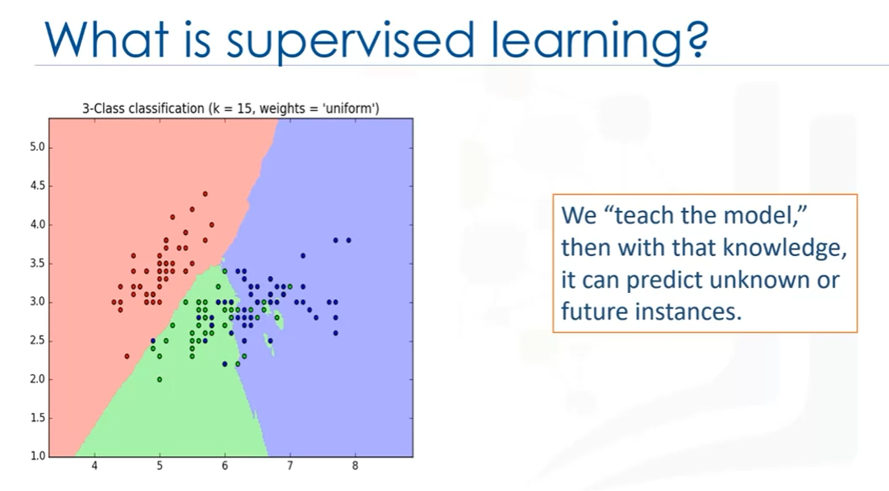
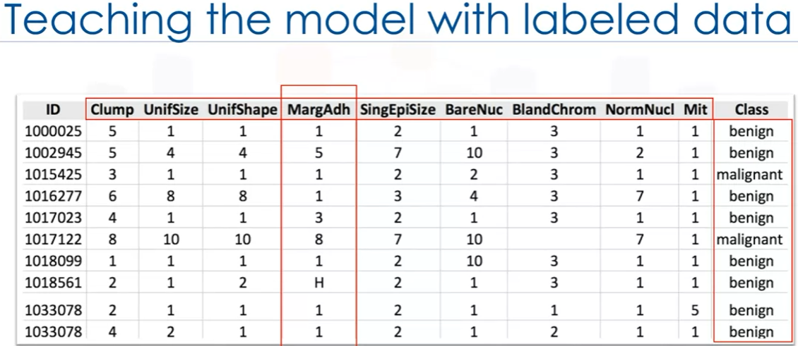
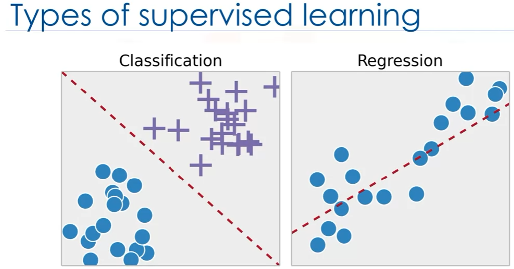
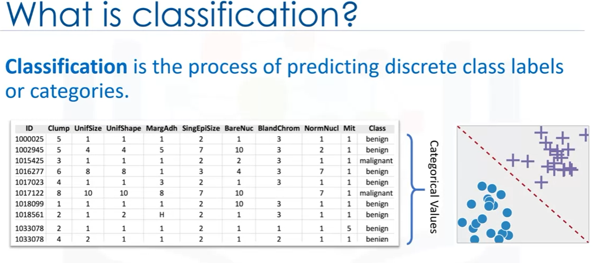
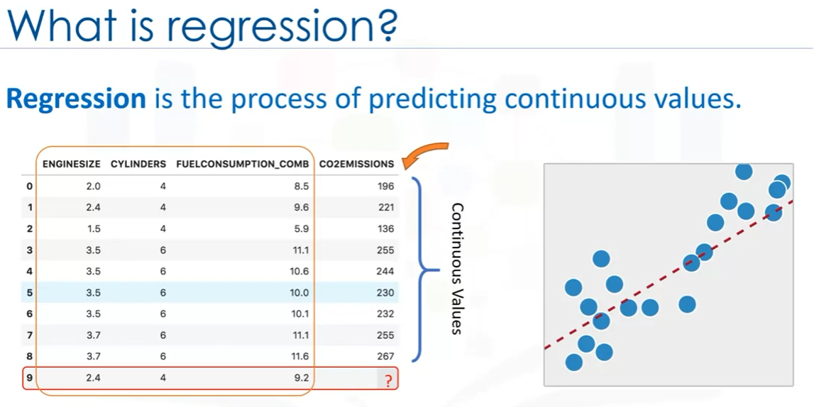
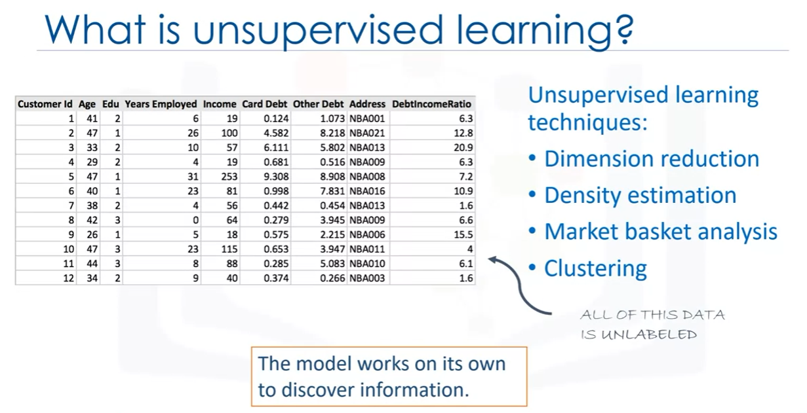
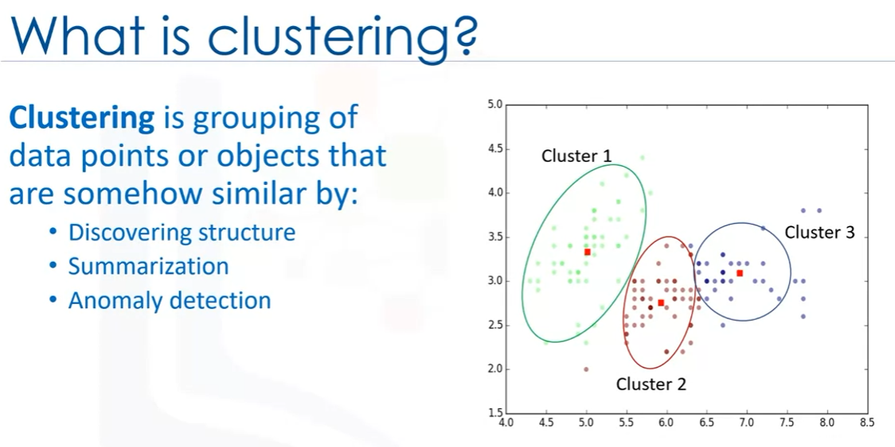
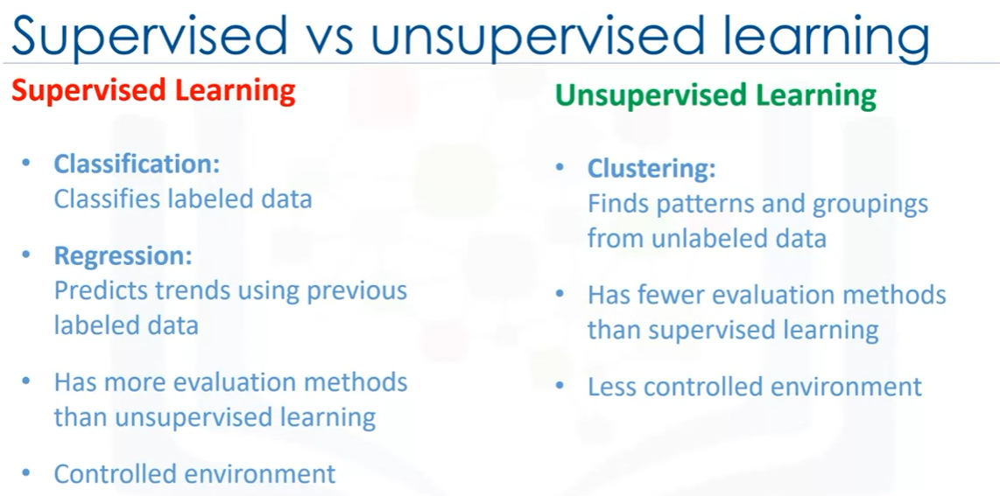

### Detailed Notes on Supervised vs. Unsupervised Learning (with Analogies)

---

#### **1. Introduction to Supervised and Unsupervised Learning**
- **Supervised Learning**: As the term “supervised” suggests, this type of learning involves “guidance” or “instruction.” In supervised learning, the machine learning model is trained on labeled data, meaning we know the expected output (or “label”) for each input. The goal is for the model to learn the relationship between input features and their corresponding output labels so it can make predictions on new, unseen data.
  
- **Unsupervised Learning**: In unsupervised learning, there is no guidance or labeled data. The model is provided with raw, unlabeled data and must find patterns, structures, or relationships within that data without any pre-defined categories or output values. The machine essentially "learns on its own" to find hidden insights.

- **Analogy**: Imagine you’re a student in two types of classes. In the **supervised class**, you’re given the answers (labeled data) to practice questions so you can learn how to solve similar problems in the future. In the **unsupervised class**, you’re given a problem without answers, and it’s up to you to figure out patterns and draw conclusions from the raw information.

---

#### **2. Supervised Learning: Components and Techniques**

- **What is Supervised Learning?**: Supervised learning involves training a model on a dataset where each observation (row of data) has an associated label or output. The model uses this information to learn how to predict labels for new observations.

- **Example Dataset**: 
  - Suppose you have a dataset of **cancer patients** with information such as “clump thickness,” “uniformity of cell size,” and “marginal adhesion.” Each row in the dataset is labeled as either “benign” or “malignant.” This label is what the model will try to predict for new patients.

- **Key Components**:
  1. **Attributes**: These are the variables or features in the dataset (e.g., clump thickness, engine size).
  2. **Features**: The individual columns of data corresponding to these attributes.
  3. **Observations**: Each row in the dataset represents an observation, where each observation has a set of attributes and a corresponding label (in supervised learning).

- **Types of Data**:
  1. **Numerical Data**: Data with measurable quantities (e.g., engine size, CO2 emissions).
  2. **Categorical Data**: Data that represents categories or groups (e.g., benign/malignant, colors, types of cars).

- **Supervised Learning Techniques**:
  1. **Classification**: The process of predicting a discrete class label or category. For instance, in the cancer dataset, the goal is to classify a tumor as benign or malignant.
  2. **Regression**: The process of predicting a continuous value. For example, in a dataset related to car emissions, you might predict CO2 emissions based on features like engine size and fuel consumption.

- **Analogy**: Imagine you’re learning to bake a cake. In **classification**, you decide if a baked good is a cake or not based on its characteristics (is it sweet, does it have frosting?). In **regression**, you try to predict the exact baking time of a cake based on its size and oven temperature (continuous value prediction).

---

#### **3. Unsupervised Learning: Components and Techniques**

- **What is Unsupervised Learning?**: Unlike supervised learning, unsupervised learning works with unlabeled data. The goal is to find hidden patterns or structures in the data. The model learns on its own without guidance from labeled data.

- **Unsupervised Learning Techniques**:
  1. **Clustering**: A common technique where the model groups similar data points into clusters. For example, in customer segmentation, the model might group customers based on purchasing behavior.
  2. **Dimensionality Reduction**: This technique simplifies the dataset by reducing the number of features while preserving important information. It’s useful when dealing with very large datasets with many features.
  3. **Density Estimation**: A technique used to estimate the probability distribution of data. This helps explore the data and find its structure.
  4. **Market Basket Analysis**: Based on the idea that if someone buys a certain group of items, they are likely to buy another group of items. It is used for recommendation systems in retail (e.g., “customers who bought X also bought Y”).

- **Clustering Example**: 
  - Suppose a bank wants to segment its customers based on financial behavior. The bank can use clustering to group similar customers together, for example, customers who spend frequently on dining, those who travel often, etc.

- **Analogy**: Imagine walking into a library with no labels on the shelves (unsupervised learning). Your job is to organize the books into groups based on themes or genres. Without guidance, you’ll cluster books based on patterns you find, like similar topics or writing styles.

---

#### **4. Comparing Supervised and Unsupervised Learning**

| Feature | Supervised Learning | Unsupervised Learning |
|---------|---------------------|-----------------------|
| **Data Type** | Labeled data (we know the correct outputs) | Unlabeled data (no pre-defined labels) |
| **Learning Approach** | Model learns by example (knows the output labels during training) | Model learns by exploring the data and finding hidden patterns |
| **Techniques** | Classification, Regression | Clustering, Dimensionality Reduction, Market Basket Analysis |
| **Complexity** | Easier, since the model has guidance from labeled data | More challenging, since the model must infer patterns without guidance |
| **Examples** | Predicting if an email is spam or not (classification) | Grouping customers by purchasing habits (clustering) |

- **Supervised Learning**: Easier because you have labeled data, meaning you know what the outcome should be. This allows for precise predictions, but you need a labeled dataset to train the model.
  
- **Unsupervised Learning**: More challenging because you don’t know the labels. The model must find structure in the data on its own. However, it’s useful for exploring data and uncovering hidden patterns, such as customer segmentation.

- **Analogy**: 
  - **Supervised Learning**: It’s like taking a test where you’ve already seen the answers during your study sessions. You know what the correct answers should be, and now you’re applying your knowledge to similar questions.
  - **Unsupervised Learning**: It’s like exploring a new city without a map. You don’t have any clear directions (labels), but by observing the layout (the data), you can figure out the best places to visit based on patterns you notice.

---

#### **5. Applications of Supervised and Unsupervised Learning**

- **Supervised Learning Applications**:
  - **Spam Detection**: Email services like Gmail use classification models to predict whether an incoming email is spam or not based on past labeled examples.
  - **Loan Approval**: Banks use regression models to predict whether an applicant will default on a loan based on labeled historical data.
  - **Medical Diagnosis**: In healthcare, classification models predict whether a tumor is benign or malignant based on labeled patient data.

- **Unsupervised Learning Applications**:
  - **Customer Segmentation**: Companies use clustering to group customers into segments based on purchasing behavior. This helps in targeted marketing strategies.
  - **Anomaly Detection**: In fraud detection, unsupervised learning helps find outliers, such as unusual transactions, without pre-labeled data.
  - **Recommender Systems**: Market basket analysis helps retailers recommend products based on patterns of past purchases.

---

#### **6. Key Takeaways: Supervised vs. Unsupervised Learning**

- **Supervised Learning**:
  - Works with labeled data.
  - Useful for tasks where the goal is to predict a specific outcome, such as classifying data points or predicting continuous values.
  - Techniques: **Classification** (predicting categories), **Regression** (predicting continuous values).

- **Unsupervised Learning**:
  - Works with unlabeled data.
  - Useful for discovering hidden patterns, summarizing data, or grouping data points.
  - Techniques: **Clustering**, **Dimensionality Reduction**, **Market Basket Analysis**, **Anomaly Detection**.

- **Biggest Difference**: Supervised learning relies on labeled data where the outcome is known, while unsupervised learning works with raw, unlabeled data and uncovers patterns or structures within it.

---

### Summary of Key Points

1. **Supervised Learning**: Trains on labeled data and is used for tasks like classification and regression. It’s easier because the model has the answers during training, like a student using an answer key.

2. **Unsupervised Learning**: Trains on unlabeled data, discovering patterns without guidance. It is more challenging and is used for tasks like clustering and anomaly detection, similar to exploring an unfamiliar city without a map.

3. **Techniques**:
   - **Supervised**: Classification (spam detection, medical diagnosis), Regression (predicting car emissions).
   - **Unsupervised**: Clustering (customer segmentation), Dimensionality Reduction, Market Basket Analysis.

4. **Application Examples**:
   - Supervised Learning: Spam detection, loan approvals, medical diagnosis.
   - Unsupervised Learning: Customer segmentation, anomaly detection, recommendation systems.
 

# Mathematical Explanation of Supervised and Unsupervised Learning with Examples

## 1. Supervised Learning

### 1.1 Overview of Supervised Learning
In supervised learning, we aim to learn a function $f(x)$ that maps input features $x$ (data points) to the corresponding target labels $y$ (output).

$$
y = f(x) + \epsilon
$$

Where:
- $x$ represents the input features (e.g., "clump thickness" or "engine size").
- $y$ represents the target or label (e.g., "benign" or "malignant," or a continuous variable like "CO2 emission").
- $\epsilon$ is a noise term that accounts for possible randomness or error in the system.

### 1.2 Classification (Discrete Outputs)

In classification problems, the target $y$ is categorical. The task is to map input data $x$ to discrete categories $y \in \{C_1, C_2, \dots, C_n\}$.

#### Example: Logistic Regression
The logistic regression model uses a sigmoid function to predict probabilities of the class labels.

The probability that a data point belongs to class 1 is modeled as:

$$
P(y=1|x) = \frac{1}{1 + e^{-(w^Tx + b)}}
$$

Where:
- $w^T$ is the weight vector.
- $x$ is the input feature vector.
- $b$ is the bias term.

**Decision Rule**:
- If $P(y=1|x) \geq 0.5$, classify the point as class 1.
- Otherwise, classify it as class 0.

#### Loss Function for Classification
The log-loss (cross-entropy loss) is used to measure the performance of the classification model:

$$
L(w, b) = - \left[ y \log P(y|x) + (1 - y) \log (1 - P(y|x)) \right]
$$

**Example**:
- **Spam Detection**: You have a dataset of emails labeled as "spam" or "not spam." Each email has features such as the frequency of certain words, the presence of attachments, etc. Logistic regression can be used to classify new emails as spam or not spam.

### 1.3 Regression (Continuous Outputs)

In regression problems, the target $y$ is a continuous value. The linear regression model is represented as:

$$
y = w^T x + b
$$

Where:
- $w$ is the weight vector.
- $x$ is the input feature vector.
- $b$ is the bias term.

#### Loss Function for Regression
The loss function for regression is the mean squared error (MSE):

$$
L(w, b) = \frac{1}{N} \sum_{i=1}^{N} \left( y_i - (w^T x_i + b) \right)^2
$$

**Example**:
- **CO2 Emission Prediction**: You have a dataset of cars with features like engine size, number of cylinders, and fuel consumption. The goal is to predict the CO2 emission of a car (a continuous value) based on these features using linear regression.

### 1.4 Training the Model (Optimization)

In supervised learning, we minimize the loss function using optimization methods like gradient descent:

$$
w := w - \eta \frac{\partial L(w, b)}{\partial w}
$$

$$
b := b - \eta \frac{\partial L(w, b)}{\partial b}
$$

Where:
- $\eta$ is the learning rate.
- $\frac{\partial L(w, b)}{\partial w}$ and $\frac{\partial L(w, b)}{\partial b}$ are the gradients of the loss function.

---

## 2. Unsupervised Learning

### 2.1 Overview of Unsupervised Learning
In unsupervised learning, there are no labels $y$. Instead, the goal is to find patterns or structures within the data $X$.

### 2.2 Clustering

#### Example: K-Means Clustering
The objective function of K-means is to minimize the sum of squared distances between data points and their cluster centroids:

$$
J = \sum_{i=1}^{N} \sum_{k=1}^{K} r_{ik} \| x_i - \mu_k \|^2
$$

Where:
- $x_i$ is the $i$-th data point.
- $\mu_k$ is the centroid of the $k$-th cluster.
- $r_{ik}$ is 1 if $x_i$ belongs to cluster $k$, 0 otherwise.

#### K-Means Algorithm
1. **Initialization**: Randomly initialize the cluster centroids.
2. **Assignment Step**: Assign each data point to the nearest centroid:
   $$
   r_{ik} = 
   \begin{cases} 
   1 & \text{if} \ k = \arg\min_k \| x_i - \mu_k \|^2 \\
   0 & \text{otherwise}
   \end{cases}
   $$

3. **Update Step**: Recalculate the centroids:
   $$
   \mu_k = \frac{\sum_{i=1}^{N} r_{ik} x_i}{\sum_{i=1}^{N} r_{ik}}
   $$

4. **Repeat**: Repeat the assignment and update steps until the centroids no longer change.

**Example**:
- **Customer Segmentation**: A retailer has transaction data for various customers but no labels. K-means can group customers based on their purchasing behavior, allowing the retailer to create targeted marketing strategies.

### 2.3 Dimensionality Reduction

#### Example: Principal Component Analysis (PCA)
PCA seeks to find new axes (principal components) that maximize the variance in the data by solving the following eigenvalue problem:

$$
\text{Cov}(X) w = \lambda w
$$

Where:
- $\text{Cov}(X)$ is the covariance matrix of the data.
- $w$ is the eigenvector (principal component).
- $\lambda$ is the eigenvalue, representing the variance explained by the corresponding component.

**Example**:
- **Visualizing High-Dimensional Data**: Suppose you have a dataset with 100 features. PCA can reduce the dataset to a lower-dimensional space (e.g., 2 or 3 dimensions) while preserving as much information as possible, making it easier to visualize the data.

---

## 3. Mathematical Recap with Examples

| Supervised Learning | Unsupervised Learning |
|---------------------|-----------------------|
| **Goal**: Learn a function $f(x)$ from inputs $x$ to outputs $y$ (labeled data). | **Goal**: Find patterns or structures in unlabeled data $X$. |
| **Techniques**: Classification (e.g., logistic regression), Regression (e.g., linear regression). | **Techniques**: Clustering (e.g., K-means), Dimensionality Reduction (e.g., PCA). |
| **Loss Function**: Measures the error between predicted and actual values. | **Objective Function**: Minimizes the distance between points and centroids in clustering or maximizes variance in dimensionality reduction. |
| **Optimization**: Gradient descent to minimize the loss function. | **Optimization**: Iterative algorithms (e.g., K-means) or solving eigenvalue problems (e.g., PCA). |
| **Example**: Spam detection (classification), CO2 emission prediction (regression). | **Example**: Customer segmentation (clustering), data visualization (PCA). |

