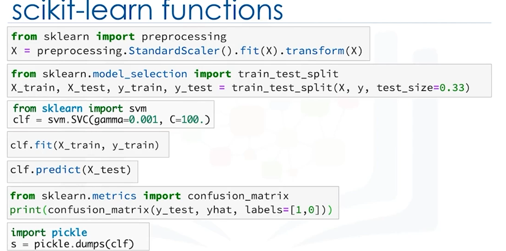

### Detailed Notes on Using Python for Machine Learning (with Analogies)

 

#### **1. Introduction to Python for Machine Learning**
- **Python**: A popular, general-purpose programming language known for its simplicity and versatility. It has gained significant popularity among data scientists for machine learning tasks.
  
- **Why Python for Machine Learning?**: 
  - **Ease of use**: Python is easy to learn, write, and understand.
  - **Vast Ecosystem**: Python boasts numerous libraries that simplify machine learning tasks.
  - **Flexibility**: It allows you to write custom machine learning algorithms, but you can also use powerful pre-built libraries that save time and effort.

- **Analogy**: Think of Python as a multi-purpose kitchen tool. It can chop, slice, and dice anything, but if you have specific attachments (libraries like NumPy and SciKit Learn), it can make your cooking (coding) much easier and faster.

---

#### **2. Key Python Libraries for Machine Learning**

1. **NumPy**:
   - **What it is**: A library that provides support for working with N-dimensional arrays, enabling efficient mathematical operations.
   - **Capabilities**: Essential for handling arrays, numerical data, and even image processing.
   - **Why it’s important**: It's more powerful and faster than Python's built-in data structures when dealing with large datasets.
   - **Analogy**: If Python is like a basic tool, NumPy is the specialized attachment that allows you to blend or chop much faster, making tasks like matrix calculations more efficient.

2. **SciPy**:
   - **What it is**: Built on top of NumPy, SciPy offers advanced scientific computing functions like signal processing, optimization, and statistical operations.
   - **Capabilities**: Good for high-performance computing and solving complex mathematical problems.
   - **Analogy**: If NumPy is a sharp knife for cutting, SciPy is like a specialized precision tool used by chefs to add the finishing touches, such as finely slicing delicate ingredients or optimizing flavors.

3. **Matplotlib**:
   - **What it is**: A plotting library that allows you to create visualizations in both 2D and 3D.
   - **Capabilities**: Essential for creating graphs, charts, and visual representations of data, which are key for understanding and interpreting machine learning results.
   - **Analogy**: Think of Matplotlib as the presentation part of cooking. It’s like beautifully plating a dish—giving you the ability to visualize your data in a way that makes it easier to digest.

4. **Pandas**:
   - **What it is**: A high-level library used for data manipulation and analysis. It provides powerful data structures, like DataFrames, which simplify data handling.
   - **Capabilities**: Importing, cleaning, and manipulating large datasets quickly and effectively. Especially useful for handling numerical tables and time-series data.
   - **Analogy**: Pandas is like the sous-chef in the kitchen, organizing all the ingredients (data) and making sure everything is in place before the chef (your model) gets to work.

---

#### **3. SciKit Learn: The Core of Machine Learning in Python**

- **What it is**: SciKit Learn is a comprehensive, easy-to-use machine learning library in Python. It integrates seamlessly with NumPy and SciPy, offering tools for building machine learning models with minimal code.

- **Why it’s popular**: 
  - **Pre-built algorithms**: SciKit Learn provides implementations of most common machine learning algorithms, such as classification, regression, and clustering.
  - **Ease of use**: Many tasks in machine learning pipelines, like pre-processing, feature selection, and model evaluation, are already implemented, making it efficient to get models up and running with a few lines of code.
  - **Documentation**: Excellent documentation helps beginners and experts alike.

- **Analogy**: SciKit Learn is like a pre-packaged meal kit. All the ingredients (algorithms, preprocessing tools) are measured and ready for use, saving you the time and hassle of sourcing, measuring, and preparing everything from scratch.

---

#### **4. Example of Using SciKit Learn for a Machine Learning Model**

- **Step-by-Step Process**:
  1. **Preprocessing**: Before feeding the data into a model, the data needs to be cleaned and standardized. This ensures that outliers or different scales in the dataset won’t skew the results.
  2. **Train-Test Split**: The dataset is split into two subsets: one for training the model and one for testing it afterward to evaluate its accuracy. This can be done in just one line of code in SciKit Learn.
  3. **Model Building**: SciKit Learn allows you to set up various machine learning algorithms easily. For example, to classify data, you might use a support vector classification (SVC) algorithm.
  4. **Training the Model**: Once the algorithm is chosen, you pass the training data to the model’s `fit()` method, where it learns from the data.
  5. **Prediction**: After training, you use the test data to make predictions using the `predict()` method.
  6. **Evaluation**: You can evaluate the model’s accuracy by using metrics like the confusion matrix or accuracy score.
  7. **Model Saving**: Finally, after ensuring the model is working well, you can save it for future use.

- **Analogy**: Think of this process like making a recipe. Preprocessing is like washing and cutting vegetables, train-test split is like setting aside some food to taste later (test set), and building the model is like following the recipe to cook the meal. Once cooked (trained), you taste (test) it to ensure it’s good. If the meal (model) is delicious, you can store the leftovers for later (save the model).

---

#### **5. The Importance of Preprocessing in Machine Learning**

- **Standardizing the Dataset**: 
  - **Why**: When data has different scales or outliers, machine learning models may perform poorly. Standardizing (normalizing) data ensures each feature contributes equally to the final result.
  - **SciKit Learn’s Solution**: Preprocessing functions, like scaling, can be easily applied to datasets with a few lines of code.

- **Train-Test Split**: 
  - **Why**: It’s important to split the data into training and testing sets to avoid overfitting, where the model performs well on training data but poorly on new, unseen data.
  - **SciKit Learn’s Solution**: The `train_test_split()` function automatically handles this task, making it quick and easy to ensure your model’s results are reliable.

---

#### **6. Why Use SciKit Learn Instead of Pure Python or NumPy/SciPy?**

- **Ease of Use**: While you could technically implement machine learning tasks using pure Python or NumPy/SciPy, it would require writing a significant amount of code. SciKit Learn simplifies the process by providing pre-built functions and utilities.

- **Time Efficiency**: Instead of writing and debugging hundreds of lines of code, SciKit Learn allows you to implement entire machine learning pipelines in just a few lines.

- **Comprehensive Tools**: SciKit Learn provides everything from data preprocessing to model evaluation, reducing the need to switch between libraries.

- **Analogy**: Think of SciKit Learn as using a power drill versus a hand screwdriver (pure Python). Sure, the hand screwdriver gets the job done, but the power drill (SciKit Learn) makes the process much faster and easier, saving time and energy.

---

### Summary of Key Points

1. **Python and Machine Learning**: Python is the go-to programming language for data scientists due to its simplicity and a rich ecosystem of libraries that support machine learning tasks.

2. **Key Libraries**:
   - **NumPy**: Handles arrays and numerical data efficiently.
   - **SciPy**: Provides advanced scientific computing functions.
   - **Matplotlib**: Allows for data visualization through 2D and 3D plots.
   - **Pandas**: Makes data manipulation easy, especially for tabular data.
   - **SciKit Learn**: The core machine learning library with pre-built algorithms, preprocessing tools, and evaluation metrics.

3. **SciKit Learn Process**:
   - **Preprocessing**: Ensures data is ready for the model.
   - **Train-Test Split**: Divides the data for model training and testing.
   - **Modeling**: Builds machine learning models like classifiers or regressors.
   - **Evaluation**: Measures the model’s performance using metrics like accuracy scores and confusion matrices.

4. **Why SciKit Learn**: It reduces the coding effort by offering a comprehensive set of tools, which makes the implementation of machine learning pipelines efficient and beginner-friendly.

---

### Chart Method for Quick Review

| Python Library | Purpose | Key Feature |
|----------------|---------|-------------|
| NumPy | Array manipulation | Fast operations on N-dimensional arrays |
| SciPy | Scientific computing | Advanced numerical methods and optimization |
| Matplotlib | Visualization | 2D and 3D plots for data insights |
| Pandas | Data manipulation | High-level data structures like DataFrames |
| SciKit Learn | Machinarning | Pre-built algorithms, preprocessing tools, and easy model evaluation |

 